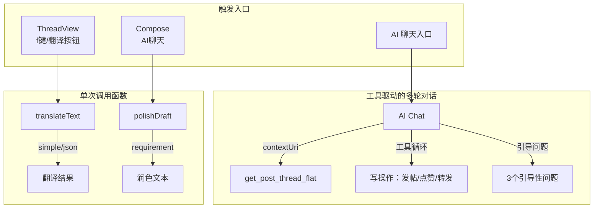

现在开始组织内容。

# AI 功能快速体验

这个项目集成了三套 AI 能力：**多轮对话 + 31 个工具**、**帖子智能翻译**和**草稿润色**。它们共享同一个 LLM 后端（默认 DeepSeek），但通过不同的代码路径触发。本文从三个实操场景入手，带你逐一验证这些能力。

## 场景一：在 AI 聊天中分析帖子

AI 聊天是能力的集大成者。当你从 ThreadView 或 Profile 页面进入 AI 对话时，系统向 AI 注入**当前帖子的上下文**，AI 自动调用 `get_post_thread_flat` 工具获取"扁平化线程"结构，并据此生成分析结论。

**效果**：在帖子页面按特定键进入 AI 聊天 → AI 主动分析帖子内容 → 展示引导性问题。

### 触发链路

```
用户打开 AI 聊天（携带 contextUri）
    │
    ▼
useAIChat 初始化 AIAssistant
    │  ┌─ 注入系统提示词（含 PF_POST_CONTEXT）
    │  └─ 注入 31 个工具（含 get_post_thread_flat）
    │
    ▼
AI 自主决策 → 调用 get_post_thread_flat(uri)
    │
    ▼
线程扁平化 → 以缩进格式返回：
  depth:0 | alice.bsky.social (Alice) (post:abc123)
  "Hello World"
    ↳ depth:1 | bob.dev → alice (post:def456)
    "Hi Alice!"
```

[来源](packages/app/src/hooks/useAIChat.ts#L97-L123) | [来源](packages/core/src/ai/assistant.ts#L157-L165) | [来源](packages/core/src/ai/tools.ts#L118-L128)

### 关键代码片段

`useAIChat` 在初始化时通过 `contextPost`（AT URI）构建系统提示，并在工具注册后让 AI 自主决策：

```typescript
// useAIChat.ts — 构建含帖子上下文的系统提示
if (options?.contextPost) {
  assistant.addSystemMessage(buildSystemPrompt(options.contextPost, undefined));
  setGuidingQuestions(P_GUIDING_QUESTIONS);
}
```

同时注册 31 个工具，AI 会在工具循环中决定是否调用 `get_post_thread_flat`：

```typescript
// useAIChat.ts — 初始化工具
const tools = createTools(client);
assistant.setTools(tools);
```

[来源](packages/app/src/hooks/useAIChat.ts#L144-L148) | [来源](packages/app/src/hooks/useAIChat.ts#L50-L53)

### 工具循环上限

**最多 10 轮**工具调用。超出则抛出 `Max tool calling rounds exceeded` 错误，保证不会无限运行。

[来源](packages/core/src/ai/assistant.ts#L198-L200) | [来源](packages/core/src/ai/assistant.ts#L310-L312)

### 深入阅读

- [AIAssistant 核心对话架构](aiassistant-核心对话架构.md) — 完整的工具循环机制
- [31 个工具系统详解](31-个工具系统详解.md) — 全部工具清单与线程扁平化格式
- [useAIChat 深度解析](useaichat-深度解析.md) — Hook 层的会话管理与持久化

---

## 场景二：在 ThreadView 中用 f 键翻译帖子

双端（TUI / PWA）的帖子详情页都内置了翻译功能，默认目标语言通过配置设定（如 `TRANSLATE_TARGET_LANG=zh`）。TUI 端按 **`f`** 键，PWA 端点击语言图标，即可将当前聚焦帖子的内容翻译为目标语言。

### 执行流程

```
用户按下 f 键 / 点击翻译按钮
    │
    ▼
提取 cursorLine.text 或 focused.text
    │
    ▼
import('@bsky/core').translateText(config, text, targetLang, mode)
    │
    ├── mode='simple': 纯文本翻译，无 JSON 包装
    └── mode='json':    带 source_lang 检测的 JSON 结构输出
    │
    ▼
返回结果 → 在对话框中展示带 [source→target] 前缀的译文
```

[来源](packages/tui/src/components/UnifiedThreadView.tsx#L143-L148) | [来源](packages/pwa/src/components/ThreadView.tsx#L80-L90)

### TUI 端实现

在 `UnifiedThreadView.tsx` 的 `useInput` 回调中，检测到 `f` 键时动态导入 `translateText`：

```typescript
if (input === 'f' || input === 'F') {
  setTranslatedText(null);
  setTranslating(true);
  import('@bsky/core').then(({ translateText: tt }) => {
    const cfg = { apiKey: aiConfig?.apiKey || '', baseUrl: aiConfig?.baseUrl || 'https://api.deepseek.com', model: aiConfig?.model || 'deepseek-v4-flash' };
    tt(cfg, cursorLine.text, targetLang || 'zh', translateMode || 'simple').then(r => {
      setTranslatedText(`[${r.sourceLang ?? '?'}→${targetLang || 'zh'}] ${r.translated}`);
      setTranslating(false);
    }).catch(() => setTranslating(false));
  }).catch(() => setTranslating(false));
}
```

[来源](packages/tui/src/components/UnifiedThreadView.tsx#L143-L151)

### PWA 端实现

PWA 封装了 `useTranslation` Hook，同时提供缓存层以节省 API 调用：

```typescript
const { translate, loading: translating } = useTranslation(
  aiConfig.apiKey, aiConfig.baseUrl, aiConfig.model,
  targetLang as TargetLang,
  translateMode,
);
```

Hook 内部维护 `Map<string, TranslationResult>` 缓存，以 `mode::lang::text` 为键，相同文本不会重复请求。

[来源](packages/app/src/hooks/useTranslation.ts#L16-L54)

### 双模式对比

| 模式 | 适用场景 | 返回格式 | 额外功能 |
|------|---------|---------|---------|
| **simple** | CJK 语言、短文本 | 纯文本字符串 | — |
| **json** | 欧洲语言、长文本 | `{ translated, source_lang }` | 自动检测源语言 |

[来源](packages/core/src/ai/assistant.ts#L470-L477)

### 深入阅读

- [智能翻译与草稿润色](智能翻译与草稿润色.md) — 重试逻辑、支持语言列表
- [键盘快捷键完整系统](键盘快捷键完整系统.md) — 快捷键分层注册机制

---

## 场景三：在 Compose 中用 AI 润色草稿

`polishDraft` 是一个**单次调用**函数（无工具循环），专为草稿优化场景设计。它采用专属提示词，只返回润色后的文本，不做额外解释。

### 函数签名

```typescript
async function polishDraft(
  config: AIConfig,
  draft: string,
  requirement: string,  // 如 "更正式"、"更幽默"、"缩短到 100 字以内"
): Promise<string>
```

[来源](packages/core/src/ai/assistant.ts#L761-L771) | [来源](packages/core/src/index.ts#L31)

### 系统提示词

```text
你是一个文字润色助手，根据用户要求调整以下帖子草稿，只返回润色后的文本。
```

用户提示模板：

```text
用户要求：{requirement}

草稿：
{draft}
```

[来源](packages/core/src/ai/prompts.ts#L167-L170)

### 在 PWA AI 聊天中使用

PWA 的 AI 聊天页面可利用 `sendMessage` 直接向 AI 发送润色指令。AI 在工具循环中调用 `singleTurnAI` 完成润色——或者更直接地，通过 `useAIChat` 发送自然语言指令如"帮我润色这段话，让它更正式"。AI 助手（非 `polishDraft` 专用函数）会利用工具或通用生成能力完成。

### 集成测试示范

```typescript
// 来自 ai_integration.test.ts
it('should polish a draft post', async () => {
  const draft = 'i think bluesky is cool and the at protocol is very nice and good';
  const requirement = '更正式';
  const result = await polishDraft(AI_CONFIG, draft, requirement);
  expect(result).toBeTruthy();
});

it('should polish a draft to be more humorous', async () => {
  const draft = 'Bluesky is a decentralized social network.';
  const requirement = '更幽默';
  const result = await polishDraft(AI_CONFIG, draft, requirement);
  expect(result.length).toBeGreaterThan(0);
});
```

[来源](packages/core/tests/ai_integration.test.ts#L137-L151)

### 深入阅读

- [智能翻译与草稿润色](智能翻译与草稿润色.md) — `polishDraft` 的 retry 机制与单次调用架构
- [系统提示词工程](系统提示词工程.md) — 提示词片段化组合策略

---

## 三大能力汇总



| 能力 | 核心函数/类 | 调用方式 | 工具循环 | 写入确认 |
|------|------------|---------|---------|---------|
| 聊天分析帖子 | `AIAssistant.sendMessage` | 自然语言，自动工具调度 | 最多 10 轮 | 是 |
| 帖子翻译 | `translateText` | 单次调用 | 否 | 否 |
| 草稿润色 | `polishDraft` | 单次调用 | 否 | 否 |

## 推荐阅读

- [AI 功能快速体验 → 深入理解 AIAssistant 核心对话架构](aiassistant-核心对话架构.md)
- [AI 功能快速体验 → 完整工具清单：31 个工具系统详解](31-个工具系统详解.md)
- [AI 功能快速体验 → useAIChat Hook 如何串联 core 与 UI](useaichat-深度解析.md)
- [AI 功能快速体验 → 系统提示词如何组合片段](系统提示词工程.md)