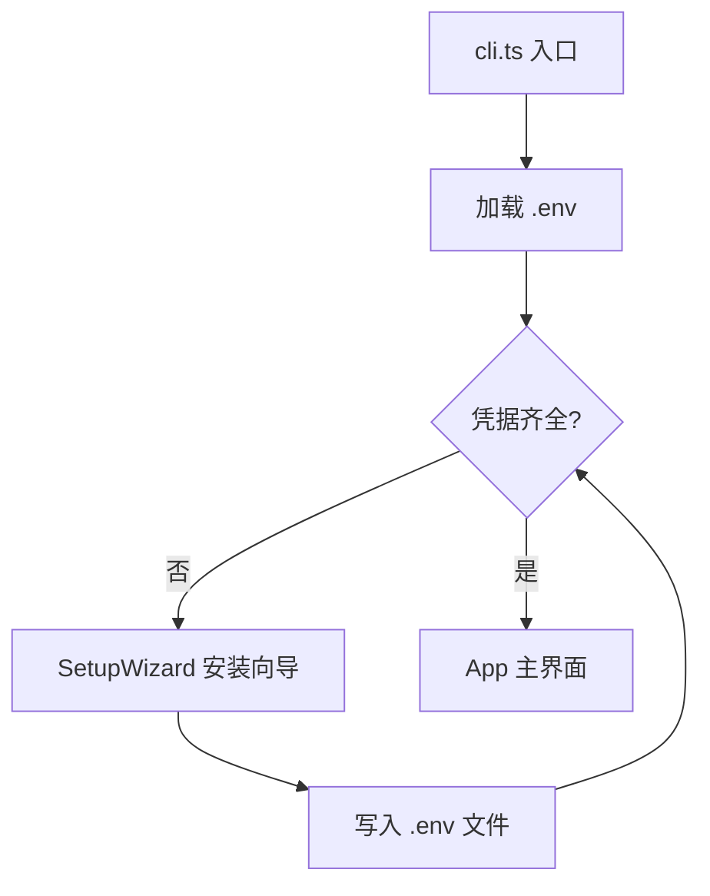

# TUI 终端客户端入门

终端客户端（TUI）是整个项目的**主力交互界面**。你打开终端、敲一行命令，就能在纯文本界面里刷 Bluesky 时间线、发帖、收通知，还能唤出 AI 助手帮你翻译、润色甚至操作账户。这个页面带你从启动到日常操作，走一遍完整流程。

---

## 启动入口：cli.ts

TUI 的起点在 `packages/tui/src/cli.ts`。当你执行 `pnpm dev`（或直接 `tsx packages/tui/src/cli.ts`）时，这个文件做了三件事：

1. **加载环境变量** —— 从项目根目录或当前工作目录读取 `.env` 文件，提取 `BLUESKY_HANDLE`、`BLUESKY_APP_PASSWORD`、`LLM_API_KEY` 等配置。[来源](../packages/tui/src/cli.ts#L17-L23)
2. **判断配置是否存在** —— 调用 `getConfigFromEnv()` 检查凭据是否齐全。如果缺失，进入 **SetupWizard**（安装向导）；如果齐全，直接渲染主界面 `App`。[来源](../packages/tui/src/cli.ts#L53-L61)
3. **渲染 React 组件** —— 基于 [Ink](https://github.com/vadimdemedes/ink) 框架，把 React 组件渲染到终端。Ink 接管了终端输入输出，让你可以用 React 的方式写终端界面。[来源](../packages/tui/src/cli.ts#L97-L103)



关键细节：`dotenv` 会从两个路径尝试加载——项目根目录的 `.env` 以及当前工作目录的 `.env`，方便你在不同场景下切换配置。[来源](../packages/tui/src/cli.ts#L17-L23)

---

## 首次运行：SetupWizard 安装向导

如果你是第一次使用，终端会直接进入 **SetupWizard**（位于 `packages/tui/src/components/SetupWizard.tsx`）。它是一个交互式表单，逐字段引导你填写配置。

### 向导会问你什么

| 字段 | 含义 | 是否必填 | 默认值 |
|------|------|---------|--------|
| `blueskyHandle` | 你的 Bluesky 用户名（如 `user.bsky.social`） | 是 | — |
| `blueskyPassword` | 应用密码（不是登录密码） | 是 | — |
| `llmApiKey` | LLM API Key（DeepSeek / OpenAI 等） | 否 | — |
| `llmBaseUrl` | API 地址 | 否 | `https://api.deepseek.com` |
| `llmModel` | 模型名称 | 否 | `deepseek-v4-flash` |
| `thinkMode` | 是否启用思考模式 | 否 | `true` |
| `visionMode` | 是否启用视觉识别 | 否 | `false` |
| `locale` | 界面语言 (`zh`/`en`/`ja`) | 否 | `zh` |

[来源](../packages/tui/src/components/SetupWizard.tsx#L24-L46)

### 操作方式

- `Tab` / `↓` ：移到下一个字段
- `↑` ：移到上一个字段
- `Enter` ：提交当前字段，进入下一个
- 密码字段会以 `****` 遮盖显示

填写完最后一个字段后，向导会把所有配置写入 `.env` 文件，然后自动进入主界面。[来源](../packages/tui/src/components/SetupWizard.tsx#L50-L98)

> 💡 **关于应用密码**：不要直接用 Bluesky 的登录密码。请前往 Bluesky 设置 → 应用密码，生成一个专用密码。详见 [环境变量与认证](环境变量与认证.md)。

---

## 主布局：App.tsx 的三栏结构

配置就绪后，`App.tsx` 渲染出整个终端界面。它分为三个区域：

```
┌──────────────────────────────────────────────────────┐
│ 🦋 Bluesky @your.handle           🟢         14:30   │  ← 顶栏（状态栏）
├────────┬─────────────────────────────────────────────┤
│        │  📋 Feed - Following                        │
│ 🦋     │  ┌──────────────────────────────────────┐   │
│ Bluesk │  │ Post 1 by @someone                    │   │  ← 主内容区
│        │  │ Post 2 by @another                    │   │
│ 📋 主页 [t]│  │ ...                                   │   │
│ 🔔通知 [n]│  └──────────────────────────────────────┘   │
│ 🔍搜索 [s]│  Esc:返回  ↑↓/jk:导航 Enter:查看           │
│ 👤资料 [p]│                                        │
│ 🔖收藏 [b]│                                        │
│ 🤖AI [a] │                                        │
│ ✏️发帖 [c]│                                        │
├────────┴─────────────────────────────────────────────┤
│  Esc:返回  ↑↓/jk:导航  Enter:查看  m:更多  r:刷新   │  ← 底栏（操作提示）
└──────────────────────────────────────────────────────┘
```

### ① 侧边栏（Sidebar）

位于左侧，宽度约为终端宽度的 14%。功能包括：

- **导航条目** —— 列出所有可访问的视图，每个条目旁标注快捷键（`[t]` `[n]` `[s]` 等）
- **当前视图高亮** —— 当前所在的视图以蓝色背景 + `▶` 标记
- **未读通知徽章** —— 如果 `notifCount > 0`，在"通知"旁显示数字
- **返回路径** —— 如果你进入了子视图（如帖子详情），底部会显示 `← Esc 返回`

[来源](../packages/tui/src/components/Sidebar.tsx#L1-L80)

### ② 主内容区

占据屏幕中间大部分区域，根据当前视图渲染不同内容：

- **Feed 视图**：帖子列表，支持光标上下移动、翻页、加载更多
- **Thread 视图**：帖子详情及回复链
- **Notifications 视图**：通知列表
- **Search 视图**：搜索输入框 + 结果列表
- **Profile 视图**：个人资料
- **Bookmarks 视图**：收藏列表
- **Compose 视图**：发帖编辑框
- **AI Chat 视图**：AI 对话面板

[来源](../packages/tui/src/components/App.tsx#L161-L211)

### ③ AI 面板（AIPanel）

当进入 AI 聊天视图时，可以通过 `Tab` 键在"主内容"和"AI 输入面板"之间切换焦点。切换后，键盘输入会进入 AI 聊天输入框而不是全局导航。[来源](../packages/tui/src/components/App.tsx#L95-L98)

### 顶栏与底栏

- **顶栏**（蓝色背景）：显示 Bluesky 标志、当前登录用户、在线状态（🟢/🔴）、当前视图名称和时间
- **底栏**：显示当前视图可用的快捷键提示，支持返回导航

[来源](../packages/tui/src/components/App.tsx#L213-L225)

---

## 核心快捷键速查

整个 TUI 的键盘系统由 **5 个 `useInput` 处理器**分层注册，Ink 会在每次按键时按注册顺序依次触发。下面是日常最常用的快捷键：

### 全局导航（任何视图下都有效）

| 按键 | 功能 | 说明 |
|------|------|------|
| `t` | **主页 / 时间线** | 回到 Feed 视图 |
| `n` | **通知** | 打开通知列表 |
| `s` | **搜索** | 打开搜索界面 |
| `p` | **个人资料** | 查看自己的资料 |
| `a` | **AI 聊天** | 启动 AI 助手对话 |
| `c` | **发帖** | 打开发帖编辑器 |
| `b` | **收藏** | 查看书签列表 |
| `,` | **设置** | 打开设置（.env 编辑器） |
| `Esc` | **返回** | 返回上一级视图 |

[来源](../packages/tui/src/components/App.tsx#L101-L114)

### Feed 时间线视图

| 按键 | 功能 |
|------|------|
| `j` / `↓` | 光标下移 |
| `k` / `↑` | 光标上移 |
| `PgUp` / `PgDn` | 翻页（5 条） |
| `Enter` | 查看选中的帖子（进入 Thread 视图） |
| `m` | 加载更多旧帖 |
| `r` | 刷新时间线 |
| `f` | 切换/配置 Feed |
| `v` | 收藏/取消收藏当前帖子 |
| `q` | 查看引用的帖子 |
| 鼠标滚轮 | 滚动光标（支持 Windows Terminal、iTerm2 等） |

[来源](../docs/KEYBOARD.md#feed-view)

### Thread 帖子详情视图

| 按键 | 功能 |
|------|------|
| `j` / `↓` | 光标下移 |
| `k` / `↑` | 光标上移 |
| `Enter` | 将光标行设为焦点帖子 |
| `h` | 回到根帖/主题帖 |
| `l` | **点赞**（如果已赞则无操作） |
| `r` | **转发**（弹出确认对话框：`y` 确认 / `n` 取消） |
| `c` | **回复**（打开带回复上下文的编辑器） |
| `v` | 收藏 |
| `d` | **删除**（仅自己的帖子，`y` 确认 / `n` 取消） |
| `y` | "Yank" 帖子 URI 到剪贴板 |
| `f` | **翻译**当前帖子内容（通过 AI） |

[来源](../docs/KEYBOARD.md#thread-view)

### AI 聊天视图

| 按键 | 功能 | 条件 |
|------|------|------|
| `Tab` | 切换焦点（主内容 ↔ AI 输入框） | 始终可用 |
| `PgUp` / `PgDn` | 滚动对话历史 | 始终可用 |
| `↑` / `↓` | 滚动 3 行 | 不在输入模式时 |
| `u` | 撤销最后一组对话 | AI 未加载且不在输入模式 |
| `r` | 编辑上一条消息 | AI 未加载且不在输入模式 |
| `i` | 上传图片（输入路径后 Enter） | AI 未加载且不在输入模式 |
| `e` | 导出对话（1=JSON, 2=HTML, 3=MD） | AI 未加载且不在输入模式 |
| `p` | 暂停/停止 AI 响应 | AI 正在加载时 |

在 AI 聊天历史列表模式下：

| 按键 | 功能 |
|------|------|
| `↑` / `↓` | 在会话列表中移动 |
| `n` | 新建对话 |
| `l` | 加载选中的会话 |
| `d` | 删除选中的会话 |
| `Esc` | 返回 |

[来源](../docs/KEYBOARD.md#ai-chat-view)

### 发帖（Compose）视图

| 按键 | 功能 |
|------|------|
| `Enter` | 提交帖子 |
| `Esc` | 取消（如有内容会提示保存草稿） |
| `i` | 进入媒体路径输入模式 |
| `D` | 打开草稿列表 |

在媒体输入模式下：输入文件路径后按 `Enter` 上传（支持图片/视频，图片自动压缩至 2MB 以下）。

[来源](../packages/tui/src/components/App.tsx#L115-L145)

### 通知视图

| 按键 | 功能 |
|------|------|
| `j` / `↓` | 光标下移 |
| `k` / `↑` | 光标上移 |
| `Enter` | 查看引用的帖子 |
| `r` / `R` | 刷新通知列表 |

[来源](../docs/KEYBOARD.md#notifications-view)

### 收藏视图

| 按键 | 功能 |
|------|------|
| `j` / `↓` | 光标下移 |
| `k` / `↑` | 光标上移 |
| `Enter` | 查看帖子 |
| `d` | 删除收藏 |
| `r` | 刷新列表 |
| `q` | 查看引用的帖子 |

[来源](../docs/KEYBOARD.md#bookmarks-view)

---

## 快捷键冲突处理

不同视图可能给同一个键赋予不同含义。例如：

| 键 | Feed 中 | Thread 中 | AI Chat 中 |
|----|---------|-----------|------------|
| `c` | 全局 → 发帖 | **回复**（带上下文） | 全局 → 发帖 |
| `r` | 刷新 | 转发确认 | — |
| `f` | 切换 Feed | 翻译帖子 | — |
| `d` | — | 删除帖子 | 删除会话（历史模式） |

系统通过 **条件守卫** 解决冲突：每个 `useInput` 处理器先用 `if (currentView.type === 'xxx')` 判断当前视图，再决定如何处理按键。全局快捷键（`t` `n` `s` `p` `a` `b` `Esc` `Tab` `Ctrl+G`）在**所有非发帖、非搜索**视图中都保留。[来源](../packages/tui/src/components/App.tsx#L95-L114)

完整冲突表见 [键盘快捷键完整系统](键盘快捷键完整系统.md)。

---

## 下一步

- 想了解如何配置环境变量？看 [环境变量与认证](环境变量与认证.md)
- 想深入理解键盘系统的分层注册机制？看 [键盘快捷键完整系统](键盘快捷键完整系统.md)
- 想用 AI 翻译帖子、润色草稿？看 [AI 功能快速体验](ai-功能快速体验.md)
- 想知道 TUI 和 PWA 如何共享业务逻辑？看 [三层架构设计](三层架构设计.md)