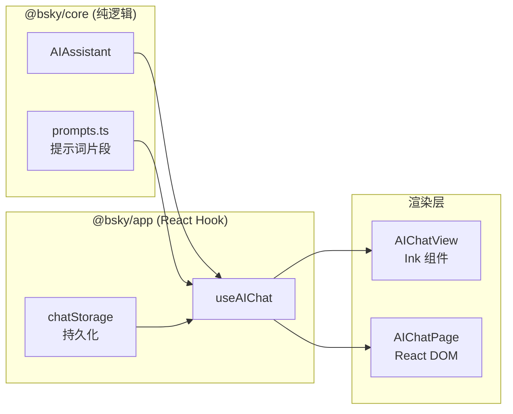

现在所有必要的信息都已收集完毕，可以开始撰写文档了。

---

# useAIChat: 深度解析

`useAIChat` 是 `@bsky/app` 层最复杂的 Hook，职责是将 `@bsky/core` 层的 `AIAssistant` 纯逻辑引擎适配为 React 可消费的状态流。它同时解决了会话管理、上下文注入、流式/非流式双路径渲染、写操作确认门控、自动保存和中断控制六个正交问题。

---

## 1. 定位与职责边界

在三层架构中 `useAIChat` 处于中间层：



Hook 不直接与 DOM/终端渲染打交道，而是将 `AIAssistant` 的内部状态映射为 React `useState`，并统一流式事件（tool_call、tool_result、thinking、token、done）为 UI 可直接渲染的消息数组。

[来源](../packages/app/src/hooks/useAIChat.ts#L1-L21)

---

## 2. buildSystemPrompt：动态片段组合

`buildSystemPrompt` 是 Hook 中最核心的提示词工厂。它不定义任何提示文本，而是从 `@bsky/core` 导入预定义的 **片段函数**，根据运行时上下文动态拼接：

```typescript
const buildSystemPrompt = useCallback((withContext?: string, contextProfile?: string) => {
    const parts: string[] = [];
    parts.push(P_ASSISTANT_BASE);            // 基础助手身份与规则
    if (options?.userHandle || options?.userDisplayName) {
        parts.push(PF_CURRENT_USER(name, handle)); // 当前用户身份
    }
    if (contextProfile) {
        parts.push(PF_PROFILE_CONTEXT(handle));     // 用户主页上下文
    } else if (withContext) {
        parts.push(PF_POST_CONTEXT(uri));           // 帖子上下文
    }
    parts.push(PF_ENVIRONMENT(env));         // TUI vs PWA 环境适配
    if (options?.locale) parts.push(PF_LOCALE_HINT(locale)); // 语言偏好
    parts.push(PF_CURRENT_TIME());           // 当前时间（UTC）
    parts.push(PF_VISION_HINT(enabled));     // 视觉模式状态
    parts.push(P_CONCISE);                   // 回答简练约束
    return parts.join('');
}, [/* deps */]);
```

### 组合策略的架构意图

每个片段都是独立可替换的 **提示词原子**，通过 `useCallback` 的依赖数组保证只在相关选项变化时重建。这种设计使其与 [系统提示词工程](系统提示词工程.md) 中描述的片段化策略完全一致——每个 `PF_` 函数对应一个正交的关注点：

| 片段 | 职责 | 来源 |
|---|---|---|
| `P_ASSISTANT_BASE` | 助手身份、工具约束、写操作禁令 | [prompts.ts#L31-L74](../packages/core/src/ai/prompts.ts#L31-L74) |
| `PF_CURRENT_USER` | 注入当前用户身份，使工具调用获得用户上下文 | [prompts.ts#L66-L74](../packages/core/src/ai/prompts.ts#L66-L74) |
| `PF_PROFILE_CONTEXT` | 指导 AI 先查作者 feed，再查互动历史 | [prompts.ts#L76-L98](../packages/core/src/ai/prompts.ts#L76-L98) |
| `PF_POST_CONTEXT` | 注入帖子 URI，触发 get_post_context 调用 | [prompts.ts#L100-L102](../packages/core/src/ai/prompts.ts#L100-L102) |
| `PF_ENVIRONMENT` | TUI/PWA 适配——换行宽度、Markdown 支持、图片内嵌 | [prompts.ts#L104-L110](../packages/core/src/ai/prompts.ts#L104-L110) |
| `PF_CURRENT_TIME` | 时间锚定，防止 AI 因训练数据截止产生幻觉 | [prompts.ts#L119-L122](../packages/core/src/ai/prompts.ts#L119-L122) |
| `PF_VISION_HINT` | 告知视觉能力边界，避免 AI 建议不可用的功能 | [prompts.ts#L128-L140](../packages/core/src/ai/prompts.ts#L128-L140) |

[来源](../packages/app/src/hooks/useAIChat.ts#L60-L78) | [来源](../packages/core/src/ai/prompts.ts#L31-L190)

---

## 3. send 方法：流式与非流式双路径

`send` 是 Hook 中唯一直接调用 `AIAssistant` 的方法，依据 `options.stream` 标志走两条完全不同的路径。

### 3.1 流式路径（`stream: true`）

用于 PWA（和最近的 TUI），核心是消费 `AIAssistant.sendMessageStreaming()` 的 `AsyncGenerator`：

```typescript
const stream = assistant.sendMessageStreaming(text, ctrl.signal);

for await (const event of stream) {
    if ((event as any).type === 'confirmation_needed') {
        setPendingConfirmation({ toolName, description });  // 挂起确认
        continue;
    }
    // 事件类型分发
    switch (event.type) {
        case 'tool_call':
            streamingContent = '';  // 重置累积缓冲区
            setMessages(prev => [...prev, { role: 'tool_call', content, toolName }]);
            break;
        case 'tool_result':
            setMessages(prev => [...prev, { role: 'tool_result', content: tryJsonSummary(content), toolName }]);
            break;
        case 'thinking':
            // 增量累积——追加到上一条 thinking 或新建
            setMessages(prev => {
                const last = prev[prev.length - 1];
                if (last?.role === 'thinking') {
                    const updated = [...prev];
                    updated[updated.length - 1] = { role: 'thinking', content: last.content + event.content };
                    return updated;
                }
                return [...prev, { role: 'thinking', content: event.content }];
            });
            break;
        case 'token':
            streamingContent += event.content;
            setMessages(prev => {
                const last = prev[prev.length - 1];
                if (last?.role === 'assistant') {
                    const updated = [...prev];
                    updated[updated.length - 1] = { ...last, content: streamingContent };
                    return updated;
                }
                return [...prev, { role: 'assistant', content: streamingContent }];
            });
            break;
        case 'done': // 无需额外操作，token 已全部渲染
            break;
    }
}
```

**关键设计决策**：`token` 事件使用局部变量 `streamingContent` 累积完整文本，再通过 `setMessages` 更新。这意味着每次 token 到达时，React 都会触发一次重渲染。对于 PWA 的 React DOM 渲染来说，这能提供平滑的打字机效果；对于 TUI 的 Ink 渲染，同样支持逐 token 刷新。

### 3.2 非流式路径（`stream: false`）

原始路径，用于早期 TUI 实现。调用 `assistant.sendMessage()` 后一次性获得所有 `intermediateSteps`：

```typescript
const result = await assistant.sendMessage(text);
// 批量处理中间步骤
const newMsgs: AIChatMessage[] = [];
for (const step of result.intermediateSteps) {
    if (step.type === 'tool_call') {
        newMsgs.push({ role: 'tool_call', content: step.content, toolName: extractToolName(step.content) });
    } else if (step.type === 'tool_result') {
        newMsgs.push({ role: 'tool_result', content: truncateToolResult(step.content) });
    }
}
newMsgs.push({ role: 'assistant', content: result.content });
```

**Token 累积策略差异**：

| 维度 | 流式 (stream=true) | 非流式 (stream=false) |
|---|---|---|
| 中间步骤渲染 | 逐事件增量渲染 | 一次性批量渲染 |
| assistant 消息 | 逐 token 追加到同一消息 | 单次完整内容 |
| 用户体验 | 实时打字机效果 | 等待后一次性展示 |
| 中断响应 | 支持实时中断（SSE reader 层面） | 仅支持在 HTTP 请求层面中断 |
| memory 压力 | 每次 setState 增量更新 | 一次性构建消息数组 |

[来源](../packages/app/src/hooks/useAIChat.ts#L104-L207)

---

## 4. pendingConfirmation：写操作确认门控

`pendingConfirmation` 状态是 `AIAssistant._waitForConfirmation()` 的 React 桥接。当工具链中遇到 `requiresWrite: true` 的工具时：

1. **core 层**：`AIAssistant` 在 `sendMessageStreaming` 中生成一个特殊的 `confirmation_needed` 事件，然后通过 `_waitForConfirmation()` 挂起一个 Promise。
2. **app 层**：Hook 捕获该事件，`setPendingConfirmation` 触发 React 重渲染，UI 弹出确认对话框。
3. **UI 层**：用户按 Y/Enter（确认）或 N/Esc（取消），调用 `confirmAction(true/false)`。
4. **core 层**：Promise resolve，工具执行或跳过。

```typescript
// Hook 层桥接
const confirmAction = useCallback(() => {
    assistant.confirmAction(true);
    setPendingConfirmation(null);
}, [assistant]);

const rejectAction = useCallback(() => {
    assistant.confirmAction(false);
    setPendingConfirmation(null);
}, [assistant]);
```

这种设计让 **UI 完全不知道写操作门控的存在**——AIChatView 和 AIChatPage 只负责渲染 `pendingConfirmation` 并绑定按钮，所有确认逻辑在 Hook 和 core 之间闭环。

[来源](../packages/app/src/hooks/useAIChat.ts#L225-L232) | [来源](../packages/core/src/ai/assistant.ts#L116-L129)

---

## 5. auto-start 消息机制

当用户从个人主页打开 AI 聊天（`contextProfile` 存在且消息列表为空），Hook 会自动触发一次分析请求：

```typescript
useEffect(() => {
    if (options?.contextProfile && messages.length === 0 && client && !loading && !autoStartedRef.current) {
        autoStartedRef.current = true;
        const displayName = options.contextProfile;
        const timer = setTimeout(() => {
            send(PF_AUTO_ANALYSIS(displayName));
        }, 500);  // 500ms 延迟确保 UI 就绪
        return () => clearTimeout(timer);
    }
}, [options?.contextProfile, messages.length, client, loading, send]);
```

`PF_AUTO_ANALYSIS` 生成的消息内容为 `请分析 @{handle} 的主页，概括他们的近期动态。`，这会触发 AI 调用 `get_author_feed` 和 `search_posts` 等工具。

关键设计细节：
- **`autoStartedRef` 防止重复触发**——即使 effect 因依赖变化重新执行，标记位保证只发一次。
- **500ms 延迟**确保组件挂载完成、`buildSystemPrompt` 的 context 片段已注入后再发送用户消息。
- 与 `contextPost`（帖子上下文）的区别：帖子上下文触发 `P_GUIDING_QUESTIONS` 引导问题面板，而 profile 上下文直接自动分析。

[来源](../packages/app/src/hooks/useAIChat.ts#L216-L223) | [来源](../packages/core/src/ai/prompts.ts#L182-L186)

---

## 6. chatStorage 自动保存逻辑

每次消息变更都会触发自动保存，但通过 `autoSave` 的 fire-and-forget 模式避免阻塞渲染：

```typescript
const autoSave = useCallback(async (msgs: AIChatMessage[]) => {
    if (!storage) return;
    const title = msgs.find(m => m.role === 'user')?.content.slice(0, 80) ?? '新对话';
    await storage.saveChat({
        id: chatIdRef.current,
        title,
        contextUri,
        context: contextRef.current,
        messages: msgs,
        createdAt: new Date().toISOString(),
        updatedAt: new Date().toISOString(),
    });
    // 仅首次保存时通知父组件刷新会话列表
    if (!chatNotifiedRef.current) {
        chatNotifiedRef.current = true;
        options?.onChatSaved?.();
    }
}, [storage, contextUri, options?.onChatSaved]);
```

### 保存时机

1. **用户发送消息时**：在 `setMessages` 的 state updater 中 `void autoSave(updated)`。
2. **每个中间步骤后**（非流式）：批量构建完消息数组后保存。
3. **流式完成时**：通过 `setMessages(prev => { void autoSave(prev); return prev; })` 确保最终状态被保存。
4. **出错时**：错误消息也会被保存，以保证对话历史完整。

`chatNotifiedRef` 是重要的「恰好一次」机制——只在第一次保存成功时调用 `onChatSaved`，防止频繁刷新会话列表。

[来源](../packages/app/src/hooks/useAIChat.ts#L84-L99)

---

## 7. abortRef 的中断控制

中断机制通过 `AbortController` 实现，同时作用于 HTTP 请求和 SSE 流读取：

```typescript
const abortRef = useRef<AbortController | null>(null);

// 发送时创建
const ctrl = new AbortController();
abortRef.current = ctrl;

// 用户暂停
const stop = useCallback(() => {
    abortRef.current?.abort();
}, []);

// 清理
finally {
    setLoading(false);
    abortRef.current = null;
}
```

在 `AIAssistant.sendMessageStreaming` 内部，`signal` 被传递给 `fetch()` 调用，同时在 SSE 读取循环的每一步检查 `signal?.aborted`。中断发生时：

- 未完成的 fetch 请求被取消。
- SSE reader 的 `read()` 抛出异常被捕获。
- hook 的 catch 块检查 `ctrl.signal.aborted`，如果已中断则不生成错误消息。
- 生成一条 `{ type: 'done', content: '\n\n[已暂停]' }` 事件，优雅结束流。

关键设计：**双重检查**——既依赖 `fetch` 的网络层中断，也在应用层每次循环检查 aborted 状态，覆盖浏览器内核尚未及时传播中断信号的情况。

[来源](../packages/app/src/hooks/useAIChat.ts#L37-L38) | [来源](../packages/app/src/hooks/useAIChat.ts#L238-L240) | [来源](../packages/core/src/ai/assistant.ts#L241-L258)

---

## 8. 会话恢复与上下文重建

Hook 支持通过 `chatId` 恢复历史会话。当 `chatId` 变化时：

1. 从 `storage.loadChat()` 加载 `ChatRecord`。
2. 如果记录中包含 `context` 字段（`{ type: 'post', uri }` 或 `{ type: 'profile', handle }`），则用 `buildSystemPrompt` 重建系统提示。
3. 将保存的 `AIChatMessage[]` 映射回 `ChatMessage[]` 并调用 `assistant.loadMessages()`，使 AIAssistant 的内部状态与 UI 显示完全同步。
4. `contextRef` 保存当前上下文，确保持久化时的 context 字段与导航时注入的上下文一致。

这种设计保证了 **页面刷新后会话的上下文完整性**——用户关闭页面再打开，AI 仍然知道它是在分析哪个帖子或哪个主页。

[来源](../packages/app/src/hooks/useAIChat.ts#L52-L83)

---

## 9. 消息编辑与回滚

Hook 暴露了三个编辑方法，全部基于 `AIAssistant.loadMessages()` 实现——通过重设内部消息列表来「回滚」到指定点：

| 方法 | 行为 |
|---|---|
| `editByIndex(n)` | 回滚到第 n 条用户消息之前，返回该消息文本供重新编辑 |
| `edit()` | 回滚到最后一条用户消息之前（编辑上一条） |
| `undoLastMessage()` | 回滚到最后一条用户消息之前（不返回文本，用于撤销） |

实现模式：遍历 `assistant.getMessages()` 找到目标用户消息的索引，`keep = allMsgs.slice(0, i)` 截断，`assistant.loadMessages(keep)` 恢复状态，`setMessages(mapMessages(keep))` 同步 UI。

[来源](../packages/app/src/hooks/useAIChat.ts#L251-L281)

---

## 10. tryJsonSummary：工具结果智能摘要

`tryJsonSummary` 是 Hook 内部的一个工具结果优化函数。由于大多数 Bluesky 工具返回 JSON，直接将完整 JSON 显示给用户会过于冗长。该函数尝试解析 JSON 并根据已知结构生成摘要：

```
"搜索到 N 个帖子"
"获取了 M 条时间线"
"N 人赞了"
"图片: image/jpeg (123.4KB)"
"用户: @handle (DisplayName)"
```

如果 JSON 结构不匹配已知格式，则回退到 `text.slice(0, 500)`。这确保了 tool_result 消息在 UI 中保持简洁可读。

[来源](../packages/app/src/hooks/useAIChat.ts#L300-L319)

---

## 下一步

- 查看 [AIAssistant 核心对话架构](aiassistant-核心对话架构.md) 了解 core 层的工具循环和确认门控实现
- 查看 [流式输出 SSE 实时渲染](流式输出-sse-实时渲染.md) 了解 SSE 流在 `sendMessageStreaming` 中的具体解析
- 查看 [系统提示词工程](系统提示词工程.md) 了解所有 `PF_` 片段的完整定义
- 查看 [Hooks 全览与复用模式](hooks-全览与复用模式.md) 了解 `useAIChat` 在 16 个共享 Hook 中的定位
- 查看 [chatStorage 的 TUI 文件实现](../packages/app/src/services/chatStorage.ts) 或 [PWA 的 IndexedDB 适配](../packages/pwa/src/services/indexeddb-chat-storage.ts)