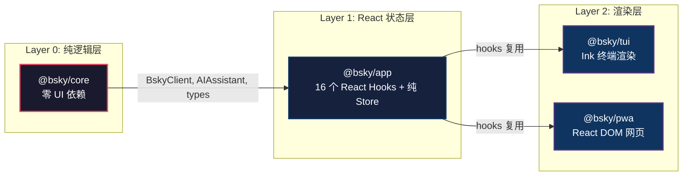

以下是页面正文。

---



## 为什么需要三层？

大多数应用在架构演进中会陷入一个陷阱：UI 框架耦合了业务逻辑，导致终端版本和 Web 版本相互拖累。React 组件里混着 API 调用，终端适配和 DOM 渲染纠缠不清。

这个项目选择了一条截然不同的路——**三层架构**。它将代码切分为三个独立的包，依赖方向严格单向：`core → app → tui/pwa`。每一层只关心一件事，且只依赖下层。

[来源](../packages/core/package.json#L1-L23)

## Layer 0: @bsky/core — 纯逻辑层

**零 UI 依赖** 是这一层的核心约束。它不 import React、不 import Ink、不 import 任何 DOM 相关的东西。依赖只有 `ky`（HTTP 客户端）和 `dotenv`（读取环境变量）。

`@bsky/core` 承担了所有"不渲染"的工作：

- **`BskyClient`** — AT Protocol HTTP 客户端封装，涵盖认证、时间线、帖子、通知、搜索等全部 API 端点。详见 [](bskyclient-bluesky-api-封装.md)。
- **`AIAssistant`** — 多轮对话 AI 引擎，支持工具循环执行（最多 10 轮）、写操作确认门控、流式输出。详见 [](aiassistant-核心对话架构.md)。
- **`createTools()`** — 31 个工具的定义和处理器，覆盖 Bluesky 全功能。详见 [](31-个工具系统详解.md)。
- **类型定义** — `PostView`、`ProfileView`、`ThreadViewPost`、`AIConfig`、`ChatMessage` 等全部 TypeScript 类型。
- **提示词系统** — 所有系统提示词（基础助手、翻译、润色、自动分析等）集中管理。详见 [](系统提示词工程.md)。
- **工具函数** — `translateText()`（双模式翻译含重试）、`singleTurnAI()`、`polishDraft()`。

这一层可以独立测试——所有 19 个集成测试都直接调用 `BskyClient` 和 `AIAssistant`，无需 mock。[来源](../packages/core/src/index.ts#L1-L37)

## Layer 1: @bsky/app — React 状态层

`@bsky/app` 依赖于 `@bsky/core` 和 `react`（仅作为 peer dependency 使用 hooks 语法）。它由两部分组成：**纯 Store** 和 **React Hooks**。

### 纯 Store 模式

Store 是不依赖 React 的普通对象。每个 Store 包含状态数据、异步操作方法和一个简单的事件订阅机制：

```typescript
// stores/auth.ts 简化的核心模式
function createAuthStore() {
  const store = {
    client: null, session: null, loading: false, error: null,
    listener: null,
    async login(handle, password) { /* ... */ },
    _notify() { store.listener?.(); },
    subscribe(fn) { store.listener = fn; return () => { store.listener = null; }; },
  };
  return store;
}
```

[来源](../packages/app/src/stores/auth.ts#L1-L55)

这个模式在 [](状态管理模式.md) 中有详细解释。关键点：**单监听器模型**，一个 Store 实例同时只能被一个 React 组件订阅。

### React Hooks 桥接

每个 Hook 负责创建 Store 实例、通过 `subscribe` 建立 React 渲染循环，并对外暴露精简的 API 接口。典型模式如下：

```typescript
function useAuth() {
  const [store] = useState(() => createAuthStore());
  const [, force] = useState(0);
  const tick = useCallback(() => force(n => n + 1), []);

  useEffect(() => store.subscribe(tick), [store, tick]);
  return { client: store.client, session: store.session, ... };
}
```

[来源](../packages/app/src/hooks/useAuth.ts#L1-L21)

### 全部 16 个 Hooks

| Hook | 依赖的 Store | 返回值 |
|------|-------------|--------|
| `useAuth` | `createAuthStore()` | client, session, profile, loading, login |
| `useTimeline` | `createTimelineStore()` | posts, loading, cursor, loadMore, refresh |
| `usePostDetail` | `createPostDetailStore()` | post, flatThread, translate, actions |
| `useNavigation` | `createNavigation()` | currentView, canGoBack, goTo, goBack |
| `useThread` | 内联状态 | flatLines, focusedIndex, up, down, focus |
| `useCompose` | 内联状态 | draft, submitting, submit, replyTo |
| `useAIChat` | AIAssistant 实例 | messages, loading, send, stop, chatId |
| `useDrafts` | `createDraftsStore()` | drafts, saveDraft, deleteDraft |
| `useI18n` | 单例 Store | t, locale, setLocale |
| `useChatHistory` | FileChatStorage | conversations, loadConversation |
| `useTranslation` | 内联缓存 | translate, loading, cache, lang |
| `useProfile` | 内联状态 | profile, posts, followList |
| `useSearch` | 内联状态 | query, results, loading |
| `useNotifications` | 内联状态 | notifications, unreadCount |
| `useBookmarks` | 内联状态 | bookmarks, isBookmarked, toggle |
| `useScrollRestore` | `saveScrollTop/getScrollTop` | 滚动位置持久化 |

[来源](../packages/app/src/index.ts#L1-L36) | [来源](../docs/HOOKS.md#L1-L55)

## Layer 2: TUI 与 PWA — 纯渲染层

两层渲染层共享同一个约定：**不包含业务逻辑**。所有数据获取、状态管理、AI 对话逻辑都来自 `@bsky/app` 的 hooks。

### @bsky/tui — Ink 终端渲染

依赖：`@bsky/core` + `@bsky/app` + `ink` + `ink-text-input` + `ink-spinner` + `react`。

入口文件 `src/cli.ts` 读取环境变量、初始化配置后渲染 `<App>` 组件。[来源](../packages/tui/package.json#L1-L25)

`<App>` 组件中，hooks 的使用方式如下：

```tsx
// TUI 的 App.tsx（简化）
import { useNavigation, useAuth, useTimeline, useAIChat, useI18n } from '@bsky/app';

function App({ config }) {
  const { currentView, goTo, goBack } = useNavigation();
  const { client, login } = useAuth();
  const timeline = useTimeline(client, feedUri);
  const aiChat = useAIChat(client, aiConfig, contextUri, { stream: true, storage, environment: 'tui' });
  const { t } = useI18n();
  // ... 路由分发到各视图组件
}
```

[来源](../packages/tui/src/components/App.tsx#L1-L30)

TUI 特有的工具（`visualWidth`、`wrapLines`、`enableMouseTracking`）只存在于 TUI 包内，PWA 不共享。[来源](../docs/ARCHITECTURE.md#L56-L66)

### @bsky/pwa — React DOM 网页

依赖：`@bsky/core` + `@bsky/app` + `react-dom` + `@tanstack/react-virtual` + `react-markdown` 等。

入口 `src/main.tsx` → `<App>` 组件：

```tsx
// PWA 的 App.tsx（简化）
import { useAuth, useTimeline, useAIChat, useI18n } from '@bsky/app';

function App() {
  const { currentView, goTo, goBack } = useHashRouter();   // ← PWA 专属路由
  const { client, restoreSession } = useAuth();
  const timeline = useTimeline(client, feedUri);
  const aiChat = useAIChat(client, aiConfig, contextUri, { stream: true, storage, environment: 'pwa' });
  // ... 路由分发到各页面组件
}
```

[来源](../packages/pwa/src/App.tsx#L1-L30)

### ⚠️ 唯一一处 "业务逻辑" 在渲染层

在 `<App>` 组件中，两端的登录后 session 持久化是各自实现的：

- **TUI**：依赖 `process.env` 的环境变量，不做浏览器端的持久化。[来源](环境变量与认证.md)
- **PWA**：使用 `localStorage` 存储/恢复 session。[来源](../packages/pwa/src/App.tsx#L45-L60)

这符合三层架构的原则：**"如何保存 session" 是渲染策略**，而非业务逻辑。核心的 `login()` 和 `refreshSession()` 逻辑仍集中在 `@bsky/core` 的 `BskyClient` 中。[来源](认证与会话自动刷新.md)

## Golden Rule：每段业务逻辑只出现一次

这是三层架构的最终检验标准：

> 任何业务逻辑——无论是"如何获取时间线"、"如何翻译文本"、"如何执行 AI 工具循环"——**必须只在一个地方实现**。

| 业务逻辑 | 所在层 | 文件位置 |
|----------|--------|----------|
| AT Protocol 调用 | core | `packages/core/src/at/client.ts` |
| 工具定义（31 个） | core | `packages/core/src/ai/tools.ts` |
| 翻译逻辑 | core | `packages/core/src/ai/assistant.ts` |
| 系统提示词 | core | `packages/core/src/ai/prompts.ts` |
| 时间线状态管理 | app | `packages/app/src/stores/timeline.ts` |
| 登录状态管理 | app | `packages/app/src/stores/auth.ts` |
| feed 配置持久化 | app | `packages/app/src/state/feedConfig.ts` |

[来源](../docs/ARCHITECTURE.md#L68-L79)

违反 golden rule 的例子：如果 TUI 和 PWA 各自实现了一套"获取用户时间线"的逻辑，那么新加一个功能（比如分页参数）就需要改两处，大概率会不一致。三层架构强制两端的差异只局限在**渲染机制**和**平台适配**上。

## TUI 与 PWA 的 hooks 复用对比

两者对同 16 个 hooks 的复用方式体现了同一套逻辑在不同渲染环境下的适配。

| 维度 | TUI（Ink） | PWA（React DOM） |
|------|-----------|------------------|
| 路由 hook | `useNavigation()`——内存栈式导航 | `useHashRouter()`——URL hash 驱动导航 |
| Auth 调用时机 | 启动时根据环境变量自动登录 | 启动时从 `localStorage` 恢复 session |
| `useTimeline` 渲染 | 逐行 pre-computed `postToLines()` 视图渲染 | 虚拟滚动列表 + PostCard 组件 |
| `useAIChat` 调用 | `stream: true`，`environment: 'tui'` | `stream: true`，`environment: 'pwa'` |
| ChatStorage 实现 | `FileChatStorage`（JSON 文件） | `IndexedDBChatStorage`（IndexedDB） |
| `useCompose` 交互 | 命令行 TextInput + markdown export | 富文本 textarea + image upload |
| `useThread` 交互 | 键盘 up/down 导航 + Enter 聚焦 | 鼠标点击 + 滚动 |

核心差异不体现在 hook 的参数或返回值上，而在于**消费方式**：

- TUI 以 **行列坐标 + 键盘事件** 为交互基元，hooks 返回的数据需要通过 `postToLines()`、`wrapLines()` 等工具预处理成终端的字符网格。[来源](ink-渲染与终端适配.md)
- PWA 以 **DOM 事件 + CSS 布局** 为交互基元，hooks 返回的数据直接映射到 React 组件树。[来源](组件树与渲染层.md)

这正是三层架构的设计目标：hooks 的接口不变，消费端的渲染逻辑完全解耦。

## 依赖方向的可执行约束

`pnpm workspace` 通过 `package.json` 的依赖声明确保了这种单向依赖无法被违反：

```
@bsky/tui → @bsky/app → @bsky/core
@bsky/pwa → @bsky/app → @bsky/core
```

检查 `@bsky/core` 的 `package.json`：它不依赖 `react`、不依赖 `@bsky/app`。检查 `@bsky/app`：它不依赖 `ink`、不依赖 `react-dom`、不依赖 `@bsky/tui` 或 `@bsky/pwa`。[来源](../packages/core/package.json#L11-L17) | [来源](../packages/app/package.json#L11-L15)

任何试图从 `@bsky/core` 中 import React 组件的代码，在 build 阶段就会被 TS 编译器拦截。更多关于 monorepo 组织方式请见 [](包管理与依赖关系.md)。

## 下一步

- [](状态管理模式.md) — 深入理解纯 Store 的订阅机制和 React hook 的桥接模式
- [](hooks-全览与复用模式.md) — 全部 16 个 hooks 的参数签名和返回值类型
- [](包管理与依赖关系.md) — `pnpm workspace` 的构建顺序和导出规则
- [](useaichat-深度解析.md) — 串联 core 层 AIAssistant 与 UI 层的核心 hook