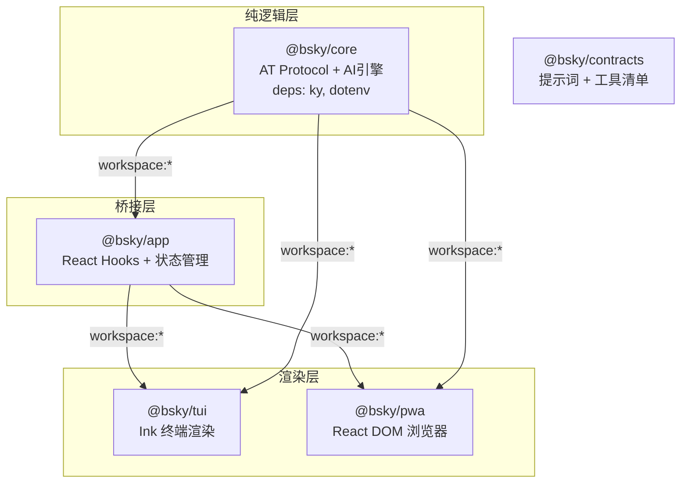

# 包管理与依赖关系

## 单体仓库的基石

项目采用 **pnpm workspace** 作为包管理方案，根目录的 `pnpm-workspace.yaml` 声明了两个搜索模式：

```yaml
packages:
  - 'packages/*'   # 核心代码包
  - 'contracts'    # 共享契约文件
```

[来源](pnpm-workspace.yaml#L1-L3)

根 `package.json` 提供了统一的编排入口：`pnpm -r build` 会递归构建所有子包，`pnpm -r test` 并行运行各包测试。单体仓库本身没有运行时依赖，仅定义引擎要求 `node >= 18`。[来源](package.json#L1-L18)

整个仓库包含 **5 个独立包**：

| 包名 | 目录 | 类型 | 运行时依赖 |
|------|------|------|-----------|
| `@bsky/core` | `packages/core` | 纯逻辑层 | `ky`, `dotenv` |
| `@bsky/app` | `packages/app` | React Hook 桥接层 | `@bsky/core`, `react` |
| `@bsky/tui` | `packages/tui` | 终端渲染层 | `@bsky/app`, `@bsky/core`, `ink`, `react` |
| `@bsky/pwa` | `packages/pwa` | 浏览器渲染层 | `@bsky/app`, `@bsky/core`, `react-dom`, 等 |
| `@bsky/contracts` | `contracts` | 数据契约层 | 无 |

## 依赖链：core → app → tui/pwa

三层架构的核心约束体现在包依赖图中：



**关键规则**：

1. `@bsky/app` 依赖 `@bsky/core`，但 **不依赖** 任何渲染层包——它只负责将 core 的纯逻辑封装成 React Hooks。
2. `@bsky/tui` 和 `@bsky/pwa` 都同时依赖 `@bsky/app` 和 `@bsky/core`。虽然 app 已经传递引入了 core，但渲染层在 `package.json` 中显式声明了 `@bsky/core` 依赖，确保在构建或类型检查时不会出现解析歧义。[来源](packages/tui/package.json#L19-L20) [来源](packages/pwa/package.json#L13-L14)
3. `@bsky/contracts` 不参与运行时依赖链——它的 `system_prompts.md` 和 `tools.json` 在构建时被 core 层引入，属于"编译时契约"。[来源](contracts/package.json#L1-L4)

> 理解这条依赖链是理解项目架构的钥匙。更详细的职责边界见 [三层架构设计](三层架构设计.md)。

## core 导出清单：纯逻辑层的公共 API

`@bsky/core` 的入口文件 `packages/core/src/index.ts` 是整个项目的逻辑基石，其导出内容按领域分为三大板块：

**AT Protocol 客户端** — 与 Bluesky 服务器通信的核心

| 导出 | 类型 | 说明 |
|------|------|------|
| `BskyClient` | class | 基于 `ky` 的全 API 封装，见 [BskyClient: Bluesky API 封装](bskyclient-bluesky-api-封装.md) |
| `parseAtUri` | function | AT URI 解析器 |
| `BUILTIN_FEEDS`, `RECOMMENDED_FEEDS` | const | 内置 Feed 列表常量 |
| `getFeedLabel`, `resolveFeedId` | function | Feed 元数据查询 |

**AI 引擎** — 对话、翻译、润色

| 导出 | 说明 |
|------|------|
| `AIAssistant` | 多轮对话管理器，详见 [AIAssistant 核心对话架构](aiassistant-核心对话架构.md) |
| `singleTurnAI` | 单轮 AI 调用函数 |
| `translateToChinese`, `translateText`, `polishDraft` | 翻译与润色工具，详见 [智能翻译与草稿润色](智能翻译与草稿润色.md) |
| `createTools` | 31 个工具的工厂函数，详见 [31 个工具系统详解](31-个工具系统详解.md) |

**提示词系统** — 集中管理的 AI prompt 片段

| 导出 | 说明 |
|------|------|
| `P_ASSISTANT_BASE`, `P_CONCISE` | 基础提示词常量 |
| `PF_CURRENT_USER`, `PF_POST_CONTEXT` 等 | 提示词片段（fragment）插入函数 |
| `LANG_LABELS` | 语言标签映射 |

> 以上所有类型导出（`ToolDefinition`, `PostView`, `AIConfig`, `ChatMessage` 等）均在此入口公开，确保上层包只用 `import { ... } from '@bsky/core'` 即可获取所有类型。[来源](packages/core/src/index.ts#L1-L38)

## app 导出清单：桥接层的公共 API

`@bsky/app` 将 core 层的纯逻辑封装为 React Hooks 和跨端共享状态。入口文件 `packages/app/src/index.ts` 导出结构如下：

**导航系统**

| 导出 | 说明 |
|------|------|
| `createNavigation` | 纯函数：创建导航控制器 |
| `useNavigation` | React Hook：订阅导航状态 |
| `AppView`, `NavigationState`, `NavigationController` | 导航类型，详见 [导航路由与视图管理](导航路由与视图管理.md) |

**核心数据 Hooks** — 驱动页面内容

| Hook | 功能 |
|------|------|
| `useAuth` | 认证状态管理，见 [认证与会话自动刷新](认证与会话自动刷新.md) |
| `useTimeline` | 时间线数据流，见 [Feed 与时间线数据流](feed-与时间线数据流.md) |
| `usePostDetail` | 帖子详情与操作 |
| `useThread` | 线程扁平化渲染 |
| `useCompose` | 发帖编辑器状态 |
| `useDrafts` | 草稿持久化存储 |
| `useActiveFeed` | 当前 Feed 切换 |
| `useScrollRestore` | 滚动位置恢复 |
| `usePostActions` | 点赞/转推/关注等操作 |
| `useProfile` | 用户资料查询 |
| `useSearch` | 搜索功能 |
| `useNotifications` | 通知列表 |
| `useBookmarks` | 书签管理 |

**AI 相关 Hooks**

| Hook | 说明 |
|------|------|
| `useAIChat` | AI 对话会话管理，见 [useAIChat: 深度解析](useaichat-深度解析.md) |
| `useChatHistory` | 聊天记录持久化 |
| `useTranslation` | 翻译功能封装 |
| `FileChatStorage` | 基于文件的聊天存储实现 |
| `ChatStorage`, `ChatRecord`, `ChatSummary` | 存储类型定义 |

**国际化与工具函数**

| 导出 | 说明 |
|------|------|
| `useI18n` | 国际化 Hook |
| `availableLocales`, `localeLabels` | 语言配置 |
| `getCdnImageUrl`, `getVideoThumbnailUrl`, `getVideoPlaylistUrl` | CDN 资源 URL 构造器 |
| `saveViewState`, `getViewState` | 视图状态持久化 |
| `getFeedConfig`, `saveFeedConfig`, `addFeed`, `removeFeed`, `setDefaultFeed` | Feed 配置管理 |

[来源](packages/app/src/index.ts#L1-L47)

> 对于 **单个 Hook 的详细签名**，请参考 [Hooks 全览与复用模式](hooks-全览与复用模式.md)。

## tsconfig paths 映射规则

项目没有在 `tsconfig.base.json` 中设置 `paths` 映射，而是依赖 **pnpm workspace 的原生链接机制**与 **TypeScript 项目引用（composite references）** 的联合方案。

### 基础配置

`tsconfig.base.json` 设定所有子包的编译基线：

```json
{
  "compilerOptions": {
    "target": "ES2022",
    "module": "ESNext",
    "moduleResolution": "bundler",
    "strict": true,
    "esModuleInterop": true,
    "declaration": true,
    "noUncheckedIndexedAccess": true
  }
}
```

[来源](tsconfig.base.json#L1-L20)

### 各包的 tsconfig 差异

| 包 | `composite` | `jsx` | `lib` | `types` |
|----|------------|-------|-------|---------|
| core | ✅ `true` | 无 | 继承 base | `["node"]` |
| app | ✅ `true` | 无 | 继承 base | `["node"]` |
| tui | ❌ 未设置 | `"react-jsx"` | 继承 base | 无 |
| pwa | ❌ 使用 `references` | `"react-jsx"` | `["ES2022","DOM","DOM.Iterable"]` | `["vite/client"]` |

[来源](packages/core/tsconfig.json#L1-L12) [来源](packages/app/tsconfig.json#L1-L12) [来源](packages/tui/tsconfig.json#L1-L11) [来源](packages/pwa/tsconfig.json#L1-L20)

### 如何解析 @bsky/* 导入？

因为所有包都在同一个 pnpm workspace 中，当 `tui` 的代码写 `import { BskyClient } from '@bsky/core'` 时：

1. pnpm 在 `node_modules` 中创建从 `@bsky/core` 到 `packages/core` 的**符号链接**
2. TypeScript 根据 `package.json` 的 `"types": "./dist/index.d.ts"` 找到声明文件
3. 编译时，各包使用自己的 `tsconfig.json` 的 `outDir` 与 `rootDir` 映射，将 `src/` 输出到 `dist/`

**pwa 的特殊处理**：pwa 的 tsconfig 显式声明了 `references`，指向 `../core` 和 `../app`。这告诉 TypeScript 在编译 pwa 前先确保这两个引用的项目已构建完毕。[来源](packages/pwa/tsconfig.json#L15-L18)

**tui 的特殊处理**：tui 没有使用 `references`，而是依赖 `tsc` 的普通模块解析来找到 `@bsky/core` 和 `@bsky/app`。这意味着 tui 需要依赖 pnpm 的 workspace 链接，而非 TypeScript 的项目引用机制。[来源](packages/tui/tsconfig.json#L1-L11)

### 构建顺序

根 `package.json` 中的 `"build": "pnpm -r build"` 利用 pnpm 的拓扑排序自动确定构建顺序：core → app → (tui, pwa)。无需手动编排，pnpm 根据 `package.json` 中的 `workspace:*` 依赖关系推导出正确的顺序。[来源](package.json#L6-L12)

---

## 下一步

- 了解三层架构的职责边界：[三层架构设计](三层架构设计.md)
- 查看 Hooks 的详细签名与复用模式：[Hooks 全览与复用模式](hooks-全览与复用模式.md)
- 探索 PWA 的构建与部署：[项目部署指南](项目部署指南.md)