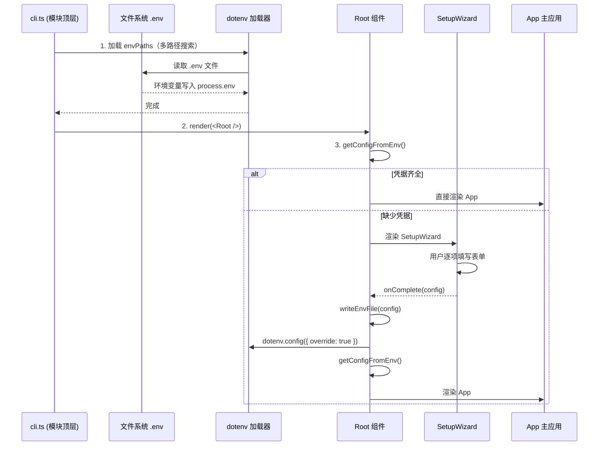

# 安装向导与环境校验

TUI 客户端首次启动时，如果检测不到 Bluesky 凭据，会自动进入交互式 SetupWizard。这是一个基于 Ink 的命令行表单，引导用户填写凭据后写入 `.env` 文件，随后重新加载配置进入主界面。整个过程由 `packages/tui/src/cli.ts` 和 `packages/tui/src/components/SetupWizard.tsx` 协同完成。

---

## 启动时序：四阶段加载

整个启动流程可以拆解为四个明确的阶段：



[来源](packages/tui/src/cli.ts#L1-L100)

---

## dotenv 多路径加载策略

模块顶层在 import 完成后立即执行环境变量加载，搜索两条路径：

```typescript
const envPaths = [
  path.resolve(__dirname, '..', '..', '..', '.env'),  // 从 tui/dist 回溯到 monorepo 根
  path.resolve(process.cwd(), '.env'),                  // 当前工作目录
];

for (const envPath of envPaths) {
  dotenv.config({ path: envPath });
}
```

[来源](packages/tui/src/cli.ts#L14-L23)

**策略解读**：

- **第一条路径**：从 `packages/tui/dist/` 上溯三层到达 monorepo 根目录 `bsky/.env`。这确保了无论是开发模式（`pnpm dev`）还是编译后运行（`node packages/tui/dist/cli.js`），都能找到项目级别的 `.env`。
- **第二条路径**：当前工作目录 `process.cwd()`，覆盖用户自定义路径。
- **不设 `override: true`**：首次循环使用默认行为（不覆盖已有变量），因此第二个路径中的变量不会覆盖第一个路径中已有的值。但首次循环内部，同文件内部按 dotenv 默认行为——**后出现的变量不覆盖先出现的**。

这种策略与 [`packages/core/tests/` 中各测试文件的加载方式](packages/core/tests/auth.test.ts#L8)一致，都采用从测试文件回溯到根 `.env` 的方式。

> **注意**：`dotenv.config()` 不会覆写已经在 `process.env` 中存在的变量。因此如果用户在 shell 中已 export 了 `BLUESKY_HANDLE`，`dotenv` 会原样保留 shell 环境变量。[dotenv 文档](https://github.com/motdotla/dotenv#what-happens-to-environment-variables-already-set)

---

## `getConfigFromEnv`：首次检测逻辑

`getConfigFromEnv` 充当**门控函数**——它读取 `process.env` 并返回 `AppConfig | null`。

```typescript
interface AppConfig {
  blueskyHandle: string;
  blueskyPassword: string;
  aiConfig: {
    apiKey: string;
    baseUrl: string;
    model: string;
    thinkingEnabled?: boolean;
    visionEnabled?: boolean;
  };
  targetLang?: string;
}

function getConfigFromEnv(): AppConfig | null {
  const handle = process.env.BLUESKY_HANDLE;
  const password = process.env.BLUESKY_APP_PASSWORD;
  if (!handle || !password) return null;
  // ... 构建 config 对象
}
```

[来源](packages/tui/src/cli.ts#L42-L58)

**关键判定**：仅凭 `BLUESKY_HANDLE` 和 `BLUESKY_APP_PASSWORD` 两者是否都存在。只要有一个为空字符串或 undefined，立即返回 `null`，触发 SetupWizard。LLM 相关配置是可选的——即使没有 API Key，用户仍可以进入主界面浏览时间线，只是 AI 功能不可用。

在 `Root` 组件中，`getConfigFromEnv` 被作为 `useState` 的初始值直接传入（函数引用），React 会在首次渲染时惰性调用它：

```typescript
const [appConfig, setAppConfig] = React.useState<AppConfig | null>(getConfigFromEnv);
```

[来源](packages/tui/src/cli.ts#L77)

---

## SetupWizard：交互式表单

当 `appConfig` 为 `null` 时，`Root` 组件直接渲染 `SetupWizard`，不显示主 `App`。

### 表单字段定义

SetupWizard 使用 `FIELDS` 常量数组定义 8 个配置项，每个字段包含 `key`、`labelKey`（i18n 键）、可选默认值和验证函数：

| 字段 | 类型 | 默认值 | 验证规则 |
|---|---|---|---|
| `blueskyHandle` | 明文 | 空 | 不能为空 |
| `blueskyPassword` | 密码（`****`） | 空 | 不能为空 |
| `llmApiKey` | 密码（`****`） | 空 | 无 |
| `llmBaseUrl` | 明文 | `https://api.deepseek.com` | 无 |
| `llmModel` | 明文 | `deepseek-v4-flash` | 无 |
| `llmThinkingEnabled` | 明文 | `true` | 必须是 `true/false/yes/no` |
| `llmVisionEnabled` | 明文 | `false` | 必须是 `true/false/yes/no` |
| `locale` | 明文 | `zh` | 必须是 `zh`/`en`/`ja` |

[来源](packages/tui/src/components/SetupWizard.tsx#L17-L50)

每个字段在界面上呈现为三态指示：
- **已完成（绿色 `✓`）**：已填写的字段，密码类型显示 `****`，普通类型显示值。
- **聚焦中（青色 `▸`）**：当前正在编辑的字段，带有一个带边框的 `TextInput` 输入框。
- **未处理**：显示默认值占位符，等待用户到达。

### 表单导航

用户通过以下按键交互：

| 按键 | 行为 |
|---|---|
| `Enter` | 提交当前字段值 → 验证通过则进入下一字段 |
| `Tab` / `↓` | 跳转到下一个字段 |
| `↑` | 跳转到上一个字段 |

当用户到达最后一个字段（`locale`）并提交时，`handleFieldSubmit` 会构建完整的 `SetupConfig` 对象并调用 `onComplete(config)`。提交前会完成**布尔值转换**：

```typescript
llmThinkingEnabled: (newValues.llmThinkingEnabled || 'true')
  .toLowerCase() !== 'false' && ... !== 'no',
llmVisionEnabled: (newValues.llmVisionEnabled || 'false')
  .toLowerCase() === 'true' || ... === 'yes',
```

[来源](packages/tui/src/components/SetupWizard.tsx#L76-L98)

### 实时 i18n 切换

如果用户修改的是 `locale` 字段，提交时会立即调用 `setLocale(loc)` 更新界面语言，后续的表单提示和标签会立刻切换到对应语言：

```typescript
if (focusedField.key === 'locale') {
  const loc = trimmed.toLowerCase();
  if (loc === 'zh' || loc === 'en' || loc === 'ja') {
    setLocale(loc as Locale);
  }
}
```

[来源](packages/tui/src/components/SetupWizard.tsx#L92-L98)

---

## `writeEnvFile`：将配置持久化到 `.env`

当 SetupWizard 完成时，`onComplete` 回调调用 `writeEnvFile`：

```typescript
function writeEnvFile(config: SetupConfig): string {
  const envPath = path.resolve(process.cwd(), '.env');
  const lines = [
    `BLUESKY_HANDLE=${config.blueskyHandle}`,
    `BLUESKY_APP_PASSWORD=${config.blueskyPassword}`,
    `LLM_API_KEY=${config.llmApiKey}`,
    `LLM_BASE_URL=${config.llmBaseUrl || 'https://api.deepseek.com'}`,
    `LLM_MODEL=${config.llmModel || 'deepseek-v4-flash'}`,
    `LLM_THINKING_ENABLED=${config.llmThinkingEnabled !== false}`,
    `LLM_VISION_ENABLED=${config.llmVisionEnabled === true}`,
    config.locale ? `TRANSLATE_TARGET_LANG=${config.locale}` : '',
  ].filter(Boolean);
  writeFileSync(envPath, lines.join('\n') + '\n', 'utf-8');
  return envPath;
}
```

[来源](packages/tui/src/cli.ts#L60-L70)

**写入策略**：

- **目标路径**：始终写入 `process.cwd() + '/.env'`，即当前工作目录下的 `.env` 文件。这恰好是 `envPaths` 数组中的第二条路径。
- **覆盖式写入**：使用 `writeFileSync` 完全覆写文件，不尝试合并已有内容（与 SettingsView 的合并策略不同，见下文）。
- **空行过滤**：`config.locale` 为空时，`TRANSLATE_TARGET_LANG` 行被 `.filter(Boolean)` 移除，不写入文件。

### 与 SettingsView 的差异

TUI 中还提供了一个运行时设置界面 `SettingsView`（通过快捷键打开），它采用**合并式写入**——读取现有 `.env` 文件内容，只替换特定 key 的行，保留其他配置不变：

```typescript
// SettingsView.tsx — 合并写入
if (existsSync(envPath)) {
  const existing = readFileSync(envPath, 'utf-8').split('\n');
  for (const line of existing) {
    const key = line.split('=')[0]?.trim();
    if (key === 'LLM_API_KEY') { lines.push(`LLM_API_KEY=${llmKey}`); replaced.add(key); }
    // ... 其他字段
  }
}
```

[来源](packages/tui/src/components/SettingsView.tsx#L43-L56)

前者是**初始化全量写入**，后者是**运行时局部更新**。

---

## 配置重载：写入后的关键步骤

`writeEnvFile` 返回后，`onComplete` 回调执行最重要的操作——**重新加载环境变量**：

```typescript
onComplete: (config: SetupConfig) => {
  const envPath = writeEnvFile(config);
  dotenv.config({ path: envPath, override: true });  // 强制覆写
  const newConfig = getConfigFromEnv();
  if (newConfig) {
    setAppConfig(newConfig);
  } else {
    console.error('Failed to load config after setup');
    process.exit(1);
  }
},
```

[来源](packages/tui/src/cli.ts#L81-L90)

这里的关键是 `override: true` 参数——首次模块加载时 `dotenv.config()` 默认不覆写已有变量，但这里的调用**强制 dotenv 用刚写入的值更新 `process.env`**。随后再次调用 `getConfigFromEnv()` 从 `process.env` 中读取完整的配置对象，通过 `setAppConfig` 触发 Root 组件重渲染，切换到主 `App`。

如果重载失败（理论上不应发生），程序以错误码退出。

---

## 相关配置项速查

SetupWizard 写入的环境变量与 `.env.example` 模板完全对应：

| 环境变量 | SetupWizard 字段 | 默认值 |
|---|---|---|
| `BLUESKY_HANDLE` | `blueskyHandle` | 无（必填） |
| `BLUESKY_APP_PASSWORD` | `blueskyPassword` | 无（必填） |
| `LLM_API_KEY` | `llmApiKey` | 空字符串 |
| `LLM_BASE_URL` | `llmBaseUrl` | `https://api.deepseek.com` |
| `LLM_MODEL` | `llmModel` | `deepseek-v4-flash` |
| `LLM_THINKING_ENABLED` | `llmThinkingEnabled` | `true` |
| `LLM_VISION_ENABLED` | `llmVisionEnabled` | `false` |
| `TRANSLATE_TARGET_LANG` | `locale` | `zh` |

[来源](packages/tui/src/cli.ts#L60-L70)，[来源](.env.example)

所有环境变量的完整含义参见 [环境变量与认证](环境变量与认证.md)。

---

## 下一步

- 了解 `SetupConfig` 与 `AppConfig` 的类型差异，以及它们在 [三层架构设计](三层架构设计.md) 中的位置。
- 如果不需要交互式向导，也可以手动创建 `.env` 文件，参考 [快速开始](快速开始.md) 的最小配置。
- 首次配置完成后进入主界面，请阅读 [TUI 终端客户端入门](tui-终端客户端入门.md) 了解快捷键和操作流程。