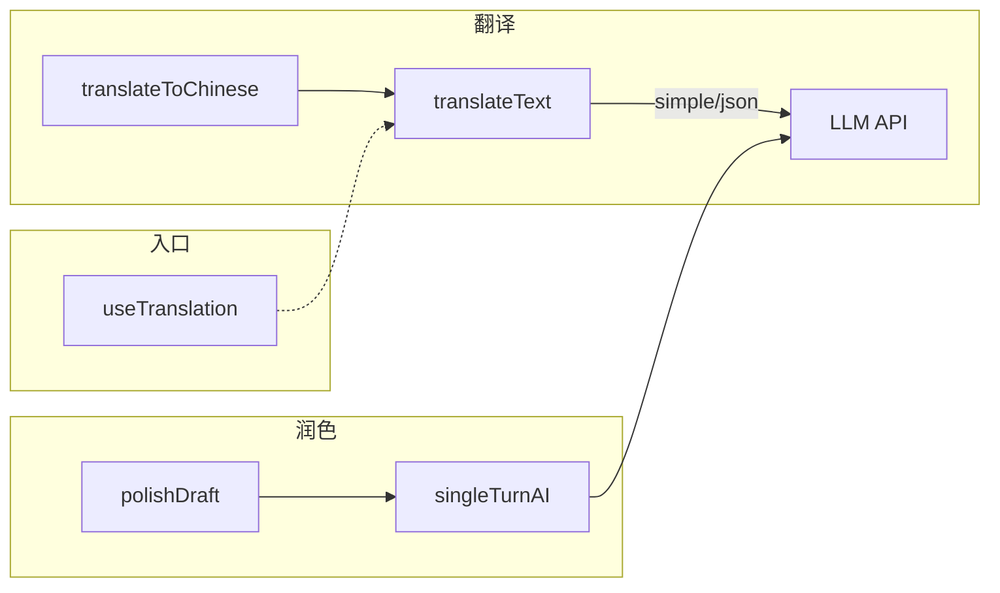

现在我有足够的信息来撰写完整的页面。以下开始输出。

# 智能翻译与草稿润色

Bluesky 的 AI 助手提供了两个独立的单次调用能力：**文本翻译**和**草稿润色**。与多轮对话的 `AIAssistant` 不同，这两个功能不维护对话上下文、不执行工具循环，而是以"一次性请求→返回结果"的简洁模式运作，支撑着个人资料页的简介翻译、帖子内容转换和发帖前的文字打磨。

---

## 1. 翻译引擎：双模式架构

翻译功能封装在 `translateText` 函数中，位于 `packages/core/src/ai/assistant.ts`。它对外暴露了两种工作模式——`simple` 和 `json`——通过同一个函数签名区分。

```typescript
export async function translateText(
  config: AIConfig,
  text: string,
  targetLang: string,
  mode: 'simple' | 'json' = 'simple',
  maxRetries = 3,
): Promise<TranslationResult>
```

[来源](packages/core/src/ai/assistant.ts#L658-L675)

### 1.1 Simple 模式

Simple 模式是向后兼容的默认行为。它构建的系统提示词直接要求 LLM 返回纯文本翻译：

```typescript
PF_TRANSLATE_SIMPLE(targetLang: string): string {
  return `Translate the following text to ${targetLang}. 
    Keep the original meaning, output only the translation, no explanations.`;
}
```

[来源](packages/core/src/ai/prompts.ts#L143-L148)

请求体不包含 `response_format` 字段，LLM 返回的是普通文本字符串。函数直接以 `{ translated: content }` 返回。

### 1.2 JSON 模式

JSON 模式的额外能力是**源语言检测**。它通过两个机制实现：

1. **`response_format: { type: 'json_object' }`** —— 告知 LLM 输出必须是合法 JSON
2. **专用提示词** —— 要求输出包含 `source_lang` 和 `translated` 两个字段

```typescript
PF_TRANSLATE_JSON(targetLang: string): string {
  return [
    `You are a translator.`,
    `Translate the user's text to ${targetLang}.`,
    `Output valid JSON with these keys:`,
    `{"source_lang": "<ISO 639-1 code, use 'und' if unsure>", "translated": "<the translation>"}.`,
    `Output ONLY the JSON object.`,
  ].join(' ');
}
```

[来源](packages/core/src/ai/prompts.ts#L151-L164)

返回结果经过 `JSON.parse` 解析后，如果 `translated` 字段缺失或 JSON 解析失败，会触发重试或回退返回 `{ translated: content, sourceLang: 'und' }`。

[来源](packages/core/src/ai/assistant.ts#L712-L736)

### 1.3 模式对比

| 维度 | Simple 模式 | JSON 模式 |
|---|---|---|
| `response_format` | 无 | `json_object` |
| 源语言检测 | ❌ | ✅ (`sourceLang` 字段) |
| 输出解析 | 直接取文本 | `JSON.parse` 后取字段 |
| 失败处理 | 空内容重试 | 解析失败/字段缺失重试 |
| 推荐场景 | 高性能翻译 | 需要知道原文语言的场景 |

两种模式共用相同的 `temperature: 0.3` 和 `max_tokens: 2000` 参数，确保翻译结果的稳定性和一致性。

[来源](packages/core/src/ai/assistant.ts#L678-L692)

---

## 2. 指数退避重试逻辑

翻译请求在网络不稳定或 LLM 输出格式异常时，会执行最多 **3 次自动重试**，采用**指数退避策略**。

### 2.1 触发条件

重试在三种情况下触发：
- **空内容**（`content.trim()` 为空）
- **JSON 模式解析失败**（`JSON.parse` 抛出异常或缺少 `translated` 字段）
- **网络异常**（`fetch` 抛出的网络层错误或 HTTP 非 2xx 状态码）

[来源](packages/core/src/ai/assistant.ts#L700-L705)

### 2.2 退避算法

重试等待时间随尝试次数增长：

| 尝试次数 | 等待时间 |
|---|---|
| 第 1 次重试 | 800ms × 1 = 800ms |
| 第 2 次重试 | 800ms × 2 = 1600ms |
| 第 3 次重试 | 800ms × 3 = 2400ms |

代码实现为 `800 * (attempt + 1)`，其中 `attempt` 从 0 开始。对于网络异常（`catch` 分支），基数提升到 1000ms：`1000 * (attempt + 1)`，因为网络错误通常需要更长恢复时间。

[来源](packages/core/src/ai/assistant.ts#L707)

### 2.3 最终兜底

当三次重试全部失败时：
- 空内容场景直接抛出 `Error('Translation returned empty content after retries')`
- JSON 解析失败场景**不抛异常**，而是回退返回已获取的原始文本和 `sourceLang: 'und'`
- 网络异常场景抛出 `e`（原始异常）

这种"软失败"设计确保了 JSON 模式在 LLM 偶尔输出非标准 JSON 时，仍能返回可用的翻译文本。

[来源](packages/core/src/ai/assistant.ts#L718-L720)

---

## 3. 便捷函数与调用链

### 3.1 `translateToChinese`

一个语法糖函数，固定调用 `translateText` 的 simple 模式、目标语言 `'zh'`：

```typescript
export async function translateToChinese(config: AIConfig, text: string): Promise<string> {
  const result = await translateText(config, text, 'zh', 'simple');
  return result.translated;
}
```

[来源](packages/core/src/ai/assistant.ts#L755-L758)

调用链极为扁平：`translateToChinese → translateText (simple 模式) → LLM API → return translated`。这是集成测试中最常用的入口，也是向后兼容旧调用者的桥梁。

[来源](packages/core/tests/ai_integration.test.ts#L131-L137)

### 3.2 `polishDraft`

草稿润色走的是另一条路径——它不经过 `translateText`，而是直接调用 `singleTurnAI`：

```typescript
export async function polishDraft(config: AIConfig, draft: string, requirement: string): Promise<string> {
  return singleTurnAI(
    config,
    P_POLISH_SYSTEM,                             // 系统提示词
    PF_POLISH_USER(requirement, draft),           // 用户提示词
    0.7,                                          // temperature（更高，鼓励创意）
    2000,                                         // max_tokens
  );
}
```

[来源](packages/core/src/ai/assistant.ts#L763-L769)

`singleTurnAI` 是比 `translateText` 更通用的底层函数，只负责"系统提示词 + 用户消息 → LLM → 返回文本"。它不包含重试逻辑，也不处理 JSON 解析。

[来源](packages/core/src/ai/assistant.ts#L595-L640)

对应的提示词片段：
- **系统提示词**：`P_POLISH_SYSTEM = '你是一个文字润色助手，根据用户要求调整以下帖子草稿，只返回润色后的文本。'`
- **用户提示词模板**：`PF_POLISH_USER(requirement, draft)` → `用户要求：{requirement}\n\n草稿：\n{draft}`

[来源](packages/core/src/ai/prompts.ts#L167-L171)

**关键差异**：`translateText` 关闭了思维链（`thinking: { type: 'disabled' }`），而 `polishDraft` 经由 `singleTurnAI` 使用 `config.thinkingEnabled` 配置，默认开启思维链。翻译追求确定性和一致性（temperature=0.3），润色则允许更多创造性（temperature=0.7）。

### 3.3 调用链对照图



---

## 4. React Hook 层：缓存策略

`useTranslation` Hook 位于 `packages/app/src/hooks/useTranslation.ts`，是 PWA 端消费翻译能力的统一入口。它从 `@bsky/core` 动态导入 `translateText`，并在上层封装了状态管理和缓存。

### 4.1 缓存机制

```typescript
const [cache] = useState(() => new Map<string, TranslationResult>());
```

缓存是一个 `Map` 实例，通过 `useState` 的初始化函数创建，在整个组件生命周期内持久存在。缓存键的生成规则为：

```
${mode}::${lang}::${text}
```

例如：`"simple::zh::Hello world"`。这意味着**同一个文本翻译到不同语言**不会缓存冲突，**不同模式下相同文本**也不会互相覆盖。

[来源](packages/app/src/hooks/useTranslation.ts#L42-L44)

### 4.2 动态导入策略

`translateText` 不是静态导入，而是按需动态导入：

```typescript
const { translateText } = await import('@bsky/core');
```

这利用了 React 的代码分割能力——只有当用户首次触发翻译时，`@bsky/core` 模块才会被加载。这是 PWA 端优化首屏加载的重要手段。

[来源](packages/app/src/hooks/useTranslation.ts#L44)

### 4.3 完整 Hook 签名

```typescript
export function useTranslation(
  aiKey: string,
  aiBaseUrl: string,
  aiModel = 'deepseek-v4-flash',
  targetLang: TargetLang = 'zh',
  initialMode: 'simple' | 'json' = 'simple',
)
```

返回值包含 `translate` 函数、`loading` 状态、`lang`/`setLang` 语言选择器、`mode`/`setMode` 模式切换器和 `LANG_LABELS` 语言标签表。

[来源](packages/app/src/hooks/useTranslation.ts#L22-L53)

---

## 5. LANG_LABELS 语言表

语言标签表定义在两个层级，采用**层级覆盖**模式。

### 5.1 Core 层定义

```typescript
// packages/core/src/ai/prompts.ts
export const LANG_LABELS: Record<string, string> = {
  zh: '中文',
  en: 'English',
  ja: '日本語',
  ko: '한국어',
  fr: 'Français',
  de: 'Deutsch',
  es: 'Español',
};
```

[来源](packages/core/src/ai/prompts.ts#L16-L24)

### 5.2 App 层增强

```typescript
// packages/app/src/hooks/useTranslation.ts
export type TargetLang = 'zh' | 'en' | 'ja' | 'ko' | 'fr' | 'de' | 'es';

export const LANG_LABELS: Record<TargetLang, string> = {
  zh: CORE_LANG_LABELS.zh ?? '中文',
  en: CORE_LANG_LABELS.en ?? 'English',
  ja: CORE_LANG_LABELS.ja ?? '日本語',
  ko: CORE_LANG_LABELS.ko ?? '한국어',
  fr: CORE_LANG_LABELS.fr ?? 'Français',
  de: CORE_LANG_LABELS.de ?? 'Deutsch',
  es: CORE_LANG_LABELS.es ?? 'Español',
};
```

[来源](packages/app/src/hooks/useTranslation.ts#L7-L15)

App 层不仅添加了 TypeScript 类型约束（`TargetLang` 联合类型），还通过 `??` 操作符提供了**运行时回退值**——如果 core 层未来删除了某个标签，app 层仍能使用硬编码的默认值。

两者是单向依赖关系：core 层是 source of truth，app 层是类型安全的包装。这在 monorepo 的 `packages/app` → `packages/core` 依赖方向中保持一致。参见 [三层架构设计](三层架构设计.md) 中对层级依赖的详细说明。

---

## 6. 集成测试演示

`translateToChinese` 和 `polishDraft` 都包含真实的 API 集成测试：

```typescript
// 翻译测试
it('should translate English to Chinese', async () => {
  const result = await translateToChinese(AI_CONFIG, 'Hello, this is a test post about Bluesky and the AT Protocol.');
  expect(result).toBeTruthy();
  expect(/[\u4e00-\u9fff]/.test(result)).toBe(true); // 验证中文 Unicode 范围
}, 60000);

// 润色测试
it('should polish a draft post', async () => {
  const draft = 'i think bluesky is cool and the at protocol is very nice and good';
  const requirement = '更正式';
  const result = await polishDraft(AI_CONFIG, draft, requirement);
  expect(result).toBeTruthy();
  expect(result.length).toBeGreaterThan(0);
}, 60000);
```

[来源](packages/core/tests/ai_integration.test.ts#L131-L149)

两个测试都具备 60 秒超时（考虑了 LLM API 的延迟），且会跳过在没有配置 API Key 的环境中。

---

## 下一步

- 了解翻译和润色如何集成进多轮对话的 `AIAssistant`：[AIAssistant 核心对话架构](aiassistant-核心对话架构.md)
- 探索 31 个工具的完整能力：[31 个工具系统详解](31-个工具系统详解.md)
- 查看 16 个共享 Hooks 的完整清单：[Hooks 全览与复用模式](hooks-全览与复用模式.md)
- 深入理解提示词的分片组合策略：[系统提示词工程](系统提示词工程.md)
- 体验完整 AI 功能流程：[AI 功能快速体验](ai-功能快速体验.md)