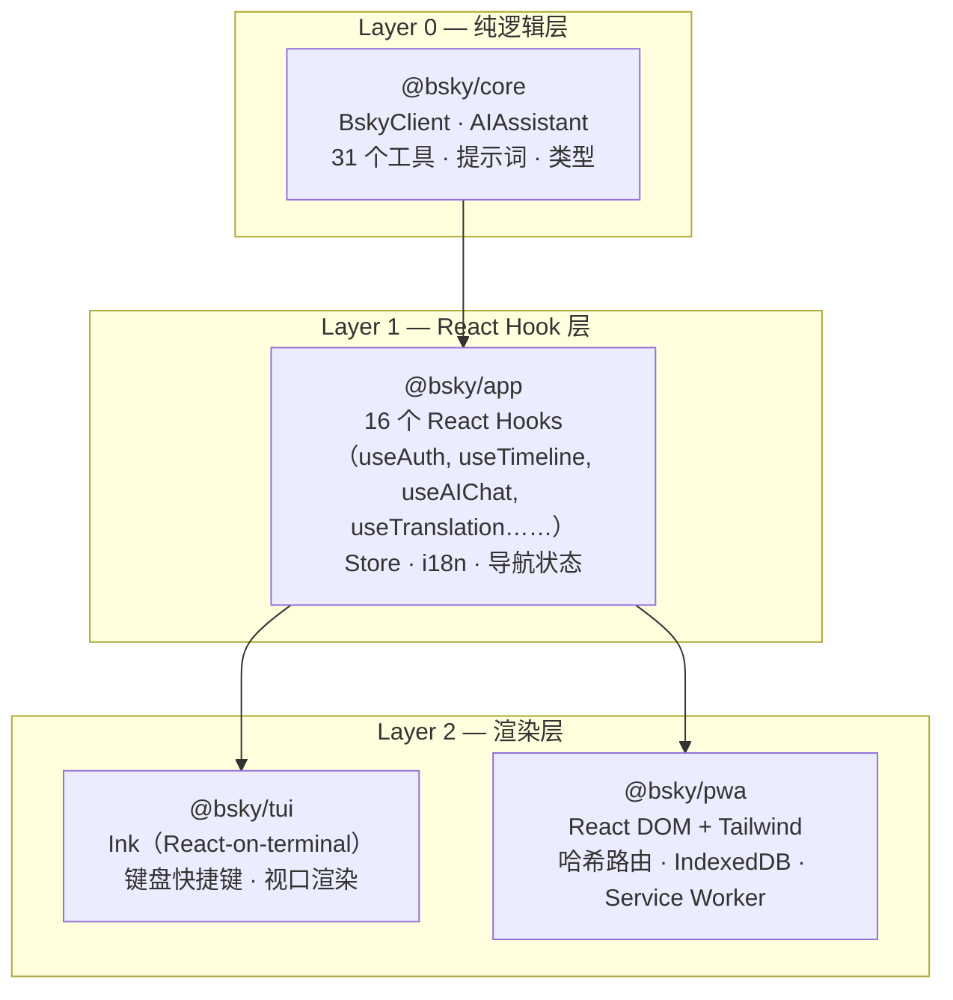

# 概览

## 一句话定位

**bsky** 是一个同时提供 **终端客户端（TUI）**和 **可安装网页应用（PWA）**的 Bluesky 第三方客户端。它最大的特色是把 **AI** 深度嵌入了每一个操作环节——从浏览时间线、翻译帖子到写草稿——而不只是套一个 AI 聊天框。

> 项目基于 TypeScript 全栈，采用 pnpm workspace monorepo 组织，当前版本 0.3.0，MIT 许可。
> [来源](README.md#L1-L6) | [来源](README.md#L282-L286)

---

## 架构一目了然：三层，一次业务逻辑

整个项目只写**一套**业务逻辑，然后同时在终端和浏览器里运行。这得益于清晰的**三层依赖架构**：

- **`@bsky/core`** — 纯 TypeScript，零 UI 依赖。封装了 AT Protocol 的全部 API（`BskyClient`）、AI 对话引擎（`AIAssistant`）、31 个工具函数和所有系统提示词。TUI 和 PWA 都不需要知道它的内部。
  [来源](ARCHITECTURE.md#L4-L6) | [来源](ARCHITECTURE.md#L46-L49)

- **`@bsky/app`** — 基于 core 构建的 **React Hook 层**。16 个共享 hooks（如 `useTimeline`、`useAIChat`、`useTranslation`）封装了所有业务状态和副作用。这一层是 TUI 和 PWA 的**共同入口**——PWA 不需要重写任何交互逻辑，直接导入这些 hooks 即可。
  [来源](ARCHITECTURE.md#L50-L55)

- **`@bsky/tui`** — 使用 **Ink** 框架把 React 渲染到终端。适用于没有图形界面的服务器、SSH 远程操作或习惯键盘驱动的用户。
  [来源](ARCHITECTURE.md#L56-L60)

- **`@bsky/pwa`** — 使用 **React DOM + Tailwind CSS** 的标准网页应用。支持离线缓存、Hash 路由、PWA 安装到桌面。
  [来源](ARCHITECTURE.md#L61-L65)

> 详细的三层职责划分请阅读 。

---

## TUI vs PWA：能力对照

下面的表格让你快速了解同一个功能在终端和网页上的不同表现。**✅** 表示支持，**N/A** 表示该端不需要或不适用。

| 功能 | TUI | PWA | 备注 |
|------|:---:|:---:|------|
| **时间线浏览**（虚拟滚动） | ✅ | ✅ | 支持 Following / Discover / 自定义 Feed |
| **切换自定义 Feed** | ✅ | ✅ | TUI 按 `f` 键，PWA 点下拉菜单 |
| **帖子讨论串**（回复树） | ✅ | ✅ | 可展开回复层、显示引用帖卡片 |
| **发帖 / 回复 / 引用** | ✅ | ✅ | 草稿保存、图片上传（最多 4 张） |
| **点赞 / 转帖 / 回复** | ✅ | ✅ | 操作后计数组件实时更新 |
| **删除自己的帖子** | ✅ | ✅ | TUI 按 `d`，PWA 点 🗑 图标，均需确认 |
| **通知** | ✅ | ✅ | 同列表风格 |
| **搜索**（4 个标签页） | ✅ | ✅ | 热门 / 最新 / 用户 / Feed |
| **个人主页** | ✅ | ✅ | 关注/取关、标签页、关注列表 |
| **书签**（内置 API） | ✅ | ✅ | |
| **AI 对话** | ✅ | ✅ | 31 个工具 + 流式输出 |
| **AI 思考模式** | ✅ | ✅ | 可配置，Terminal 显示 💭 块 |
| **AI 视觉模式** | ✅ | ✅ | 可选 GPT-4V / Claude Vision 等 |
| **智能翻译**（7 种语言） | ✅ | ✅ | TUI 按 `f`，PWA 点图标 |
| **AI 润色草稿** | ✅ | ✅ | |
| **链接/@提及 自动着色** | ✅ | ✅ | 文本中的蓝色高亮 |
| **Markdown 渲染** | ✅ | ✅ | PWA 用 react-markdown（完整 GFM），TUI 用自定义解析器 |
| **图片展示**（CDN） | ✅ | ✅ | 灯箱 + 本地保存 |
| **多语言界面**（zh/en/ja） | ✅ | ✅ | 单例 Store，即时切换 |
| **深色主题** | N/A | ✅ | CSS 变量驱动 |
| **PWA 可安装** | N/A | ✅ | manifest.json + Service Worker |
| **哈希路由** | N/A | ✅ | `#/feed?feed=at://...` 格式，支持静态托管 |
| **JWT 自动刷新** | ✅ | ✅ | ky 后置拦截器实现 |
| **滚动位置恢复** | N/A | ✅ | 返回时记住之前位置 |
| **AI 会话链接** | N/A | ✅ | `#/ai?session=uuid` 可分享对话 |
| **操作按钮行**（PostActionsRow） | N/A | ✅ | 时间线/搜索/书签/讨论串使用同一组件 |
| **SVG 图标**（50+） | N/A | ✅ | 心形、循环、书签、AI 等 |

[来源](README.md#L56-L78)

**核心差异理解**：TUI 依赖键盘快捷键驱动，适合快速浏览和批量操作；PWA 依赖鼠标/触摸和图形界面，适合深度阅读和多媒体交互。两者的**业务逻辑**完全一致——同一个 `useTimeline` hook 驱动两端的时间线。

---

## AI 集成亮点

bsky 的 AI 能力不是简单的"套壳聊天"，而是**系统级嵌入**。

### 31 个工具全覆盖

AI 助手拥有 31 个可直接调用的 **Bluesky 工具函数**，其中 24 个是只读操作（浏览时间线、搜索帖子、查看用户资料等），6 个是写操作（点赞、转帖、发帖等）。写操作设有**确认门控**——AI 不能擅自发帖或点赞，每次都会弹出确认提示。

> 完整工具清单请见 。

[来源](README.md#L39-L43) | [来源](ARCHITECTURE.md#L24-L25)

### 流式输出 + 思考过程可见

无论是 TUI 还是 PWA，AI 回复都通过 **SSE（Server-Sent Events）**实时流式渲染，用户不需要等待完整回复。DeepSeek V4 的推理过程会以独立的 💭 思考块显示，让 AI 的"脑回路"透明化。

> 流式方案的实现细节见 。

[来源](README.md#L37-L43)

### 智能翻译

支持 7 种语言的帖子级翻译，提供两种模式：
- **简单模式**：直接输出翻译文本
- **JSON 模式**：返回 `{translated, source_lang}` 结构，自动检测源语言

当翻译结果为空时，有**指数退避重试**机制（最多 3 次）。

> 翻译与润色的完整实现见 。

[来源](ARCHITECTURE.md#L79-L80)

### AI 润色

在帖子编辑器中，AI 可以按指定风格要求润色草稿。这本质上是一个带 style 参数的系统提示词调用。

> 提示词工程策略见 。

[来源](README.md#L39-L43)

### 编辑消息替代重试

当 AI 回复不符合预期时，TUI 和 PWA 都支持**预填上次输入**并编辑后再发送，而不需要整条消息重发。

[来源](README.md#L54)

---

## 开箱即用的技术栈

| 层级 | 技术 |
|------|------|
| 语言 | TypeScript 全栈 |
| 包管理 | pnpm workspace（`workspace:*` 协议） |
| HTTP 客户端 | ky（轻量级 fetch 封装） |
| 终端 UI | Ink 5（React 渲染到终端） |
| 网页 UI | React 18 + Tailwind CSS 3 |
| PWA 构建 | Vite 6 |
| 测试 | Vitest，19 个集成测试（真实 API，无 Mock） |
| AI 模型 | DeepSeek V4 Flash（可替换为其他 LLM） |

[来源](package.json#L1-L18) | [来源](README.md#L1-L6)

---

## 下一步

如果你是**第一次接触这个项目**，推荐的阅读路径：

1.  — 10 分钟内跑起 TUI 和 PWA
2.  — 深入理解三层如何协作
3.  — 一键体验 AI 对话、翻译和润色
4.  — 了解 monorepo 的组织规则

如果你是**架构爱好者**，可以直接跳到：

-  — 纯 TypeScript 的 Store 模式与跨端复用
-  — AI 助手的引擎设计
-  — 16 个共享 hooks 的完整清单