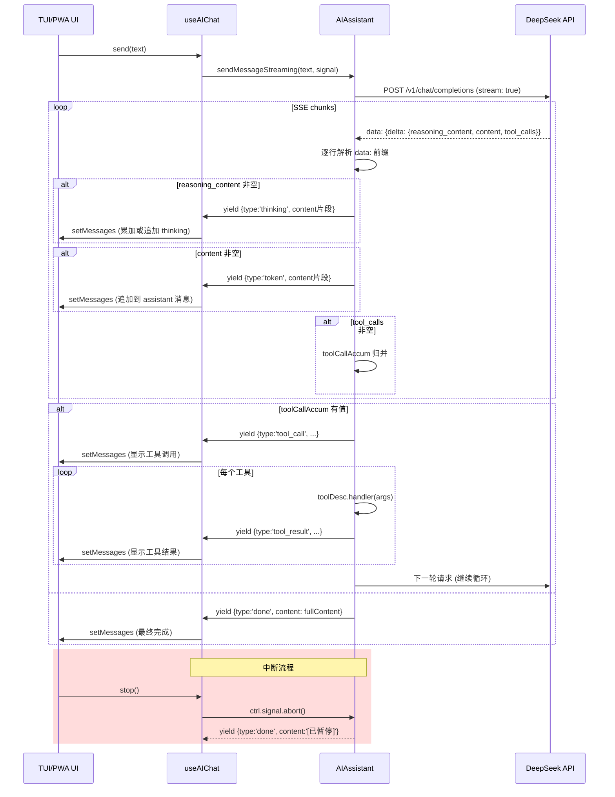

现在我已掌握全部代码素材，可以撰写文档了。

---

# 流式输出 SSE 实时渲染

## 一、设计目标

流式输出方案的核心目标只有一个：**用 AsyncGenerator 统一"思考过程"和"工具循环"的异步推送逻辑**，让下游消费者（无论是 React Hook 还是 Ink 组件）以 `for await...of` 统一消费四种事件类型：

| 事件类型 | 含义 | 产出时机 |
|---|---|---|
| `thinking` | DeepSeek 推理过程片段 | SSE chunk 中 `delta.reasoning_content` 非空 |
| `token` | 最终输出文本片段 | SSE chunk 中 `delta.content` 非空 |
| `tool_call` | 工具调用开始 | 流结束后 `toolCallAccum` 非空，逐工具产出 |
| `tool_result` | 工具执行结果 | 每个工具 handler 执行完毕后 |
| `done` | 本轮结束（无工具调用）或中断 | 流读取完毕或 `AbortSignal` 触发 |

来源：[assistant.ts#L382-L387](packages/core/src/ai/assistant.ts#L382-L387)

## 二、AsyncGenerator 的 SSE 解析

### 2.1 请求阶段：启用 `stream: true`

在 `sendMessageStreaming` 的每轮请求中，`ChatCompletionRequest` 设置 `stream: true`，这是触发服务端 SSE 返回的唯一条件：

```typescript
const body: ChatCompletionRequest = {
  model: this.config.model,
  messages: this._buildMessages(),
  temperature: 0.7,
  max_tokens: 4096,
  stream: true,                          // ← 关键标识
  thinking: { type: this.config.thinkingEnabled !== false ? 'enabled' : 'disabled' },
};
```

来源：[assistant.ts#L393-L399](packages/core/src/ai/assistant.ts#L393-L399)

### 2.2 逐行解析：`data: ` 前缀与 JSON 反序列化

SSE 流以 `data: ` 作为每行事件的前缀标记。解析步骤在 `while(true)` 循环中完成：

```typescript
const reader = res.body!.getReader();
const decoder = new TextDecoder();

while (true) {
  if (signal?.aborted) { /* 中断处理 */ }
  const { done, value } = await reader.read();
  if (done) break;
  const text = decoder.decode(value, { stream: true });
  const lines = text.split('\n');

  for (const line of lines) {
    if (!line.startsWith('data: ')) continue;  // ← 非事件行跳过
    const data = line.slice(6);                  // ← 剥离 "data: "
    if (data === '[DONE]') continue;             // ← 流终止标记

    const chunk = JSON.parse(data);
    const delta = chunk.choices?.[0]?.delta;
    if (!delta) continue;
    // ... 提取 delta.content / delta.reasoning_content ...
  }
}
```

关键边界处理：

- **`data: [DONE]`**：DeepSeek / OpenAI 标准流终止标记，直接跳过不报错。
- **JSON 解析失败**：`try/catch` 空捕获，跳过不可解析行（偶见网络半包残留）。
- **`TextDecoder` 的 `stream: true`**：确保 UTF-8 多字节字符跨 chunk 分割时正确拼接。

来源：[assistant.ts#L429-L460](packages/core/src/ai/assistant.ts#L429-L460)

### 2.3 双流分离：`delta.content` vs `delta.reasoning_content`

这是 DeepSeek 模型特有的字段设计。标准 OpenAI-compatible 接口只提供 `delta.content`，而 DeepSeek 的流式响应在每个 chunk 中额外携带 `delta.reasoning_content` 字段，表示模型内部推理过程的碎片。

```typescript
if (delta.reasoning_content) {
  reasoningContent += delta.reasoning_content;          // ← 累积完整推理文本
  yield { type: 'thinking', content: delta.reasoning_content as string };
}

if (delta.content) {
  fullContent += delta.content;                          // ← 累积最终输出
  yield { type: 'token', content: delta.content };
}
```

**分离设计的意义**：

- `thinking` 事件立即 yield，不等待 chunk 结束——消费端（如 TUI 的 `AIChatView`）可以用灰色斜体实时渲染"思考气泡"。
- `token` 事件同样实时 yield，消费端可以逐字追加到 assistant 气泡中。
- 两个累积器 `reasoningContent` 和 `fullContent` 在 `done` 事件中作为 `message.reasoning_content` 持久化到 `ChatMessage`，供后续多轮对话上下文使用。

来源：[assistant.ts#L462-L472](packages/core/src/ai/assistant.ts#L462-L472)

### 2.4 工具调用的流式累积

工具调用在 SSE 中以 `delta.tool_calls` 数组形式分片到达，需要按 `index` 归并：

```typescript
if (delta.tool_calls) {
  for (const tc of delta.tool_calls) {
    const idx = tc.index as number;
    if (!toolCallAccum.has(idx)) {
      toolCallAccum.set(idx, { id: tc.id || '', name: tc.function?.name || '', arguments: '' });
    }
    const acc = toolCallAccum.get(idx)!;
    if (tc.id) acc.id = tc.id;
    if (tc.function?.name) acc.name = tc.function.name;
    if (tc.function?.arguments) acc.arguments += tc.function.arguments;  // ← 分片参数拼接
  }
}
```

流结束后，按 `index` 排序后构造完整的 `ToolCall[]` 数组，进入工具执行循环。

来源：[assistant.ts#L474-L482](packages/core/src/ai/assistant.ts#L474-L482)

## 三、AbortController 中断机制

### 3.1 中断的三层防护

`AbortSignal` 在三个层级发挥作用：

```
┌─────────────────────────────────────────┐
│ 1. fetch() 层：signal 直接传 fetch      │
│    浏览器/Node 自动中止 HTTP 请求        │
├─────────────────────────────────────────┤
│ 2. SSE 读取层：每次 iterate 前检查       │
│    if (signal?.aborted) → yield done     │
├─────────────────────────────────────────┤
│ 3. Catch 边界层：fetch 或 decode 抛异常   │
│    区分"被中断" vs "网络错误"            │
└─────────────────────────────────────────┘
```

来源：[assistant.ts#L411-L422](packages/core/src/ai/assistant.ts#L411-L422)

**第一层**：`fetch(url, { signal })`——操作系统级的 TCP 连接断开。
**第二层**：`while(true)` 循环体首行——即使在 HTTP 层面信号没来得及传播（如正在 `reader.read()` 阻塞中），下个迭代也会立即中止。
**第三层**：`try/catch` 包裹整个 SSE 读取块——如果 `reader.read()` 因中断抛出异常，`catch` 块中检查 `signal?.aborted`，若是则 yield `{ type: 'done', content: fullContent }` 返回已累积的部分文本；否则抛出原始错误。

### 3.2 消费端的 stop 语义

在 `useAIChat` 中：

```typescript
const ctrl = new AbortController();
abortRef.current = ctrl;

// ... 传入 assistant.sendMessageStreaming(text, ctrl.signal) ...

const stop = useCallback(() => {
  abortRef.current?.abort();
}, []);
```

TUI 和 PWA 的"停止"按钮均调用 `stop()`，触发 `AbortController.abort()`。被中断的流会 yield 一个 `done` 事件，内容为 `[已暂停]` 标记——而非抛出异常。这保证了**"停止"不是错误，而是正常结束**。

来源：[useAIChat.ts#L239-L241](packages/app/src/hooks/useAIChat.ts#L239-L241), [assistant.ts#L414-L416](packages/core/src/ai/assistant.ts#L414-L416)

## 四、双端消费：useAIChat 的 onToken 等价实现

`sendMessageStreaming` 的 AsyncGenerator 设计让两端的消费模式完全一致。

### 4.1 PWA 端（React DOM）

在 `AIChatPage` 中，消息由 `useAIChat` 返回的 `messages` 状态驱动渲染。`useAIChat` 内部的 `send` 函数以 `for await...of` 消费流，每收到一个 `token` 事件就 `setMessages` 更新最后一条 assistant 消息的内容：

```typescript
if (event.type === 'token') {
  streamingContent += event.content;
  setMessages(prev => {
    const last = prev[prev.length - 1];
    if (last?.role === 'assistant') {
      // Append to existing assistant message
      const updated = [...prev];
      updated[updated.length - 1] = { ...last, content: streamingContent };
      return updated;
    }
    // First token — create new assistant message
    return [...prev, { role: 'assistant', content: streamingContent }];
  });
}
```

`thinking` 事件的渲染类似——累加或追加到 role 为 `thinking` 的消息上。PWA 用 `<div className="border-l-2 border-text-secondary/20 pl-3 py-1 text-xs text-text-secondary/60 italic">` 样式呈现思考过程，与最终输出在视觉上完全分离。

来源：[useAIChat.ts#L163-L178](packages/app/src/hooks/useAIChat.ts#L163-L178), [AIChatPage.tsx#L231-L240](packages/pwa/src/components/AIChatPage.tsx#L231-L240)

### 4.2 TUI 端（React Ink）

TUI 的 `AIChatView` 同样通过 `useAIChat` 消费流，渲染方式完全相同。区别在于 `thinking` 消息的视觉样式：

```typescript
if (msg.role === 'thinking') {
  const prefix = '| Thinking: ';
  // ... wrapLines 后以 <Text color="gray" dimColor> 渲染
}
```

TUI 使用 `| Thinking: ` 前缀和 `gray` + `dimColor` 的 Ink 样式，在终端中呈现为暗淡的辅助文本。

来源：[AIChatView.tsx#L103-L111](packages/tui/src/components/AIChatView.tsx#L103-L111)

## 五、完整数据流图



## 六、设计决策要点

1. **AsyncGenerator 而非回调函数**：让消费方可以用 `for await...of` 线性编写流程，无需处理嵌套回调。这是本项目选择 Generator 模式而非传统 `onToken` 回调 API 的核心原因。

2. **`thinking` 与 `token` 分离而非合并**：若将推理过程直接拼入最终内容，UI 层无法区分"模型正在思考"和"模型正在输出"。分离设计使 PWA 能用斜体灰字展示推理、TUI 能用 `dimColor` 展示——两者互不影响。

3. **`done` 事件承载完整内容**：`done` 事件的 `content` 字段包含 `fullContent` 的累积值，确保消费方在不追踪 `token` 累计的情况下也能拿到完整结果。同时，`done` 也是中断后的唯一终止信号，避免 `return` 和 `throw` 两套路径并存。

4. **工具循环嵌套于流中**：与非流式 `sendMessage` 不同，流式版的工具循环不是返回后的二次处理，而是作为 Generator 的一部分逐轮 yield `tool_call` / `tool_result` 事件。这使得消费方可以在同一 `for await...of` 中看到"思考→输出→调工具→继续思考→最终输出"的完整链路。

## 推荐阅读

- 理解流式输出如何与[对话核心架构](AIAssistant-核心对话架构.md)中的多轮工具循环配合
- 查看 [useAIChat 深度解析](useAIChat-深度解析.md) 以了解流式事件如何映射到 React 状态
- 了解 [31 个工具系统](31-个工具系统详解.md) 中 `requiresWrite` 门控如何在流式路径中暂停 Generator 并等待用户确认
- 阅读 [系统提示词工程](系统提示词工程.md) 了解 `thinking` 是否启用对提示词组装的影响