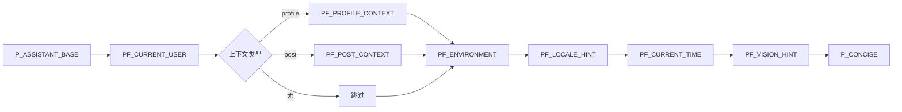

# 系统提示词工程

> **核心命题：如何通过片段化（fragment-based）组合策略，在保持提示词一致性的同时，为不同上下文动态注入差异化指令。**

## 约定：`P_` 与 `PF_` 的语义边界

`prompts.ts` 文件定义了一套严格的命名约定，这是理解整个系统的第一把钥匙：

| 前缀 | 语义 | 特征 | 示例 |
|------|------|------|------|
| **`P_`** | 纯字符串常量 | 编译期确定，零参数 | `P_ASSISTANT_BASE`、`P_CONCISE` |
| **`PF_`** | 参数化函数 | 运行时求值，注入动态数据 | `PF_CURRENT_USER(name)`、`PF_ENVIRONMENT(env)` |

这条界线的设计意图很清晰：**调用方（`buildSystemPrompt`）只需要关心"我要推入哪些片段"，而不需要关心每个片段内部如何构造文本**。每个片段是独立封装的单元，修改一个片段的措辞不会影响其他片段——这正是单一职责原则在提示词工程中的映射。

> `P_` 常量使用 IIFE 初始化，而非简单的字符串字面量，是为了方便未来在构造时注入逻辑（例如条件性拼接），同时保持 API 的一致性——调用方看到的始终是一个字符串值。
>
> [来源](packages/core/src/ai/prompts.ts#L1-L7)

## 八个片段，八种职责

### 1. `P_ASSISTANT_BASE` — 身份与铁律

这是系统的**锚点片段**，定义了助手的身份（"Bluesky 助手"）、能力边界（工具调用、搜索语法、图片/视频处理限制）和三条不可逾越的规则：

1. **写操作必须由用户明确要求**——不得主动发帖、点赞、转发或关注
2. **汇总资料时直接输出**——不得附加"要我帮你发条帖子吗"之类的建议
3. **工具仅在用户要求时执行**

规则部分使用了"绝对不要""永远不要"等强约束语气，这是有意为之——在与 LLM 交互时，模糊的"建议"往往被忽略，而明确的禁令能显著降低幻觉率。

> [来源](packages/core/src/ai/prompts.ts#L32-L61)

### 2. `PF_CURRENT_USER` — 身份锚定

```typescript
export function PF_CURRENT_USER(name: string, handle?: string): string {
  const suffix = handle ? ` (@${handle})` : '';
  return `当前用户: ${name}${suffix}。`;
}
```

**设计意图**：将"我是谁"注入到系统提示中。当 AI 需要执行 `search_posts from:handle` 或判断当前用户与某个资料的关系时，这个名字是推理的基础。`handle` 作为可选参数，兼容仅显示名或无显示名的场景。

> [来源](packages/core/src/ai/prompts.ts#L65-L69)

### 3. `PF_PROFILE_CONTEXT` — 人物分析模式

当用户从他人主页打开 AI 聊天时，这个片段会注入完整的分析指令：

- 先调用 `get_author_feed` 获取近期帖子
- 使用 `search_posts from:currentUser to:handle` 查找互动历史
- 要求概括至少 3 个要点并引用原文
- 包含明确的"仅分析，不要代表用户发帖或互动"护栏

**设计意图**：profile context 是所有片段中最复杂的一个，因为它本质上是**行为指令**——它告诉 AI 在进入该模式时应该执行哪些工具调用、按照什么流程、产出什么格式。这比单纯"注入上下文"更进一步，是**微工作流的嵌入式编排**。

> [来源](packages/core/src/ai/prompts.ts#L75-L90)

### 4. `PF_POST_CONTEXT` — 帖子锚定

```typescript
export function PF_POST_CONTEXT(uri: string): string {
  return `用户正在查看帖子 ${uri}，如果需要请用工具获取上下文。`;
}
```

极简，仅提供 URI。与 profile context 形成鲜明对比——**职责单一到极致**：只告诉 AI "用户在看什么"，具体怎么分析交给 AI 自行判断。这种设计差异源于帖子上下文的多样性：用户可能想总结、翻译、分析情绪或追踪讨论线，AI 需要的灵活度远高于 profile 分析。

> [来源](packages/core/src/ai/prompts.ts#L97-L98)

### 5. `PF_ENVIRONMENT` — 渲染格式适配

```typescript
export function PF_ENVIRONMENT(env: 'tui' | 'pwa'): string {
  return `你运行在${env === 'tui' ? '终端命令行界面 (TUI/CLI)' : '网页浏览器 (PWA)'}中。...`;
}
```

这是**跨端适配的关键片段**。TUI 环境要求纯文本、80 字符换行、复杂格式受限；PWA 环境允许 Markdown、图片内嵌和超链接。AI 据此调整输出风格，这是"三层架构"中渲染差异在提示词层的体现。

> 关于 TUI 与 PWA 的架构差异，参见 [三层架构设计](三层架构设计.md)。

> [来源](packages/core/src/ai/prompts.ts#L103-L107)

### 6. `PF_LOCALE_HINT` — 语言偏好

```typescript
export function PF_LOCALE_HINT(locale: string): string {
  return `用户界面语言: ${locale}，请优先用该语言回复。`;
}
```

使用"优先"而非"必须"，留有余地——当用户要求用非 UI 语言翻译时，AI 可以适度偏离而不违反系统提示。

> [来源](packages/core/src/ai/prompts.ts#L112-L114)

### 7. `PF_CURRENT_TIME` — 时间锚点

```typescript
export function PF_CURRENT_TIME(): string {
  const now = new Date();
  return `当前时间: ${now.toISOString().slice(0, 19).replace('T', ' ')} (UTC+0)，星期${['日','一','二','三','四','五','六'][now.getUTCDay()]}。`;
}
```

**设计意图**：UTC+0 而非本地时间，原因是 LLM 的推理一致性——UTC 作为世界时基准，避免了时区转换引入的计算偏差。星期信息则有助于理解"今天""上周五"等相对时间表述。

> [来源](packages/core/src/ai/prompts.ts#L121-L123)

### 8. `PF_VISION_HINT` — 视觉能力门控

这是片段中最长的一个，分为两个分支：

- **启用时**：简短告知可用 `view_image` 和 `download_image`
- **禁用时**：详细引导用户开启视觉模式，**同时加入重要防御逻辑**——"如果你不支持视觉，请不要建议用户开启视觉模式以避免浪费上下文"

**设计意图**：这既是功能指引，也是 token 预算控制。当模型本身不具备视觉能力（如某些轻量模型），却被告知"可以开启视觉模式"，会导致模型假装能看图而产生幻觉。这段提示是**自省门控**：让模型判断自身能力边界。

> [来源](packages/core/src/ai/prompts.ts#L128-L138)

### 收尾片段：`P_CONCISE`

```typescript
export const P_CONCISE = '回答简练。';
```

整个提示词的**最后一个片段**，仅三个字，作用是压制 AI 的过度输出倾向。放在末尾而非开头，利用了 LLM 对文本尾部指令更敏感的"近因效应"（recency bias）。

> [来源](packages/core/src/ai/prompts.ts#L116)

## 组装逻辑：`buildSystemPrompt` 的动态组合

`useAIChat.ts` 中的 `buildSystemPrompt` 是组合引擎，按照**固定顺序**拼接片段：



**关键设计决策**：

1. **profile 与 post 互斥**：`if (contextProfile)` 优先判断，仅有 `else if (withContext)` 兜底。这意味着 profile 上下文优先级高于 post 上下文——因为 profile 的分析流程更复杂，需要更多指令空间。

2. **`PF_LOCALE_HINT` 条件性注入**：只在 `options?.locale` 存在时插入。这是为了兼容未配置地区的降级场景（如首次启动时）。

3. **`PF_ENVIRONMENT` 硬编码保底**：`options?.environment || 'pwa'` —— 默认走 PWA 格式，因为 PWA 的 Markdown 兼容性更高，即使跑在终端也只是格式稍冗余，不会出乱码。这是**默认安全（safe default）** 策略。

4. **顺序不是随机的**：身份→上下文→环境→语言→时间→视觉→简洁。从"我是谁"到"用户是谁"到"我在哪"到"何时"到"我能做什么"到"别啰嗦"，是**从稳定到变化的渐进**——恒定片段在前，易变片段在后，最大化确定性。

> [来源](packages/app/src/hooks/useAIChat.ts#L63-L80)

## 与原始版本的对比

`contracts/system_prompts.md` 中记录了最初的提示词设计：

```
你是一个深度集成 Bluesky 的终端助手。你可以通过工具调用获取最新的
网络动态、用户资料和帖子上下文。当用户提及某个帖子时，主动使用
get_post_thread_flat 和 get_post_context。回答简练，适合终端显示，
支持 Markdown（由 ink 渲染）。
```

对比当前版本，演化方向清晰：

| 维度 | 原始版本 | 当前版本 |
|------|---------|---------|
| **结构** | 单块文本 | 8 个可组合片段 |
| **硬编码** | `终端助手`、`ink 渲染` | 运行时可选的 `PF_ENVIRONMENT` |
| **行为指令** | "当用户提及某个帖子时，主动使用…" | 移入 `PF_POST_CONTEXT`，按需注入 |
| **护栏** | 无 | 三条铁律 + 视觉自省门控 |
| **语言** | 仅中文 | 可配置 locale |
| **时间感知** | 无 | `PF_CURRENT_TIME` 锚定 |

**核心变化**：从"一个适用于所有人的提示词"进化为"根据当前视图动态组合的提示词系统"。这对应着产品从单一终端向 TUI+PWA 双端架构的演进需求。

> [来源](contracts/system_prompts.md#L6-L10)

## 设计意图总结

这套提示词系统体现了三个层次的工程思想：

**第一层：可维护性**。命名约定（`P_`/`PF_`）让提示词的意图一目了然，新增或修改一个片段不会影响其他部分。所有 LLM 涉及的文本集中在单一文件中，避免了"提示词散落在各组件"的反模式。

**第二层：上下文感知**。`buildSystemPrompt` 的上下文选择逻辑（profile vs post vs none）直接映射到 UI 层的视图切换——当用户在 [导航路由与视图管理](导航路由与视图管理.md) 中跳转到 profile 页时，AI 自动获得人物分析指令；跳转到帖子视图时，获得帖子分析指令。提示词系统是视图系统的"影子层"。

**第三层：防御性设计**。三条铁律抑制了 AI 的过度主动性；`PF_VISION_HINT` 的自省门控防止了无视觉模型的幻觉输出；`P_CONCISE` 利用近因效应降低 token 消耗。这些细节说明文件作者对 LLM 的行为偏差有系统的理解，并针对性地设计了 countermeasure。

> 关于这些片段在运行时如何注入到 AI 对话引擎中，参见 [useAIChat: 深度解析](useAIChat-深度解析.md)。
> 关于完整的工具系统如何与提示词协同工作，参见 [31 个工具系统详解](31-个工具系统详解.md)。