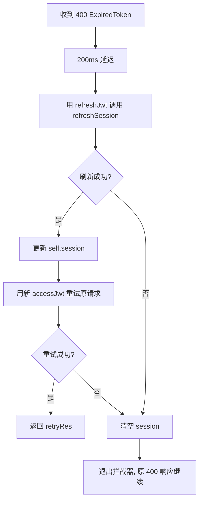

Now I have all the information needed. Let me write the page.

---

# 认证与会话自动刷新

Bluesky 的 AT Protocol 使用 **JWT（JSON Web Token）** 进行 API 认证。每次登录成功后，服务端返回两个 token：`accessJwt`（短期凭证，用于常规请求）和 `refreshJwt`（长期凭证，用于续期）。当 `accessJwt` 过期时，客户端需自动用 `refreshJwt` 换发新 token，整个过程对用户透明。

本页深入剖析 `BskyClient` 如何借助 **ky 后置拦截器** 实现这一机制，以及 TUI 与 PWA 在会话持久化策略上的根本差异。

[来源](../packages/core/src/at/client.ts#L33-L40)

---

## BskyClient 的 withRefresh 拦截器

`BskyClient` 的构造函数中注册了一个 ky 实例的 `afterResponse` 钩子，名为 `withRefresh`。它拦截每一个 **非 2xx** 响应，从中检测 token 过期错误并自动执行刷新重试。

```typescript
const withRefresh = async (request, _options, response) => {
  if (!response.ok) {
    const body = await response.clone().text();
    if (response.status === 400 && self.session) {
      const err = JSON.parse(body);
      if (err.error === 'ExpiredToken' || err.error === 'InvalidToken') {
        // → 触发 refresh 流程
      }
    }
  }
};
```

拦截器只对 **状态码 400** 且 **错误类型为 `ExpiredToken` 或 `InvalidToken`** 的响应做出反应。这三个条件同时满足，才进入刷新流程。其他 4xx/5xx 错误（如 403 权限不足）会被直接跳过，仅打印日志。

[来源](../packages/core/src/at/client.ts#L41-L77)

### 检测逻辑的边界

- **状态码 400**：AT Protocol 的 token 过期统一返回 400，而非 401。这是协议层面的约定。
- **错误名精确匹配**：`ExpiredToken` 表示 token 确实过期；`InvalidToken` 可能是 token 损坏或被服务端吊销。两者都触发刷新。
- **仅当已登录**：`self.session` 为 `null` 时跳过，防止未登录状态下对公共 API 的响应误触发刷新。
- **非 JSON body 安全退出**：JSON 解析失败时整个 `try` 块静默结束，不抛出异常。

[来源](../packages/core/src/at/client.ts#L44-L51)

---

## refreshSession 机制：重试 + 200ms 延迟

一旦检测到过期 token，拦截器执行以下步骤：



[来源](../packages/core/src/at/client.ts#L51-L70)

### 200ms 延迟的原因

代码注释明确解释：*"Small delay avoids TLS connection contention with ky's keep-alive."* 这是第一性原理的体现——ky 默认启用 HTTP 连接池（keep-alive），当多个请求几乎同时失败时（例如多个 API 调用同时发现 token 过期），若所有失败请求同时发起 refresh，会导致 TLS 握手竞争。200ms 的随机化窗口让刷新请求错开，减少连接建立冲突。

[来源](../packages/core/src/at/client.ts#L53)

### 重试的保底策略

刷新流程有三层保底：

1. **刷新请求本身失败**（网络错误）：进入 `catch` 块，**不清空 session**，保留现有 token 让调用方自行重试。这是保守策略——网络抖动不应当导致用户登出。
2. **刷新成功但重试原请求失败**：清空 `self.session`，标记未认证状态。此时上层 UI 会显示登录界面。
3. **刷新请求返回非 200**（如 refreshJwt 也已过期）：同样清空 session，触发重新登录。

[来源](../packages/core/src/at/client.ts#L65-L69)

---

## restoreSession：注入已有会话

`restoreSession` 是一个纯内存操作的方法，直接替换 `BskyClient` 内部的 `session` 字段：

```typescript
restoreSession(session: CreateSessionResponse): void {
  this.session = session;
}
```

它不执行任何网络请求，不验证 token 有效性，也不触发刷新。调用者负责确保传入的 session 是有效的。一旦后续请求遭遇 `ExpiredToken`，`withRefresh` 拦截器会自动完成续期。

[来源](../packages/core/src/at/client.ts#L364-L367)

---

## TUI 与 PWA 的会话持久化差异

双端共享同一套 core 层 `BskyClient`，但在会话管理方式上存在根本区别：

| 维度 | TUI（终端客户端） | PWA（网页客户端） |
|------|------------------|------------------|
| 凭证来源 | `.env` 文件的 `BLUESKY_HANDLE` + `BLUESKY_APP_PASSWORD` | 用户在登录页输入凭据 |
| session 存储 | **仅内存**，进程退出即消失 | **localStorage**，跨页面/跨会话持久 |
| 重启后恢复 | 每次启动用密码重新 `login()` | 用 `restoreSession` 注入 localStorage 中的 session |
| 过期恢复 | 监听 `client.isAuthenticated()` 变化，检测到登出后自动重新 `login()` | 依赖 `withRefresh` 拦截器自动刷新；刷新失败则清空 localStorage 并回到登录页 |
| 持久化工具 | 无 | `useSessionPersistence`（`getSession`/`saveSession`/`clearSession`） |

[来源](../packages/tui/src/components/App.tsx#L96-L102) · [来源](../packages/tui/src/components/App.tsx#L105-L110) · [来源](../packages/pwa/src/hooks/useSessionPersistence.ts) · [来源](../packages/pwa/src/App.tsx#L64-L76)

### TUI：每次启动重新登录

TUI 没有 session 持久化。它从 `.env` 读取凭据，在组件挂载时自动调用 `login()`：

```typescript
useEffect(() => {
  if (!authLoading) login(config.blueskyHandle, config.blueskyPassword);
}, []);
```

更关键的是，TUI **监听客户端认证状态的变化**。当 `withRefresh` 拦截器清空了 session（例如系统休眠后 refreshJwt 也已过期），客户端会变为未认证状态，TUI 立即用保存的密码重新执行完整登录：

```typescript
useEffect(() => {
  if (client?.isAuthenticated()) {
    setWasAuthenticated(true);
  } else if (wasAuthenticated) {
    setWasAuthenticated(false);
    login(config.blueskyHandle, config.blueskyPassword);
  }
}, [client]);
```

这种设计利用了 `.env` 中始终可用的凭据，简化了终端的用户体验——用户不会看到登录界面，终端始终尝试保持在线。

[来源](../packages/tui/src/components/App.tsx#L96-L110)

### PWA：localStorage 持久化 + restoreSession

PWA 使用 `useSessionPersistence` 工具，将 session 的四个核心字段存入 `localStorage`：

```typescript
export interface StoredSession {
  accessJwt: string;
  refreshJwt: string;
  handle: string;
  did: string;
}
```

**应用启动时**，PWA 从 localStorage 读取已保存的 session，调用 `restoreSession` 注入到新创建的 `BskyClient`：

```typescript
useEffect(() => {
  const saved = getSession();
  if (saved && !client) {
    restoreSession({
      accessJwt: saved.accessJwt,
      refreshJwt: saved.refreshJwt,
      handle: saved.handle,
      did: saved.did,
    });
    setIsLoggedIn(true);
  }
}, []);
```

**登录成功时**，PWA 将新 session 同步写入 localStorage：

```typescript
useEffect(() => {
  if (session && client?.isAuthenticated()) {
    saveSession({ accessJwt: session.accessJwt, ... });
  }
}, [session, client]);
```

**认证失败时**（如 `withRefresh` 清空了 session），PWA 清空 localStorage 并回到登录页：

```typescript
useEffect(() => {
  if (authError && isLoggedIn) {
    clearSession();
    setIsLoggedIn(false);
  }
}, [authError, isLoggedIn]);
```

[来源](../packages/pwa/src/hooks/useSessionPersistence.ts) · [来源](../packages/pwa/src/App.tsx#L64-L94)

### 差异的本质原因

TUI 能使用密码重新登录，因为 `.env` 文件在本地文件系统中始终可读；而 PWA 在浏览器环境没有安全的本地凭据存储（除非使用密码管理器或 WebAuthn），因此选择持久化 session 本身而非密码。两种策略都绕过了同一个约束——**JWT 过期后的无缝恢复**——但用了不同的资源。

[来源](../packages/tui/src/cli.ts#L30-L35) · [来源](../packages/pwa/src/hooks/useSessionPersistence.ts#L1)

---

## auth store 中的 restoreSession 包装

PWA 的 auth store（`packages/app/src/stores/auth.ts`）在 `restoreSession` 中除了调用 `c.restoreSession(session)`，还额外进行了一次 **profile 验证**：

```typescript
restoreSession(session: CreateSessionResponse) {
  const c = new BskyClient();
  c.restoreSession(session);
  store.session = session;
  store.client = c;
  c.getProfile(session.handle).then(p => {
    store.profile = p;
    store._notify();
  }).catch(() => {
    if (!c.isAuthenticated()) {
      store.client = null;
      store.session = null;
      store.error = 'session_expired';
      store._notify();
    }
  });
}
```

这个设计将 **session 恢复** 与 **session 验证** 合并——如果 profile 请求返回 `ExpiredToken`，`withRefresh` 拦截器会自动尝试刷新；若刷新失败导致 session 被清空，则 `c.isAuthenticated()` 返回 `false`，store 将状态标记为 `session_expired`，PWA 的 App 组件据此清空 localStorage 并展示登录页。

[来源](../packages/app/src/stores/auth.ts#L44-L57)

---

## 相关页面

- [环境变量与认证](环境变量与认证.md) — TUI 的 `.env` 文件配置与 PWA 浏览器端配置的差异
- [BskyClient: Bluesky API 封装](bskyclient-bluesky-api-封装.md) — ky HTTP 客户端及公共/认证端点的智能路由
- [状态管理模式](状态管理模式.md) — 纯 TypeScript 的单监听器 Store 模式与跨端共享
- [三层架构设计](三层架构设计.md) — core→app→tui/pwa 的依赖分层