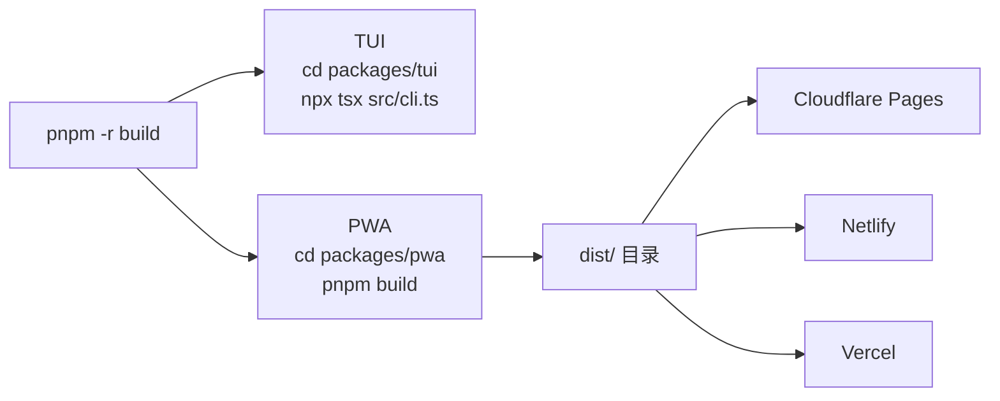

# 项目部署指南

你只需要一条命令就能构建整个项目，再花 5 分钟就能把网页版部署到线上。本页覆盖两条路径：**TUI 终端客户端**的本地运行和 **PWA 网页客户端**的三种静态部署方式。

---

## 整体流程一览



两条路径共享同一份构建产物。TUI 在终端运行，PWA 输出静态文件后部署到任意静态托管平台。 [来源](../README.md#L20-L40)

---

## 前置条件

| 工具 | 版本要求 | 获取方式 |
|------|----------|----------|
| Node.js | >= 18 | [nodejs.org](https://nodejs.org) |
| pnpm | 最新稳定版 | `npm install -g pnpm` |
| Git | 任意版本 | [git-scm.com](https://git-scm.com) |

TUI 还需要一个支持 raw mode 的终端（Windows Terminal、iTerm2、Kitty 均可）。PWA 则只需要现代浏览器（Chrome / Firefox / Safari）。 [来源](../README.md#L17-L18)

---

## TUI：本地运行终端客户端

TUI 不需要部署到服务器，它在你的终端里直接运行。

### 1. 克隆并安装

```bash
git clone https://github.com/epheiamoe/bsky.git
cd bsky
pnpm install
pnpm -r build
```

`pnpm -r build` 会按依赖顺序构建所有子包（`@bsky/core` → `@bsky/app` → `@bsky/tui` + `@bsky/pwa`）。如果你只打算用 TUI，这条命令仍然是最保险的，因为它确保所有依赖包都已编译。 [来源](../README.md#L22-L27)

### 2. 配置环境变量

复制模板文件并填写凭据：

```bash
cp .env.example .env
```

编辑 `.env`，至少需要填写以下两项：

```env
BLUESKY_HANDLE=your-handle.bsky.social
BLUESKY_APP_PASSWORD=xxxx-xxxx-xxxx-xxxx
```

完整的配置项说明见 [环境变量与认证](环境变量与认证.md)。 [来源](../.env.example)

### 3. 启动

```bash
cd packages/tui
npx tsx src/cli.ts
```

首次启动会进入 **SetupWizard** 安装向导，引导你完成环境校验和配置。之后直接进入时间线界面。 [来源](tui-终端客户端入门.md)

详细操作指南请参考 [TUI 终端客户端入门](tui-终端客户端入门.md)。 [来源](../packages/tui/package.json#L15-L21)

---

## PWA：构建并部署到线上

PWA 是纯静态前端应用，**不需要任何后端服务器**。所有 Bluesky API 调用直接从浏览器发出——Bluesky 官方 API 和 PDS 端点支持跨域请求（CORS），因此你的网页客户端可以独立运行。 [来源](../docs/PWA_GUIDE.md#L13-L15)

### 构建

```bash
cd packages/pwa
pnpm build      # 输出 → dist/
```

构建产物 `dist/` 目录包含：

```
dist/
├── index.html           # 入口页面
├── manifest.json        # PWA 安装清单
├── sw.js                # Service Worker（离线缓存）
├── assets/              # JS + CSS（哈希文件名）
└── icons/               # 应用图标（64/192/512px）
```

可以用 `pnpm preview` 在本地预览构建结果。 [来源](../packages/pwa/package.json#L8-L12)

### 部署方式一：Cloudflare Pages（推荐）

```bash
# 确保已安装 wrangler
npx wrangler pages deploy dist --project-name ai-bsky --commit-dirty=true
```

如果网络环境不允许使用 CLI，也可以通过 Cloudflare Dashboard 手动上传：

1. 登录 Cloudflare Dash → **Workers & Pages** → **Pages** → **直接上传**
2. 将 `dist/` 文件夹拖入上传区
3. 填写项目名称 → 部署

**在线 Demo** 正是部署在 Cloudflare Pages 上：<https://ai-bsky.pages.dev> [来源](../docs/PWA_GUIDE.md#L6-L12)

### 部署方式二：Netlify

```bash
# 确保已安装 netlify-cli
npx netlify deploy --dir dist --prod
```

Netlify 会自动识别静态站点配置，无需额外设置重定向规则。 [来源](../README.md#L66-L72)

### 部署方式三：Vercel

```bash
# 确保已安装 vercel CLI
npx vercel dist --prod
```

Vercel 同样原生支持静态目录部署，零配置即可上线。 [来源](../README.md#L66-L72)

---

## 关键架构优势

理解了部署流程后，这里再说明为什么 PWA 可以如此轻量地部署。

| 特性 | 说明 |
|------|------|
| **无后端依赖** | 没有 Node.js 服务器，没有数据库，没有 API 代理——一个 CDN 就能跑 |
| **CORS 支持** | Bluesky 的 `public.api.bsky.app` 和用户 PDS 均开放 CORS 头 |
| **凭证在浏览器** | 用户通过登录页面输入凭据，会话存储在 `localStorage`，服务器无从知晓 |
| **AI API Key 也存本地** | LLM 的 API Key 通过设置页面配置，同样只在浏览器内存和 `localStorage` 中 |
| **离线可用** | Service Worker 缓存了静态资源和 Bluesky CDN 图片，弱网环境也能浏览已缓存内容 |

PWA 与 TUI 共享 100% 的业务逻辑，核心差异仅在于渲染层和存储实现。 [来源](../docs/PWA_GUIDE.md#L13-L15) 详见 [三层架构设计](三层架构设计.md)。

**更直白的说法**：你把 `dist/` 上传到任何能托管静态文件的地方——GitHub Pages、Vercel、Netlify、Cloudflare Pages 甚至 Apache/Nginx 服务器——它都能正常工作。不需要买服务器，不需要配环境变量，不需要维护数据库。

---

## 在线 Demo

PWA 线上实例已在运行，你可以直接体验：<https://ai-bsky.pages.dev>

Demo 部署在 Cloudflare Pages 上，代码与仓库保持一致。

---

## 下一步

- 如果你首次接触该项目，建议先阅读 [概览](概览.md) 了解整体架构
- 体验部署好的 PWA 后，参考 [PWA 网页客户端入门](pwa-网页客户端入门.md) 了解界面导航和 AI 功能
- 如果是 TUI 用户，[TUI 终端客户端入门](tui-终端客户端入门.md) 提供快捷键和操作流程的完整说明
- 想了解 PWA 离线缓存的具体实现，见 [哈希路由、存储与离线支持](哈希路由-存储与离线支持.md)
- 关于环境变量差异的详细说明，见 [环境变量与认证](环境变量与认证.md)