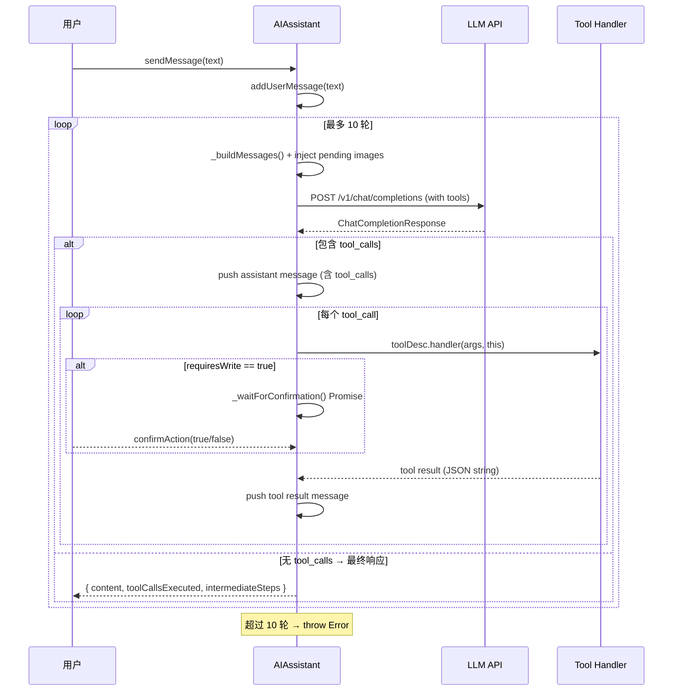

现在我已掌握全部信息，来撰写这篇深度技术文档。

---

# AI 助手与工具调用系统

`@bsky/core` 的 AI 子系统是整个项目智能化的核心引擎。它围绕两个关键模块构建：`createTools()` 工厂函数生成的 **31 个工具描述符**（ToolDescriptor），以及 `AIAssistant` 类驱动的 **多轮工具调用循环**。这套架构让 LLM 既能以只读方式浏览 Bluesky 全局数据，又能通过写操作确认门控安全地执行发帖、点赞等敏感操作。

[来源](packages/core/src/ai/tools.ts) · [来源](packages/core/src/ai/assistant.ts)

---

## 1. 类型体系：三层抽象

系统通过三个层级解耦工具的"声明"与"执行"：

**ToolDefinition** — 工具的声明式 Schema，包含 `name`、`description`、`inputSchema`（JSON Schema 格式），直接映射到 LLM Function Calling API 的 `function` 参数。

**ToolHandler** — 执行函数签名：`(params: Record<string, unknown>, assistant?: unknown) => Promise<string>`。第二个参数 `assistant` 是可选注入的 `AIAssistant` 实例引用，供需要访问助手内部状态（如待确认图片或用户上传）的工具使用。

**ToolDescriptor** — 前两者的打包体，外加一个 `requiresWrite: boolean` 标志。这面"旗帜"是写操作门控机制的触发条件。

```typescript
export interface ToolDescriptor {
  definition: ToolDefinition;
  handler: ToolHandler;
  requiresWrite: boolean;
}
```

[来源](packages/core/src/ai/tools.ts#L13-L22)

---

## 2. 工具清单：27 只读 + 4 写入

`createTools(client: BskyClient)` 接收一个 `BskyClient` 实例，返回 31 个 `ToolDescriptor` 数组。所有工具 handler 共享同一个 client 实例，这是依赖注入的典型模式。

### 2.1 只读工具（27 个）

这些工具的 `requiresWrite` 均为 `false`，执行前无需用户确认。它们覆盖了 Bluesky 数据读取的几乎所有维度：

| 类别 | 工具名 | 对应 AT Protocol 端点 |
|------|--------|----------------------|
| **身份解析** | `resolve_handle` | `com.atproto.identity.resolveHandle` |
| **记录操作** | `get_record`、`list_records` | `com.atproto.repo.getRecord` / `listRecords` |
| **时间线** | `get_timeline` | `app.bsky.feed.getTimeline` |
| **搜索** | `search_posts`、`search_actors` | `app.bsky.feed.searchPosts` / `actor.searchActors` |
| **帖子上下文** | `get_post_thread`、`get_post_thread_flat`、`get_post_subtree`、`get_post_context` | 组合调用 |
| **互动数据** | `get_likes`、`get_reposted_by`、`get_quotes` | 对应 feed APIs |
| **用户/资料** | `get_profile`、`get_author_feed`、`get_follows`、`get_followers`、`get_suggested_follows` | 对应 graph/actor APIs |
| **Feed 生成器** | `get_feed`、`get_feed_generator`、`get_popular_feed_generators` | `app.bsky.feed.*` |
| **通知** | `list_notifications` | `app.bsky.notification.listNotifications` |
| **媒体工具** | `extract_images_from_post`、`download_image`、`view_image`、`extract_external_link` | 组合或 blob 下载 |
| **网页抓取** | `fetch_web_markdown` | 代理 `https://r.jina.ai/{url}` |

`contracts/tools.json` 中记录了完全相同的工具列表，附加 `endpoint` 和 `readonly` 元数据字段。注意两份清单的差异：代码中的 `view_image` 在 JSON 中不存在，而 JSON 中的 `upload_blob` 在代码中尚未实现。

[来源](packages/core/src/ai/tools.ts#L74-L341) · [来源](contracts/tools.json)

### 2.2 写入工具（4 个）

| 工具名 | 写入类型 | 实现逻辑 |
|--------|---------|---------|
| `create_post` | 发帖/回复/引用 | 构建 `app.bsky.feed.post` Record，自动计算 reply root 链，支持图片嵌入（从 CDN 下载 → 上传到用户 PDS） |
| `like` | 点赞 | 创建 `app.bsky.feed.like` Record |
| `repost` | 转发 | 创建 `app.bsky.feed.repost` Record |
| `follow` | 关注 | 创建 `app.bsky.graph.follow` Record |

所有写入工具均通过 `requiresWrite: true` 标记，`create_post` 的 handler 是其中最复杂的——它需要处理四种场景：纯文字帖、回复帖（自动遍历 `getPostThread` 寻找 root）、引用帖（embed record）、以及带图片的帖子（需通过 `client.downloadBlob` → `client.uploadBlob` 完成跨 PDS 的图片搬运）。

[来源](packages/core/src/ai/tools.ts#L344-L584)

---

## 3. AIAssistant：多轮 Tool Calling 循环

`AIAssistant` 是协调 LLM API 请求与工具执行的调度器。核心方法 `sendMessage` 实现了一个 **最多 10 轮** 的循环：



每轮循环中，`_buildMessages()` 先将待处理的图片注入到最新的用户消息中（见第 5 节），然后发送请求。LLM 返回的内容有两种可能：

1. **含 `tool_calls`**：将 assistant 消息（含 tool_calls）入栈，逐个执行工具，将结果以 `role: 'tool'` 入栈，然后 `continue` 进入下一轮。
2. **不含 `tool_calls`**：将最终 assistant 消息入栈并返回。

这种设计让 LLM 可以在一次交互中"观察 → 思考 → 行动 → 观察结果 → 再思考"，实现链式推理。

[来源](packages/core/src/ai/assistant.ts#L113-L191)

---

## 4. 写操作确认门控（_waitForConfirmation Promise 模式）

这是系统最重要的安全机制。所有 `requiresWrite: true` 的工具在执行 handler 之前，都会触发一个 **Promise 门控**：

```typescript
private _confirmPromise: Promise<boolean> | null = null;
private _confirmResolve: ((v: boolean) => void) | null = null;

private async _waitForConfirmation(): Promise<boolean> {
  this._confirmPromise = new Promise<boolean>((resolve) => {
    this._confirmResolve = resolve;
  });
  return this._confirmPromise;
}
```

这个模式的关键在于：Promise 的 resolve 函数被暴露给外部，但调用者（AIAssistant）被阻塞在 `await` 上。调用链路如下：

1. `sendMessage` 循环中检测到 `toolDesc.requiresWrite === true`
2. 调用 `await this._waitForConfirmation()` — 此处 **阻塞整个异步执行**
3. 外部 UI 层（TUI 或 PWA）检测到 `hasPendingConfirmation === true`，弹出确认对话框
4. 用户选择后调用 `confirmAction(true/false)`
5. Promise resolve，`_waitForConfirmation` 返回 `true`（继续执行）或 `false`（取消操作）

拒绝后 handler 仍会收到 `'User cancelled the operation.'` 字符串作为工具结果，LLM 能感知到用户拒绝并做出相应回应。

流式版本 `sendMessageStreaming` 通过 yield `{ type: 'confirmation_needed', content }` 让 UI 层以事件驱动的方式处理确认。

[来源](packages/core/src/ai/assistant.ts#L75-L90) · [来源](packages/core/src/ai/assistant.ts#L157-L177)

---

## 5. view_image 与视觉模型图片注入

`view_image` 工具实现了"图片注入"的反向控制流——它不是在 handler 返回值中传递图片数据，而是将图片注入到 **下一次 LLM 请求的用户消息中**。

### 5.1 数据流

```
extract_images_from_post(post_uri) → [{ did, cid, alt }]
         ↓
view_image(did, cid, alt)
         ↓ handler:
   1. client.downloadBlob(did, cid) → Uint8Array
   2. Uint8Array → base64 data URL
   3. assistant.addPendingImage(dataUrl, alt)
         ↓
sendMessage() → _buildMessages() 触发图片注入
```

### 5.2 _buildMessages 的实现逻辑

```typescript
private _buildMessages(): ChatMessage[] {
  if (!this.hasPendingImages || !this.config.visionEnabled) return this.messages;
  const msgs = [...this.messages];
  for (let i = msgs.length - 1; i >= 0; i--) {
    if (msgs[i]!.role === 'user') {
      // 将纯文本 content 替换为 ContentBlock[] 数组
      // 文本在前，图片在后（含 ALT 文本）
      msgs[i] = { ...msgs[i]!, content: blocks };
      break; // 只替换倒数第一个 user 消息
    }
  }
  this.clearPendingImages(); // 注入后清空
  return msgs;
}
```

该方法从消息末尾向前搜索，找到最后一个 `role: 'user'` 的消息，将其 `content` 从纯字符串替换为 `ContentBlock[]` 数组。这个数组包含：原始文本 + 每张图片的 ALT 文字 + `image_url`（带 `detail: 'auto'` 参数）。注入后立即清空 `_pendingImages`，防止重复注入。

这种设计保证了图片只在 LLM 需要"看"的时候才被注入，不浪费跨轮对话的上下文窗口。

[来源](packages/core/src/ai/tools.ts#L244-L276) · [来源](packages/core/src/ai/assistant.ts#L193-L214)

### 5.3 用户上传图片支持

`create_post` 的图片参数支持 `pendingImageIndex`，指向通过 `addUserUpload` 预存的用户本地图片。流程如下：

1. 用户通过 UI 上传图片 → `assistant.addUserUpload(data, mimeType, alt)` 返回 index
2. LLM 调用 `create_post` 时传入 `images: [{ pendingImageIndex: 0 }]`
3. handler 通过 `assistant.getUserUpload(index)` 获取原始数据
4. 通过 `client.uploadBlob` 上传到用户 PDS，最后嵌入 post Record

[来源](packages/core/src/ai/assistant.ts#L66-L72) · [来源](packages/core/src/ai/tools.ts#L398-L423)

---

## 6. 流式版本（sendMessageStreaming）

除了同步的 `sendMessage`，`AIAssistant` 还提供了异步生成器 `sendMessageStreaming`。它使用 SSE 流式解析，逐 token yield 给 UI 层，支持 `AbortSignal` 中断。关键差异：

| 特性 | sendMessage | sendMessageStreaming |
|------|-------------|---------------------|
| 返回方式 | Promise | AsyncGenerator |
| 中间步骤 | 累积在 `intermediateSteps` 数组 | yield 每个事件 |
| 中断支持 | 不支持 | AbortSignal |
| Thinking 内容 | 只记录不返回 | yield `{ type: 'thinking' }` |
| 工具调用通知 | 仅记录在数组 | yield `{ type: 'tool_call' }` 和 `{ type: 'tool_result' }` |

SSE 解析器使用 `TextDecoder` 逐 chunk 解码，按行解析 `data: ` 前缀，处理 `[DONE]` 终止标记。对多 index 的 tool_calls 增量合并使用 `Map<number, Accumulator>` 按 index 聚合。

[来源](packages/core/src/ai/assistant.ts#L231-L370)

---

## 7. 辅助工具函数

### 7.1 讨论串展平（flattenThread）

三个工具（`get_post_thread_flat`、`get_post_subtree`、`get_post_context`）共享同一个 `flattenThread` 函数。它递归遍历 `ThreadViewPost` 树，输出带 depth 标记的纯文本行：

```
depth:-2 | parent_handle (post:rkey123)
 ↳ > depth:-1 | grandparent_handle (post:rkey456)
depth:0 | root_handle (post:rkey789)
text: 这是根帖子
  ↳ depth:1 → (post:rkey789) | replier_handle (post:rkey000)
  text: 这是回复
    ↳ depth:2 → (post:rkey000) | sub_replier_handle (post:rkey111)
  （还有 3 条回复被折叠，可调用 get_post_subtree 展开）
```

每个层级的 `maxReplies` 限制通过 `Math.min(maxReplies, 20)` 硬上限保护，超出部分标记为折叠提示。

[来源](packages/core/src/ai/tools.ts#L586-L688)

### 7.2 MIME 类型嗅探

`detectMimeType(data)` 通过检查文件魔数（Magic Bytes）判断图片格式：PNG（`0x89 0x50 0x4E 0x47`）、JPEG（`0xFF 0xD8 0xFF`）、GIF（`0x47 0x49 0x46`），回退到 `application/octet-stream`。

[来源](packages/core/src/ai/tools.ts#L57-L65)

### 7.3 网页 Markdown 代理

`fetch_web_markdown` 通过 `r.jina.ai` 代理将任意 URL 转为 Markdown。响应超过 10000 字符时自动截断，并通过 `extractTitle` 从 Markdown 的 `# ` 标题或 `<title>` 标签中提取页面标题。

[来源](packages/core/src/ai/tools.ts#L322-L342) · [来源](packages/core/src/ai/tools.ts#L712-L722)

---

## 与项目其他部分的关系

- 工具定义中的 `BskyClient` 实例来自 [AT Protocol 客户端封装](at-protocol-客户端封装.md)，所有写入操作最终通过 `client.createRecord` 在 PDS 上创建 Record。
- 系统提示词（System Prompt）集中管理在 [提示词工程与系统提示](提示词工程与系统提示.md) 中，其中 `P_ASSISTANT_BASE` 明确约束了 AI 不能主动发起写操作。
- `sendMessageStreaming` 的 SSE 流式解析与中断控制机制在 [流式输出与思考模式](流式输出与思考模式.md) 中有专项讲解。
- 前端 UI 通过 `hasPendingConfirmation` 属性获取门控状态，实现确认弹窗，参见 [AI 对话与智能助手](ai-对话与智能助手.md)。

---

## 架构设计总结

这套系统围绕三条核心原则设计：

1. **声明式工具注册**：`createTools` 将所有能力统一为 ToolDescriptor 数组，`AIAssistant.setTools` 构建索引，`makeRequest` 自动序列化为 OpenAI 兼容的 Function Calling 格式。新增工具只需添加一条数组条目和 handler 函数，无需修改调度器。

2. **错误隔离与回退**：每个工具 handler 都有独立的 try-catch，失败时返回 `Error executing tool: ...` 字符串而非抛异常。这使得 LLM 能感知错误并自行调整策略，而不是让整个对话崩溃。

3. **安全约束前置**：写操作确认门控使用 Promise 模式，在不引入额外消息队列或回调嵌套的前提下实现了异步阻塞。`requiresWrite` 标志将安全策略与执行逻辑解耦 —— 调整某个工具是否需要确认只需修改一个布尔值。