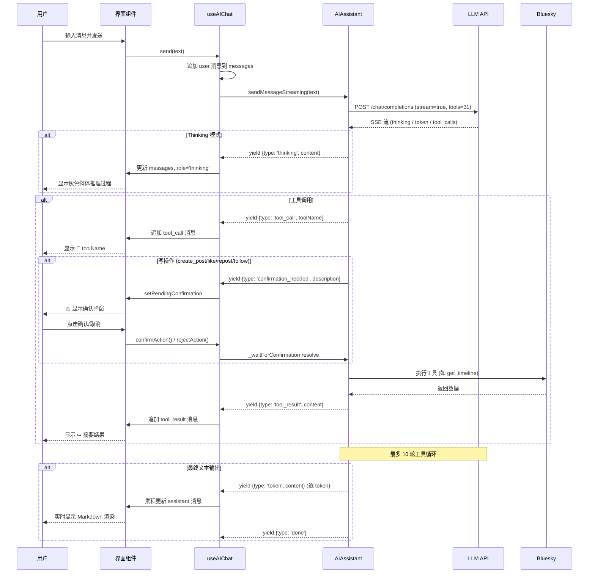

现在我已掌握三个核心文件及配套代码的全部逻辑，可以撰写这个页面了。

---

# AI 对话与智能助手

AI Chat 是本项目最具区分度的功能：它不是一个简单的聊天框，而是一个**通过自然语言操纵 Bluesky 客户端的智能体工作台**。你可以问"最近有什么热门帖子"、让它分析某个用户的风格、或者直接说"帮我发一条推，内容是……"——AI 会自动选择合适的工具执行，并在涉及写操作时停下来等你确认。

## 开启对话：三种入口

无论你在 TUI 还是 PWA 中，都有多种方式进入 AI Chat。

**TUI 终端**：

- **全局快捷键**：在当前任何视图按下 `a`（小写），立即打开一个新的 AI Chat 会话，并自动携带当前正在查看的帖子 URI 作为上下文。
- **Ctrl+G**：同样触发 AI Chat，快捷键对应的 ASCII 码为 `\x07`，在 `App.tsx` 中直接处理路由跳转。
- **侧边栏**：按 `Tab` 切换到侧边栏，选中 "AI Chat" 条目（显示为 🤖 图标）后按回车。

**PWA 网页**：

- **侧边栏导航**：左侧栏始终显示 AI Chat 按钮（图标为 `astroid-as-AI-Button`），点击后进入对话页。
- **上下文入口**：在帖子详情页或用户主页，点击"AI 分析"按钮（紫色图标），会自动创建携带上下文的新会话。

无论是哪种方式，最终都导航到 `{ type: 'aiChat', sessionId, contextPost?, contextProfile?, contextUri? }` 状态——sessionId 由 `crypto.randomUUID()` 生成，确保每次新建都是独立会话。

[来源](tui/src/components/App.tsx#L181-L181)
[来源](tui/src/components/App.tsx#L312-L312)
[来源](pwa/src/components/Sidebar.tsx#L22-L22)
[来源](pwa/src/components/PostActionsRow.tsx#L65-L65)

## 发送消息后的完整生命周期

当你输入消息并点击发送（或按 Enter），`useAIChat` hook 接管整个流程。下面这张时序图展示了关键阶段：

`AIAssistant.sendMessageStreaming()` 是核心流式方法，它在一个 `for` 循环中反复调用 LLM API，每次检查返回的 `tool_calls`。如果有工具调用，则执行后把结果注入对话，再发起下一轮请求——最多允许 10 轮工具循环，防止无限循环。

[来源](app/src/hooks/useAIChat.ts#L206-L262)
[来源](core/src/ai/assistant.ts#L266-L406)

## 31 个工具：自动选择与执行

AI Chat 向 LLM 注册了 **31 个工具**，全部定义在 `createTools()` 函数中。这些工具按性质分为两大类：

| 类别 | 数量 | 典型工具 | 需确认 |
|------|------|----------|--------|
| **读工具** | 26 | `get_timeline`, `search_posts`, `get_profile`, `get_post_thread_flat`, `fetch_web_markdown`, `view_image` 等 | 否 |
| **写工具** | 5 | `create_post`, `like`, `repost`, `follow` | **是** |

读工具用于搜索帖子、查看用户资料、获取时间线、浏览讨论串、下载图片等；写工具会改变 Bluesky 上的数据。LLM 的 `tool_choice` 设置为 `'auto'`，意味着模型自行判断何时调用哪个工具——你只需要用自然语言表达意图即可。

每个工具的 `ToolDescriptor` 包含三个核心字段：`definition`（名称、描述、参数 schema）、`handler`（执行函数）、`requiresWrite`（是否是写操作门控标记）。

[来源](core/src/ai/tools.ts#L28-L43)
[来源](core/src/ai/assistant.ts#L111-L117)
[来源](core/src/ai/assistant.ts#L388-L394)

## 写操作确认弹窗

当 AI 决定执行 `create_post`、`like`、`repost` 或 `follow` 时，**不会立即执行**——流式循环中检测到 `toolDesc.requiresWrite === true` 时，会 yield 一个 `confirmation_needed` 事件，然后通过 Promise 挂起执行。

`useAIChat` 收到该事件后设置 `pendingConfirmation` 状态，UI 组件据此渲染确认界面：

**PWA**：渲染一个固定定位的模态弹窗（`fixed inset-0 z-50`），黄色边框，显示工具的描述信息（如 "创建帖子: 今天天气真不错"），下方有"确认"和"取消"两个按钮。

**TUI**：在聊天区域顶部显示一个双线边框的横幅，提示 `Y:确认 N:取消`，键盘监听会拦截 `y/Y/Enter` 和 `n/N/Esc` 按键，调用 `confirmAction()` 或 `rejectAction()`。

确认后，`AIAssistant.confirmAction(boolean)` 会 resolve 内部 Promise，流程恢复执行；拒绝则注入 `"User cancelled the operation."` 并继续下一轮。

[来源](core/src/ai/assistant.ts#L91-L96)
[来源](core/src/ai/assistant.ts#L347-L361)
[来源](app/src/hooks/useAIChat.ts#L221-L226)
[来源](pwa/src/components/AIChatPage.tsx#L184-L198)
[来源](tui/src/components/AIChatView.tsx#L317-L323)

## 流式输出与实时呈现

流式输出分为三个视觉层级，在 TUI 和 PWA 中有不同的渲染方式：

### 思考模式 (Thinking)

LLM 返回的 `delta.reasoning_content` 字段被提取为 `thinking` 事件。`useAIChat` 的 reducer 逻辑会检查上一条消息是否为 `thinking` 类型，如果是则追加内容，否则新建一条。

- **PWA**：以左侧竖线（`border-l-2`）和灰色斜体字呈现，前缀 `💭 Thinking:`，保留原始的换行和缩进。
- **TUI**：每行使用 `| Thinking:` 前缀，超出宽度时自动换行（`wrapLines`），整体以灰色 dim 文本显示。

### 工具调用与结果

工具调用显示为居中的小标签：`🔧 toolName`。工具结果在 PWA 中显示为 `⮡` 前缀的摘要文本，TUI 中缩进 4 个空格并加箭头。结果内容经过 `tryJsonSummary()` 函数智能截断——JSON 格式的结果会被解析并提取关键字段（如"搜索到 15 个帖子"），而非展示原始 JSON。

### 最终文本输出

逐 token 累积：`delta.content` 每到达一个 chunk，就更新最后一条 `assistant` 消息的内容。PWA 使用 `ReactMarkdown` + `remarkGfm` 渲染，支持 Markdown 语法、表格、代码块。TUI 使用自定义 `renderMarkdown()` 函数，在终端中呈现粗体、链接等样式。

发送按钮在加载中会变为红色"停止"按钮，点击调用 `stop()` 触发 `AbortController.abort()`。

[来源](app/src/hooks/useAIChat.ts#L230-L262)
[来源](core/src/ai/assistant.ts#L310-L325)
[来源](pwa/src/components/AIChatPage.tsx#L218-L226)
[来源](tui/src/components/AIChatView.tsx#L85-L93)
[来源](app/src/hooks/useAIChat.ts#L401-L419)

## 编辑与撤销消息

AI Chat 提供了三种方式来管理已发送的消息：

### 编辑 (Edit)

点击用户消息旁的铅笔图标（PWA）或按 `r` 键进入编号选择模式（TUI），可以回退到某条用户消息之前的状态。

核心逻辑在 `editByIndex(n)`：遍历 `AIAssistant.getMessages()`，找到第 n 条 `user` 消息的索引位置，截断该位置之前的所有消息，用 `loadMessages(keep)` 恢复助理状态，同时返回该用户消息的文本内容以便填充到输入框。

### 撤销 (Undo)

`undoLastMessage()` 找到最后一条 `user` 消息的位置，截断之后所有内容。相当于"撤回上一条消息及其所有后续回复"。

### 重发

编辑后修改文本再发送，本质上就是一次新的 `send()` 调用——因为助理内部的对话历史已经被 `editByIndex` 截断了，新的消息会基于截断后的上下文继续。

**TUI 特有关键字**：在非输入焦点状态下，按 `a` 进入 AI 消息编号选择（复制），按 `r` 进入用户消息编号选择（编辑），按 `t` 复制全部转录，按 `e` 导出对话（JSON/HTML/MD）。

[来源](app/src/hooks/useAIChat.ts#L364-L387)
[来源](tui/src/components/AIChatView.tsx#L100-L110)
[来源](pwa/src/components/AIChatPage.tsx#L248-L254)

## 空状态与引导问题

首次进入 AI Chat 且没有上下文时，界面会显示一组**引导问题**（`guidingQuestions`）。这些问题来自 `P_GUIDING_QUESTIONS` 常量，典型如"查看我的时间线""搜索关于 AI 的帖子"等。点击问题按钮会自动发送该文本，帮助新用户快速上手。

如果带有上下文（如在帖子详情页点击"AI 分析"），则不会显示引导问题，而是直接携带上下文 URI 初始化系统提示。

[来源](app/src/hooks/useAIChat.ts#L74-L84)
[来源](pwa/src/components/AIChatPage.tsx#L200-L218)

---

## 推荐阅读

- [AI 助手与工具调用系统](ai-助手与工具调用系统.md) — 深入 31 个工具的定义、写操作门控机制与执行循环
- [流式输出与思考模式](流式输出与思考模式.md) — SSE 解析、Thinking 推理内容展示与中断控制
- [提示词工程与系统提示](提示词工程与系统提示.md) — 上下文注入策略、Prompt 分片与环境标识
- [聊天记录存储方案](聊天记录存储方案.md) — ChatStorage 接口与 TUI/PWA 双端持久化实现
- [@bsky/app 共享逻辑与 Hooks](bsky-app-共享逻辑与-hooks.md) — useAIChat 所在的共享逻辑层设计