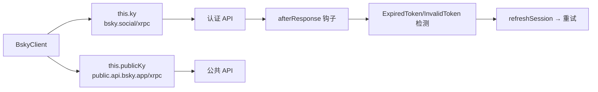

# AT Protocol 客户端封装

`BskyClient` 是 `@bsky/core` 核心层的网络通信枢纽，基于 **ky** HTTP 客户端库封装了所有 Bluesky AT Protocol 接口。它解决了一个核心矛盾：部分 API 需要认证访问，部分可以公开调用，而访问令牌（JWT）会在会话过程中过期。整个封装围绕 **双客户端实例 + 自动刷新钩子** 两个设计点展开。

[来源](client.ts)

---

## 双 ky 实例架构

构造器创建了两个独立的 ky 实例，分别对应不同的 AT Protocol 服务端点：

| 实例 | 端点 | 用途 |
|------|------|------|
| `this.ky` | `https://bsky.social/xrpc` | 需要认证的 API（时间线、发帖、通知等） |
| `this.publicKy` | `https://public.api.bsky.app/xrpc` | 公共 API（解析 Handle、部分只读查询） |



二者超时时间均为 30 秒。`this.ky` 额外注册了 `afterResponse` 钩子用于自动刷新令牌；`this.publicKy` 没有钩子，也不会携带认证头。

[来源](client.ts#L28-L43)

为什么需要两个实例？因为公共 API 端点对速率限制和缓存策略的处理与认证端点不同，分离后公共请求不会触发不必要的令牌检测逻辑，也避免了向 PDS（个人数据服务器）发送未经认证的请求。

---

## 自动 JWT 刷新机制

`withRefresh` 是注册在 `this.ky` 上的 `afterResponse` 钩子函数，是整个客户端的**可靠性核心**。

### 触发条件

钩子仅在同时满足三项条件时激活：
1. 响应状态码为 **400**
2. `this.session` 存在（已登录状态）
3. 响应体 JSON 中的 `error` 字段为 `"ExpiredToken"` 或 `"InvalidToken"`

```typescript
if (response.status === 400 && self.session) {
  const err = JSON.parse(body);
  if (err.error === 'ExpiredToken' || err.error === 'InvalidToken') {
    // 触发刷新流程
  }
}
```

[来源](client.ts#L16-L18)

### 刷新流程（三步走）

1. **200ms 延迟** — 等待底层 TLS 连接释放，避免 ky 的 keep-alive 机制引发连接竞争。
2. **调用 `com.atproto.server.refreshSession`** — 使用 `refreshJwt`（而非 `accessJwt`）从 PDS 获取新的会话凭据。
3. **重试原请求** — 刷新成功后，用新 `accessJwt` 重新发起原始请求，并将新响应返回给调用方。

如果刷新或重试失败，会话被置为 `null`，后续请求将抛出未认证错误。网络异常（如断网）则保留现有 session，让调用方自行决定重试策略。

```typescript
await new Promise(r => setTimeout(r, 200));
const refreshRes = await fetch(`${BSKY_SERVICE}/xrpc/com.atproto.server.refreshSession`, {
  method: 'POST',
  headers: { Authorization: `Bearer ${session.refreshJwt}` },
});
if (refreshRes.ok) {
  self.session = await refreshRes.json();
  const retryRes = await fetch(request.url, {
    method: request.method,
    headers: { Authorization: `Bearer ${self.session.accessJwt}` },
  });
  if (retryRes.ok) return retryRes;
}
self.session = null;
```

[来源](client.ts#L19-L31)

值得注意的是，刷新请求使用原生 `fetch` 而非 `this.ky`，这是为了避免递归触发自身的 `afterResponse` 钩子。

---

## 会话管理

`BskyClient` 通过 `session` 字段维护登录状态，提供一组访问器方法：

| 方法 | 返回值 | 说明 |
|------|--------|------|
| `login(handle, password)` | `CreateSessionResponse` | 凭据登录，保存 session |
| `restoreSession(session)` | `void` | 从持久化存储恢复 session |
| `isAuthenticated()` | `boolean` | 检查是否已登录 |
| `getDID()` | `string` | 获取用户 DID |
| `getHandle()` | `string` | 获取用户 Handle |
| `getAccessJwt()` | `string` | 获取当前 access JWT |

`login` 调用 `com.atproto.server.createSession` 获取初始会话。`restoreSession` 用于从本地存储恢复会话（如页面刷新后从 IndexedDB 读取），避免重复登录。

[来源](client.ts#L80-L108)

---

## API 方法大全（按 CRUD 分组）

### 信息流（Feed / Timeline）

| 方法 | 端点 | 认证要求 |
|------|------|----------|
| `getTimeline(limit, cursor)` | `app.bsky.feed.getTimeline` | **必需** |
| `getFeed(feedUri, limit, cursor)` | `app.bsky.feed.getFeed` | 可选 |
| `getAuthorFeed(actor, limit, cursor, filter)` | `app.bsky.feed.getAuthorFeed` | 可选 |
| `getPostThread(uri, depth, parentHeight)` | `app.bsky.feed.getPostThread` | 可选 |
| `getLikes(uri, limit, cursor)` | `app.bsky.feed.getLikes` | 可选 |
| `getRepostedBy(uri, limit, cursor)` | `app.bsky.feed.getRepostedBy` | 可选 |

[来源](client.ts#L120-L175)

### 搜索

| 方法 | 端点 | 认证要求 |
|------|------|----------|
| `searchPosts({ q, limit, cursor, sort })` | `app.bsky.feed.searchPosts` | **必需**（公共 API 返回 403） |
| `searchActors({ q, limit, cursor })` | `app.bsky.actor.searchActors` | 可选 |

[来源](client.ts#L177-L198)

### 用户与社交图谱

| 方法 | 端点 | 认证要求 |
|------|------|----------|
| `getProfile(actor)` | `app.bsky.actor.getProfile` | 可选 |
| `resolveHandle(handle)` | `com.atproto.identity.resolveHandle` | 不需要 |
| `getFollows(actor, limit, cursor)` | `app.bsky.graph.getFollows` | 可选 |
| `getFollowers(actor, limit, cursor)` | `app.bsky.graph.getFollowers` | 可选 |
| `getSuggestedFollows(actor)` | `app.bsky.graph.getSuggestedFollowsByActor` | **必需** |
| `follow(did)` | 包装 `createRecord` → `app.bsky.graph.follow` | **必需** |
| `unfollow(followUri)` | 包装 `deleteRecord` → `app.bsky.graph.follow` | **必需** |

[来源](client.ts#L200-L243)

### 通知

| 方法 | 端点 | 认证要求 |
|------|------|----------|
| `listNotifications(limit, cursor, priority)` | `app.bsky.notification.listNotifications` | **必需** |

[来源](client.ts#L245-L252)

### Feed 发现

| 方法 | 端点 | 认证要求 |
|------|------|----------|
| `getPopularFeedGenerators(limit, cursor)` | `app.bsky.unspecced.getPopularFeedGenerators` | 可选 |
| `getFeedGenerator(feed)` | `app.bsky.feed.getFeedGenerator` | 可选 |
| `getSuggestedFeeds(limit, cursor)` | `app.bsky.feed.getSuggestedFeeds` | **必需** |

[来源](client.ts#L254-L278)

### 资源记录（通用 CRUD）

| 方法 | 端点 | 认证要求 |
|------|------|----------|
| `listRecords(repo, collection, limit, cursor)` | `com.atproto.repo.listRecords` | 可选 |
| `getRecord(repo, collection, rkey)` | `com.atproto.repo.getRecord` | 可选 |
| `createRecord(repo, collection, record, rkey, swapCommit)` | `com.atproto.repo.createRecord` | **必需** |
| `deleteRecord(repo, collection, rkey)` | `com.atproto.repo.deleteRecord` | **必需** |
| `deletePost(uri)` | 解析 AT URI 后调用 `deleteRecord` | **必需** |

[来源](client.ts#L280-L323)

### 书签（自定义扩展）

| 方法 | 端点 | 认证要求 |
|------|------|----------|
| `getBookmarks(limit, cursor)` | `app.bsky.bookmark.getBookmarks` | **必需** |
| `createBookmark(uri, cid)` | `app.bsky.bookmark.createBookmark` | **必需** |
| `deleteBookmark(uri)` | `app.bsky.bookmark.deleteBookmark` | **必需** |

书签是项目自定义的 AT Protocol 扩展，非 Bluesky 原生功能。详见 [个人主页与书签](个人主页与书签.md)。

[来源](client.ts#L325-L354)

### 多媒体

| 方法 | 端点 | 认证要求 |
|------|------|----------|
| `uploadBlob(data, mimeType)` | `com.atproto.repo.uploadBlob` | **必需** |
| `downloadBlob(did, cid)` | `com.atproto.sync.getBlob` | 可选（有 session 则带认证头） |

`uploadBlob` 以原始二进制体上传，需通过 `Content-Type` 头指定 MIME 类型。`downloadBlob` 使用独立的 `ky.get` 实例（非 `this.ky` 或 `this.publicKy`），避免前缀 URL 干扰。

[来源](client.ts#L345-L367)

---

## 视频 CDN 地址构造

两个辅助方法专门用于构造 Bluesky 视频 CDN 的 URL，不发起网络请求：

```typescript
getVideoThumbnailUrl(did: string, cid: string): string {
  return `https://video.bsky.app/watch/${encodeURIComponent(did)}/${encodeURIComponent(cid)}/thumbnail.jpg`;
}

getVideoPlaylistUrl(did: string, cid: string): string {
  return `https://video.bsky.app/watch/${encodeURIComponent(did)}/${encodeURIComponent(cid)}/playlist.m3u8`;
}
```

[来源](client.ts#L369-L375)

URL 模式：`https://video.bsky.app/watch/{did}/{cid}/thumbnail.jpg` 和 `.../playlist.m3u8`。`did` 和 `cid` 均经过 `encodeURIComponent` 编码，确保特殊字符安全。`playlist.m3u8` 用于 HLS 流式播放，`thumbnail.jpg` 用于封面预览。

---

## 针对不同认证需求的请求模式

客户端中有三种请求模式，反映了 AT Protocol 不同接口的认证约束：

1. **始终走 `this.ky` + 认证头** — `getTimeline`、`searchPosts`、`listNotifications`、所有写操作。这些接口即使未认证也不会返回 401，而是返回 400 触发刷新逻辑（如果已登录）。
2. **可选走 `this.ky` 或 `this.publicKy`** — 根据 `this.session` 动态选择，有 session 时带认证头，否则走公共端点。覆盖 `getProfile`、`getAuthorFeed`、`getPostThread`、`getLikes`、`getRepostedBy`、`searchActors`、`getFollows`、`getFollowers`、`getFeed`、`listRecords`、`getRecord` 等大部分只读方法。
3. **始终走 `this.publicKy`** — `resolveHandle` 是唯一一个始终使用公共 API 的方法，因为它不需要任何上下文。

```typescript
// 模式 2 示例：动态选择实例
const kyInstance = this.session ? this.ky : this.publicKy;
const headers = this.session ? { headers: this.getAuthHeaders() } : {};
return kyInstance.get('app.bsky.actor.getProfile', {
  searchParams: { actor },
  ...headers,
}).json<ProfileView>();
```

[来源](client.ts#L115-L118)

这种设计避免了未登录用户获取不必要的「未认证」错误，也让已登录用户能获得更完整的响应数据（如私人 Feed 内容）。

---

## 下一步

- 了解 `BskyClient` 在整体架构中的位置，参见 [@bsky/core 核心层设计](bsky-core-核心层设计.md)
- 查看 AI 助手如何调用这些 API，参见 [AI 助手与工具调用系统](ai-助手与工具调用系统.md)
- 了解持久化会话如何恢复，参见 [聊天记录存储方案](聊天记录存储方案.md)
- 探索 Feed 配置如何与 `getFeed` 结合，参见 [状态管理与路由系统](状态管理与路由系统.md)