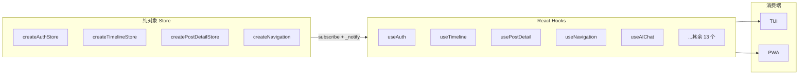
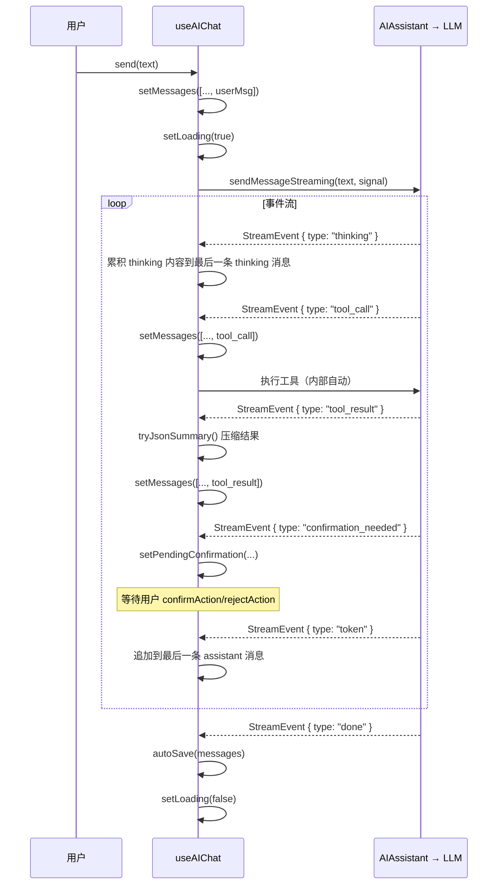

# @bsky/app 共享逻辑与 Hooks

`@bsky/app` 包是 PWA 双界面的共享逻辑层。它不依赖任何渲染库，只定义了一组纯状态 Store 和 React Hooks，TUI 和 PWA 两端通过相同的 Hook 接口消费数据。整个包的导出入口集中在 [`packages/app/src/index.ts`](packages/app/src/index.ts)，所有 Hook 实现位于 [`packages/app/src/hooks/`](packages/app/src/hooks/)。

---

## 架构全景



核心思想：**Store 是纯 JavaScript 对象，不依赖 React**。Hook 作为适配器层，通过 `useState` + `useEffect` 将 Store 的状态变化同步到 React 渲染周期。[来源](packages/app/src/stores/auth.ts#L62-L65)

---

## Store Subscribe Pattern

这是整个共享逻辑层的核心设计模式。几乎所有通过 `createXxxStore()` 创建的 Store 都遵循同一套接口。

### 协议定义

```typescript
interface Store {
  // 所有需要暴露给 React 的数据字段
  data: T | null;
  loading: boolean;
  error: string | null;

  // 订阅协议
  listener: (() => void) | null;
  _notify(): void;
  subscribe(fn: () => void): () => void;
}
```

[来源](packages/app/src/stores/auth.ts#L12-L17)

### Store 端：手动通知

Store 在每次状态变更后调用 `_notify()` 触发 listener。以 `createAuthStore` 为例：

```typescript
async login(handle: string, password: string) {
  store.loading = true;
  store._notify();              // 通知 React：loading 变了
  try {
    const c = new BskyClient();
    store.session = await c.login(handle, password);
    store.client = c;
    store.profile = await store.client.getProfile(handle);
  } catch (e) {
    store.error = e instanceof Error ? e.message : String(e);
  } finally {
    store.loading = false;
    store._notify();             // 通知 React：数据或错误已更新
  }
},

_notify() { if (store.listener) store.listener(); },
subscribe(fn) {
  store.listener = fn;
  return () => { store.listener = null; };
},
```

[来源](packages/app/src/stores/auth.ts#L28-L65)

### Hook 端：强制重渲染

```typescript
function useAuth() {
  const [store] = useState(() => createAuthStore());
  const [, force] = useState(0);
  const tick = useCallback(() => force(n => n + 1), []);

  useEffect(() => store.subscribe(tick), [store, tick]);

  return {
    client: store.client,
    session: store.session,
    // ...
  };
}
```

[来源](packages/app/src/hooks/useAuth.ts#L3-L21)

**模式机理**：`force(n => n + 1)` 是一个空依赖的 setState 调用，每次被调用都会触发 React 组件重渲染。Store 的 `_notify()` → listener 回调 → `force()` → React 重新读取 `store.*` 属性。

**单监听器限制**：Store 端使用单字段 `listener: (() => void) | null`，这意味着同一 Store 实例在同一时间只能被一个组件订阅。后续订阅会覆盖前者。实践中这不构成问题，因为每个 Store 实例通过 `useState(() => createStore())` 在 Hook 内创建，是组件私有的。[来源](packages/app/src/stores/auth.ts#L12)

### 多监听器变体

对于需要跨组件共享状态的场景（如导航、国际化），Store 使用数组或 Set 管理多个 listener：

| Store | 容器 | 添加方式 | 移除方式 |
|---|---|---|---|
| `createNavigation()` | `Array<() => void>` | `push` | `filter` 排除 |
| `createI18nStore()` | `Set<() => void>` | `add` | `delete` |
| `useActiveFeed()` | `Array<() => void>` | `push` | `splice` 索引 |
| `usePostActions()` | `Array<() => void>` | `push` | `splice` 索引 |

[来源](packages/app/src/state/navigation.ts#L23-L42) · [来源](packages/app/src/i18n/store.ts#L25-L58) · [来源](packages/app/src/hooks/useActiveFeed.ts#L6-L25) · [来源](packages/app/src/hooks/usePostActions.ts#L13-L16)

---

## 19 个 Hook 分组详解

### 认证与身份 (Auth)

**`useAuth`** — 登录态管理与 Bluesky 会话恢复。返回 `{ client, session, profile, loading, error, login, restoreSession }`。

- **Store 依赖**：`createAuthStore()`（组件私有，`useState` 创建）
- **订阅模式**：单监听器 `store.listener`（`subscribe` + `_notify` 回调）
- **特点**：`login()` 和 `restoreSession()` 方法内嵌在 Store 中，异步操作期间通过 `_notify()` 触发两次重渲染（loading → true，完成后 → false）。[来源](packages/app/src/hooks/useAuth.ts#L3-L21) · [来源](packages/app/src/stores/auth.ts#L28-L65)

### 时间线 (Timeline)

**`useTimeline`** — 主页 Feed 流或自定义 Feed 的帖子列表。返回 `{ posts, loading, cursor, error, loadMore, refresh }`。

- **Store 依赖**：`createTimelineStore()`（组件私有）
- **订阅模式**：同单监听器模式
- **设计细节**：通过 `useRef` 追踪当前 Feed URI，当 URI 变化时重置 Store。`shouldUseTimeline()` 区分主页时间线与自定义 Feed。[来源](packages/app/src/hooks/useTimeline.ts#L7-L38) · [来源](packages/app/src/stores/timeline.ts#L48-L55)

### 帖子详情与讨论串 (Thread)

**`usePostDetail`** — 单个帖子的详细视图（含上下文线程）。返回 `{ post, flatThread, loading, translations, translate, actions }`。

- **Store 依赖**：`createPostDetailStore()`（组件私有）
- **订阅模式**：单监听器模式
- **特点**：`actions` 对象封装了 `like`、`repost`、`reply`、`translate`、`openAI`、`viewThread` 六个操作，其中 `openAI` 会导航到 AI 聊天视图。[来源](packages/app/src/hooks/usePostDetail.ts#L59-L86) · [来源](packages/app/src/stores/postDetail.ts#L17-L97)

**`useThread`** — 完整的讨论串扁平化视图，专为 TUI 键盘导航优化。返回 `{ flatLines, loading, focusedIndex, focused, likePost, repostPost, isLiked, isReposted, expandReplies }`。

- **Store 依赖**：无——状态全部内联在 `useState` 中
- **订阅模式**：不依赖 Store subscribe 模式；通过 `setState` 直接驱动渲染
- **FlatLine 结构**：每个帖子展开为 `{ depth, uri, text, handle, displayName, authorAvatar, hasReplies, mediaTags, imageUrls, ... }`，`depth` 为负数表示父帖，正数为回复
- **光标导航**：`focusedIndex` 允许上下键遍历，`focus(uri)` 跳转到指定帖子
- **按需展开**：`expandReplies` 增加 `maxSiblings`（默认 5），触发重新拉取并扁平化[来源](packages/app/src/hooks/useThread.ts#L33-L102)

### 发帖与草稿 (Compose)

**`useCompose`** — 发帖表单状态管理。返回 `{ draft, setDraft, submitting, error, replyTo, setReplyTo, quoteUri, setQuoteUri, submit }`。

- **Store 依赖**：无——全部使用 `useState` 内联
- **特点**：`submit` 方法处理回复（设置 `reply.root` 和 `reply.parent`）、图片嵌入（`app.bsky.embed.images`）、视频嵌入（`app.bsky.embed.video`）、引用+图片混合嵌入（`app.bsky.embed.recordWithMedia`）[来源](packages/app/src/hooks/useCompose.ts#L23-L97)

**`useDrafts`** — 草稿 CRUD。返回 `{ drafts, saveDraft, deleteDraft, loadDraft }`。

- **Store 依赖**：`createDraftsStore()`（组件私有，但 Store 本身无 `_notify`）
- **订阅模式**：不标准——Hook 手动调用 `tick(n => n + 1)` 强制重渲染，而非通过 Store 的 `_notify`
- **特点**：`saveDraft` 会根据 `id` 判断是新建还是更新[来源](packages/app/src/hooks/useDrafts.ts#L24-L44)

### AI 对话 (AIChat)

**`useAIChat`** — 最复杂、代码量最大的 Hook（约 260 行）。详见下文专节。

### 导航 (Navigation)

**`useNavigation`** — 基于栈的路由控制。返回 `{ currentView, canGoBack, goTo, goBack, goHome }`。

- **Store 依赖**：`createNavigation()`（组件私有）
- **订阅模式**：多监听器数组模式。`subscribe()` 将回调加入数组，返回的 cleanup 通过 `filter` 移除
- **状态快照**：`useNavigation` 使用 `useState(() => nav.getState())` 初始化，每次变更时通过 `setState(nav.getState())` 用新快照替换，而非读取单个字段——这种方式确保 `currentView` 变更的原子性[来源](packages/app/src/hooks/useNavigation.ts#L3-L19) · [来源](packages/app/src/state/navigation.ts#L23-L42)

**`useActiveFeed`** — 跨视图记住上次激活的 Feed URI。返回 `{ resolveFeed, recordFeed, goHomeFeed }`。

- **Store 依赖**：无——模块级变量 `_lastFeedUri` + `_listeners` 数组
- **订阅模式**：模块级多监听器模式。组件挂载时 `push` 一个 `tick` 回调，卸载时 `splice` 移除
- **共享边界**：数据存活于模块作用域（同次页面刷新内持久），不跨刷新[来源](packages/app/src/hooks/useActiveFeed.ts#L5-L37)

### 共享点赞/转发状态 (PostActions)

**`usePostActions`** — 跨组件统一的点赞/转发状态管理。返回 `{ isLiked, isReposted, likePost, repostPost, seedFromPosts, seedFromPost }`。

- **Store 依赖**：无——模块级 `Set<string>` 和 `Map<string, string>` 数据结构
- **订阅模式**：模块级 `_tickers` 数组模式，与 `useActiveFeed` 相同
- **设计意图**：当用户在 Thread 视图中点赞，回到 Feed 时点赞状态应同步。模块级 `_liked` Set 是全局唯一的来源
- **乐观更新**：`likePost` 和 `repostPost` 会立即更新本地状态并触发所有订阅者重渲染，网络请求失败则打印错误但不回滚[来源](packages/app/src/hooks/usePostActions.ts#L52-L111)

### 滚动位置恢复 (ScrollRestore)

**`useScrollRestore`** — 在视图切换时恢复滚动位置。不返回值，只作为副作用 Hook 使用。

- **Store 依赖**：无——模块级 `Map<string, number>` 缓存
- **订阅模式**：不使用——纯 `useEffect` 操作 DOM 的 `scrollTop`
- **工作原理**：挂载时从 `_scrollTops` 读取保存值并 `scrollTo`；卸载时将当前 `scrollTop` 写入 Map。`key` 参数区分不同视图（如 `'profile-actor'`、`'search-query'`）[来源](packages/app/src/hooks/useScrollRestore.ts#L28-L48)

### 国际化 (I18n)

**`useI18n`** — 多语言支持。返回 `{ t, locale, setLocale, availableLocales, localeLabels }`。

- **Store 依赖**：`getI18nStore()` — 单例模式，模块级 `_instance` 变量只创建一次
- **订阅模式**：多监听器 `Set<() => void>` 模式。支持 `subscribe` 和显式 `unsubscribe`
- **特点**：`t(key)` 方法按当前语言 → 英文 → 中文链式回退，未匹配时返回 key 原文[来源](packages/app/src/i18n/store.ts#L25-L58)

### 翻译 (Translation)

**`useTranslation`** — 调用 LLM API 翻译帖子文本。返回 `{ translate, loading, cache, lang, setLang, mode, setMode, LANG_LABELS }`。

- **Store 依赖**：无——内联 `useState`
- **双模式**：`simple` 模式返回纯翻译文本；`json` 模式使用 `response_format: "json_object"`，额外返回 `sourceLang` 自动检测结果
- **缓存**：以 `"mode::lang::text"` 为 key 的 `Map`，避免重复请求[来源](packages/app/src/hooks/useTranslation.ts#L29-L50)

### 用户主页 (Profile)

**`useProfile`** — 用户信息、帖子列表、关注/粉丝列表、关注操作。返回约 20 个字段，是状态最复杂的 Hook 之一。

- **Store 依赖**：无——全部内联 `useState`
- **自动加载防护**：通过 `loadedActor` ref 防止重复请求同一个 actor
- **分页**：`loadMoreFeed` 和 `loadMoreFollowList` 均支持基于 cursor 的翻页[来源](packages/app/src/hooks/useProfile.ts#L17-L120)

### 搜索 (Search)

**`useSearch`** — 多标签搜索。返回 `{ query, tab, posts, users, feeds, loading, search, setTab }`。

- **Store 依赖**：无——内联 `useState`
- **标签切换**：`top` / `latest` 搜索帖子，`users` 搜索用户，`feeds` 客户端过滤 Feed 名称[来源](packages/app/src/hooks/useSearch.ts#L16-L49)

### 通知 (Notifications)

**`useNotifications`** — 通知列表与未读计数。返回 `{ notifications, loading, unreadCount, refresh }`。

- **Store 依赖**：无——内联 `useState`
- **自动加载**：`useEffect` 自动触发首次加载
- **未读判断**：通过 `(Notification).isRead` 字段计数[来源](packages/app/src/hooks/useNotifications.ts#L8-L28)

### 书签 (Bookmarks)

**`useBookmarks`** — 内置书签系统。返回 `{ bookmarks, loading, isBookmarked, addBookmark, removeBookmark, toggleBookmark, refresh }`。

- **Store 依赖**：无——内联 `useState`
- **同步检测**：`isBookmarked(uri)` 使用 `Set.has()`，零网络开销
- **存储后端**：通过 `app.bsky.graph.bookmark` 集合存于服务器[来源](packages/app/src/hooks/useBookmarks.ts#L38-L44)

### 聊天历史 (ChatHistory)

**`useChatHistory`** — AI 对话列表的管理。返回 `{ conversations, loading, loadConversation, saveConversation, deleteConversation, refresh, storage }`。

- **Store 依赖**：无——内联 `useState`
- **存储抽象**：接收可选的 `ChatStorage` 接口，默认使用 `FileChatStorage`（IndexedDB 持久化）
- **单例存储**：`getDefaultStorage()` 在模块级缓存 `FileChatStorage` 实例[来源](packages/app/src/hooks/useChatHistory.ts#L10-L42)

---

## 重点分析：useAIChat

`useAIChat` 是包内最复杂的 Hook，因为它要协调 **AI 推理引擎**、**流式输出渲染**、**工具执行循环**、**写操作确认门控**、**对话持久化** 和 **上下文记忆** 六个关注点。

### 签名

```typescript
function useAIChat(
  client: BskyClient | null,
  aiConfig: AIConfig,
  contextUri?: string,
  options?: {
    chatId?: string;           // 恢复已有对话
    storage?: ChatStorage;     // 自动保存
    stream?: boolean;          // 流式输出（默认 false，TUI 使用）
    userHandle?: string;
    userDisplayName?: string;
    environment?: 'tui' | 'pwa';
    locale?: string;
    contextPost?: string;      // 上下文帖子（来自导航，非 URL）
    contextProfile?: string;   // 上下文用户（来自导航，非 URL）
    onChatSaved?: () => void;
  }
)
```

[来源](packages/app/src/hooks/useAIChat.ts#L23-L45)

### 状态结构

| 字段 | 类型 | 说明 |
|---|---|---|
| `messages` | `AIChatMessage[]` | 消息列表（user/assistant/tool_call/tool_result/thinking） |
| `loading` | `boolean` | 正在响应中 |
| `guidingQuestions` | `string[]` | 上下文相关的引导提问列表 |
| `pendingConfirmation` | `{ toolName, description } \| null` | 等待用户确认的写操作 |
| `chatId` | `string` | 当前对话 ID |
| `send` | `(text) => Promise<void>` | 发送消息 |
| `stop` | `() => void` | 中止流式响应 |
| `addUserImage` | 添加图像到上下文 | 返回图像索引 |
| `confirmAction` / `rejectAction` | 确认/拒绝写操作 |  |
| `edit` / `editByIndex` | 撤回/编辑消息 |  |

[来源](packages/app/src/hooks/useAIChat.ts#L167-L172)

### Store 依赖

与其他 Hook 不同，useAIChat **不依赖纯对象 Store**。它直接持有 `AIAssistant` 实例（来自 `@bsky/core`）：

```typescript
const [assistant] = useState(() => new AIAssistant(aiConfig));
```

`AIAssistant` 封装了 LLM API 调用、工具注册、消息历史维护和流式生成。useAIChat 通过 `assistant.sendMessage()` 或 `assistant.sendMessageStreaming()` 与之交互。[来源](packages/app/src/hooks/useAIChat.ts#L47)

### 流式生成循环（stream: true）

当 `options.stream === true`（PWA 默认），hook 使用异步生成器模式处理 SSE 流：



[来源](packages/app/src/hooks/useAIChat.ts#L106-L155)

关键设计决策：

1. **逐 token 渲染**：每个 `token` 事件触发 `setMessages`，使 UI 实时显示 LLM 输出。`streamingContent` 变量累积当前 assistant 回合的全部内容。

2. **`tryJsonSummary` 结果压缩**：工具调用返回的 JSON 结果通过启发式规则压缩为自然语言摘要（如 `"搜索到 10 个帖子"`），避免原始 JSON 撑爆消息列表。[来源](packages/app/src/hooks/useAIChat.ts#L220-L237)

3. **`confirmation_needed` 事件**：写操作工具（发帖、点赞等）在 AI 决定执行前暂停，设置 `pendingConfirmation` 状态。用户调用 `confirmAction()` 或 `rejectAction()` 后，调用 `assistant.confirmAction(bool)` 恢复执行。[来源](packages/app/src/hooks/useAIChat.ts#L118-L125)

### 非流式路径（stream: false）

用于 TUI 终端环境，一次调用返回完整结果：

```typescript
const result = await assistant.sendMessage(text);
// result.intermediateSteps: Array<{ type, content }>
// result.content: 最终回复
```

Hook 将所有 `intermediateSteps` 展平为 `tool_call` / `tool_result` 消息，最后追加 `assistant` 消息。[来源](packages/app/src/hooks/useAIChat.ts#L157-L193)

### 对话持久化

```typescript
const autoSave = useCallback(async (msgs) => {
  if (!storage) return;
  await storage.saveChat({
    id: chatIdRef.current,
    title: msgs.find(m => m.role === 'user')?.content.slice(0, 80) ?? '新对话',
    contextUri,
    context: contextRef.current,
    messages: msgs,
    createdAt: new Date().toISOString(),
    updatedAt: new Date().toISOString(),
  });
}, [storage, contextUri]);
```

每次消息变更后调用 `autoSave`。`contextRef.current` 存储 `{ type: 'post' | 'profile', uri/handle }`，使恢复对话时能重建系统提示。[来源](packages/app/src/hooks/useAIChat.ts#L93-L104)

### 系统提示构建

`buildSystemPrompt` 动态组合多个提示碎片：

```typescript
parts: P_ASSISTANT_BASE
     + PF_CURRENT_USER(name, handle)     // 用户身份
     + PF_POST_CONTEXT(withContext)       // 帖子上下文
       // 或 PF_PROFILE_CONTEXT(handle)   // 用户主页上下文
     + PF_ENVIRONMENT(env)                // TUI / PWA 环境区分
     + PF_LOCALE_HINT(locale)             // 语言偏好
     + PF_CURRENT_TIME()                  // 当前时间
     + PF_VISION_HINT(enabled)            // 视觉能力声明
     + P_CONCISE                          // 简洁风格要求
```

[来源](packages/app/src/hooks/useAIChat.ts#L63-L82)

### 消息编辑

`editByIndex(n)` 是撤回机制的实现：找到第 `n` 条用户消息在 `assistant.getMessages()` 中的索引，截断该索引之前的所有消息，调用 `assistant.loadMessages(keep)` 重置 AI 状态，并返回该用户消息的文本供重新编辑。[来源](packages/app/src/hooks/useAIChat.ts#L239-L250)

---

## 推荐阅读

- [状态管理与路由系统](状态管理与路由系统.md) — 深入 `createNavigation()` 的栈式路由设计与 `AppView` 类型系统
- [@bsky/core 核心层设计](bsky-core-核心层设计.md) — `AIAssistant`、工具系统与 `BskyClient` 的基础设施
- [AI 助手与工具调用系统](ai-助手与工具调用系统.md) — 31 个 Bluesky 工具的定义与写操作确认门控机制
- [流式输出与思考模式](流式输出与思考模式.md) — SSE 流式解析与 Thinking 推理内容渲染
- [国际化 (i18n) 系统设计](国际化-i18n-系统设计.md) — `createI18nStore` 单例模式与即時语言切换