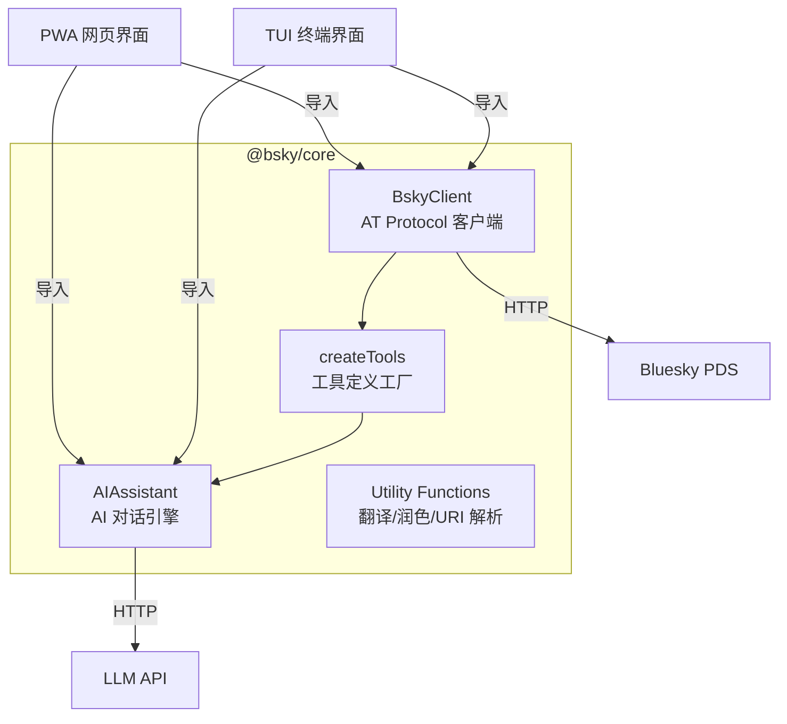

# @bsky/core 核心层设计

`@bsky/core` 是整个项目的**零 UI 依赖**的心脏。它封装了 AT Protocol 客户端、AI 对话引擎和工具调度系统，不包含任何 React、Ink 或 DOM 引用。TUI 和 PWA 两个界面层都依赖它完成所有业务逻辑。



**来源：** 全部公开 API 在 [`packages/core/src/index.ts`](src/index.ts#L1-L37) 中声明。

---

## BskyClient：AT Protocol 客户端

`BskyClient` 是 Bluesky API 的完整封装，基于 **ky** HTTP 客户端构建。它管理两个独立的客户端实例：

| 实例 | 用途 | 是否需要登录 | 超时 |
|------|------|-------------|------|
| `this.ky` | 认证 API（时间线、通知、写操作） | 是 | 30s |
| `this.publicKy` | 公共 API（解析 handle、搜索用户） | 否 | 30s |

实例在构造函数中创建，`publicKy` 指向 `https://public.api.bsky.app`，`this.ky` 指向 `https://bsky.social`，两者都通过 `/xrpc` 前缀访问 [AT Protocol Lexicons](https://atproto.com/)。[来源](src/at/client.ts#L21-L40)

### 自动 JWT 刷新机制

这是客户端中最精巧的设计。`afterResponse` 钩子拦截所有 400 级响应：

1. 检测 `response.status === 400` 且 `body.error` 为 `'ExpiredToken'` 或 `'InvalidToken'`
2. 200ms 延迟避让 TLS 连接竞争
3. 使用 `refreshJwt` 调用 `com.atproto.server.refreshSession`
4. 刷新成功后，携带新 `accessJwt` **重放原始请求**
5. 如果刷新或重放失败，将 `session` 置空，触发重新登录

```typescript
const withRefresh = async (request, _options, response) => {
  if (response.status === 400 && self.session) {
    const err = JSON.parse(await response.clone().text());
    if (err.error === 'ExpiredToken' || err.error === 'InvalidToken') {
      await new Promise(r => setTimeout(r, 200));
      const refreshRes = await fetch(`${BSKY_SERVICE}/xrpc/com.atproto.server.refreshSession`, {
        method: 'POST',
        headers: { Authorization: `Bearer ${session.refreshJwt}` },
      });
      if (refreshRes.ok) {
        self.session = await refreshRes.json();
        // 重放原始请求
        const retryRes = await fetch(request.url, {
          method: request.method,
          headers: { Authorization: `Bearer ${self.session.accessJwt}` },
        });
        if (retryRes.ok) return retryRes;
      }
    }
  }
};
```

**来源：** 完整逻辑在 [`packages/core/src/at/client.ts`](src/at/client.ts#L26-L52)。

### 公有 API 方法（30+）

覆盖 Bluesky 核心功能的全部端点：

**读取类 — 无需登录确认**

| 方法 | AT Protocol 端点 | 说明 |
|------|-----------------|------|
| `resolveHandle` | `com.atproto.identity.resolveHandle` | Handle → DID |
| `getProfile` | `app.bsky.actor.getProfile` | 用户资料（支持未登录） |
| `getAuthorFeed` | `app.bsky.feed.getAuthorFeed` | 用户帖子流 |
| `getPostThread` | `app.bsky.feed.getPostThread` | 讨论串（支持 depth/parentHeight） |
| `getLikes` | `app.bsky.feed.getLikes` | 点赞列表 |
| `getRepostedBy` | `app.bsky.feed.getRepostedBy` | 转发列表 |
| `searchPosts` | `app.bsky.feed.searchPosts` | 帖子搜索（需登录） |
| `searchActors` | `app.bsky.actor.searchActors` | 用户搜索 |
| `getFollows` / `getFollowers` | `app.bsky.graph.*` | 关注/粉丝列表 |
| `listNotifications` | `app.bsky.notification.listNotifications` | 通知列表 |
| `getFeed` / `getFeedGenerator` | `app.bsky.feed.*` | Feed 内容与元数据 |
| `getBookmarks` | `app.bsky.bookmark.getBookmarks` | 书签列表 |
| `getSuggestedFeeds` | `app.bsky.feed.getSuggestedFeeds` | 推荐 Feed |

**写入类 — 需要登录**

| 方法 | 端点 | 说明 |
|------|------|------|
| `createRecord` | `com.atproto.repo.createRecord` | 通用记录创建 |
| `deleteRecord` | `com.atproto.repo.deleteRecord` | 通用记录删除 |
| `follow` / `unfollow` | `app.bsky.graph.follow` | 关注/取关（高层封装） |
| `uploadBlob` | `com.atproto.repo.uploadBlob` | 图片上传（Uint8Array + MIME） |
| `downloadBlob` | `com.atproto.sync.getBlob` | 图片下载 |
| `createBookmark` / `deleteBookmark` | `app.bsky.bookmark.*` | 书签管理 |
| `deletePost` | `com.atproto.repo.deleteRecord` | 删帖（内部解析 AT URI） |

**来源：** 全部方法签名在 [`packages/core/src/at/client.ts`](src/at/client.ts#L67-L321)。

### 会话管理

`login(handle, password)` → 验证并存储 session；`restoreSession(session)` 用于从持久化存储恢复；`isAuthenticated()`、`getDID()`、`getHandle()`、`getAccessJwt()` 提供查询。[来源](src/at/client.ts#L57-L75)

---

## AIAssistant：AI 对话与工具调度引擎

`AIAssistant` 封装了多轮对话的全部逻辑，是 `@bsky/core` 中复杂度最高的模块。它不依赖任何框架，只使用 `fetch` 调用兼容 OpenAI 格式的 LLM API。

### 核心状态

```typescript
class AIAssistant {
  private config: AIConfig;       // apiKey, baseUrl, model, visionEnabled, thinkingEnabled
  private tools: ToolDescriptor[];  // 已注册的工具列表
  private toolMap: Map<string, ToolDescriptor>; // 工具名→描述 快速查找
  private messages: ChatMessage[];  // 多轮对话历史
  private _confirmPromise: Promise<boolean> | null;  // 写操作确认门控
  private _pendingImages: Array<{ url: string; alt?: string }>; // 视觉模型图片
  private _userUploads: Array<{ data: Uint8Array; mimeType: string; alt: string }>; // 用户上传
}
```

**来源：** 类声明在 [`packages/core/src/ai/assistant.ts`](src/ai/assistant.ts#L70-L90)。

### 多轮对话管理

- `addSystemMessage(content)`、`addUserMessage(content)` — 构建消息队列
- `getMessages()`、`clearMessages()`、`loadMessages(msgs)` — 消息持久化的接口
- `sendMessage(content)` → **非流式**完整对话：自动执行工具循环，最多 10 轮
- `sendMessageStreaming(content, signal?)` → **流式**生成器：逐 token 推送，支持 AbortSignal 中断

两个方法共享同一个核心循环：**调用 LLM → 解析工具调用 → 执行工具 → 回到 LLM**，直到 LLM 返回纯文本响应或超出 10 轮限制。

**来源：** 核心循环在 [`packages/core/src/ai/assistant.ts`](src/ai/assistant.ts#L163-L244)（非流式）和 [`packages/core/src/ai/assistant.ts`](src/ai/assistant.ts#L296-L459)（流式）。

### 工具注册与调度

工具以 `ToolDescriptor` 格式注册：

```typescript
interface ToolDescriptor {
  definition: ToolDefinition;   // name, description, inputSchema（OpenAI function-calling 格式）
  handler: ToolHandler;         // (params, assistant?) => Promise<string>
  requiresWrite: boolean;       // 是否为写操作
}
```

通过 `setTools(tools)` 注册后，`toolMap` 建立名称到描述符的索引。`createTools(client)` 工厂函数创建 30+ 个工具，其中包含 4 个写操作工具（`create_post`、`like`、`repost`、`follow`），其余为只读工具。

**来源：** 工具定义在 [`packages/core/src/ai/tools.ts`](src/ai/tools.ts#L1-L22)，`createTools` 在 [`packages/core/src/ai/tools.ts`](src/ai/tools.ts#L45-L49)。

### 写操作确认门控

这是 AI 安全的关键设计。当调度器检测到 `toolDesc.requiresWrite` 为 `true` 时：

1. 暂停执行，`yield { type: 'confirmation_needed', ... }`（流式）或挂起 Promise
2. 前端展示确认对话框——内容通过 `buildToolDescription()` 生成用户可读的描述
3. 用户调用 `confirmAction(true/false)` 放行或取消
4. 取消时返回 `'User cancelled the operation.'` 给 LLM，让它自行应对

```typescript
if (toolDesc.requiresWrite) {
  const approved = await this._waitForConfirmation();
  if (!approved) {
    toolResult = 'User cancelled the operation.';
    // 继续执行，不会阻塞
  }
}
```

**来源：** 门控逻辑在 [`packages/core/src/ai/assistant.ts`](src/ai/assistant.ts#L133-L148)（非流式）和 [`packages/core/src/ai/assistant.ts`](src/ai/assistant.ts#L419-L435)（流式）。

### 图片上传管理

`AIAssistant` 维护两套图片状态：

| 池 | 用途 | API |
|----|------|-----|
| `_pendingImages` | 从 Bluesky 下载到内存，供视觉模型分析 | `addPendingImage(dataUrl, alt)` |
| `_userUploads` | 用户上传的本地图片，稍后附到帖子 | `addUserUpload(data, mimeType, alt)` → 返回索引 |

`_buildMessages()` 方法在视觉模型启用时将 pending 图片注入最后一条用户消息，转换为 `ContentBlock[]` 格式供多模态 API 使用。

**来源：** 图片管理在 [`packages/core/src/ai/assistant.ts`](src/ai/assistant.ts#L109-L128)，`_buildMessages` 在 [`packages/core/src/ai/assistant.ts`](src/ai/assistant.ts#L246-L268)。

---

## 工具工厂：createTools

`createTools(client: BskyClient)` 将 `BskyClient` 的原始 API 包装为 AI 可调用的工具。每个工具包含：

- **LLM-friendly 描述**：自然语言描述工具用途和参数
- **JSON Schema 输入**：告诉 LLM 需要哪些参数
- **执行处理函数**：内部调用 `client` 方法，返回 JSON 字符串给 LLM

只读工具（20+ 个）涵盖时间线、资料、搜索、通知、讨论串展开、图片提取等。写操作工具（4 个）通过 `requiresWrite: true` 触发确认门控。

**来源：** 工具列表在 [`packages/core/src/ai/tools.ts`](src/ai/tools.ts#L45-L408)。

---

## 纯函数工具类

除了两个核心类外，`@bsky/core` 还导出一组无状态的纯函数：

| 函数 | 用途 |
|------|------|
| `parseAtUri(uri)` | 将 `at://did:plc:xxx/collection/rkey` 解析为结构化对象 |
| `singleTurnAI(config, system, user, temp, maxTokens)` | 单轮对话（翻译/润色的底层） |
| `translateText(config, text, targetLang, mode, retries)` | 翻译：`simple` 纯文本 / `json` 带源语言检测，最多 3 次重试 |
| `translateToChinese(config, text)` | 快捷翻译到中文 |
| `polishDraft(config, draft, requirement)` | 润色帖子草稿 |
| `BUILTIN_FEEDS` / `RECOMMENDED_FEEDS` | 内置 Feed 常量 |
| `getFeedLabel(uri)` / `resolveFeedId(id)` | Feed URI ↔ 标签转换 |

**来源：** 全部导出在 [`packages/core/src/index.ts`](src/index.ts#L1-L37)。

---

## 包依赖

`@bsky/core` 的依赖极轻：

```
dependencies: ky (HTTP 客户端), dotenv (环境变量)
devDependencies: typescript, vitest, @types/node
```

**没有 React、没有 Ink、没有框架**——这就是它被称为"零 UI 依赖核心"的原因。

**来源：** [`packages/core/package.json`](package.json#L1-L30)。

---

## 设计原则

1. **纯函数优先**：翻译、润色、URI 解析均为无副作用的纯函数，易于测试。
2. **类状态集中**：`BskyClient` 管理认证状态，`AIAssistant` 管理对话状态，互不干涉。
3. **可持久化**：`BskyClient.restoreSession()` 和 `AIAssistant.loadMessages()` 使会话/对话可序列化到 IndexedDB 或文件。
4. **可中断流式**：`sendMessageStreaming` 接受 `AbortSignal`，支持用户随时中断 AI 响应。
5. **门控安全**：所有写入操作必须经用户确认，AI 无法自主执行破坏性操作。

---

## 下一步

- 了解上层如何使用 Hooks 封装这些核心类：[项目结构与包依赖](项目结构与包依赖.md)
- 查看工具系统的完整注册方式：[AI 助手与工具调用系统](ai-助手与工具调用系统.md)
- 了解 AT Protocol 客户端在真实测试中的表现：[测试策略与实战](测试策略与实战.md)
- 提示词工程如何与 AIAssistant 配合：[提示词工程与系统提示](提示词工程与系统提示.md)