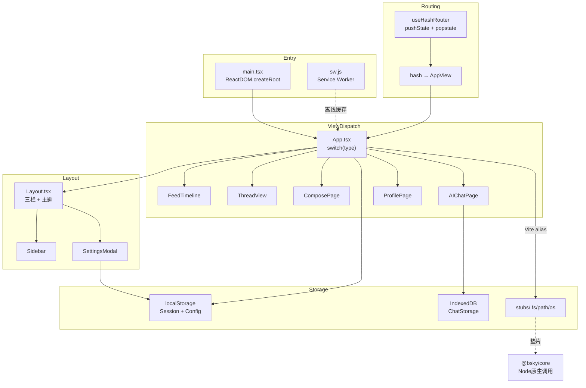

# PWA 网页应用实现

**React DOM + Tailwind CSS + Vite + IndexedDB** 构成了 PWA 客户端的技术栈底座。与 [TUI 终端界面实现](tui-终端界面实现.md) 共享 `@bsky/core` 和 `@bsky/app` 层，但渲染引擎和路由机制完全不同。本页深入分析入口初始化、无服务器路由、视图分发、主题系统、配置持久化、Node.js 垫片和 IndexedDB 存储这七个核心架构点。

---

## 一、入口初始化：`main.tsx`

`packages/pwa/src/main.tsx` 是 Vite 打包的模块入口，职责清晰的两步：

**1. Service Worker 注册** — 条件检测 `navigator.serviceWorker` 后在 `load` 事件中注册 `./sw.js`，设置 `scope: './'`。注册失败仅为 warn 级别，不阻塞渲染。

**2. ReactDOM 挂载** — 使用 `ReactDOM.createRoot`（React 18 concurrent API）挂载 `<App />` 到 `#root` 容器，外层包裹 `<React.StrictMode>`。

```typescript
ReactDOM.createRoot(document.getElementById('root')!).render(
  <React.StrictMode><App /></React.StrictMode>,
);
```

[来源](main.tsx#L1-L16)

Service Worker 实现（`public/sw.js`）采用了四层缓存策略：

| 匹配规则 | 策略 | 缓存桶 |
|---|---|---|
| `cdn.bsky.app`（Bluesky CDN 图片） | Cache-first | `bsky-img-v1` |
| `fonts.gstatic.com`（字体文件） | Cache-first | `bsky-font-v1` |
| `fonts.googleapis.com`（字体 CSS） | Stale-while-revalidate | `bsky-font-v1` |
| `bsky.social` / API 域名 | Network-first | `bsky-v3` |
| Vite 构建产物 (`/assets/`, `/icons/`) | Cache-first | `bsky-v3` |
| HTML / 根路径 | Stale-while-revalidate | `bsky-v3` |

`activate` 阶段清理旧缓存桶，`install` 阶段预缓存 `index.html` 和 `manifest.json`。

[来源](sw.js#L1-L87)

`index.html` 声明了 PWA 元标签：`theme-color`、`apple-mobile-web-app-capable`、`viewport-fit=cover`，并预连接 Google Fonts 以提速字体加载。

[来源](index.html#L1-L23)

---

## 二、无服务器路由：`useHashRouter`

PWA 产物为纯静态文件，无法依赖服务端 URL 重写。`useHashRouter` 基于 **`history.pushState` + `popstate`** 实现客户端路由，所有页面状态编码在 URL hash 中。

### 路由协议

hash 格式采用类 URL 路径加查询参数：

```
#/feed?feed=at://...         → 时间线
#/thread?uri=at://...        → 讨论串
#/profile?actor=did:plc:...  → 个人主页
#/notifications              → 通知
#/search?q=...&tab=...       → 搜索
#/bookmarks                  → 书签
#/compose?replyTo=...        → 发帖
#/ai?session=...             → AI 对话
```

### 实现机制

**状态解析** `parseHash()` 函数将 `window.location.hash` 解码为 `AppView` 联合类型。每个 case 分支用 `URLSearchParams` 提取参数，`decodeURIComponent` 还原 URI。空 hash 或 `/feed` 不带参数时，自动解析默认 Feed URI（优先取 `getFeedConfig().defaultFeedUri`，回退 `BUILTIN_FEEDS.following`）。

**状态编码** `encodeView()` 反向操作：根据 `AppView` 各属性构建带 `encodeURIComponent` 的 hash 字符串。

**导航原语** 三个核心方法：

- **`goTo(view)`** — 调用 `history.pushState` 压栈，更新 `currentView` 状态并置 `canGoBack = true`。Feed 无 URI 时自动解析为最后一个活跃 Feed 或默认 Feed。
- **`goBack()`** — 调用 `history.back()` 委托浏览器处理历史栈回退；`popstate` 事件监听器同步 `currentView`。
- **`goHome()`** — `pushState` 到 `#/feed`，重置 `canGoBack = false`。

`canGoBack` 的判断逻辑排除了首页状态：`hash !== '#/feed' && hash !== '' && hash !== '#/'`。

**初始重定向** — `useEffect` 中拦截 bare `/feed`，若用户配置了 `defaultFeedUri` 则 `replaceState` 替换为具体 Feed URI，确保首次加载即有内容。

[来源](useHashRouter.ts#L1-L117)

这种设计的核心优势是**零服务端依赖**：hash 变化不会触发 HTTP 请求，所有状态在客户端内存和浏览器历史栈中流转。与 [状态管理与路由系统](状态管理与路由系统.md) 中描述的 AppView 类型结合，实现了类型安全的路由分发。

---

## 三、视图分发：`App.tsx`

`App` 组件是整个 PWA 的编排中枢。其核心结构是一个 **`switch (currentView.type)`** 分发器，覆盖 9 种视图状态：

| `currentView.type` | 渲染组件 | 关键 props |
|---|---|---|
| `feed` | `FeedTimeline` | `posts`, `cursor`, `loadMore`, `initialScrollIndex` |
| `thread` | `ThreadView` | `uri`, `aiConfig`, `targetLang` |
| `compose` | `ComposePage` | `replyTo`, `quoteUri` |
| `profile` | `ProfilePage` | `actor`, `profileTab` |
| `notifications` | `NotifsPage` | — |
| `search` | `SearchPage` | `query`, `searchTab` |
| `aiChat` | `AIChatPage` | `aiConfig`, `sessionId`, `contextPost` |
| `bookmarks` | `BookmarkPage` | — |
| default | 占位文字 | — |

### 状态管理层次

`App` 同时协调多个全局状态源：

- **认证流** — `useAuth` 提供 `login/logout/restoreSession`。首次挂载从 `localStorage` 恢复会话（`getSession()`），登录成功后写入 `saveSession()`。认证错误（如休眠后 token 过期）时自动 `clearSession()` 退出。
- **时间线** — `useTimeline` 根据当前 `feedUri` 加载帖子流。`useEffect` 将帖子注入 `seedPostViewers` 确保赞/转发的全局状态一致。
- **草稿** — `useDrafts` 提供 `drafts.length` 传递给 Layout 显示小红点。
- **配置** — `useAppConfig` 初始化 `appConfig`，构建 `effectiveAiConfig`（合并 `thinkingEnabled` 和 `visionEnabled`）传递给 AI 相关页面。
- **滚动位置** — `feedScrollIndexRef` 用 `useRef` 在 Feed 切换时保持滚动恢复能力。

### 三态渲染

组件返回三个条件分支：
1. **`authLoading`** → 动画脉冲文字 "🦋 Connecting..."
2. **`!isLoggedIn || !client`** → `LoginPage`
3. **已登录** → `Layout` 包裹 `renderView()`

这种三明治结构确保了未认证用户无法接触到应用主体，也避免了空状态竞态。

[来源](App.tsx#L1-L147)

---

## 四、Layout 与主题切换

`Layout` 组件定义了 PWA 的三栏式骨架：

```
┌──────────────────────────────────────────────┐
│ Header (sticky, blur backdrop)               │
├──────────┬───────────────────────┬───────────┤
│ Sidebar  │  Main (max-w-content) │ Right     │
│ (280px)  │  scrollable          │ Panel     │
│ sticky   │                      │ (300px)   │
│ top-12   │                      │ sticky    │
└──────────┴───────────────────────┴───────────┘
```

**Header** 包含：汉堡菜单按钮（md 隐藏）、返回按钮（md 显示）、品牌图标 + "Bluesky"、当前 handle、连接状态指示灯（绿/灰）、设置按钮、暗色模式切换、退出按钮（md 隐藏）。

**响应式策略** — 三栏仅在 `lg` 断位全开；`md` 以下隐藏右侧面板和桌面 Sidebar，改为抽屉式 overlay 菜单。

### 黑暗模式实现

完全基于 CSS 变量，不依赖 Tailwind 的 `dark:` 变体覆盖每个组件：

**`index.css`** 中定义了两组变量：

```css
:root {
  --color-surface: #F8F9FA;
  --color-text-primary: #0F172A;
  --color-text-secondary: #64748B;
  --color-border: #E5E7EB;
}
.dark {
  --color-surface: #121212;
  --color-text-primary: #F1F5F9;
  --color-text-secondary: #A3B4C0;
  --color-border: #27272A;
}
```

**`tailwind.config.ts`** 将这些 CSS 变量映射为 Tailwind 语义色板：

```typescript
colors: {
  primary: { DEFAULT: 'var(--color-primary)', hover: 'var(--color-primary-hover)' },
  surface: 'var(--color-surface)',
  border: 'var(--color-border)',
  'text-primary': 'var(--color-text-primary)',
  'text-secondary': 'var(--color-text-secondary)',
}
```

切换逻辑在 `Layout` 的 `toggleDark` 回调中：调用 `document.documentElement.classList.toggle('dark', dark)`，Tailwind 的 `darkMode: 'class'` 策略自动匹配 `.dark` 选择器下的变量覆盖。

`App.tsx` 的 `useEffect` 在挂载时同步初始状态：`document.documentElement.classList.toggle('dark', getAppConfig().darkMode)`。

[来源](Layout.tsx#L58-L62)
[来源](index.css#L1-L13)
[来源](tailwind.config.ts#L1-L25)

---

## 五、配置持久化：SettingsModal + useAppConfig

### AppConfig 接口

```typescript
interface AppConfig {
  aiConfig: AIConfig;       // apiKey, baseUrl, model
  targetLang: string;       // 翻译目标语言
  translateMode: 'simple' | 'json';
  darkMode: boolean;
  thinkingEnabled: boolean;  // AI 思考模式
  visionEnabled: boolean;    // AI 视觉模式
}
```

### localStorage 持久化

`useAppConfig.ts` 提供三个纯函数：

- `getAppConfig()` — 读取 `localStorage.getItem('bsky_app_config')`，缺失时返回 `DEFAULT_CONFIG`。`try/catch` 包裹避免 JSON 解析异常。
- `saveAppConfig(config)` — `JSON.stringify` 写入。
- `updateAppConfig(partial)` — 读-合并-写原子操作，返回新配置。

[来源](useAppConfig.ts#L1-L38)

### SettingsModal 三 Tab 架构

模态框由 `Layout` 的 `settingsOpen` 状态控制，包含三个 Tab：

**Bluesky Tab** — 双输入框（handle + App Password）、重新登录按钮、退出按钮。调用 `onRelogin` 时先 `clearSession()` 再 `login()`，确保旧凭据被完全清除。

**AI Tab** — API Key（password 类型）、Base URL、Model 三个文本输入，加两个 checkbox（思考模式、视觉模式）。各自有独立的本地状态（`useState`），点击 "Save AI Settings" 时统一调用 `updateAppConfig` 持久化。

**General Tab** — 目标语言下拉选择（7 种语言）、翻译模式（simple/json）、UI 语言选择（由 `useI18n` 的 `setLocale` 实时切换）、暗色模式 checkbox。`saveGeneral` 额外调用 `document.documentElement.classList.toggle('dark', darkMode)` 立即生效。

[来源](SettingsModal.tsx#L1-L189)

---

## 六、Node.js 浏览器垫片

`@bsky/core` 层在纯 Node.js 环境下使用了 `fs`、`path`、`os` 三个标准库模块（例如 `homedir()` 确定配置文件路径，`join()` 拼接路径）。PWA 运行在浏览器中，**Vite 的 `resolve.alias`** 将这些模块替换为 `src/stubs/` 中的空实现：

```typescript
// vite.config.ts
resolve: {
  alias: {
    os: resolve(__dirname, 'src/stubs/os.ts'),
    fs: resolve(__dirname, 'src/stubs/fs.ts'),
    path: resolve(__dirname, 'src/stubs/path.ts'),
  },
},
```

[来源](vite.config.ts#L9-L13)

各垫片的实现策略：

| 模块 | 导出的函数 | 实现 |
|---|---|---|
| `fs.ts` | `existsSync`, `mkdirSync`, `writeFileSync`, `readFileSync`, `readdirSync`, `unlinkSync` | `existsSync` → `false`；`readFileSync` → `''`；其余为空操作 |
| `path.ts` | `join(...args)` | `args.join('/')` — 简单正斜杠拼接，浏览器路径足够 |
| `os.ts` | `homedir()` | `'/'` — 返回根路径，使 `@bsky/core` 的配置路径计算退化为 `/bsky/config.json` 模式 |

这些垫片的核心设计原则是**最小可行实现**：不模拟文件系统行为（浏览器中无意义），只返回能让调用方正常继续的值。例如 `existsSync` 始终返回 `false`，引导 `@bsky/core` 的配置读取走 `catch` 路径或使用默认值。

[来源](stubs/fs.ts#L1-L7)
[来源](stubs/os.ts#L1-L2)
[来源](stubs/path.ts#L1-L2)

---

## 七、IndexedDBChatStorage

`IndexedDBChatStorage` 是 [聊天记录存储方案](聊天记录存储方案.md) 中 `ChatStorage` 接口的 PWA 端实现，使用浏览器内置的 **IndexedDB** 作为持久化引擎。

### 数据库结构

- 数据库名：`bsky-chats`（版本 1）
- 对象存储名：`chats`
- 主键：`id`（字符串，`keyPath: 'id'`）

### 连接管理

`openDB()` 返回 `Promise<IDBDatabase>`，`onupgradeneeded` 中惰性创建 object store。`withStore(mode)` 工具函数封装了打开数据库 + 获取事务 + 返回对象存储的异步链，避免重复打开连接。

### 五接口实现

| 方法 | IndexedDB 操作 | 备注 |
|---|---|---|
| `saveChat(chat)` | `store.put()` | 自动注入 `updatedAt` |
| `loadChat(id)` | `store.get(id)` | 返回 `null` 而非 `undefined` |
| `listChats()` | `store.getAll()` | 后处理：统计 `messageCount`（过滤 user/assistant 角色），按 `updatedAt` 降序排列 |
| `deleteChat(id)` | `store.delete(id)` | — |

所有方法都返回 `Promise`，将 IndexedDB 的请求式 API 封装为 async/await 模式：

```typescript
async saveChat(chat: ChatRecord): Promise<void> {
  const store = await withStore('readwrite');
  return new Promise((resolve, reject) => {
    const req = store.put({ ...chat, updatedAt: chat.updatedAt ?? new Date().toISOString() });
    req.onsuccess = () => resolve();
    req.onerror = () => reject(req.error);
  });
}
```

[来源](indexeddb-chat-storage.ts#L1-L55)

IndexedDB 的选择权衡了容量和持久性：相比 `localStorage` 的 5MB 限制，IndexedDB 可存储数百 MB 的聊天记录（含多轮对话的完整消息体），且不会阻塞主线程。代价是异步 API 的封装复杂度稍高。

---

## 架构全景



每个模块的职责边界清晰：`useHashRouter` 只关心 URL ↔ AppView 的编解码，`App` 只做视图分发，`Layout` 只负责骨架和主题，存储层通过 `@bsky/app` 的接口与上层解耦。这种关注点分离使得 PWA 与 TUI 共享 80% 的业务逻辑（`@bsky/app` + `@bsky/core`），仅在 UI 渲染和存储实现层面分岔。

---

## 推荐阅读

- [项目结构与包依赖](项目结构与包依赖.md) — 理解 `@bsky/pwa` 在 monorepo 中的位置
- [聊天记录存储方案](聊天记录存储方案.md) — `ChatStorage` 接口定义与 TUI 端文件存储实现
- [状态管理与路由系统](状态管理与路由系统.md) — `AppView` 类型定义与导航状态机
- [PWA 部署与发布](pwa-部署与发布.md) — 构建配置、Service Worker 注册与托管平台
- [国际化 (i18n) 系统设计](国际化-i18n-系统设计.md) — Header 和 SettingsModal 中 `useI18n` 的多语言切换机制