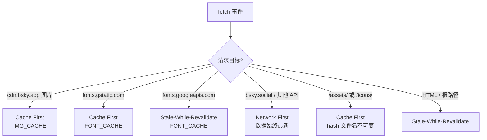

# PWA 部署与发布

`@bsky/pwa` 是一个纯静态 PWA——无需后端服务器，所有 **AT Protocol** 请求从浏览器直接发出。构建产物是一个自包含的 `dist/` 目录，可部署到任意静态托管平台。

[来源](../packages/pwa/package.json#L1-L31)

---

## 构建输出

执行 `pnpm build`（即 `tsc -b && vite build`）后在 `packages/pwa/dist/` 生成以下结构：

```
dist/
├── index.html              # 入口 HTML（内联 asset 引用）
├── manifest.json           # Web App Manifest（从 public/ 复制）
├── sw.js                   # Service Worker（从 public/ 复制）
├── icons/
│   ├── icon-64.png
│   ├── icon-192.png
│   └── icon-512.png
└── assets/
    ├── index-xxxxxx.js     # Vite 打包的 JS bundle（hash 文件名）
    ├── index-xxxxxx.css    # 编译后的 Tailwind CSS（hash 文件名）
    └── hls-xxxxxx.js       # HLS 视频播放 chunk
```

关键配置来自 `vite.config.ts`：

- **`base: './'`** — 所有资源使用**相对路径**，确保在任意子路径部署都能正确加载。
- **`outDir: 'dist'`** / **`assetsDir: 'assets'`** — 输出目录结构如上。
- **`resolve.alias`** — 将 `os`、`fs`、`path` 三组 Node 内置模块重定向到空桩文件，避免浏览器环境报错。

构建后的 `index.html` 自动注入 script 和 link 标签指向 hash 命名的 assets，天然支持长效缓存。

[来源](../packages/pwa/vite.config.ts#L1-L18) | [来源](../packages/pwa/dist/index.html#L1-L17) | [来源](../packages/pwa/package.json#L8-L10)

---

## Service Worker 缓存策略

`public/sw.js` 实现了三层缓存策略，通过请求 URL 的路由来选择策略：



| 策略 | 适用场景 | 行为 |
|------|---------|------|
| **Cache First** | CDN 图片、字体文件、Vite 构建的 hash 资源 | 命中缓存直接返回；无缓存则回退到网络并填充缓存 |
| **Network First** | `bsky.social`、`public.api.bsky.app`、`api.deepseek.com` 等 API | 优先请求网络；网络不可用时返回缓存或 503 错误 |
| **Stale-While-Revalidate** | Google Fonts CSS、HTML 页面 | 先返回缓存（如有），同时在后台请求更新缓存 |

安装阶段执行**预缓存**：将 `./`、`./index.html`、`./manifest.json` 写入 `bsky-v3` 缓存。激活阶段清理旧版本缓存（保留 `bsky-v3`、`bsky-img-v1`、`bsky-font-v1`），并调用 `clients.claim()` 立即接管页面。

`main.tsx` 在页面 `load` 事件后注册 Service Worker，作用域为 `./`。

[来源](../packages/pwa/public/sw.js#L1-L108) | [来源](../packages/pwa/src/main.tsx#L7-L14)

---

## Manifest 与安装配置

`public/manifest.json` 定义了 PWA 安装所需元数据：

```json
{
  "name": "Bluesky Client",
  "short_name": "Bluesky",
  "start_url": "./",
  "display": "standalone",
  "background_color": "#FFFFFF",
  "theme_color": "#00A5E0",
  "icons": [
    { "src": "icons/icon-64.png",  "sizes": "64x64",   "type": "image/png" },
    { "src": "icons/icon-192.png", "sizes": "192x192", "type": "image/png", "purpose": "any maskable" },
    { "src": "icons/icon-512.png", "sizes": "512x512", "type": "image/png", "purpose": "any maskable" }
  ]
}
```

`index.html` 额外包含了 iOS 专用的 meta 标签——`apple-mobile-web-app-capable`、`apple-mobile-web-app-status-bar-style`、`apple-touch-icon`——确保添加到主屏幕时的体验完整。

[来源](../packages/pwa/public/manifest.json#L1-L26) | [来源](../packages/pwa/index.html#L1-L21)

---

## Hash 路由与静态托管兼容性

PWA 使用 **Hash 路由**（由 `useHashRouter` 实现），所有路径以 `#` 开头（如 `#/feed`、`#/thread/...`）。这意味着**任意路径请求都只需返回 `index.html`**——不依赖服务端 URL 重写规则。

这对静态托管至关重要：Cloudflare Pages、Netlify、Vercel 的默认行为是将 `/some/path` 映射到文件系统查找，而 Hash 路由完全绕过了这个机制，部署时无需配置 `_redirects` 或 `vercel.json` 的 rewrites。

[来源](../packages/pwa/src/App.tsx#L1-L10) | [来源](../packages/pwa/src/hooks/useHashRouter.ts)

---

## 部署命令

### 通用前提

```bash
cd packages/pwa
pnpm build
```

产物全部在 `dist/` 目录内。部署到以下任一平台均可：

### Cloudflare Pages

```bash
npx wrangler pages deploy dist --project-name ai-bsky --commit-dirty=true
```

或通过 Cloudflare Dashboard → Workers & Pages → Pages → 直接上传 `dist/` 文件夹。

演示地址：[https://ai-bsky.pages.dev](https://ai-bsky.pages.dev)

### Netlify

```bash
npx netlify deploy --dir dist --prod
```

### Vercel

```bash
npx vercel dist --prod
```

[来源](../README.md#L135-L148) | [来源](../docs/PWA_GUIDE.md#L12-L26)

---

## 零环境变量原则

PWA 不需要 `.env` 文件。凭据通过登录表单输入后持久化到 `localStorage`，AI API Key 在设置页面（⚙️）配置。这意味着：

- 不同平台的部署流程完全一致，无需为不同环境调整配置。
- 用户各自的凭据互不干扰。
- 静态托管平台无需任何环境变量注入。

[来源](../docs/PWA_GUIDE.md#L24-L26)

---

## 离线体验注意事项

PWA 的离线能力由 Service Worker 提供，但存在以下边界：

- **只能读取已缓存的内容**。未浏览过的帖子、图片在离线时不可用。
- **API 请求离线时返回 503**。Network First 策略在无网络时会返回 `{ error: 'Network offline' }`，UI 层需妥善处理此状态。
- **Bluesky CDN 图片**采用 Cache First，意味着首次查看的图片需要网络，之后离线可复用。
- **Google Fonts** 在首次加载后离线可用。
- **会话凭据**存储在 `localStorage`，离线时登录状态保持——但 JWT 过期后无法刷新，需要用户重新登录。

[来源](../packages/pwa/public/sw.js#L43-L50)

---

## 架构回顾

PWA 与 TUI 共享 `@bsky/app` 层的全部业务逻辑 — 详见 [PWA 网页应用实现](pwa-网页应用实现.md) 和 [@bsky/app 共享逻辑与 Hooks](bsky-app-共享逻辑与-hooks.md)。构建与部署层则完全独立，纯静态输出无需后端。