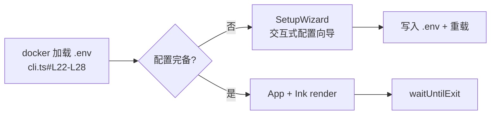

# TUI 终端界面实现

## 架构总览：从 Node.js 入口到 Ink 渲染树

TUI 子系统是 `@bsky/tui` 包的完整前端实现，基于 **Ink**（React-on-terminal）构建。其入口文件 `cli.ts` 定义了清晰的启动三阶段：



第一阶段，从两个候选路径加载 `dotenv`：相对于 `cli.ts` 的 monorepo 根目录，以及 `process.cwd()`。第二阶段，`getConfigFromEnv()` 提取 `BLUESKY_HANDLE` / `BLUESKY_APP_PASSWORD` / `LLM_*` 系列变量；缺失关键凭据时渲染 `SetupWizard`。第三阶段，调用 Ink 的 `render()` 挂载根组件，传入 `stdin`/`stdout`/`stderr` 流，并设 `exitOnCtrlC: true`。[来源](../packages/tui/src/cli.ts#L30-L38)

**Raw mode 的降级策略**值得注意：若 `stdin.setRawMode()` 失败（如非 TTY 环境），代码构建一个虚拟 `Readable` 流，将 `process.stdin` 的 data 事件桥接过去，确保 Ink 在非 raw 模式下仍能接收输入。[来源](../packages/tui/src/cli.ts#L69-L85)

---

## 单一键盘分发器：App.tsx 的 useInput 设计

`App.tsx` 是整个 TUI 的 **central nervous system**。它不使用任何路由库，而是用 Ink 的 `useInput` 钩子实现了一个**基于当前 view type 的集中式键盘分发器**：

```
useInput((input, key) => {
  // 优先级 1: Tab / Esc 全局快捷键
  // 优先级 2: 当前 view 独占模式 (compose/search/aiChat→ai)
  // 优先级 3: 箭头键 + Enter (feed/bookmarks 列表导航)
  // 优先级 4: 字母快捷键 (t/n/p/s/a/c/b)
  // 优先级 5: view 专属操作 (j/k/m/r/f/v/q)
})
```

设计模式是**状态机 + 门控**：当视图处于 `compose` 的 `draftSavePrompt` / `draftListOpen` / `imagePathInput` 等子状态时，所有输入被该子状态拦截，直到 Esc 或 Enter 退出该子状态。`search` 视图同理——它拥有全部输入控制权，`App` 直接 `return` 放行。[来源](../packages/tui/src/components/App.tsx#L117-L258)

**Tab 键**实现 AI 面板与主内容区的焦点切换，仅在 `aiChat` 视图下生效。`Ctrl+G` 是全局 AI 聊天快捷键，从任意视图创建新会话并携带当前上下文（thread URI）。[来源](../packages/tui/src/components/App.tsx#L150-L152)

---

## Viewport 渲染策略：预计算行列表与扁平 Text 元素

TUI 面临一个根本挑战：Ink 的 `Box` 嵌套布局在终端中无法精确控制像素级重叠，且不同终端对 `Box` 边距/边框的渲染差异巨大。解决方案是 **PostList 预计算 + 扁平化**：

### 行预计算

`PostItem.tsx` 中的 `postToLines()` 将每个 `PostView` 对象展开为一个 `PostLine[]` 数组，包含作者行、正文行、引用行、媒体行、统计行和空分隔行。每行携带 `isName` 和 `isSelected` 标记来决定颜色和加粗。[来源](../packages/tui/src/components/PostItem.tsx#L11-L120)

```mermaid
flowchart LR
    P[PostView] --> L[postToLines<br/>展平为 PostLine[]]
    L --> M[useMemo 缓存<br/>依赖 posts + selectedIndex + width]
    M --> V[可见窗口切片<br/>viewStart ~ viewStart+visibleLines]
    V --> T[PostListItem × N<br/>纯 Text 元素]
```

### 可见窗口计算

`PostList.tsx` 接收 `width` 和 `height` 两个数值，**在 useMemo 中完成所有帖子的一次性展开**，然后根据 `selectedIndex` 计算视口偏移 `viewStart`——目标是将选中行置于视口的约 1/3 处。滚动指示器（`▲`/`▼`）显示当前进度的百分比。[来源](../packages/tui/src/components/PostList.tsx#L14-L48)

**为什么不用 `Box` 嵌套**？因为终端 Layout 引擎不具备浏览器的 CSS 盒模型精确度。每个 `PostListItem` 只输出一个 `<Text>` 元素，由外层 `PostList` 的 `flexDirection: 'column'` 控制垂直排列。引用的帖子用 `color="magenta"` 和 `dimColor` 视觉区分，而非通过缩进 Box。[来源](../packages/tui/src/components/PostItem.tsx#L123-L137)

---

## CJK 文本引擎：visualWidth 与 wrapLines 换行算法

`text.ts` 是 TUI 独有的工具模块——PWA 依赖 CSS `word-wrap`，而终端需要自行计算每个字符的视觉宽度。

### visualWidth

该函数遍历字符串的 Unicode 码点，对 CJK 表意文字、Hangul 音节、Emoji 等宽字符计 2 列，零宽字符（U+0000、U+200B ZWSP）跳过，其余计 1 列。宽字符判定范围覆盖 U+1100–U+115F（Hangul Jamo）、U+2E80–U+A4CF（CJK + Yi）、U+1F300–U+1F9FF（Emoji/Misc Symbols）等 10 个区间。[来源](../packages/tui/src/utils/text.ts#L1-L37)

### wrapLines 换行算法

```
wrapLines(text: string, maxCols: number, indent = 0): string[]
```

逐段落（`\n` 分隔）处理，对每段应用**贪心换行**：
1. 若整段视觉宽度 ≤ maxCols，直接输出。
2. 否则，调用 `findBreakPoint` 从前往后扫描字符，累计视觉宽度，在首次超过 maxCols 时寻找最近的空格断点；若无可用的空格断点，则在该字符处强断。
3. 续行首部添加 `indent` 个空格缩进。

`findBreakPoint` 的核心逻辑是逐码点累加视觉宽度，同时记录最后一个空格的位置 `lastSpace`，在超出 maxCols 时优先选择空格断点（包含该空格）。[来源](../packages/tui/src/utils/text.ts#L39-L82)

---

## ANSI 鼠标追踪：mouse.ts 的序列解析

终端鼠标支持通过 DEC private mode `\x1b[?1000h` 启用，滚动事件以 `\x1b[M<button><col+32><row+32>` 格式发送。

`enableMouseTracking()` 向 stdout 写入 `\x1b[?1000h`，`disableMouseTracking()` 写入 `\x1b[?1000l`。`parseMouseEvent()` 维护一个 `mouseBuf` 字符串缓冲区，逐字符拼接输入流，当检测到完整的 `\x1b[M` + 3 字节序列时，提取 button、col、row 字段。button 值为 64 表示上滚，65 表示下滚。[来源](../packages/tui/src/utils/mouse.ts#L24-L47)

```typescript
// 完整序列: ESC [ M <button> <col+32> <row+32>
// 上滚: button = 64 (0x40)
// 下滚: button = 65 (0x41)
```

`App.tsx` 在 `useEffect` 中启用鼠标追踪，监听 `process.stdin.data` 事件解析滚动，调用 `setFeedIdx` 调整选中行。[来源](../packages/tui/src/components/App.tsx#L260-L273)

**注意**：TUI 的鼠标支持仅限滚动，不处理点击。这是因为 Ink 的 `useInput` 在 raw mode 下会吞掉所有输入，与鼠标点击序列冲突。

---

## Feed 配置覆盖层：FeedConfigOverlay 的 UI 状态机

`FeedConfigOverlay` 是嵌入在 `feed` view 中的全功能 Feed 管理界面，拥有独立的 `useInput` 钩子，覆盖 `App` 的分发器（通过 `App` 在 `showFeedConfig` 为 true 时提前 return 实现门控）。

其内部状态包括：
- `idx`：当前高亮行索引
- `adding`：是否正在输入新 Feed URI
- `addInput`：URI 输入缓冲区
- `suggested`：从 `client.getSuggestedFeeds(10)` 获取的推荐列表

键盘操作集：`jk` 上下导航，`Enter` 选择/添加，`d` 删除，`s` 设为默认，`Esc` 关闭。添加模式下渲染一个 `<TextInput>` 组件接收 URI 输入。[来源](../packages/tui/src/components/App.tsx#L309-L384)

用户配置的 Feed 列表存储于 `feedConfig` 状态（默认从 `BSKY_FEEDS` 环境变量或 `RECOMMENDED_FEEDS` 获取），基于 URI 的 `currentFeedUri` 和 `defaultFeedUri` 双重引用实现——`defaultFeedUri` 是 "回到主页" 时的回退 feed。[来源](../packages/tui/src/components/App.tsx#L46-L60)

---

## 辅助能力：SetupWizard 与 Markdown 渲染

### 首次启动向导

`SetupWizard.tsx` 在凭据缺失时呈现，是一个**表单状态机**：8 个字段顺序交互（Bluesky 凭据 → LLM 配置 → 语言偏好），每字段支持 `validate` 校验函数。`Tab`/`DownArrow` 前进，`UpArrow` 后退。最后字段提交时，构造 `SetupConfig` 写入 `.env` 文件，然后调用 `dotenv.config` 重载并触发 `App` 挂载。[来源](../packages/tui/src/components/SetupWizard.tsx#L73-L107)

### 内联 Markdown 渲染

`markdown.tsx` 提供 `renderMarkdown(md: string): React.ReactNode[]`，将 Markdown 文本转换为 Ink `<Text>` 元素数组，**不生成 ANSI 转义序列**，完全依赖 Ink 的 React 渲染。支持标题（`#`/`##`/`###` → `bold` + `cyan`/`cyanBright`）、代码块（` ``` ` → `dimColor` 缩进）、块引用（`>` → `dimColor`）、无序/有序列表、分隔线。URL 和 @handle 经由 `TOKEN_REGEX` 正则识别，渲染为蓝色。[来源](../packages/tui/src/utils/markdown.tsx#L6-L100)

---

## 与 PWA 的对比

| 维度 | TUI | PWA |
|------|-----|-----|
| 渲染引擎 | Ink（React → ANSI） | React DOM + Tailwind CSS |
| 文本换行 | 手动 `visualWidth` + `wrapLines` | CSS `word-wrap` + `overflow-wrap` |
| 输入机制 | `useInput` raw mode 全局分发器 | DOM 事件 + 标准表单控件 |
| 鼠标交互 | ANSI 转义序列滚动（仅 Xterm） | 原生 `scroll` / `click` 事件 |
| 路由 | `currentView` 状态机 | Hash 路由 |
| 媒体处理 | sharp 压缩 + `fs.readFileSync` | `` 原生加载 |
| 图片展示 | 可点击 URL（OSC 8 超链接） | `` 标签渲染 |

详见 [PWA 网页应用实现](pwa-网页应用实现.md) 了解更多差异。

---

## 推荐阅读

- [项目结构与包依赖](项目结构与包依赖.md) — Monorepo 中 `@bsky/tui` 的依赖流向
- [@bsky/app 共享逻辑与 Hooks](bsky-app-共享逻辑与-hooks.md) — `useTimeline`、`useNavigation` 等跨 TUI/PWA 共享的 Store 模式
- [状态管理与路由系统](状态管理与路由系统.md) — `currentView` 导航状态机的完整定义
- [国际化 i18n 系统设计](国际化-i18n-系统设计.md) — 页面所有 `t()` 调用背后的翻译引擎