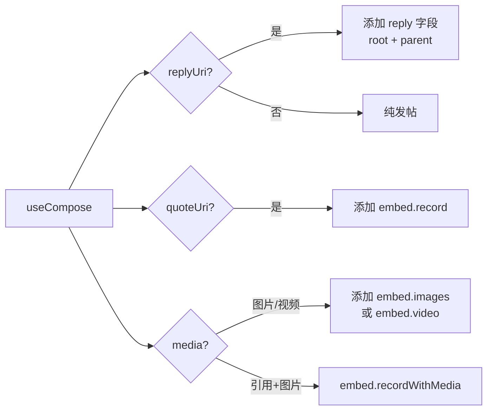

现在我有所有需要的上下文，开始编写页面。

---

# 发布帖子与互动

发帖是 Bluesky 的核心操作。本项目围绕**三个发帖场景**（新帖、回复、引用）+ **三个互动操作**（点赞、转发、删除）构建了统一的交互逻辑，并在终端（TUI）和网页（PWA）两端分别适配了不同操作习惯。

---

## 三种发帖场景

`useCompose` 是核心 Hook，统一管理草稿文本、回复目标、引用 URI 和媒体附件。它的 `submit` 方法根据参数自动构建 AT Protocol 记录结构。



### 发新帖

从时间线按 `c`（TUI）或点击导航栏"发布"按钮（PWA）进入编辑界面。输入文本后提交，`submit` 调用 `client.createRecord` 将记录写入 `app.bsky.feed.post` 集合。

[来源](https://github.com/user/repo/blob/main/packages/app/src/hooks/useCompose.ts#L16-L48)

### 回复帖子

回复时传入 `replyTo`（目标帖子的 AT URI）。`submit` 内部通过 `client.getRecord` 获取目标帖子的 CID，然后构造嵌套的 `reply.root` + `reply.parent` 对象。PWA 端在 `PostActionsRow` 点击回复按钮后导航到 `#/compose?replyTo=...`；TUI 端在帖子详情按 `c` 触发。

[来源](https://github.com/user/repo/blob/main/packages/app/src/hooks/useCompose.ts#L34-L43)

### 引用帖子

引用（Quote）走两种路径：

- **纯引用**：`quoteUri` 参数设为被引帖子的 URI，`submit` 构造 `app.bsky.embed.record` 嵌入。
- **引用+图片**：同时传入 `quoteUri` 和 `media[]`，构造 `app.bsky.embed.recordWithMedia`，内层 `record` 放引用、`media` 放图片数组。

PWA 端在转发弹窗中选择 "Quote" 触发，TUI 端在帖子详情按 `r` 进入转发选择对话框后按 `q` 切换为引用模式。

[来源](https://github.com/user/repo/blob/main/packages/app/src/hooks/useCompose.ts#L46-L73)

---

## 图片上传：TUI 路径输入 vs PWA 文件选择器

两个界面采用截然不同的文件选择方式，但最终都经过**压缩 → 上传 Blob → 构造 embed** 这条流程。

| 环节 | TUI（终端） | PWA（网页） |
|---|---|---|
| 选择方式 | 手动输入文件路径（`i` 键） | `<input type="file">` 浏览器对话框 |
| 依赖 | `fs.readFileSync` + `sharp` | `createImageBitmap` + Canvas |
| 压缩引擎 | sharp（原生 C++ 库） | 浏览器 Canvas `toBlob` |
| 压缩时机 | 自动压缩 >2MB 图片成 JPEG 82% 质量，2048px 限制 | 同上，但采用多轮尝试（JPEG→WebP→低质JPEG） |
| 视频支持 | 支持，通过文件扩展名判断 | 支持，通过 `file.type.startsWith('video/')` 判断 |
| 最大数量 | 4 张图片 OR 1 个视频（不可混合） | 同左 |
| 最大大小 | 图片 2MB，视频 100MB | 同左 |

### TUI 端：sharp 硬件加速压缩

按下 `i` 键后进入图片路径输入模式，输入本地路径后按回车触发上传。代码通过 `sharp` 库对超过 2MB 的图片执行 `resize(2048, 2048, { fit: 'inside' })` + `jpeg({ quality: 82 })`，压缩完成后在界面显示"原大小 → 压缩后大小 (压缩率%)"的信息提示，8 秒后自动消失。

[来源](https://github.com/user/repo/blob/main/packages/tui/src/components/App.tsx#L117-L124)

### PWA 端：浏览器前端压缩

通过隐藏的 `<input type="file" accept="image/*,video/*" multiple>` 唤起系统文件选择器。`compressImage` 工具函数先用 `createImageBitmap` 解码，然后逐步尝试 JPEG 82%、JPEG 65%、WebP 75% 三种编码参数，若仍然超限则使用低质量 JPEG 40% 保底。GIF 动图跳过压缩以保留动画。

[来源](https://github.com/user/repo/blob/main/packages/pwa/src/utils/compressImage.ts#L18-L96)

### 共同的后端链路

无论哪种前端，最终都调用 `client.uploadBlob(data, mimeType)` 将二进制数据上传到用户的 PDS（个人数据服务器），返回 `blob.ref.$link` 引用。然后将该引用组装进 `app.bsky.embed.images` 或 `app.bsky.embed.video` 结构的 `image/ref/$link` 字段。

[来源](https://github.com/user/repo/blob/main/packages/core/src/at/client.ts#L324-L331)

---

## 互动操作：点赞、转发、删除

三个互动操作都走"模块级乐观状态 + 确认门控"的模式，确保界面即时响应，同时防止误操作。

### 乐观状态管理

`usePostActions` 使用模块级变量（而非 React state）维护点赞和转发状态：

```typescript
let _liked = new Set<string>();
let _reposted = new Set<string>();
```

这种设计的优势是：**跨组件、跨页面共享状态**——时间线列表和帖子详情中的点赞/转发图标始终保持一致。组件通过 `tick` 计数器订阅状态变更，状态变化时所有订阅者重新渲染。

[来源](https://github.com/user/repo/blob/main/packages/app/src/hooks/usePostActions.ts#L6-L16)

### 点赞/取消点赞

点击点赞按钮时，`likePost` 先检查 `_liked.has(postUri)`：

- **已点赞** → 调用 `client.deleteRecord` 删除点赞记录 → 从 `_liked` 移除 → `_likeCountAdj` 减 1
- **未点赞** → 调用 `client.createRecord` 创建 `app.bsky.feed.like` 记录 → 加入 `_liked` → `_likeCountAdj` 加 1

PWA 端的 `PostActionsRow` 直接调用 `likePost(client!, post.uri, post.cid)`，TUI 端在 `UnifiedThreadView` 中按 `l` 触发。计数使用 `staticCount + adjustment` 的方式实时计算，确保不会出现负数。

[来源](https://github.com/user/repo/blob/main/packages/app/src/hooks/usePostActions.ts#L54-L77)

### 转发/引用选择

转发走两步确认流程：

**TUI 端**：按 `r` 弹出对话框，分为两阶段：

1. **选择阶段**（`phase: 'choice'`）：提供"转发"和"引用"两个选项
2. **确认阶段**（`phase: 'confirm'`）：按 `y` 确认转发，按 `n` 取消
3. 在 `choice` 阶段按 `q` 可切换到引用发帖模式

**PWA 端**：点击转发按钮弹出浮动菜单，包含"转发"和"引用"两个按钮，点击后直接执行或跳转编辑页。

`repostPost` 的逻辑与 `likePost` 对称：已转发则删除记录，未转发则创建 `app.bsky.feed.repost`。

[来源](https://github.com/user/repo/blob/main/packages/tui/src/components/UnifiedThreadView.tsx#L70-L100)

### 删除确认

只有在当前用户是帖子作者时才允许删除。流程：

**TUI 端**：按 `d` 触发，设置 `deleteConfirm` 状态 → 等待用户按 `y`（确认）或 `n`/`Esc`（取消）→ 确认后调用 `client.deletePost(uri)`，成功后通过 `refreshThread` 刷新视图。

**PWA 端**：`ThreadView` 中通过 `client.getHandle()` 判断作者身份，显示删除按钮，点击后直接调用 `client.deletePost`（浏览器内置 `confirm()` 对话框由具体实现决定是否需要）。

底层 `deletePost` 将 AT URI 解析为 `did + collection + rkey`，然后调用 `com.atproto.repo.deleteRecord` API。

[来源](https://github.com/user/repo/blob/main/packages/core/src/at/client.ts#L386-L395)

---

## TUI 键盘快捷键速查表

以下是在 TUI 发帖和互动场景下可用的快捷键：

| 快捷键 | 作用域 | 功能 |
|---|---|---|
| **`c`** | 时间线 | 进入发帖页面 |
| **`i`** | 发帖界面 | 插入图片（输入文件路径） |
| **`D`** | 发帖界面 | 打开草稿列表 |
| **`Esc`** | 发帖界面 | 退出（有内容时提示保存草稿） |
| **`y`/`n`** | 草稿保存提示 | 确认/取消保存草稿 |
| **`↑`/`↓`** 或 **`k`/`j`** | 草稿列表 | 上下选择草稿 |
| **`Enter`** | 草稿列表 | 加载选中草稿 |
| **`d`** | 草稿列表 | 删除选中草稿 |
| **`r`** | 帖子详情 | 转发（弹出选择对话框） |
| **`q`** | 转发选择 | 切换为引用模式 |
| **`y`** | 转发确认 | 确认转发 |
| **`n`** / **`Esc`** | 转发/删除确认 | 取消操作 |
| **`l`** | 帖子详情 | 点赞/取消点赞 |
| **`d`** | 帖子详情 | 删除自己的帖子（需二次确认） |
| **`v`** | 帖子详情 | 添加/移除书签 |

---

> **推荐阅读**：了解发帖背后的 AT Protocol 记录结构，参见 [AT Protocol 客户端封装](at-protocol-客户端封装.md)；关于草稿存储的实现，参见 [@bsky/app 共享逻辑与 Hooks](bsky-app-共享逻辑与-hooks.md) 中的 `useDrafts` 部分；若需深入了解 AI 如何辅助发帖（如润色、翻译），参见 [翻译与润色功能](翻译与润色功能.md)。