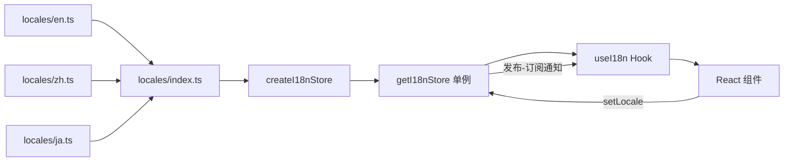

# 国际化 (i18n) 系统设计

国际化系统采用**单例 Store + React Hook 桥接**架构，以零外部依赖的方式实现了中文、英文、日文三语支持，具备运行时即时切换、参数插值和多层回退（fallback）能力。

## 类型系统：约束即文档

**`Locale`** 是一个字面量联合类型，精确限定支持的语种：

```typescript
export type Locale = 'zh' | 'en' | 'ja';
```

**`LocaleMessages`** 定义为 `Record<string, string>`，即一个扁平键值对映射。所有翻译文件都遵循此接口，保证跨语种的结构一致性。

[来源](types.ts#L1-L3)

## 语言包组织：三模块 + 索引聚合

`locales/` 目录下每个语言模块导出一个默认的 `LocaleMessages` 对象。索引文件 `locales/index.ts` 将三者聚合成一个 `messages` 注册表：

```typescript
export const messages: Record<Locale, LocaleMessages> = { zh, en, ja };
```

同时导出 `availableLocales`（语种列表）和 `localeLabels`（人类可读标签，如 `'zh': '中文'`），供 UI 在语言选择器中使用。

[来源](locales/index.ts#L1-L8)

## Store：函数式单例 + 发布-订阅

`store.ts` 并未使用 class，而是通过 `createI18nStore()` 工厂函数创建对象实例，再通过模块级变量 `_instance` 实现惰性单例。

### 核心状态

每个 Store 实例维护两个字段：
- `locale`：当前语种
- `messages`：当前语种对应的翻译映射

### 订阅机制

Store 内部维护一个 `Set<() => void>` 的 listener 集合，提供标准的 `subscribe(fn)` / `unsubscribe(fn)` 接口。`subscribe` 返回取消订阅函数，与 React 的 `useEffect` 清理机制天然契合。

### 翻译函数 `t()`

`t(key, params?)` 实现三级回退策略：

1. **当前语言**中查找 key → 命中则返回
2. **兜底到英文** → 命中则返回
3. **兜底到中文** → 命中则返回
4. **原样返回 key** — 所有语言都缺失时直接显示 key 本身，便于开发阶段识别缺失项

参数插值通过 `interpolate()` 函数完成，使用正则 `/\{(\w+)\}/g` 匹配占位符，从 `params` 中取值替换。

[来源](store.ts#L1-L60)

## useI18n Hook：React 与 Store 的桥梁

`useI18n()` 函数是连接 Store 与 React 组件的桥梁，其核心机制是利用 **`useSyncExternalStore` 模式**（手动实现版）——通过 `useState(0)` + `force` 计数器驱动重渲染：

```typescript
const [, force] = useState(0);
const tick = useCallback(() => force(n => n + 1), []);
useEffect(() => store.subscribe(tick), [store, tick]);
```

当 `setLocale()` 被调用时，Store 通知所有 listener，React 组件因状态变更而重渲染，从而读到最新的 `store.messages`。

Hook 返回的对象包含：
- `t(key, params?)` — 使用 `useCallback` 稳定引用的翻译函数
- `locale` — 当前语种
- `setLocale(locale)` — 切换语言
- `availableLocales` / `localeLabels` — 供 UI 渲染语言选择器

[来源](useI18n.ts#L1-L19)

## 翻译 Key 命名规范

所有翻译 key 采用**点分隔的命名空间**模式，结构清晰可预测：

| 命名空间 | 用途 | 示例 key |
|---------|------|---------|
| `nav.*` | 导航栏 / 侧边栏标签 | `nav.feed`, `nav.profile` |
| `action.*` | 按钮 / 可操作行为 | `action.like`, `action.delete` |
| `status.*` | 加载 / 空 / 错误状态 | `status.loading`, `status.empty` |
| `compose.*` | 发帖 / 回复编辑器 | `compose.placeholder`, `compose.charCount` |
| `thread.*` | 帖子详情 / 讨论串 | `thread.replies`, `thread.confirmDelete` |
| `notifications.*` | 通知列表 | `notifications.reason.like`, `notifications.empty` |
| `search.*` | 搜索界面 | `search.placeholder`, `search.noResults` |
| `profile.*` | 个人资料页 | `profile.followers`, `profile.notFound` |
| `bookmarks.*` | 书签列表 | `bookmarks.title`, `bookmarks.empty` |
| `ai.*` | AI 对话界面 | `ai.thinking`, `ai.summarizePost` |
| `login.*` | 登录页面 | `login.handle`, `login.password` |
| `settings.*` | 设置页面 | `settings.darkMode`, `settings.targetLang` |
| `theme.*` | 主题切换 | `theme.switchDark`, `theme.switchLight` |
| `common.*` | 通用文本 | `common.loading`, `common.error` |
| `keys.*` | TUI 键盘快捷键提示 | `keys.feed`, `keys.thread` |
| `breadcrumb.*` | TUI 面包屑导航 | `breadcrumb.feed`, `breadcrumb.compose` |
| `setup.*` | TUI 初始设置向导 | `setup.welcome`, `setup.locale` |
| `feed.*` | Feed 配置界面 | `feed.switchFeed`, `feed.subscribe` |

**命名规则总结**：
- **命名空间前缀**：按功能模块分组（如 `compose`、`thread`）
- **小写 + 点 + 驼峰**：每段小写，必要时嵌套（如 `notifications.reason.like`）
- **动词/名词区分**：行为用动词或动名词（`action.refresh`），展示状态用名词（`status.error`）
- **参数占位符**：使用 `{paramName}` 格式，在运行时由 `interpolate()` 替换

[来源](locales/en.ts#L1-L10)

## 架构总览



切换语言时，数据流为：`组件调用 setLocale('en')` → Store 更新 `locale` 和 `messages` → 通知所有 listener → `useI18n` 的 `useState` 触发重渲染 → 组件使用新的翻译。

## 与项目其他部分的关联

i18n 系统通过 `index.ts` 的导出作为公共 API 暴露，被 TUI 和 PWA 两种界面消费：

- TUI 在 `页面初始化` 和 `设置向导` 中使用 `useI18n` 或直接调用 `getI18nStore` [](状态管理与路由系统.md)
- PWA 使用相同的 Hook 桥接 React 组件 [](pwa-网页应用实现.md)
- 语言设置随配置持久化，参考 [](环境与凭据配置.md)

## 下一步

- 探索项目的 [状态管理与路由系统](状态管理与路由系统.md) — i18n Store 的设计模式与其一脉相承
- 了解其他共享逻辑与 Hooks：[](bsky-app-共享逻辑与-hooks.md)
- 深入到 [AI 对话与智能助手](ai-对话与智能助手.md) 中查看翻译相关 key 的实际使用场景