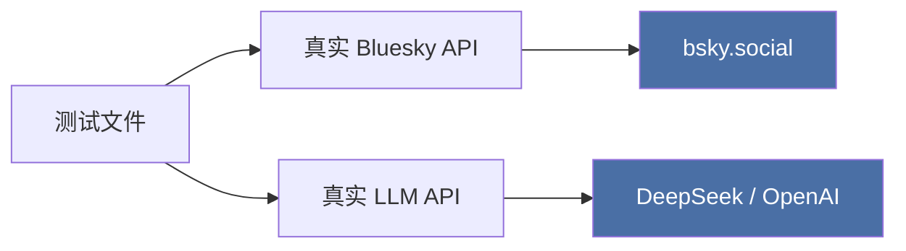

# 测试策略与实战

本项目的测试套件位于 `packages/core/tests/`，它的设计遵循一条看似反直觉的原则：**绝不使用 Mock**。每一个测试用例都向真实的 Bluesky 服务发起 HTTP 请求，并在真实的 LLM API 上执行 AI 调用。这套测试不是为了验证代码逻辑的正确性（那是类型系统的职责），而是为了验证**真实环境下的端到端可用性**。

## 测试哲学：无 Mock，直面真实

传统的单元测试热衷于 Mock 网络层、Mock 数据库、Mock 一切外部依赖。本项目的测试恰恰相反——它选择相信 TypeScript 编译器和类型定义已经捕获了大部分逻辑错误，因此测试的唯一使命是回答一个更本质的问题：**当代码真的连上 Bluesky 时，它能工作吗？**



这一决策意味着**运行测试前必须配置环境变量**。每个测试文件的开头都通过 `dotenv` 从项目根目录的 `.env` 加载凭据：

```typescript
dotenv.config({ path: path.resolve(__dirname, '..', '..', '..', '.env') });
```

需要的环境变量包括 `BLUESKY_HANDLE`、`BLUESKY_APP_PASSWORD`，以及 AI 测试所需的 `LLM_API_KEY`、`LLM_BASE_URL`、`LLM_MODEL`。详见 [环境与凭据配置](环境与凭据配置.md)。

[来源](../packages/core/tests/auth.test.ts#L6-L8)

## 测试配置

`vitest.config.ts` 定义了全局测试行为：

```typescript
export default defineConfig({
  test: {
    globals: true,        // 全局注册 describe/it/expect
    testTimeout: 60000,   // 单测最长 60 秒
    hookTimeout: 30000,   // beforeAll/afterAll 最长 30 秒
  },
});
```

60 秒超时反映了真实 API 调用的不确定性——Bluesky 的搜索索引延迟、LLM 的推理耗时都可能让测试运行数秒甚至数十秒。三个测试脚本分别对应不同的场景：

- `npm test` → `vitest run`：运行所有测试
- `npm run test:watch` → `vitest`：watch 模式
- `npm run test:e2e` → 仅运行 `e2e.test.ts`，verbose 输出

[来源](../packages/core/vitest.config.ts#L1-L8) | [来源](../packages/core/package.json#L12-L16)

---

## 文件分析

### auth.test.ts：认证与基础端点

覆盖 `BskyClient` 最核心的三个方法，每条测试超时 15 秒：

| 测试 | 验证点 | 实际作用 |
|------|--------|----------|
| **创建会话** | `accessJwt` 非空、`handle` 匹配、`did` 格式为 `did:plc:` | 确认应用密码正确、API 可达 |
| **解析 Handle** | `resolveHandle` 返回的 DID 与登录会话一致 | 验证公共 API 端点可用 |
| **获取个人资料** | 返回的 `handle` 和 `did` 与会话一致 | 验证认证后的 `getProfile` 工作 |

```typescript
it('should create a session and return accessJwt', async () => {
  const session = await client.login(HANDLE, APP_PASSWORD);
  expect(session.accessJwt).toBeTruthy();
  expect(session.handle).toBe(HANDLE);
  expect(session.did).toMatch(/^did:plc:/);
}, 15000);
```

这三个测试构成了**健康检查门**：如果它们失败，说明网络连接、凭据或 API 版本出了问题，后续所有测试都不用跑。

[来源](../packages/core/tests/auth.test.ts#L1-L39)

### feed.test.ts：时间线与 Feed 读取

这个文件的写法透露出一个重要的设计决策：**所有写操作都被注释掉了**。

文件上半部分声明了 `testPostUri`、`testPostUris`、`uploadedBlobCid` 等变量，并定义了发帖、获取讨论串、展平线程、上传图片、提取图片等一系列测试——但它们的 `it` 块全部被 `/* */` 包裹。唯一活跃的测试是：

```typescript
it('should search posts and find some results', async () => {
  const searchRes = await client.searchPosts({ q: 'Bluesky', limit: 25, sort: 'latest' });
  expect(searchRes.posts.length).toBeGreaterThanOrEqual(0);
}, 30000);
```

这个测试只断言返回结果长度 `>= 0`——它不要求搜索结果存在，只要求 API 调用本身不抛异常。这反映了搜索 API 的不确定性：不同时间、不同网络环境下结果可能为空。

被注释掉的部分（发帖 → 展线程 → 获取上下文）展示了**理想情况下应该测试的完整链路**，但由于写操作会产生真实数据、消耗 API 配额、且 AT Protocol 不提供便捷的删除接口，团队选择暂时将其禁用。

[来源](../packages/core/tests/feed.test.ts#L1-L151)

### ai_integration.test.ts：AI 助手与单轮功能

这是最复杂的测试文件，包含三个 `describe` 块：

#### 1. AI Tool Calling（工具调用全流程）

初始化 `AIAssistant`，注入 20+ 个工具定义，然后让 AI 执行真实调用：

```typescript
it('should search posts via AI tool call', async () => {
  const assistant = new AIAssistant(AI_CONFIG);
  assistant.setTools(tools);
  assistant.addSystemMessage('你是一个深度集成 Bluesky 的终端助手。使用工具获取信息。回答简练。');

  const result = await assistant.sendMessage(
    '在 Bluesky 上搜索包含 "Bluesky" 的帖子，告诉我找到了多少条。'
  );
  expect(result.toolCallsExecuted).toBeGreaterThanOrEqual(1);
}, 120000);
```

这个测试的关键不是验证搜索结果的内容，而是验证 **AI 正确地选择了 `search_posts` 工具并解析了返回数据**。类似地，"获取用户资料"测试验证 AI 能调用 `get_profile` 工具。

#### 2. 翻译与润色（单轮）

测试三个函数：`translateToChinese`、`polishDraft`（两种风格）。这些是纯 AI 调用，不涉及 Bluesky：

| 测试 | 输入 | 验证 |
|------|------|------|
| 英译中 | English 句子 | 结果包含中文字符 |
| 润色→正式 | 口语化草稿 | 结果非空、长度增加 |
| 润色→幽默 | 正式句子 | 结果非空 |

```typescript
it('should translate English to Chinese', async () => {
  const result = await translateToChinese(AI_CONFIG, 'Hello, this is a test post about Bluesky and the AT Protocol.');
  expect(/[\u4e00-\u9fff]/.test(result)).toBe(true);
}, 60000);
```

这里有个值得关注的细节：`LLM_API_KEY` 缺失时，整个 describe 块通过 `it.skip('No API key - skip', () => {})` 跳过所有测试。

#### 3. 引导性问题

使用 `singleTurnAI` 生成引导性问题。它使用一个硬编码的公开帖子 URI 作为上下文，验证 AI 是否能根据帖子生成相关问题。

[来源](../packages/core/tests/ai_integration.test.ts#L1-L165)

### e2e.test.ts：全链路集成测试

这个文件以编号 `[1]` 到 `[10]` 组织了 10 个测试步骤，但实际活跃的只有 6 个：

| 编号 | 测试 | 状态 | 说明 |
|------|------|------|------|
| [1] | 认证 | ✅ 活跃 | login → resolveHandle → getProfile |
| [2] | Feed 读取 | ✅ 活跃 | getTimeline（仅验证长度） |
| [3] | 图片 | ❌ 注释 | 上传/嵌入/提取/下载 |
| [4] | AI 工具调用 | ❌ 注释 | 分析帖子（依赖已发帖） |
| [5] | AI 翻译 | ✅ 活跃 | translateToChinese |
| [6] | AI 润色 | ✅ 活跃 | polishDraft |
| [7] | 资料与关系图 | ✅ 活跃 | getProfile('bsky.app') + getFollows |
| [8] | 时间线 | ✅ 活跃 | getTimeline（冗余测试） |
| [9] | 通知 | ✅ 活跃 | listNotifications（仅验证存在） |
| [10] | AI 引导问题 | ✅ 活跃 | singleTurnAI |

组合观察可以看出策略：**读操作全量覆盖，写操作全部搁置**。活跃测试覆盖了认证、时间线、搜索、资料、通知、翻译、润色——这些都是用户日常使用的高频路径。被注释的发帖和图片测试则对应管理后台或自动化脚本场景。

[来源](../packages/core/tests/e2e.test.ts#L1-L190)

---

## 注意事项

### 速率限制

Bluesky 的 API 有速率限制（Rate Limit）。连续运行全部测试（尤其是 `searchPosts` 和 `getTimeline` 并行执行时）可能触发 `HTTP 429`。代码中有一个应对措施：翻译测试完成后通过 `setTimeout(r, 2000)` 插入延迟。如果遇到限流，建议在 `vitest.config.ts` 中启用 `--pool forks` 或单线程执行。

### 测试账号隔离

测试依赖 `.env` 中的 `BLUESKY_HANDLE` 和 `BLUESKY_APP_PASSWORD`，**强烈建议使用专门的测试账号**，而非日常主账号。原因：

- 搜索测试、时间线读取会产生可追踪的调用记录
- 如果将来启用被注释的写操作测试，测试帖子会出现在账号时间线上
- 应用密码（`app password`）具有独立权限，但操作记录仍归属于主账号

### AI 测试的成本

两个 AI 测试文件（`ai_integration.test.ts` 和 `e2e.test.ts`）中的 AI 调用会消耗 LLM API 的 token 配额。`translateToChinese` 和 `polishDraft` 每次调用约消耗 200-500 token；`sendMessage`（含工具调用循环）可能消耗 2000-5000 token。建议仅在需要验证 AI 功能时运行这些测试，日常 CI 可以跳过（通过 `--exclude` 或条件跳过）。

### 幂等性

由于测试不创建数据（写操作被注释），所有活跃测试都是**天然幂等**的——无论运行多少次，不会在 Bluesky 留下痕迹。这降低了 CI 集成和重复运行的心理负担。

---

## 推荐阅读

- [@bsky/core 核心层设计](bsky-core-核心层设计.md) — BskyClient 和 AIAssistant 的架构细节
- [AI 助手与工具调用系统](ai-助手与工具调用系统.md) — 工具定义、执行循环与写确认门控
- [翻译与润色功能](翻译与润色功能.md) — translateToChinese 和 polishDraft 的实现
- [环境与凭据配置](环境与凭据配置.md) — 如何配置 `.env` 文件