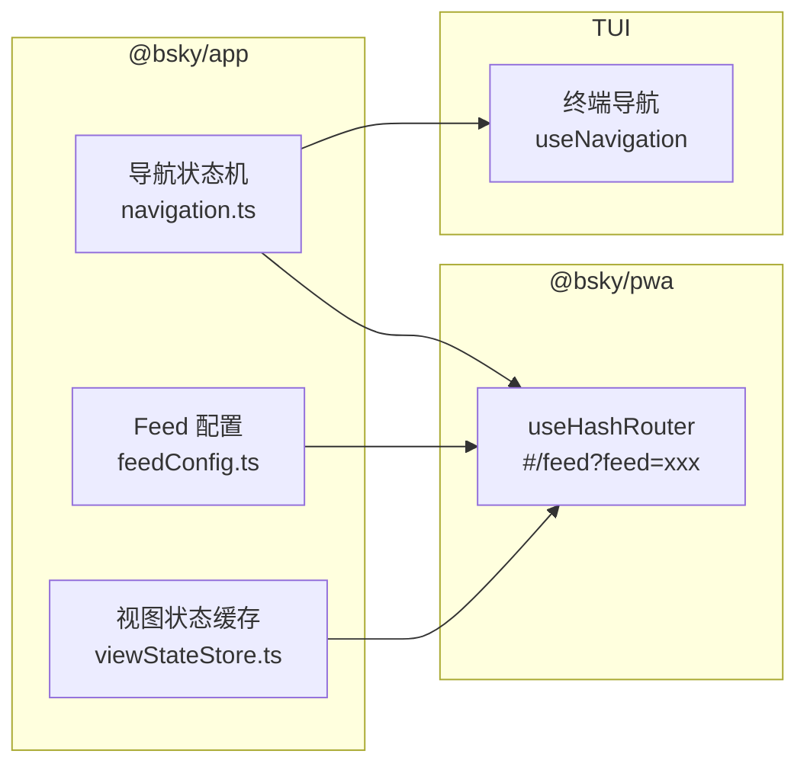

现在我已掌握全部四个模块的源码，下面开始编写页面。

---

# 状态管理与路由系统

本项目采用一种**纯 Store 模式**：不依赖 Redux 或 Zustand 等第三方状态管理库，而是用模块级变量 + 订阅者模式实现最小可行状态管理。三个独立的状态模块各自聚焦一个领域——导航、Feed 配置、视图缓存——然后由 PWA 层的 Hash Router 将它们桥接到浏览器 URL 地址栏。



---

## 导航状态机：`navigation.ts`

导航核心是一个 **`AppView` 联合类型**，精确枚举了应用中全部 9 种视图：

```typescript
type AppView =
  | { type: 'feed'; feedUri?: string }
  | { type: 'detail'; uri: string }
  | { type: 'thread'; uri: string }
  | { type: 'compose'; replyTo?: string; quoteUri?: string }
  | { type: 'profile'; actor: string; profileTab?: string }
  | { type: 'notifications' }
  | { type: 'search'; query?: string; searchTab?: string }
  | { type: 'aiChat'; contextUri?: string; sessionId?: string; ... }
  | { type: 'bookmarks' };
```

每个视图通过 `type` 字段区分，可选参数携带上下文（如 `feedUri`、`actor`、`sessionId`）。这种联合类型的设计让消费方通过 `switch (view.type)` 即可获得 TypeScript 类型收窄——写错属性名在编译期就会被捕获。

### 栈式导航

`createNavigation()` 创建了一个经典的后进先出栈：

- **`goTo(view)`** → `stack = [...stack, view]`，推入新视图
- **`goBack()`** → `stack.slice(0, -1)`，弹出一个
- **`goHome()`** → 重置为 `[{ type: 'feed' }]`

状态变更通过订阅者模式通知：`subscribe(fn)` 注册监听器，`goTo`/`goBack` 变化时批量通知。

```typescript
function goTo(view: AppView) {
  stack = [...stack, view];  // 不可变推入
  notify();
}
```

接口 `NavigationState` 暴露 `currentView`（栈顶）和 `canGoBack`（栈深 > 1），消费组件只需读这两个字段即可渲染对应的 UI。

[来源](packages/app/src/state/navigation.ts#L1-L53)

---

## Feed 配置持久化：`feedConfig.ts`

Feed 配置是一组用户可自定义的 Feed 源，通过 `localStorage` 实现跨会话持久化。

### 数据结构

```typescript
interface FeedConfigData {
  feeds: FeedInfo[];           // 已添加的 Feed 列表
  defaultFeedUri: string | null; // 默认 Feed，null = 主页时间线
}
```

`getFeedConfig()` 从 `localStorage` 读取键 `bsky_feed_config`，若不存在或解析失败则回退到 `DEFAULT_CONFIG`（包含 `RECOMMENDED_FEEDS`）。

### 三个关键操作

| 操作 | 行为 | 保护规则 |
|------|------|----------|
| `addFeed(uri, label?)` | 追加 Feed，若已存在则忽略 | 无重复添加 |
| `removeFeed(uri)` | 过滤掉指定 Feed | 拒绝删除 `BUILTIN_FEEDS.following` |
| `setDefaultFeed(uri\|null)` | 设置默认 Feed，`null` 表示主页时间线 | 删除默认 Feed 时自动置 null |

每次写操作都调用 `saveFeedConfig()` 同步写入 `localStorage`，然后返回最新配置（不可变风格）。

[来源](packages/app/src/state/feedConfig.ts#L1-L53)

---

## 视图状态缓存：`viewStateStore.ts`

这是一个极其精简的模块级缓存——一个 `Map<string, Record<string, number>>`，用于在视图切换间**保存和恢复滚动位置**。

```typescript
const _state = new Map<string, Record<string, number>>();

export function saveViewState(key: string, state: Record<string, number>): void { ... }
export function getViewState(key: string): Record<string, number> | undefined { ... }
```

TUI 端（终端界面）在离开视图时将滚动偏移量存入此 Map，返回时取出恢复。注意这是**运行时内存缓存**，页面刷新即失效。PWA 端则使用独立的 `useScrollRestore` Hook（见下文）。

[来源](packages/app/src/state/viewStateStore.ts#L1-L8)

---

## 滚动位置恢复：`useScrollRestore`

PWA 端在 `useScrollRestore` Hook 中实现了相同的模式，但针对 DOM 滚动做了适配：

- 使用独立的 `_scrollTops: Map<string, number>` 按 **view key** 存储像素偏移量
- **`useScrollRestore(key, scrollRef, ready)`** 在组件挂载时恢复滚动位置，卸载时自动保存
- 支持容器内滚动（通过 `scrollRef.current.scrollTop`）和全局 `window.scrollTo`

```typescript
useEffect(() => {
  return () => {
    if (key) {
      _scrollTops.set(key, scrollRef?.current ? scrollRef.current.scrollTop : getGlobalScrollY());
    }
  };
}, [key]);
```

这里的 `key` 遵循约定格式：`{viewType}-{identifier}`，如 `profile-did:plc:xxx`、`search-query`、`bookmarks`。

[来源](packages/app/src/hooks/useScrollRestore.ts#L1-L57)

---

## Hash Router：从状态到 URL 的桥梁

`useHashRouter` 是 PWA 层最关键的路由桥梁。它将 `AppView` 编码为浏览器 URL hash 片段（`#/feed?feed=...`），同时监听 `popstate` 事件响应浏览器的前进/后退按钮。

### 编码规则（`encodeView`）

```
feed     → #/feed 或 #/feed?feed=at://...
thread   → #/thread?uri=at://...
profile  → #/profile?actor=did:plc:...&tab=...
search   → #/search?q=...&tab=...
aiChat   → #/ai?session=... 或 #/ai?context=at://...
compose  → #/compose?replyTo=...
```

每个视图类型映射到明确的 hash 路径和查询参数，参数值均经过 `encodeURIComponent` 编码。

### 解码规则（`parseHash`）

解析流程：

1. 去掉 `#` 前缀
2. 以 `?` 分割出路径和查询参数
3. 根据路径（`/feed`、`/thread`、`/profile` 等）分发到对应 case
4. 从 `URLSearchParams` 读取参数，携带默认值回退

```typescript
function parseHash(): AppView {
  const raw = window.location.hash.replace(/^#/, '');
  const [path, queryString] = raw.split('?');
  const params = new URLSearchParams(queryString || '');
  // switch (path) → 构造对应 AppView
}
```

### 默认 Feed 重定向

首次加载 `#/feed`（无参数）时，`useEffect` 会自动替换为配置的默认 Feed：

```typescript
if (!raw || raw === '/' || raw === '/feed') {
  const defFeed = getFeedConfig().defaultFeedUri ?? BUILTIN_FEEDS.following;
  window.history.replaceState(null, '', `#/feed?feed=${encodeURIComponent(defFeed)}`);
}
```

这一设计保证了：（1）用户书签的 URL 包含具体的 Feed URI；（2）`goHome()` 跳转到用户设置的默认 Feed 而非硬编码的 "Following"。

### 返回键兼容

`canGoBack` 的状态由两路信号决定：`history.length > 1` 和当前 hash 是否为 `#/feed`。这与 `@bsky/app` 纯 store 的 `canGoBack`（栈深 > 1）在语义上等价，但实现路径不同——PWA 完全依赖浏览器的历史栈。

[来源](packages/pwa/src/hooks/useHashRouter.ts#L1-L166)

---

## 模块间数据流

```
用户点击 Feed 切换按钮
        │
        ▼
PWA: 调用 goTo({ type: 'feed', feedUri: 'at://...' })
        │
        ├── useHashRouter.goTo()
        │       ├── window.history.pushState(null, '', '#/feed?feed=...')
        │       └── setCurrentView(...)
        │
        ├── hook 返回的 currentView 驱动 UI 重渲染
        │
        └── getLastFeedUri() + setLastFeedUri() 记录最后活跃的 Feed
```

用户刷新页面时：

```
页面加载 → parseHash() → 解析 #/feed?feed=...
          → 若无参数，redirect 到 getFeedConfig().defaultFeedUri
          → setCurrentView({ type: 'feed', feedUri: '...' })
          → 组件根据 currentView 渲染对应视图
```

---

## 与 TUI 的对比

TUI（终端界面）使用 `useNavigation` Hook，它直接调用 `@bsky/app` 的 `createNavigation()` 纯 store，**不依赖 URL**。PWA 则在纯 store 之上包装了 `useHashRouter`，两者共享 `AppView` 类型定义，但路由实现各取其道。详细对比见 [](pwa-网页应用实现.md) 和 [](tui-终端界面实现.md)。

[来源](packages/pwa/src/hooks/useHashRouter.ts#L1-L5)

---

## 推荐阅读

- [](项目结构与包依赖.md) — 理解 `@bsky/app` 与 `@bsky/pwa` 的包层级关系
- [](pwa-网页应用实现.md) — PWA 层的整体架构与渲染管线
- [](tui-终端界面实现.md) — TUI 端如何使用纯 Store 实现无 URL 导航
- [](核心术语与概念.md) — 理解 Feed、时间线等概念