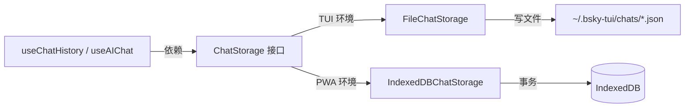

# 聊天记录存储方案

AI 对话需要持久化。用户关闭聊天界面后重新打开，之前的对话内容不应丢失。本项目为此定义了一套统一的 `ChatStorage` 接口，并提供了两套互斥的实现：TUI 用的 `FileChatStorage` 和 PWA 用的 `IndexedDBChatStorage`。



## 接口与数据结构

`ChatStorage` 定义在 `packages/app/src/services/chatStorage.ts`，包含四个异步方法：

| 方法 | 签名 | 语义 |
|------|------|------|
| `saveChat` | `(chat: ChatRecord) => Promise<void>` | 保存完整聊天记录（创建或覆盖） |
| `loadChat` | `(id: string) => Promise<ChatRecord \| null>` | 按 ID 加载单条记录，不存在返回 `null` |
| `listChats` | `() => Promise<ChatSummary[]>` | 列出所有聊天摘要（按 `updatedAt` 降序） |
| `deleteChat` | `(id: string) => Promise<void>` | 删除指定聊天记录 |

[来源](chatStorage.ts#L20-L24)

支撑两个数据结构：

**`ChatRecord`** — 完整的聊天记录，包含全部消息体：

```typescript
interface ChatRecord {
  id: string;
  title: string;
  contextUri?: string;                        // 关联帖子或资料的 AT URI
  context?: { type: 'post'; uri: string }     // 结构化上下文
          | { type: 'profile'; handle: string };
  messages: AIChatMessage[];                   // 消息序列
  createdAt: string;                           // ISO 时间戳
  updatedAt: string;
}
```

其中每条 `AIChatMessage` 携带 `role`（`user` / `assistant` / `tool_call` / `tool_result` / `thinking`）、`content` 字符串以及可选的 `toolName` 和 `isError` 标记。

[来源](chatStorage.ts#L2-L18)

**`ChatSummary`** — 列表场景的轻量摘要，不包含消息体：

```typescript
interface ChatSummary {
  id: string;
  title: string;
  messageCount: number;   // 仅计数 user + assistant 角色
  updatedAt: string;
}
```

[来源](chatStorage.ts#L19-L24)

## 两个实现，两个世界

### FileChatStorage：TUI 的本地文件方案

`FileChatStorage` 位于 `@bsky/app` 包中，默认将聊天记录写入 `~/.bsky-tui/chats/` 目录，每条记录一个独立的 JSON 文件（`{id}.json`）。

```typescript
constructor(dir?: string) {
  this.dir = dir ?? path.join(homedir(), '.bsky-tui', 'chats');
  if (!fs.existsSync(this.dir)) {
    fs.mkdirSync(this.dir, { recursive: true });
  }
}
```

[来源](chatStorage.ts#L28-L34)

核心特征：

- **同步文件操作**：`writeFileSync` / `readFileSync` / `readdirSync`。虽然方法签名是 `async`，但内部不涉及真正的异步 I/O——在 Node.js 环境下同步调用对 TUI 影响可以忽略。
- **按文件遍历**：`listChats` 通过 `readdirSync` 过滤 `.json` 后缀，逐文件读入、解析、提取摘要，最后按 `updatedAt` 排序。遇到损坏文件静默跳过。
- **无版本控制**：JSON 文件直接序列化，向前兼容依赖调用方保证字段一致性。

[来源](chatStorage.ts#L36-L79)

TUI 端通过 `getDefaultStorage()`（位于 `useChatHistory.ts`）以单例方式获取实例：`[来源](useChatHistory.ts#L7-L11)`。

### IndexedDBChatStorage：PWA 的浏览器方案

`IndexedDBChatStorage` 位于 `packages/pwa/src/services/indexeddb-chat-storage.ts`，完全运行在浏览器的 IndexedDB 之上。

**数据库初始化**：

```typescript
const DB_NAME = 'bsky-chats';
const DB_VERSION = 1;
const STORE_NAME = 'chats';
```

`openDB` 通过 `indexedDB.open` 连接，`onupgradeneeded` 钩子中创建 `chats` 对象仓库，以 `id` 为 keyPath。版本号 `1` 意味着首次访问时自动建库。

[来源](indexeddb-chat-storage.ts#L3-L16)

**异步事务模式**：

- `saveChat`、`deleteChat` 使用 `readwrite` 模式
- `loadChat`、`listChats` 使用 `readonly` 模式
- 每个方法都通过 `withStore` 获取对象仓库，再包装 `IDBRequest` 为 Promise

```typescript
async saveChat(chat: ChatRecord): Promise<void> {
  const store = await withStore('readwrite');
  return new Promise((resolve, reject) => {
    const req = store.put({ ...chat, updatedAt: chat.updatedAt ?? new Date().toISOString() });
    req.onsuccess = () => resolve();
    req.onerror = () => reject(req.error);
  });
}
```

[来源](indexeddb-chat-storage.ts#L30-L37)

**`listChats` 的 getAll 模式**：一次性通过 `store.getAll()` 取出全部记录，在内存中映射为 `ChatSummary[]` 并排序。聊天记录总量通常在几十到几百条，全量读取不会成为性能瓶颈。

[来源](indexeddb-chat-storage.ts#L44-L60)

PWA 的 `AIChatPage` 组件在 `useMemo` 中创建 `IndexedDBChatStorage` 实例并注入给 `useChatHistory`：`[来源](../../pwa/src/components/AIChatPage.tsx#L7-L24)`。

## 为什么需要两套？

根本原因是**运行环境的文件系统差异**。

| 维度 | FileChatStorage | IndexedDBChatStorage |
|------|----------------|---------------------|
| 运行环境 | Node.js（TUI） | 浏览器（PWA） |
| 存储介质 | 磁盘 JSON 文件 | 浏览器 IndexedDB |
| API 风格 | `fs` 同步方法（伪装 async） | 原生异步 Promise |
| 数据可见性 | 用户可直接查看 .json | 浏览器 DevTools > Application > IndexedDB |
| 并发安全 | 单进程无竞争 | 同域多 Tab 共享事务 |
| DB 版本升级 | 无版本概念 | `DB_VERSION` 递增 + `onupgradeneeded` |

TUI 在终端中运行，Node.js 的 `fs` 模块是天然选择。PWA 运行在浏览器沙箱中，JavaScript 无法访问本地文件系统，IndexedDB 是唯一的内置结构化存储方案。`useChatHistory` hook 接受可选的 `storage` 参数，TUI 传入默认的 `FileChatStorage`（通过 `getDefaultStorage()`），PWA 显式传入 `IndexedDBChatStorage`，两种运行时在接口层面完全解耦。

[来源](useChatHistory.ts#L23-L24)

## 消费方式：useChatHistory

`useChatHistory` 是 `@bsky/app` 导出的 React Hook，封装了 `ChatStorage` 的全部消费者路径：

```typescript
const { conversations, loading, loadConversation, saveConversation, deleteConversation, refresh } =
  useChatHistory(storage);
```

- `conversations`：`ChatSummary[]`，自动在 mount 时调用 `listChats`
- `saveConversation` / `deleteConversation` 执行后自动 `refresh`，保持列表同步
- `storage` 参数可选，未传入时使用 `FileChatStorage` 单例

[来源](useChatHistory.ts#L14-L42)

## 推荐阅读

- [AI 对话与智能助手](ai-对话与智能助手.md) — `useChatHistory` 的上层消费者，完整对话循环
- [@bsky/app 共享逻辑与 Hooks](bsky-app-共享逻辑与-hooks.md) — `useChatHistory` 所在包的架构设计
- [TUI 终端界面实现](tui-终端界面实现.md) — 文件存储方案的消费方
- [PWA 网页应用实现](pwa-网页应用实现.md) — IndexedDB 存储方案的消费方