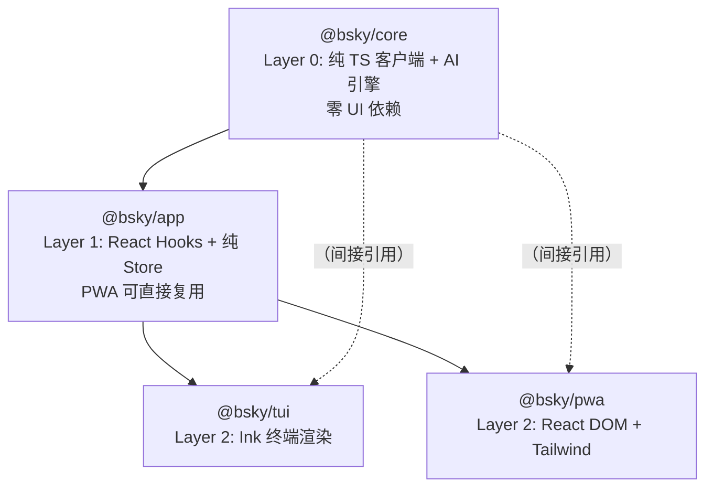

# 项目结构与包依赖

本项目采用 pnpm **Monorepo** 架构，将代码划分为四个职责清晰的包加上一个共享契约目录。这种分层的核心动机是：**让业务逻辑只存在一次（Business logic lives ONCE），让渲染层互换而不重复实现功能。**

## Workspace 拓扑

`pnpm-workspace.yaml` 声明了两个通配路径：

```yaml
packages:
  - 'packages/*'
  - 'contracts'
```

[来源](../pnpm-workspace.yaml#L1-L3)

所有包共享根目录的 `package.json`，其 `scripts.build` 定义为：

```json
"build": "pnpm -r build"
```

[来源](../package.json#L10-L12)

这会按依赖拓扑顺序递归构建各子包。`onlyBuiltDependencies` 配置了 `esbuild` 和 `sharp` 两个原生模块，允许其运行 postinstall 脚本。[来源](../package.json#L19-L21)

---

## 依赖流向：四层架构

整个项目形成一条清晰的单向依赖链：



### 各层职责

| 层 | 包名 | 关键依赖 | 产物 |
|---|------|---------|------|
| Layer 0 | `@bsky/core` | `ky`（HTTP），零 UI 依赖 | `BskyClient`、`AIAssistant`、31 个工具定义 |
| Layer 1 | `@bsky/app` | `@bsky/core`、`react` | 16 个 Hooks、状态 Store、i18n 系统 |
| Layer 2 (TUI) | `@bsky/tui` | `@bsky/app`、`ink` | 终端交互式客户端 |
| Layer 2 (PWA) | `@bsky/pwa` | `@bsky/app`、`react-dom`、`vite` | 浏览器渐进式网页应用 |

[来源](../docs/ARCHITECTURE.md#L7-L38)

---

## 核心原则：Business logic lives ONCE

这是整个架构的最关键决策。`@bsky/core` 和 `@bsky/app` 共同承载**所有业务逻辑**，而 `@bsky/tui` 和 `@bsky/pwa` 是**纯渲染层**。

具体体现为：

1. **AT Protocol 客户端**在 core 中实现：`BskyClient` 封装了登录、JWT 自动刷新、Feed 获取、发帖、点赞等全部 API 操作。[来源](../packages/core/src/index.ts#L3-L4)

2. **AI 引擎**在 core 中实现：`AIAssistant` 管理多轮对话、工具调用循环、写操作确认门控。[来源](../packages/core/src/index.ts#L20-L21)

3. **所有 React Hooks** 在 app 中定义：`useAuth`、`useTimeline`、`useThread`、`useAIChat`、`useTranslation`、`useBookmarks` 等 16 个 Hooks，覆盖全部功能领域。[来源](../packages/app/src/index.ts#L1-L39)

4. **状态管理**在 app 中定义：纯 Store 模式（`navigation`、`feedConfig`、`viewStateStore`），无全局 React Context，渲染层只需导入 Hooks。[来源](../packages/app/src/index.ts#L1-L2)

5. **用户界面专属逻辑仅在对应包**：TUI 有 CJK 文本宽度计算（`visualWidth`、`wrapLines`）和 ANSI 鼠标追踪；PWA 有 IndexedDB 聊天记录存储、Vite 构建配置和 Node 模块的浏览器 stub。[来源](../docs/ARCHITECTURE.md#L44-L53)

> 这也意味着，当你需要添加一个新功能（如"获取点赞列表"）时，**你只需要在 core 中新增 API 方法，在 app 中新增 Hook**，两个渲染层自动获得该功能，无需重复实现。

---

## TSConfig 继承关系

所有包共享一条继承链，但各有差异点：

```
tsconfig.base.json          ← 根共享配置
├── @bsky/core/tsconfig.json
├── @bsky/app/tsconfig.json
├── @bsky/tui/tsconfig.json
└── @bsky/pwa/tsconfig.json  ← 不继承 base，独立配置
```

### tsconfig.base.json 关键设置

```json
{
  "compilerOptions": {
    "target": "ES2022",
    "module": "ESNext",
    "moduleResolution": "bundler",
    "strict": true,
    "declaration": true,
    "declarationMap": true,
    "sourceMap": true
  }
}
```

[来源](../tsconfig.base.json#L3-L18)

### 各包差异

| 包 | 继承 base | JSX | 额外 types | 特殊配置 |
|---|-----------|-----|-----------|---------|
| `@bsky/core` | 是 | 无 | `["node"]` | `composite: true`，支持项目引用 |
| `@bsky/app` | 是 | 无 | `["node"]` | `composite: true` |
| `@bsky/tui` | 是 | `"react-jsx"` | 无 | 无 composite |
| `@bsky/pwa` | **否**（独立） | `"react-jsx"` | `["vite/client"]` | `lib` 含 `DOM`、`DOM.Iterable`；`references` 指向 core + app |

[来源](../packages/core/tsconfig.json#L1-L13) [来源](../packages/app/tsconfig.json#L1-L13) [来源](../packages/tui/tsconfig.json#L1-L12) [来源](../packages/pwa/tsconfig.json#L1-L19)

PWA 的 tsconfig 独立于 base，是因为它运行在浏览器环境，需要 `DOM` 类型定义，且通过 Vite 打包（使用 `bundler` module resolution），而不直接使用 tsc 输出。它的 `references` 字段指向 core 和 app 的 composite 构建，确保类型检查时能解析依赖包的类型声明。

---

## 构建策略

### 层级构建流

执行 `pnpm build`（等价于 `pnpm -r build`）时，pnpm 根据 workspace 依赖关系自动确定构建顺序：

1. **`@bsky/core`** — 执行 `tsc`，输出到 `dist/`
2. **`@bsky/app`** — 执行 `tsc`，输出到 `dist/`（依赖 core 的声明文件）
3. **`@bsky/tui`** — 执行 `tsc`，输出到 `dist/`
4. **`@bsky/pwa`** — 执行 `tsc -b && vite build`：先类型检查（`-b` 基于 references），再用 Vite 打包为静态资源

[来源](../packages/core/package.json#L9) [来源](../packages/app/package.json#L9) [来源](../packages/tui/package.json#L9) [来源](../packages/pwa/package.json#L7)

### PWA 构建的特殊性

PWA 的 build 脚本是 `tsc -b && vite build`。`tsc -b` 利用 project references 对 core 和 app 做增量类型检查，确保类型安全；随后 `vite build` 使用 [Vite 配置](../packages/pwa/vite.config.ts) 中的别名（`os`、`fs`、`path` → 浏览器 stub）将 React 组件打包为可在静态服务器部署的 HTML + JS + CSS。[来源](../packages/pwa/vite.config.ts#L1-L19)

---

## contracts 目录：共享契约

`contracts/` 是一个不产生构建产物的数据包，其 `package.json` 只声明元信息。[来源](../contracts/package.json#L1-L4)

### system_prompts.md

该文件集中存放所有 AI 系统提示词，是"提示词工程"的单一声明源。包含六个提示片段：

- **Main Assistant System Prompt**：设定 AI 助手的角色定位（深度集成 Bluesky 的终端助手）
- **Translation System Prompt**：翻译任务的系统提示
- **Draft Polish System Prompt**：帖子草稿润色指令
- **Guiding Questions Generation Prompt**：生成引导性问题的提示，包含 `{post_uri}` 占位符
- **Thread Analysis Prompt**：讨论串分析摘要的提示，包含 `{thread_text}` 占位符
- **Write Confirmation Flow Prompt**：描述写操作确认流程的元提示

[来源](../contracts/system_prompts.md#L1-L29)

这些提示在 `@bsky/core` 的 [`prompts.ts`](../../packages/core/src/ai/prompts.ts) 中被引用和分片组装。详细机制见 [提示词工程与系统提示](提示词工程与系统提示.md)。

### tools.json

包含 31 个工具的函数式定义，每个工具包含：

- `name` — 唯一标识符，如 `resolve_handle`、`get_timeline`、`create_post`
- `description` — LLM 理解的语义描述
- `inputSchema` — JSON Schema 格式的参数声明
- `endpoint` — 对应的 AT Protocol API 端点或复合操作描述
- `readonly` — `true`（只读查询）或 `false`（写操作，需用户确认）

[来源](../contracts/tools.json#L1-L305)

所有写操作（`create_post`、`like`、`repost`、`follow`、`upload_blob`）的 `readonly` 均为 `false`，触发 [AI 助手与工具调用系统](ai-助手与工具调用系统.md) 中的确认门控流程。

---

## 总结：架构全景

```
┌──────────────────────────────────────────────────────────┐
│                     contracts/                           │
│          system_prompts.md   tools.json                  │
│          （共享契约：提示词 + 工具定义）                    │
└──────────────────────────────────────────────────────────┘
                           ↓ 引用
┌──────────────────────────────────────────────────────────┐
│  @bsky/core    纯 TS, 零 UI 依赖                         │
│  BskyClient | AIAssistant | 31 tools | 类型定义          │
│  构建: tsc                                                │
└──────────────────────┬───────────────────────────────────┘
                       ↓ npm dependency
┌──────────────────────────────────────────────────────────┐
│  @bsky/app       React Hooks + 纯 Store                  │
│  useAuth | useTimeline | useThread | useAIChat | ...     │
│  构建: tsc                                                │
└──────────────┬───────────────────────────┬───────────────┘
               ↓                           ↓
┌──────────────────────────┐  ┌─────────────────────────────┐
│  @bsky/tui               │  │  @bsky/pwa                  │
│  Ink 终端渲染             │  │  React DOM + Tailwind CSS  │
│  构建: tsc               │  │  构建: tsc -b && vite build │
│  专属: CJK 文本工具        │  │  专属: IndexedDB, Vite     │
└──────────────────────────┘  └─────────────────────────────┘
```

---

## 下一步

- 深入 [@bsky/core 核心层设计](bsky-core-核心层设计.md) — 了解 AT Protocol 客户端和 AI 引擎的内部设计
- 查看 [@bsky/app 共享逻辑与 Hooks](bsky-app-共享逻辑与-hooks.md) — 了解 16 个 Hooks 和纯 Store 模式
- 对比两种渲染层的实现差异：[TUI 终端界面实现](tui-终端界面实现.md) vs [PWA 网页应用实现](pwa-网页应用实现.md)
- 了解 [提示词工程与系统提示](提示词工程与系统提示.md) 如何将 `contracts/system_prompts.md` 中的提示分片组装为完整上下文