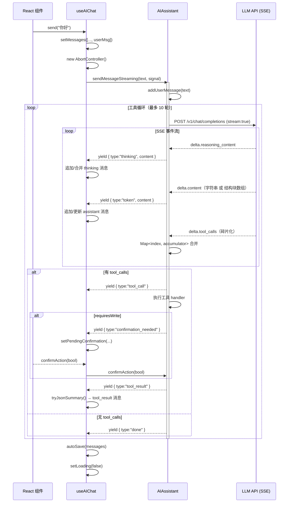

至此我已掌握全部信息。以下是为 Wiki 编写的内容：

# AI 对话与流式输出

从用户按下发送到屏幕上逐字出现 AI 回复，数据穿过两个包、跨越四层抽象。这条路径的每一跳都有其设计意图：`useAIChat` 负责 React 渲染周期的同步，`AIAssistant.sendMessageStreaming` 负责与 LLM API 的通信与工具调度，而 `AsyncGenerator` 的 yield 类型系统则是两者之间的契约。本文将自顶向下追踪这条完整链路。

[来源](packages/app/src/hooks/useAIChat.ts) · [来源](packages/core/src/ai/assistant.ts)

---

## 一、调用链条总览



整个链条的起点是 `useAIChat` 暴露的 `send(text)` 函数，终点是 `messages` 状态数组中新增的渲染就绪消息。中间经过 `AIAssistant` 的流式生成循环，每一轮循环可能在 LLM 和多个工具 handler 之间来回多次。

[来源](packages/app/src/hooks/useAIChat.ts#L106-L155) · [来源](packages/core/src/ai/assistant.ts#L382-L430)

---

## 二、Hook 层入口：send 函数

### 2.1 函数签名与初始化

```typescript
function useAIChat(
  client: BskyClient | null,
  aiConfig: AIConfig,
  contextUri?: string,
  options?: UseAIChatOptions,
)
```

`useAIChat` 在初始化时创建一个 `AIAssistant` 实例，并通过 `useEffect` 保持配置、工具和系统提示的同步：

```typescript
const [assistant] = useState(() => new AIAssistant(aiConfig));

useEffect(() => {
  assistant.updateConfig(aiConfig);
}, [aiConfig, assistant]);

useEffect(() => {
  if (!client) return;
  const tools = createTools(client);
  assistant.setTools(tools);
  // ... 设置系统提示 ...
}, [client, assistant]);
```

这种设计使 `AIAssistant` 成为**有状态的长生命周期对象**——它维护消息历史、工具注册表、待确认 Promise 和待注入图片，跨多次 `send` 调用持久存在。

[来源](packages/app/src/hooks/useAIChat.ts#L47-L80)

### 2.2 两种路径的选择

`send` 内部根据 `options.stream` 分支：

- **`stream: true`**（PWA 默认）：使用 `for await...of` 消费 `AsyncGenerator`，逐事件更新 `messages` 状态
- **`stream: false`**（TUI 默认）：使用 `await assistant.sendMessage(text)`，获得完整结果后一次性展平 `intermediateSteps`

```typescript
const send = useCallback(async (text: string) => {
  // ... 添加 user 消息，设 loading ...

  if (options?.stream) {
    // 流式路径
    const stream = assistant.sendMessageStreaming(text, ctrl.signal);
    for await (const event of stream) {
      // 按 event.type 分发
    }
  } else {
    // 非流式路径
    const result = await assistant.sendMessage(text);
    // 展平 result.intermediateSteps
  }
}, [assistant, autoSave, options?.stream]);
```

[来源](packages/app/src/hooks/useAIChat.ts#L106-L193)

### 2.3 流式路径的事件分发器

`for await...of` 循环内部是一个基于 `event.type` 的分发器，维护一个局部的 `streamingContent` 累加器。这是 React 状态管理与异步生成器之间的**适配层**：

```typescript
let streamingContent = '';

for await (const event of stream) {
  if ((event as any).type === 'confirmation_needed') {
    setPendingConfirmation({ toolName, description: event.content });
    continue;
  }
  if (event.type === 'tool_call') {
    streamingContent = '';  // 重置，准备下一轮 assistant 响应
    setMessages(prev => [...prev, { role: 'tool_call', content, toolName }]);
  } else if (event.type === 'tool_result') {
    const summary = tryJsonSummary(event.content);
    setMessages(prev => [...prev, { role: 'tool_result', content: summary, toolName }]);
  } else if (event.type === 'thinking') {
    // 增量合并：最后一条是 thinking 就追加，否则新建
    setMessages(prev => {
      const last = prev[prev.length - 1];
      if (last?.role === 'thinking') {
        const updated = [...prev];
        updated[updated.length - 1] = { role: 'thinking', content: last.content + event.content };
        return updated;
      }
      return [...prev, { role: 'thinking', content: event.content }];
    });
  } else if (event.type === 'token') {
    streamingContent += event.content;
    setMessages(prev => {
      const last = prev[prev.length - 1];
      if (last?.role === 'assistant') {
        const updated = [...prev];
        updated[updated.length - 1] = { ...last, content: streamingContent };
        return updated;
      }
      return [...prev, { role: 'assistant', content: streamingContent }];
    });
  } // done: 不需要额外处理，token 已更新
}
```

每个 `setMessages` 调用都触发 React 重渲染，使 `token` 和 `thinking` 事件实现打字机效果。`streamingContent` 作为局部变量跨多次渲染存活，确保即使 React 批量更新也不丢失已累积的文本。

[来源](packages/app/src/hooks/useAIChat.ts#L108-L155)

### 2.4 tryJsonSummary：工具结果的智能压缩

工具 handler 返回的原始 JSON 可能很大（如 `get_timeline` 返回完整帖子列表），直接展示会撑爆消息列表。`tryJsonSummary` 使用一组启发式规则识别常见响应模式并压缩为自然语言摘要：

| 原始 JSON 特征 | 压缩结果 |
|---|---|
| `{ posts: [...], total: 30 }` | `搜索到 30 个帖子` |
| `{ feed: [...] }` | `获取了 20 条时间线` |
| `{ thread: "..." }` | 保留前 800 字符 |
| `{ did: "...", handle: "alice" }` | `用户: @alice (Alice)` |
| `{ text: "..." }` | `帖子: {text前300字}` |
| 其余情况 | 截断至 500 字符 |

无法解析 JSON 时回退到原始文本截断。这种设计在**信息完整度**和**阅读体验**之间取得了平衡。

[来源](packages/app/src/hooks/useAIChat.ts#L287-L302)

---

## 三、AsyncGenerator Yield 类型系统

`sendMessageStreaming` 的返回类型定义了流式事件的 6 元枚举（含一个类型逃逸）：

```typescript
async *sendMessageStreaming(
  content: string,
  signal?: AbortSignal
): AsyncGenerator<{
  type: 'tool_call' | 'tool_result' | 'token' | 'done' | 'thinking';
  content: string;
  toolName?: string;
}>
```

加上通过 `(event as any).type === 'confirmation_needed'` 逃逸的隐式第六种，完整的事件表如下：

| 事件 | 触发时机 | content | toolName | 消费方行为 |
|---|---|---|---|---|
| `thinking` | 收到 `delta.reasoning_content` 或 Mistral 结构块中的 thinking 块 | 推理文本片段 | — | 合并到最后一条 `thinking` 消息 |
| `token` | 收到 `delta.content`（字符串或结构块中的 text 块） | 输出文本片段 | — | 追加到最后一条 `assistant` 消息 |
| `tool_call` | 一轮流结束后 `toolCallAccum.size > 0` | `函数名(参数JSON)` | 工具名 | 插入 `tool_call` 气泡，重置 `streamingContent` |
| `tool_result` | 单个工具 handler 执行完成 | 执行结果（原始或有 `tryJsonSummary` 压缩） | 工具名 | 插入 `tool_result` 气泡 |
| `confirmation_needed` | 写操作工具执行前 **（类型逃逸）** | 工具描述文本 | 工具名 | 设置 `pendingConfirmation` 状态，挂起流消费 |
| `done` | 一轮流结束且无 tool_calls，或流中断 | 完整文本内容（或 `[已暂停]`） | — | 触发自动保存，设 `loading=false` |

**设计要点**：`confirmation_needed` 在 TypeScript 类型中没有声明，而是在运行时通过 `(event as any).type` 检测。这是一个刻意的类型逃逸，因为 `AIAssistant` 不应假设消费方一定有 UI 交互能力（TUI 和 PWA 的处理方式不同）。非流式路径 (`sendMessage`) 则直接使用 Promise 阻塞，类型更安全但灵活性更低。

[来源](packages/core/src/ai/assistant.ts#L412-L416) · [来源](packages/core/src/ai/assistant.ts#L532-L538)

---

## 四、SSE 解析器：手动逐行解析

### 4.1 解析管道

`sendMessageStreaming` 内部使用 `fetch` 的 `ReadableStream` 接收 SSE 数据，解析逻辑是一个手写的按行解析器：

```
原始字节流 → TextDecoder(stream:true) → line.split('\n') → data: 前缀过滤 → JSON.parse → delta 提取
```

```typescript
const reader = res.body!.getReader();
const decoder = new TextDecoder();

while (true) {
  const { done, value } = await reader.read();
  if (done) break;
  const text = decoder.decode(value, { stream: true });
  const lines = text.split('\n');

  for (const line of lines) {
    if (!line.startsWith('data: ')) continue;   // ← 只处理 data: 前缀行
    const data = line.slice(6);                  // ← 去掉 'data: ' 前缀
    if (data === '[DONE]') continue;             // ← SSE 流终止标记

    try {
      const chunk = JSON.parse(data);
      const delta = chunk.choices?.[0]?.delta;
      if (!delta) continue;
      // ... 提取 delta.reasoning_content, delta.content, delta.tool_calls
    } catch {
      /* 静默跳过无法解析的 chunk */           // ← 容错：单帧异常不破坏流
    }
  }
}
```

[来源](packages/core/src/ai/assistant.ts#L441-L488)

### 4.2 四个关键设计决策

1. **`TextDecoder(stream:true)`**：防止多字节字符（如中文、Emoji）在跨 chunk 边界时被截断。UTF-8 编码中一个中文字符占 3 字节，如果 chunk 边界恰好在字符中间，`stream:true` 会保留不完整字节等待下一帧补齐。

2. **逐行过滤**：SSE 协议允许空行和其他事件类型行（如 `event:`、`retry:`），系统只关注 `data: ` 前缀行。

3. **`[DONE]` 跳过**：OpenAI 兼容 API 的标准流终止标记，跳过以避免触发 `JSON.parse` 报错。

4. **静默容错**：`try { JSON.parse } catch { /* skip */ }` 处理 API 可能发送的非 JSON 行（如代理中间件插入的调试信息），保证单帧异常不破坏整个流。

### 4.3 与浏览器原生 EventSource 的对比

项目选择手动解析而非使用 `EventSource` 或 `eventsource-parser` 库，原因有三：

| 因素 | 手动解析 | EventSource | eventsource-parser |
|---|---|---|---|
| 请求方法 | POST（自定义 body） | GET only | 需要配合 fetch |
| AbortSignal | 原生支持 | 不支持 | 需额外处理 |
| Header 控制 | 完全控制 | 无法自定义 | 需配合 fetch |
| 包体积 | 零依赖 | 需 polyfill | ~2KB |

因为 LLM API 的 `/v1/chat/completions` 端点是 **POST** 请求（需要携带 API Key 和工具定义），且需要 `AbortSignal` 中断支持，手动解析是最轻量且可控的方案。

[来源](packages/core/src/ai/assistant.ts#L421-L430)

---

## 五、Thinking 双流合并与结构化内容

### 5.1 双轨累加器

系统在 SSE 解析循环中维护两个独立的累加器：

```typescript
let fullContent = '';
let reasoningContent = '';
```

`fullContent` 只累积 `delta.content`（LLM 的可见输出），`reasoningContent` 只累积 `delta.reasoning_content`（LLM 的推理过程）。每一帧到达时，两路数据分别 yield 为独立的 `token` 和 `thinking` 事件，互不干扰。

### 5.2 reasoning_content（DeepSeek 模式）

DeepSeek R1 系列在 SSE 流中发送非标准的 `delta.reasoning_content` 字段。解析器直接提取并 yield：

```typescript
if (delta.reasoning_content) {
  reasoningContent += delta.reasoning_content;
  yield { type: 'thinking', content: delta.reasoning_content as string };
}
```

一轮流结束后，`reasoningContent` 会被写入消息历史的 `ChatMessage.reasoning_content` 字段，随对话持久化，供后续消费方读取。

### 5.3 structured_content（Mistral 模式）

Mistral 的推理模型使用另一种格式：`delta.content` 本身是**结构块数组**（Array of ContentBlock），而非纯字符串。每个块有 `type` 字段区分是 `thinking` 还是 `text`：

```typescript
if (Array.isArray(delta.content)) {
  for (const block of delta.content) {
    if (block.type === 'thinking' && block.thinking) {
      // Mistral 的 thinking 块内可能嵌套 text 子块
      for (const t of block.thinking) {
        if (t.type === 'text' && t.text) {
          reasoningContent += t.text;
          yield { type: 'thinking', content: t.text };
        }
      }
    } else if (block.type === 'text' && block.text) {
      fullContent += block.text;
      yield { type: 'token', content: block.text };
    }
  }
}
```

这使系统能同时支持两种主流的推理内容编码方式，对消费方透明——无论源头是 DeepSeek 还是 Mistral，UI 层得到的都是统一的 `{ type: 'thinking' | 'token' }` 事件。

### 5.4 消息回放的兼容性处理

`_buildMessages()` 中有一个重要的兼容性转换：对于 `reasoningStyle !== 'reasoning_content'` 的供应商（如 Mistral），将历史消息中的 `reasoning_content` 合并到 `content` 字段中作为思考前言，然后删除 `reasoning_content` 字段，避免 API 报 `extra_forbidden` 错误：

```typescript
if (this.config.reasoningStyle !== 'reasoning_content') {
  msgs = msgs.map(m => {
    const rc = (m as any).reasoning_content as string | undefined;
    if (!rc || m.role !== 'assistant') return m;
    const { reasoning_content: _, ...rest } = m as any;
    const prefix = `【上一步思考过程】\n${rc}\n\n`;
    if (typeof rest.content === 'string') {
      rest.content = prefix + rest.content;
    }
    return rest;
  });
}
```

[来源](packages/core/src/ai/assistant.ts#L316-L323) · [来源](packages/core/src/ai/assistant.ts#L460-L470) · [来源](packages/core/src/ai/assistant.ts#L505-L515)

---

## 六、AbortSignal 三段式中断

中断机制是流式系统最精细的设计之一，覆盖三个不同阶段的取消场景。

### 6.1 Hook 层的触发

用户在 UI 上点击"停止"按钮，调用 `useAIChat` 暴露的 `stop()` 函数：

```typescript
const stop = useCallback(() => {
  abortRef.current?.abort();
}, []);
```

`abortRef` 是一个 `useRef<AbortController | null>`，在每次 `send` 调用开始时创建：

```typescript
const ctrl = new AbortController();
abortRef.current = ctrl;
```

在 `finally` 块中清空引用：

```typescript
finally {
  setLoading(false);
  abortRef.current = null;
}
```

[来源](packages/app/src/hooks/useAIChat.ts#L101-L104) · [来源](packages/app/src/hooks/useAIChat.ts#L189-L194)

### 6.2 Core 层的三段式防御

`AIAssistant.sendMessageStreaming` 在三个位置响应中断：

**阶段 1 — HTTP 请求发起前/中**：

```typescript
res = await fetch(url, {
  signal,  // AbortSignal 传入 fetch
});
// fetch 抛出 AbortError 时捕获
catch (e) {
  if (signal?.aborted) {
    yield { type: 'done', content: '\n\n[已暂停]' };
    return;
  }
  throw e;
}
```

此时没有任何内容被消费，`content` 使用 `[已暂停]` 标记。

**阶段 2 — SSE 流循环检测**：

```typescript
while (true) {
  if (signal?.aborted) {
    yield { type: 'done', content: '\n\n[已暂停]' };
    break;
  }
  const { done, value } = await reader.read();
  // ...
}
```

在每轮迭代开始前检查 `signal.aborted`。如果上一轮刚消费了部分数据但未 yield，这些数据可能丢失。这也是使用 `[已暂停]` 的原因——因为 `fullContent` 可能未及时更新。

**阶段 3 — reader.read() 挂起中**：

```typescript
try {
  while (true) { ... }
} catch (_err) {
  if (signal?.aborted) {
    yield { type: 'done', content: fullContent };  // 保留已累积内容
    return;
  }
  throw _err;
}
```

`reader.read()` 本身是异步挂起的，可能被中断信号中断。此时 `fullContent` 已累积了之前收到的所有 token，中断时以 `fullContent` 作为最终内容 yield，不丢失已收到的数据。

| 中断阶段 | content 值 | 语义 |
|---|---|---|
| HTTP 请求中 | `\n\n[已暂停]` | 无任何可见内容 |
| 流循环检测 | `\n\n[已暂停]` | 本轮尚未读取新数据 |
| reader.read 挂起中 | `fullContent` | 部分内容已展示 |

[来源](packages/core/src/ai/assistant.ts#L431-L436) · [来源](packages/core/src/ai/assistant.ts#L445-L449) · [来源](packages/core/src/ai/assistant.ts#L480-L487)

---

## 七、编辑消息：editByIndex

`useAIChat` 提供了三个与消息编辑相关的函数：`editByIndex`、`edit` 和 `undoLastMessage`。其中最核心的是 `editByIndex`。

### 7.1 工作机制

```typescript
const editByIndex = useCallback((n: number): string | null => {
  const allMsgs = assistant.getMessages();
  let count = 0;
  for (let i = 0; i < allMsgs.length; i++) {
    if (allMsgs[i]!.role === 'user') {
      if (count === n) {
        const userContent = contentToString(allMsgs[i]!.content);
        const keep = allMsgs.slice(0, i);
        assistant.loadMessages(keep);
        setMessages(mapMessages(keep));
        return userContent;
      }
      count++;
    }
  }
  return null;
}, [assistant, mapMessages]);
```

算法逻辑：

1. 遍历 `assistant.getMessages()` 中的所有消息
2. 统计 `role === 'user'` 的消息，找到第 `n` 条（0-indexed）
3. 提取该条用户消息的文本内容（通过 `contentToString` 处理 `string | ContentBlock[]` 两种格式）
4. 截断该索引之前的所有消息作为新的消息历史
5. `assistant.loadMessages(keep)` 重置 AI 的内部状态
6. `setMessages(mapMessages(keep))` 更新 UI
7. 返回用户文本，供 UI 预填到输入框

关键语义：**编辑不是覆盖，而是截断**。AI 不会看到被编辑位置之后的所有消息（包括它自己的回复和工具结果），相当于"回到过去，重新出发"。

### 7.2 mapMessages 的适配转换

`mapMessages` 将 `AIAssistant` 的内部 `ChatMessage[]` 转换为 `AIChatMessage[]` 供 UI 渲染：

```typescript
const mapMessages = useCallback((msgs: ChatMessage[]): AIChatMessage[] => {
  return msgs
    .filter(m => m.role !== 'system')
    .map(m => ({
      role: (m.role === 'tool' ? 'tool_result' : m.role) as AIChatMessage['role'],
      content: contentToString(m.content),
    }));
}, []);
```

```typescript
function contentToString(c: string | unknown): string {
  if (typeof c === 'string') return c;
  if (Array.isArray(c)) {
    return c.map((b: { type?: string; text?: string }) => b.text ?? '').join('');
  }
  return String(c ?? '');
}
```

`contentToString` 处理 `ContentBlock[]` 格式（视觉模式注入图片后的消息格式），提取所有 `text` 块拼接为纯文本。

### 7.3 edit 与 undoLastMessage

`edit` 是 `editByIndex` 的便捷封装，用于编辑最后一条用户消息：

```typescript
const edit = useCallback((): string | null => {
  const allMsgs = assistant.getMessages();
  let lastUserIdx = -1;
  for (let i = allMsgs.length - 1; i >= 0; i--) {
    if (allMsgs[i]!.role === 'user') { lastUserIdx = i; break; }
  }
  if (lastUserIdx < 0) return null;
  return editByIndex(lastUserIdx);
}, [assistant, editByIndex]);
```

`undoLastMessage` 则是回退到倒数第二条用户消息之前——相当于撤回整轮对话（用户消息 + AI 回复 + 工具调用），回到上一轮交互开始前的状态：

```typescript
const undoLastMessage = useCallback(() => {
  const allMsgs = assistant.getMessages();
  let lastUserIdx = -1;
  for (let i = allMsgs.length - 1; i >= 0; i--) {
    if (allMsgs[i]!.role === 'user') { lastUserIdx = i; break; }
  }
  if (lastUserIdx < 0) return;
  const keep = allMsgs.slice(0, lastUserIdx);
  assistant.loadMessages(keep);
  setMessages(mapMessages(keep));
}, [assistant, mapMessages]);
```

三者关系：`undoLastMessage` = 回退到倒数第一条 user 消息之前；`edit` = 回退到最后一条 user 消息之处并预填文本；`editByIndex(n)` = 回退到第 n 条 user 消息之处并预填文本。

[来源](packages/app/src/hooks/useAIChat.ts#L235-L280)

---

## 八、数据流中涉及的关键函数汇总

| 函数/字段 | 位置 | 作用 |
|---|---|---|
| `send()` | `useAIChat.ts` | 入口，分支到流式/非流式路径 |
| `sendMessageStreaming()` | `assistant.ts` | AsyncGenerator，执行 SSE 解析 + 工具循环 |
| `_buildMessages()` | `assistant.ts` | 注入待处理图片，处理 reasoning_content 兼容性 |
| `tryJsonSummary()` | `useAIChat.ts` | 压缩工具返回的 JSON 为自然语言 |
| `contentToString()` | `useAIChat.ts` | 将 `ContentBlock[]` 格式转为纯文本 |
| `editByIndex()` | `useAIChat.ts` | 截断消息历史 + 返回预填文本 |
| `mapMessages()` | `useAIChat.ts` | 转换 `ChatMessage[]` 为 `AIChatMessage[]` |
| `autoSave()` | `useAIChat.ts` | 每次消息变更后持久化到 ChatStorage |
| `cleanBaseUrl()` | `providers.ts` | 规范化 API base URL，去除多余路径后缀 |
| `shouldSendThinkingParam()` | `providers.ts` | 判断供应商是否支持 thinking 参数（仅 DeepSeek） |
| `_waitForConfirmation()` | `assistant.ts` | Promise 门控，阻塞写操作直到用户确认 |

[来源](packages/core/src/ai/providers.ts#L45-L48) · [来源](packages/core/src/ai/providers.ts#L62-L64)

---

## 推荐阅读

- [流式输出与思考模式](流式输出与思考模式.md) — SSE 底层解析、Thinking 渲染和流式中断的详实现细节（本文的平行伙伴篇）
- [AI 助手与工具调用系统](ai-助手与工具调用系统.md) — `AIAssistant` 的完整设计、31 个工具定义和写操作确认门控
- [@bsky/app 共享逻辑与 Hooks](bsky-app-共享逻辑与-hooks.md) — `useAIChat` 在 19 个 Hook 体系中的位置与协作
- [提示词工程与系统提示](提示词工程与系统提示.md) — `buildSystemPrompt` 中使用的 8 个提示碎片
- [聊天记录存储方案](聊天记录存储方案.md) — `autoSave` 的持久化后端与 `ChatStorage` 接口定义
- [多模型供应商与 Provider 系统](多模型供应商与-provider-系统.md) — `reasoningStyle` 配置与供应商注册机制