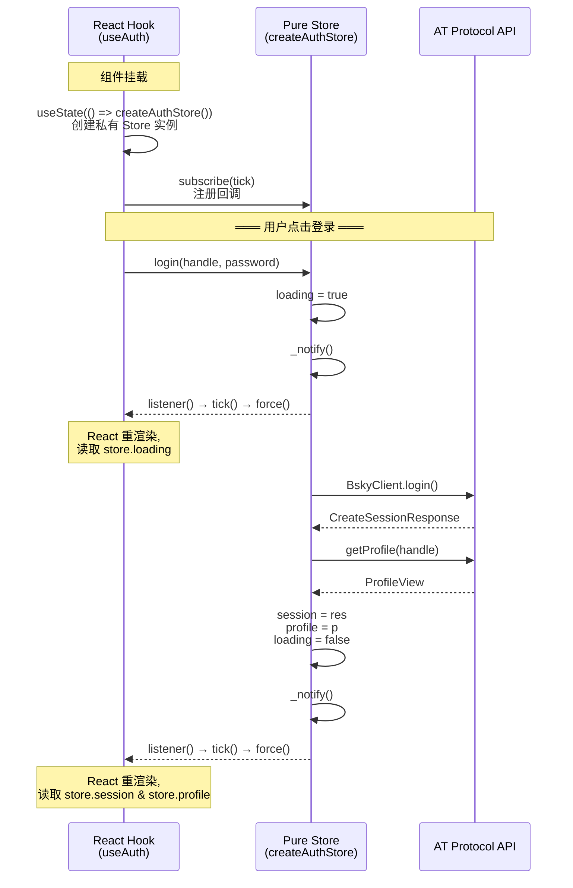

Now I have all the data needed. Let me compose the Wiki page.

---

# @bsky/app：React Hooks 层

整个 `@bsky/app` 包的 20+ 个 React Hook 是 TUI 和 PWA 两端唯一的共享数据入口。它们不依赖任何渲染库，只通过 **纯对象 Store** + **`useState` 驱动重渲染** 的模式将状态同步到 React 生命周期。所有 Hook 的导出统一在 [`packages/app/src/index.ts`](packages/app/src/index.ts) 中声明，实现位于 `packages/app/src/hooks/` 目录下。

---

## 全景：Hook 速查表

下表覆盖了所有公开导出的 Hook，涵盖其输入、输出和底层 Store 依赖：

| Hook | 核心输入 | 返回值 | 底层 Store |
|---|---|---|---|
| `useAuth` | 无（单例级） | `{ client, session, profile, loading, error, login, restoreSession }` | `createAuthStore()` |
| `useTimeline` | `client, feedUri?` | `{ posts, loading, cursor, error, loadMore, refresh }` | `createTimelineStore()` |
| `usePostDetail` | `client, uri, goTo, aiKey, aiBaseUrl, targetLang?` | `{ post, flatThread, loading, translations, translate, actions }` | `createPostDetailStore()` |
| `useNavigation` | 无 | `{ currentView, canGoBack, goTo, goBack, goHome }` | `createNavigation()` |
| `useThread` | `client, uri` | `{ flatLines, loading, error, focusedIndex, focused, themeUri, likePost, repostPost, expandReplies, isLiked, isReposted }` | 内联 state |
| `useCompose` | `client` | `{ draft, setDraft, submitting, error, replyTo, setReplyTo, quoteUri, setQuoteUri, submit }` | 内联 state |
| `useAIChat` | `client, aiConfig, contextUri?, options?` | `{ messages, loading, guidingQuestions, send, stop, addUserImage, chatId, pendingConfirmation, confirmAction, rejectAction, edit, editByIndex }` | `AIAssistant` 实例 |
| `useDrafts` | 无 | `{ drafts, saveDraft, deleteDraft, loadDraft }` | `createDraftsStore()` |
| `useI18n` | 无 | `{ t, locale, setLocale, availableLocales, localeLabels }` | `getI18nStore()`（单例） |
| `useChatHistory` | `storage?, onChatSaved?` | `{ conversations, loading, loadConversation, saveConversation, deleteConversation, refresh }` | 内联 state |
| `useTranslation` | `aiKey, aiBaseUrl, aiModel?, targetLang?, initialMode?` | `{ translate, loading, cache, lang, setLang, mode, setMode, LANG_LABELS }` | 内联 state + 内联 cache |
| `useProfile` | `client, actor` | `{ profile, loading, error, tab, setTab, posts, feedCursor, feedLoading, loadMoreFeed, isFollowing, handleFollow, handleUnfollow, followList, ... }` | 内联 state |
| `useSearch` | `client` | `{ query, tab, results, posts, users, feeds, loading, search, setTab }` | 内联 state |
| `useNotifications` | `client` | `{ notifications, loading, unreadCount, refresh }` | 内联 state |
| `useBookmarks` | `client` | `{ bookmarks, loading, isBookmarked, addBookmark, removeBookmark, toggleBookmark, refresh }` | 内联 state |
| `useActiveFeed` | 无 | `{ getLastFeedUri, setLastFeedUri }` | 模块级 ref |
| `usePostActions` | `client` | `{ isPostLiked, isPostReposted, getLikeCount, getRepostCount, likePost, repostPost, seedPostViewers }` | 模块级 Sets/Maps |
| `useScrollRestore` | `key` | `{ saveScrollTop, getScrollTop }` | 模块级 Map |

[来源](packages/app/src/index.ts) · [来源](docs/HOOKS.md)

---

## Store Subscribe 模式：零 React 依赖的纯对象 Store

这是整个共享逻辑层的核心架构决策。Store 是**纯 JavaScript 对象**，不依赖 React、不调用 `useState`、不触发任何渲染。Hook 作为适配器，将 Store 的变化桥接到 React 的渲染周期。

### 协议定义

每个通过 `createXxxStore()` 创建的 Store 都遵循同一套接口：

```typescript
interface Store {
  // 响应式数据字段
  data: T | null;
  loading: boolean;
  error: string | null;

  // 订阅协议（单监听器）
  listener: (() => void) | null;

  // 内部：触发通知
  _notify(): void;

  // 外部：注册/注销监听器（返回 cleanup 函数）
  subscribe(fn: () => void): () => void;
}
```

[来源](packages/app/src/stores/auth.ts#L12-L17)

### 数据流时序



### Hook 端的适配器实现

```typescript
function useAuth() {
  const [store] = useState(() => createAuthStore());
  const [, force] = useState(0);
  const tick = useCallback(() => force(n => n + 1), []);

  useEffect(() => store.subscribe(tick), [store, tick]);

  return {
    client: store.client,
    session: store.session,
    profile: store.profile,
    loading: store.loading,
    error: store.error,
    login: (h, p) => store.login(h, p),
    restoreSession: (s) => store.restoreSession(s),
  };
}
```

`force(n => n + 1)` 是一个经典的 "tick trick"——无意义的 `setState` 调用，唯一作用就是触发 React 组件重渲染。每次 `_notify()` 被调用，就触发一次 `force()`，React 重新读取 `store.*` 属性，UI 随之更新。

[来源](packages/app/src/hooks/useAuth.ts#L3-L21)

### 单监听器模型的限制

所有 `createXxxStore()` 创建的 Store 都在内部使用**单字段**存储监听器：

```typescript
listener: (() => void) | null;

subscribe(fn) {
  store.listener = fn;
  return () => { store.listener = null; };
}
```

这意味着同一个 Store 实例只能被一个组件订阅——第二个 `subscribe` 调用会直接覆盖第一个。这在实践中不成问题，因为每个 Store 实例都是**组件私有**的（通过 `useState(() => createStore())` 创建），不存在跨组件的订阅冲突。但对于需要跨组件共享状态的部分（如导航、Feed URI 记忆），项目使用了**多监听器变体**——`Array<() => void>` 或 `Set<() => void>`——而非此处的单监听器模式。

[来源](packages/app/src/stores/auth.ts#L62-L65)

| Store 类型 | 监听器容器 | 典型使用场景 |
|---|---|---|
| `createAuthStore` / `createTimelineStore` | 单个 `listener` 字段 | 组件私有，每 Hook 实例一个 Store |
| `createNavigation()` | `Array<() => void>` | 全局路由，跨组件共享 |
| `getI18nStore()` | `Set<() => void>` | 全局语言切换，单例模式 |

[来源](packages/app/src/state/navigation.ts#L23-L42) · [来源](packages/app/src/i18n/store.ts#L25-L58)

---

## useAIChat：最复杂的 Hook

`useAIChat` 是包内行数最多的 Hook（约 260 行），它要协调 **AI 推理引擎**、**流式输出渲染**、**工具执行循环**、**写确认门控**、**对话持久化** 和 **上下文记忆** 六个关注点。

### 签名

```typescript
function useAIChat(
  client: BskyClient | null,
  aiConfig: AIConfig,
  contextUri?: string,
  options?: {
    chatId?: string;           // 恢复已有对话
    storage?: ChatStorage;     // 自动保存
    stream?: boolean;          // 启用逐 token 流式输出（PWA 默认 true）
    userHandle?: string;
    userDisplayName?: string;
    environment?: 'tui' | 'pwa';
    locale?: string;
    contextPost?: string;      // 上下文帖子 URI（导航传入，非 URL）
    contextProfile?: string;   // 上下文用户 handle
    onChatSaved?: () => void;  // 新对话保存后触发（刷新侧边栏列表）
  }
): {
  messages: AIChatMessage[];
  loading: boolean;
  guidingQuestions: string[];
  send: (text: string) => Promise<void>;
  stop: () => void;              // 中断流式响应
  addUserImage: (data: Uint8Array, mimeType: string, alt: string) => number;
  chatId: string;
  pendingConfirmation: { toolName: string; description: string } | null;
  confirmAction: () => void;
  rejectAction: () => void;
  edit: () => string | null;
  editByIndex: (n: number) => string | null;
}
```

[来源](packages/app/src/hooks/useAIChat.ts#L23-L45)

### 流式 vs 非流式双路径

`options.stream` 参数切换两种完全不同的实现路径：

**流式路径（`stream: true`，PWA 默认）**：使用 `assistant.sendMessageStreaming()` 的异步生成器，逐事件处理 SSE 流。每个 `token` 事件触发一次 `setMessages`，实现逐字渲染。

```typescript
if (options?.stream) {
  const stream = assistant.sendMessageStreaming(text, ctrl.signal);
  for await (const event of stream) {
    if (event.type === 'token') {
      streamingContent += event.content;
      setMessages(prev => {
        const last = prev[prev.length - 1];
        if (last?.role === 'assistant') {
          const updated = [...prev];
          updated[updated.length - 1] = { ...last, content: streamingContent };
          return updated;
        }
        return [...prev, { role: 'assistant', content: streamingContent }];
      });
    }
    // 处理 thinking / tool_call / tool_result / confirmation_needed / done
  }
}
```

**非流式路径（`stream: false`，TUI 默认）**：调用 `assistant.sendMessage()`，等完整响应后批量更新。`result.intermediateSteps` 数组中的所有步骤被展平为独立的 `tool_call` / `tool_result` 消息。

[来源](packages/app/src/hooks/useAIChat.ts#L106-L193)

### 写入确认门控（Write Confirmation Gate）

当 AI 决定执行写操作（发帖/点赞/转发/关注）时，`AIAssistant` 内部会 yield 一个 `confirmation_needed` 事件。Hook 捕获此事件并设置 `pendingConfirmation` 状态：

```typescript
if ((event as any).type === 'confirmation_needed') {
  setPendingConfirmation({
    toolName: (event as any).toolName || '',
    description: event.content,
  });
  continue; // 等待用户响应
}
```

用户调用 `confirmAction()` → `assistant.confirmAction(true)` 继续执行；调用 `rejectAction()` → `assistant.confirmAction(false)` 取消操作。确认对话框的展示完全由消费端（TUI 或 PWA）负责。

[来源](packages/app/src/hooks/useAIChat.ts#L118-L125)

### 自动保存（Storage）

每次消息变更后都会调用 `autoSave()`，将当前对话写入 `ChatStorage`：

```typescript
const autoSave = useCallback(async (msgs: AIChatMessage[]) => {
  if (!storage) return;
  const title = msgs.find(m => m.role === 'user')?.content.slice(0, 80) ?? '新对话';
  await storage.saveChat({
    id: chatIdRef.current,
    title,
    contextUri,
    context: contextRef.current,     // 保存 { type: 'post'|'profile', uri/handle }
    messages: msgs,
    createdAt: new Date().toISOString(),
    updatedAt: new Date().toISOString(),
  });
}, [storage, contextUri]);
```

`contextRef.current` 存储对话的上下文类型（帖子分析 / 用户主页分析），恢复对话时据此重建系统提示词。`chatId` 由 `uuidv4()` 生成，支持通过 `options.chatId` 恢复历史对话。

[来源](packages/app/src/hooks/useAIChat.ts#L93-L104)

系统提示词的构建方式详见 [`提示词工程与系统提示`](提示词工程与系统提示.md)，AI 工具调用的底层实现参见 [`AI 助手与工具调用系统`](AI 助手与工具调用系统.md)。

---

## useThread：FlatLine 数据结构和光标/焦点分离

`useThread` 不依赖外部 Store，状态全部内联在 `useState` 中。它的核心设计围绕 **FlatLine** 展开——将嵌套的 `ThreadViewPost` 树扁平化为一个可遍历的数组。

### FlatLine 结构

```typescript
interface FlatLine {
  depth: number;          // -N 为父帖, 0 为根帖, +N 为回复
  uri: string;
  cid: string;
  rkey: string;
  text: string;
  handle: string;
  displayName: string;
  authorAvatar?: string;
  hasReplies: boolean;
  mediaTags: string[];    // 例如 ['🖼 图片', '🔗 链接', '📌 引用']
  imageUrls: string[];
  externalLink: { uri: string; title: string; description: string } | null;
  quotedPost?: { uri: string; cid: string; text: string; handle: string; ... };
  isRoot: boolean;
  isTruncation: boolean;  // 标记"还有 N 条回复未显示"占位行
  likeCount: number;
  repostCount: number;
  replyCount: number;
  indexedAt: string;
}
```

[来源](packages/app/src/hooks/useThread.ts#L10-L58)

`flattenThreadTree()` 递归遍历 `ThreadViewPost` 树，对每个节点走 `walk(node, depth)`：先递归处理 `parent`（depth 递减），再处理自身，最后按时间排序 `replies`（depth 递增）。每层的 `maxSiblings` 控制可见回复数量，超出的部分插入一个 `isTruncation: true` 的占位行。

[来源](packages/app/src/hooks/useThread.ts#L103-L168)

### 光标与焦点分离

`useThread` 返回两个独立概念：

- **`focusedIndex`** — 当前光标在 `flatLines` 数组中的位置（数字），由 `up()` / `down()` 方法控制
- **`focused`** — 便捷访问 `flatLines[focusedIndex]` 的当前帖子对象

这种分离使得 UI 层可以独立操作光标位置（键盘上下键）和渲染当前焦点帖子（高亮、显示详情等）。`focus(uri)` 方法允许通过帖子 URI 直接跳转。

```typescript
const focusedLine = flatLines[focusedIndex];

return {
  flatLines, loading, error,
  focusedIndex,          // 光标位置（数字）
  focused: focusedLine,  // 焦点帖子（对象）
  themeUri,              // 主题帖 URI
  expandReplies,         // 增加 maxSiblings → 重新拉取并扁平化
  ...
};
```

[来源](packages/app/src/hooks/useThread.ts#L82-L102)

### 共享点赞/转发状态

`useThread` 不维护自己的点赞/转发状态，而是从模块级的 `usePostActions` 借用 `isPostLiked`/`isPostReposted` 函数和 `seedPostViewers`。首次加载时通过 `seedPostViewers(posts)` 将 API 返回的 viewer 数据填充到全局 Sets 中：

```typescript
const posts: any[] = [];
const lines = flattenThreadTree(res.thread, INITIAL_SIBLINGS, (post) => { posts.push(post); });
seedPostViewers(posts);
```

这确保用户在 Thread 视图中点赞后，回到 Timeline 时状态一致。详见 [`Navigator 与状态管理`](Navigator 与状态管理.md)。

[来源](packages/app/src/hooks/useThread.ts#L66-L71)

---

## useTranslation：双模式 + 重试

### 签名

```typescript
function useTranslation(
  aiKey: string,
  aiBaseUrl: string,
  aiModel: string = 'deepseek-v4-flash',
  targetLang: TargetLang = 'zh',
  initialMode: 'simple' | 'json' = 'simple'
): {
  translate: (text: string, overrideLang?: TargetLang) => Promise<TranslationResult>;
  loading: boolean;
  cache: Map<string, TranslationResult>;
  lang: TargetLang;
  setLang: (l: TargetLang) => void;
  mode: 'simple' | 'json';
  setMode: (m: 'simple' | 'json') => void;
  LANG_LABELS: Record<TargetLang, string>;
}
```

[来源](packages/app/src/hooks/useTranslation.ts#L23-L36)

### 双模式行为

| 模式 | LLM 调用方式 | 返回值 | 适用场景 |
|---|---|---|---|
| `simple` | 普通 prompt | `{ translated: string }` | 快速翻译，纯文本结果 |
| `json` | `response_format: "json_object"` | `{ translated: string, sourceLang: string }` | 需要源语言检测 |

`json` 模式下额外返回 `sourceLang` 字段（ISO 639-1 编码），由 LLM 自动判断源语言。

### 三级缓存与延迟加载

缓存以 `"mode::lang::text"` 为 key，存储在 `useState(() => new Map())` 中（组件挂载期间持久）。`translate()` 调用是懒惰的——真正的 LLM 请求函数 `translateText` 来自 `@bsky/core`，通过**动态 `import()`** 引入：

```typescript
const translate = useCallback(async (text: string, overrideLang?: TargetLang) => {
  const cacheKey = `${mode}::${l}::${text}`;
  const cached = cache.get(cacheKey);
  if (cached) return cached;

  setLoading(true);
  try {
    const { translateText } = await import('@bsky/core');
    const result = await translateText(config, text, l, mode);
    cache.set(cacheKey, result);
    return result;
  } finally {
    setLoading(false);
  }
}, [cache, config, lang, mode]);
```

[来源](packages/app/src/hooks/useTranslation.ts#L38-L52)

### 核心层的重试逻辑

`@bsky/core` 的 `translateText()` 实现了最多 3 次重试，使用指数退避（base 800ms）应对以下失败场景：
- 返回内容为空
- `translated` 字段缺失
- JSON 解析失败

详见 [`翻译系统：双模式与重试`](翻译系统：双模式与重试.md)。

---

## useAuth：自动 JWT 刷新 + 睡眠恢复重登录

### 签名

```typescript
function useAuth(): {
  client: BskyClient | null;
  session: CreateSessionResponse | null;
  profile: ProfileView | null;
  loading: boolean;
  error: string | null;
  login: (handle: string, password: string) => Promise<void>;
  restoreSession: (session: CreateSessionResponse) => void;
}
```

[来源](packages/app/src/hooks/useAuth.ts#L3-L21)

### 自动 JWT 刷新（Core 层）

`BskyClient` 在构造时通过 `ky` 的 `afterResponse` 钩子注册了自动刷新逻辑：

```typescript
const withRefresh = async (request, _options, response) => {
  if (!response.ok && response.status === 400) {
    const err = JSON.parse(await response.clone().text());
    if (err.error === 'ExpiredToken' || err.error === 'InvalidToken') {
      // 使用 refreshJwt 调用 com.atproto.server.refreshSession
      const refreshRes = await fetch(`${BSKY_SERVICE}/xrpc/com.atproto.server.refreshSession`, {
        method: 'POST',
        headers: { Authorization: `Bearer ${session.refreshJwt}` },
      });
      if (refreshRes.ok) {
        self.session = await refreshRes.json();
        // 用新 accessJwt 重试原始请求
        const retryRes = await fetch(request.url, {
          headers: { Authorization: `Bearer ${self.session.accessJwt}` },
        });
        if (retryRes.ok) return retryRes;
      }
      self.session = null; // 刷新失败 → 清除会话
    }
  }
};
```

刷新成功后透明重试原始请求；刷新失败则清除 `session`，触发 `client?.isAuthenticated()` 返回 `false`。

[来源](packages/core/src/at/client.ts#L25-L65)

### 睡眠恢复重登录（TUI 层）

TUI 使用一个 `wasAuthenticated` 状态标志检测认证状态的意外丢失：

```typescript
const [wasAuthenticated, setWasAuthenticated] = useState(false);

useEffect(() => {
  if (client?.isAuthenticated()) {
    setWasAuthenticated(true);
  } else if (wasAuthenticated) {
    // 之前已登录，现在突然未认证 → 系统休眠或网络中断 → 重新登录
    setWasAuthenticated(false);
    login(config.blueskyHandle, config.blueskyPassword);
  }
}, [client]);
```

当客户端的 `session` 因 JWT 双重过期、网络断开或系统休眠被清除时，`client?.isAuthenticated()` 变为 `false`，`wasAuthenticated` 检测到这一过渡，自动触发 `login()` 恢复会话。

[来源](packages/tui/src/components/App.tsx#L127-L137)

### 会话持久化（PWA 层）

PWA 将 `accessJwt`、`refreshJwt`、`handle`、`did` 写入 `localStorage`，页面加载后通过 `getSession()` 恢复：

```typescript
// 保存
useEffect(() => {
  if (session && client?.isAuthenticated()) {
    saveSession({
      accessJwt: session.accessJwt,
      refreshJwt: session.refreshJwt,
      handle: session.handle,
      did: session.did,
    });
  }
}, [session, client]);

// 恢复
useEffect(() => {
  const saved = getSession();
  if (saved && !client) {
    restoreSession({ ...saved });
  }
}, []);
```

这覆盖了浏览器标签页长时间后台运行或系统休眠后恢复的场景——`localStorage` 中的数据在页面刷新间持久，`Ky` 的 JWT 刷新钩子则在运行期间透明处理令牌过期。

[来源](packages/pwa/src/App.tsx#L124-L143) · [来源](packages/pwa/src/hooks/useSessionPersistence.ts)

---

## 推荐阅读

- [三层架构设计](三层架构设计.md) — 理解 Core/App/TUI+PWA 的分层原则与 Hook 在其中的位置
- [Navigator 与状态管理](Navigator 与状态管理.md) — 深入导航系统与 `createNavigation()` 的多监听器实现
- [AI 对话与流式输出](AI 对话与流式输出.md) — `useAIChat` 中流式渲染的端到端数据流
- [翻译系统：双模式与重试](翻译系统：双模式与重试.md) — `useTranslation` 后端 `translateText` 的重试机制
- [JWT 会话管理](JWT 会话管理.md) — Bluesky 双令牌机制的完整生命周期
- [国际化 (i18n) 系统](国际化 (i18n) 系统.md) — `useI18n` 的单例 Store + 运行时语言切换
- [Widget 系统与扩展点](Widget 系统与扩展点.md) — `registerWidget` / `widgetStore` 的跨视图组件注册机制