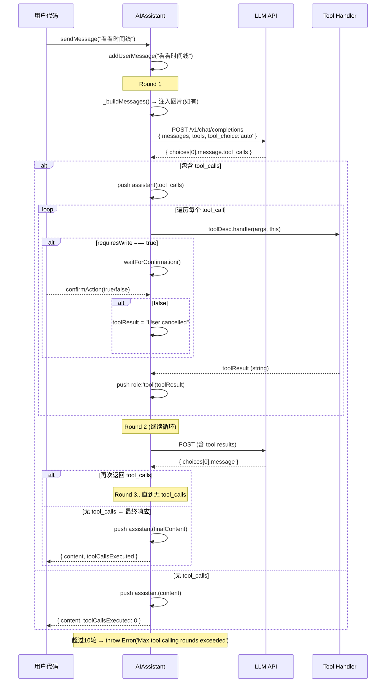

# @bsky/core：AI 助手系统

`AIAssistant` 是 `@bsky/core` 层的对话引擎核心，负责协调 LLM API 请求与 31 个 Bluesky 工具的执行调度。它是一个**零 UI 依赖的纯 TypeScript 类**，运行在[三层架构](三层架构设计.md)的最底层，被 TUI 和 PWA 两套界面共享使用。

整个引擎围绕一条核心原则设计：**LLM 通过 Function Calling 驱动工具调用，系统通过最多 10 轮循环实现链式推理**。

[来源](packages/core/src/ai/assistant.ts#L95-L110)

---

## 1. 核心流程：多轮 Tool Calling 循环

`sendMessage` 方法实现了完整的"用户消息 → LLM 请求 → 工具检测 → 工具执行 → 结果回注 → 再次请求"的闭环。每轮循环对应一次 LLM API 调用，最多允许 **10 轮**。

### 1.1 调用序列



### 1.2 关键决策点：检测 tool_calls

每轮循环中，`makeRequest` 返回的 `ChatCompletionResponse` 经过两个分支判断：

**分支 A — 包含 `message.tool_calls`**
1. 将 assistant 消息（含 `tool_calls` 数组）入消息栈
2. 遍历每个 tool_call，按 name 从 `this.toolMap` 中查找 `ToolDescriptor`
3. 先检查 `requiresWrite`，若为 `true` 则触发确认门控（见第 3 节）
4. 执行 `handler(args, this)`，捕获所有异常防止崩溃
5. 将结果以 `role: 'tool'` 入栈（含 `tool_call_id` 与 LLM 返回值关联）
6. `continue` 进入下一轮

**分支 B — 无 tool_calls**
1. 将最终 assistant 消息入栈
2. 返回 `{ content, toolCallsExecuted, intermediateSteps }`

[来源](packages/core/src/ai/assistant.ts#L217-L310)

---

## 2. sendMessage vs sendMessageStreaming 对比

两者共享同一个多轮循环架构，但输出模式截然不同。

| 维度 | `sendMessage` | `sendMessageStreaming` |
|------|:-------------|:----------------------|
| **返回类型** | `Promise<{ content, toolCallsExecuted, intermediateSteps }>` | `AsyncGenerator<{ type, content, toolName? }>` |
| **中间步骤可见性** | 仅在返回的 `intermediateSteps` 数组中累积 | 实时 yield `tool_call` / `tool_result` 事件 |
| **Token 输出** | 不暴露，仅在最终 content 中返回 | yield `type: 'token'` 逐字推送 |
| **Thinking 内容** | 不暴露 | yield `type: 'thinking'` 实时推送推理过程 |
| **中断支持** | 不支持 | 接收 `AbortSignal`，中断时 yield `{ type: 'done' }` 优雅退出 |
| **SSE 解析** | 无（非流式请求） | `ReadableStream` → `TextDecoder` → 逐行解析 `data: ` 事件 |
| **工具确认** | 内部 `_waitForConfirmation` 阻塞 | yield `type: 'confirmation_needed'` 让 UI 层处理 |

### 2.1 sendMessageStreaming 的事件类型

异步生成器 yield 五种事件类型：

```typescript
type StreamEvent = 
  | { type: 'token'; content: string }              // 文本 token
  | { type: 'thinking'; content: string }            // 推理过程（DeepSeek reasoning_content）
  | { type: 'tool_call'; content: string; toolName: string }    // 工具调用声明
  | { type: 'tool_result'; content: string; toolName: string }  // 工具执行结果
  | { type: 'done'; content: string }                 // 对话结束（含最终完整文本）
  | { type: 'confirmation_needed'; content: string; toolName: string }  // 写操作待确认
```

其中 `confirmation_needed` 是流式版本特有的——它在非流式版本中通过 `_waitForConfirmation` 内部阻塞，而流式版本将其提升为事件，让 UI 层可以展示确认对话框而不阻塞生成器的事件循环。

### 2.2 SSE 解析器的增量 tool_call 合并

流式 SSE 解析中，tool_call 的 `id`、`function.name`、`function.arguments` 可能分散在多个 chunk 中。解析器使用 **`Map<number, Accumulator>`** 按 `index` 聚合：

```typescript
let toolCallAccum: Map<number, { id: string; name: string; arguments: string }> = new Map();

// 每个 SSE chunk 处理：
for (const tc of delta.tool_calls) {
  const idx = tc.index;
  if (!toolCallAccum.has(idx)) {
    toolCallAccum.set(idx, { id: '', name: '', arguments: '' });
  }
  const acc = toolCallAccum.get(idx)!;
  if (tc.id) acc.id = tc.id;
  if (tc.function?.name) acc.name = tc.function.name;
  if (tc.function?.arguments) acc.arguments += tc.function.arguments; // 追加！
}
```

流结束后，按 index 排序生成完整的 `ToolCall[]` 数组。这种方式兼容 OpenAI 和 DeepSeek 的流式 tool_calls 格式。

[来源](packages/core/src/ai/assistant.ts#L396-L540)

---

## 3. 写确认门控：_waitForConfirmation

这是系统最重要的安全机制。所有 `requiresWrite === true` 的工具（发帖、点赞、转发、关注）在执行 handler 前必须经过用户确认。

### 3.1 Promise 门控原理

门控的核心是一个**"外部可 resolve 的 Promise"**模式：

```typescript
private _confirmPromise: Promise<boolean> | null = null;
private _confirmResolve: ((v: boolean) => void) | null = null;

private async _waitForConfirmation(): Promise<boolean> {
  this._confirmPromise = new Promise<boolean>((resolve) => {
    this._confirmResolve = resolve;  // 暴露 resolve 给外部
  });
  return this._confirmPromise;       // 阻塞当前异步执行流
}
```

### 3.2 调用时序

```
sendMessage 循环
  │
  ├─ 检测到 toolDesc.requiresWrite === true
  ├─ await this._waitForConfirmation()
  │     │
  │     ├─ 创建 Promise，将 resolve 存入 this._confirmResolve
  │     ├─ 设置 this._confirmPromise = Promise
  │     ├─ 阻塞在此 await
  │     │
  │     └─ 外部 UI 检测到 hasPendingConfirmation === true
  │            │
  │            ├─ 弹出确认对话框
  │            ├─ 用户选择 → this.confirmAction(true/false)
  │            │     │
  │            │     ├─ this._confirmResolve(approved)
  │            │     ├─ this._confirmPromise = null
  │            │     └─ this._confirmResolve = null
  │            │
  │            └─ await 恢复，返回 true/false
  │
  ├─ true → 执行 handler
  └─ false → toolResult = "User cancelled the operation."
```

拒绝后，tool result 中写入 `"User cancelled the operation."`。这条消息以 `role: 'tool'` 入栈，LLM 能感知用户的拒绝并做出回应（例如"好的，我不点赞了"）。

### 3.3 流式版本的事件化

在 `sendMessageStreaming` 中，写确认不再内部阻塞，而是先 yield `confirmation_needed` 事件，然后才 `await`：

```typescript
if (toolDesc.requiresWrite) {
  const desc = buildToolDescription(toolName, toolArgs);
  yield { type: 'confirmation_needed', content: desc, toolName };
  const approved = await this._waitForConfirmation();  // 仍 await，但 UI 已先收到事件
  if (!approved) { /* ... */ }
}
```

`buildToolDescription` 函数为每个写工具生成可读性强的中文描述：

```typescript
function buildToolDescription(toolName: string, args: Record<string, unknown>): string {
  switch (toolName) {
    case 'create_post': return `创建帖子: "${String(args.text || '').slice(0, 100)}"`;
    case 'like':        return `点赞帖子: ${String(args.uri || '')}`;
    case 'repost':      return `转发帖子: ${String(args.uri || '')}`;
    case 'follow':      return `关注用户: ${String(args.subject || '')}`;
    case 'upload_blob': return '上传图片';
    // ...
  }
}
```

[来源](packages/core/src/ai/assistant.ts#L75-L90) · [来源](packages/core/src/ai/assistant.ts#L157-L177) · [来源](packages/core/src/ai/assistant.ts#L581-L597) · [来源](packages/core/src/ai/assistant.ts#L632-L647)

---

## 4. reasoning_content 处理策略

这是一个跨 Provider 兼容性设计。不同 LLM 供应商对"推理过程"的实现方式不同：

| Provider | reasoningStyle | 原生字段 | 行为 |
|----------|:--------------|---------|------|
| DeepSeek | `reasoning_content` | `delta.reasoning_content` | 原生支持，直接透传 |
| Mistral | `structured_content` | `delta.content` 中嵌套 `{ type: 'thinking', thinking: [...] }` | 解析嵌套结构 |
| 其他 | `none` | 无推理 | 不做任何处理 |

### 4.1 请求端：thinking 参数

`shouldSendThinkingParam` 仅在 provider 为 `deepseek` 时返回 `true`，因为 DeepSeek API 使用非标准的 `thinking` 参数：

```typescript
// 仅在 provider === 'deepseek' 时发送
(body as any).thinking = { type: this.config.thinkingEnabled !== false ? 'enabled' : 'disabled' };
```

对于 `reasoningStyle === 'structured_content'`（Mistral），额外发送 `reasoning_effort: 'high'`。

[来源](packages/core/src/ai/providers.ts#L53-L56) · [来源](packages/core/src/ai/assistant.ts#L361-L365)

### 4.2 流式接收：两种推理格式

SSE 解析器同时处理两种推理格式：

**DeepSeek 原生格式**（`delta.reasoning_content`）：
```typescript
if (delta.reasoning_content) {
  reasoningContent += delta.reasoning_content;
  yield { type: 'thinking', content: delta.reasoning_content };
}
```

**Mistral 结构化格式**（`delta.content` 为数组）：
```typescript
if (Array.isArray(delta.content)) {
  for (const block of delta.content) {
    if (block.type === 'thinking' && block.thinking) {
      for (const t of block.thinking) {
        if (t.type === 'text' && t.text) {
          reasoningContent += t.text;
          yield { type: 'thinking', content: t.text };
        }
      }
    } else if (block.type === 'text' && block.text) {
      fullContent += block.text;
      yield { type: 'token', content: block.text };
    }
  }
}
```

两种格式最终都合并到本轮的 `reasoningContent` 变量中，随消息一同入栈。

[来源](packages/core/src/ai/assistant.ts#L504-L528)

### 4.3 历史消息的推理内容兼容（_buildMessages）

当 `reasoningStyle !== 'reasoning_content'`（即非 DeepSeek 原生模式）时，`_buildMessages` 会将历史消息中的 `reasoning_content` 合并到 `content` 中，然后移除该字段：

```typescript
if (this.config.reasoningStyle !== 'reasoning_content') {
  msgs = msgs.map(m => {
    const rc = (m as any).reasoning_content;
    if (!rc || m.role !== 'assistant') return m;
    const { reasoning_content: _, ...rest } = m as any;
    const prefix = `【上一步思考过程】\n${rc}\n\n`;
    if (typeof rest.content === 'string') {
      rest.content = prefix + rest.content;
    }
    return rest;
  });
}
```

这个设计的动机：Mistral 等 API 不认识 `reasoning_content` 字段，直接发送会导致 `extra_forbidden` 错误。通过将推理内容以文本前缀的方式嵌入 content，既保留了推理过程的信息，又避免了未知字段错误。这条逻辑与[多模型供应商与 Provider 系统](多模型供应商与-provider-系统.md)中的 `reasoningStyle` 配置项直接关联。

[来源](packages/core/src/ai/assistant.ts#L315-L328)

---

## 5. 图片注入与视觉模式

`_buildMessages` 的第二个职责是将待处理图片注入到请求中。这是 `view_image` 工具（在[31 个 AI 工具详解](31-个-ai-工具详解.md)中有详细说明）的反向控制流关键环节。

### 5.1 注入逻辑

```typescript
private _buildMessages(): ChatMessage[] {
  let msgs = this.messages;
  // 1. 先处理 reasoning_content 兼容（如上节）
  // ...
  
  // 2. 图片注入
  if (!this.hasPendingImages || !this.config.visionEnabled) return msgs;
  msgs = [...msgs];
  for (let i = msgs.length - 1; i >= 0; i--) {
    if (msgs[i]!.role === 'user') {
      const text = typeof msgs[i]!.content === 'string' ? msgs[i]!.content : '';
      const blocks: ContentBlock[] = [
        { type: 'text', text },
        ...this._pendingImages.flatMap(img => [
          ...(img.alt ? [{ type: 'text' as const, text: `[图片 ALT: ${img.alt}]` }] : []),
          { type: 'image_url' as const, image_url: { url: img.url, detail: 'auto' } },
        ]),
      ];
      msgs[i] = { ...msgs[i]!, content: blocks };
      this.messages[i] = { ...this.messages[i]!, content: blocks }; // 持久化到消息栈
      break;  // 只处理最后一个 user 消息
    }
  }
  this.clearPendingImages();
  return msgs;
}
```

关键设计要点：

- **从尾部搜索**：只注入到最后一个 `role: 'user'` 消息——这是刚通过 `addUserMessage` 添加的用户输入
- **ContentBlock 结构**：将 `content` 从 `string` 替换为 `ContentBlock[]`，结构为 `[用户文本, (ALT 文本 + image_url)...]`
- **持久化到 `this.messages`**：注入后的 `ContentBlock[]` 不仅返回给 API 请求，还写回 `this.messages[i]`，确保跨轮对话中图片上下文不丢失
- **注入后清空**：`clearPendingImages()` 防止重复注入

### 5.2 图片来源

`_pendingImages` 由 `view_image` 工具的 handler 填充：

```
view_image handler:
  1. client.downloadBlob(did, cid) → Uint8Array
  2. Uint8Array → base64 data URL
  3. assistant.addPendingImage(dataUrl, alt)
```

这实现了"AI 先请求图片 → 系统下载并转为 data URL → 注入到下一轮 LLM 请求"的闭环。视觉模式配置项 `visionEnabled` 在[思考模式与视觉模式](思考模式与视觉模式.md)中有完整论述。

### 5.3 用户上传图片

通过 `addUserUpload(data, mimeType, alt)` 预存的图片数据不经过 `_buildMessages` 注入，而是通过 `create_post` 工具的 `pendingImageIndex` 参数引用。handler 通过 `assistant.getUserUpload(index)` 获取原始 Uint8Array 后上传到 PDS。

[来源](packages/core/src/ai/assistant.ts#L56-L72) · [来源](packages/core/src/ai/assistant.ts#L320-L348)

---

## 6. 辅助单轮 AI 函数

除 `AIAssistant` 类外，`assistant.ts` 还导出了三个独立的单轮 AI 函数。它们不涉及工具调用和多轮循环，直接发送请求并返回结果。

### 6.1 singleTurnAI

最底层的单轮调用，适用于翻译、润色等无需工具的场景：

```typescript
export async function singleTurnAI(
  config: AIConfig,
  systemPrompt: string,   // 从 prompts.ts 导入
  userPrompt: string,
  temperature = 0.3,
  maxTokens = 2000,
  modelOverride?: string,
): Promise<string>
```

发送非流式请求，直接提取 `choices[0].message.content` 返回纯文本。支持 `thinking` 参数（仅 DeepSeek）。

### 6.2 translateText

带重试的翻译函数，支持双模式输出：

| 模式 | 行为 | 返回值 |
|------|------|--------|
| `simple` | 纯文本翻译 | `{ translated: string }` |
| `json` | 结构化 JSON 输出，自动检测源语言 | `{ translated: string, sourceLang?: string }` |

重试策略：最多 `maxRetries`（默认 3）次，指数退避（800ms × attempt）。触发条件：空内容、JSON 解析失败、网络异常。JSON 模式下发送 `response_format: { type: 'json_object' }` 参数。

翻译系统提示词 `PF_TRANSLATE_SIMPLE` 和 `PF_TRANSLATE_JSON` 在[Prompt 工程与系统提示词](prompt-工程与系统提示词.md)中有完整定义。

### 6.3 polishDraft

草稿润色函数，调用 `singleTurnAI` 传入润色专用的系统提示词 `P_POLISH_SYSTEM` 和用户提示词 `PF_POLISH_USER`。

[来源](packages/core/src/ai/assistant.ts#L649-L719) · [来源](packages/core/src/ai/assistant.ts#L721-L739)

---

## 7. 消息生命周期与状态管理

`AIAssistant` 内部维护一个 `messages: ChatMessage[]` 数组作为**事实来源**。整个对话周期的状态变化如下：

```
初始状态: messages = []
    │
    ├─ addSystemMessage("你是 Bluesky 助手...")
    │   → messages = [ { role: 'system', content } ]
    │
    ├─ sendMessage("看看时间线")
    │   → addUserMessage → messages = [ sys, { role: 'user', content: "看看时间线" } ]
    │   → Round 1: makeRequest → LLM 返回 tool_calls
    │   → push assistant(tool_calls) → messages = [ sys, user, assistant(tool_calls) ]
    │   → 执行工具 → push tool result → messages = [ sys, user, assistant, tool ]
    │   → Round 2: makeRequest(含 tool result) → LLM 返回最终内容
    │   → push assistant(final) → messages = [ sys, user, assistant, tool, assistant ]
    │   → 返回 { content, toolCallsExecuted }
    │
    ├─ 持久化: 通过 getMessages() 导出 → [聊天存储](聊天存储-chatstorage-接口.md)
    │
    └─ clearMessages() → messages = []
```

关键约束：
- **system 消息只能有一条**（通过 `addSystemMessage` 添加，非覆盖式追加）
- **user 消息**通过 `addUserMessage` 添加，`sendMessage` / `sendMessageStreaming` 内部自动调用
- **assistant 消息**和 **tool 消息**由循环内部管理，外部不直接操作
- **图片注入**会修改已有 user 消息的 `content` 字段（从 `string` → `ContentBlock[]`），这是一种**就地变异**

[来源](packages/core/src/ai/assistant.ts#L26-L37)

---

## 架构设计总结

`AIAssistant` 的设计体现了三条原则：

1. **工具注册与调度解耦**：`setTools` 一次性注册全部工具描述符，`makeRequest` 自动序列化为 OpenAI 兼容的 Function Calling 格式。新增工具只需添加 `ToolDescriptor` 条目，调度器无需修改。

2. **错误隔离**：每个工具 handler 都有独立 try-catch，失败时返回错误字符串而非抛异常。LLM 能感知错误并自行调整策略，整个对话不崩溃。

3. **安全策略前置**：写确认门控使用 Promise 模式实现异步阻塞，无需消息队列或回调嵌套。`requiresWrite` 标志将安全策略与执行逻辑解耦。

这套引擎的流式输出细节（SSE 解析、UI 层消费模式）在[AI 对话与流式输出](ai-对话与流式输出.md)中有完整说明。工具定义与实现清单参见[31 个 AI 工具详解](31-个-ai-工具详解.md)。Provider 配置体系参见[多模型供应商与 Provider 系统](多模型供应商与-provider-系统.md)。