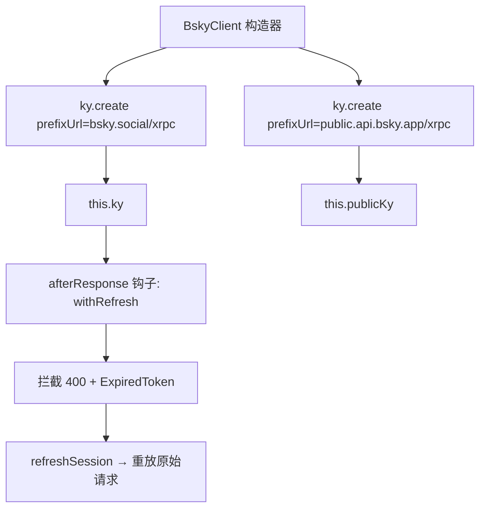

现在我已充分掌握代码，可以撰写页面了。

---

# @bsky/core：AT Protocol 客户端

`BskyClient` 是 `@bsky/core` 与 Bluesky 网络通信的唯一入口。它不只是一个 HTTP 客户端封装——它解决了一个分布式系统级别的难题：**无状态 HTTP 协议上，有状态的 JWT 会话如何在不中断调用方体验的情况下自动续期**。答案是两个 ky 实例 + 一个 `afterResponse` 钩子函数。

[来源](packages/core/src/at/client.ts#L34-L376)

---

## 双 ky 实例：构造器的设计决策

构造器创建了两个独立的 **ky** 实例，各自绑定不同的 AT Protocol 端点：

| 实例 | 基础 URL | 用途 | 钩子 |
|------|----------|------|------|
| `this.ky` | `https://bsky.social/xrpc` | 认证 API | ✅ `afterResponse: [withRefresh]` |
| `this.publicKy` | `https://public.api.bsky.app/xrpc` | 公共 API | ❌ 无 |



两个实例的超时均为 30 秒。`this.ky` 注册了 `withRefresh` 作为 `afterResponse` 钩子；`this.publicKy` 没有任何钩子，也不会附带任何认证头。二者共享 `timeout: 30000` 配置。

[来源](packages/core/src/at/client.ts#L34-L50)

为什么两个实例？根本原因在于 AT Protocol 的端点设计割裂：认证 API（PDS）和公共 API（AppView）部署在不同域名，分离后可以实现：
- 公共请求不会触发不必要的 `ExpiredToken` 检测逻辑
- 未登录用户无需面对认证端点的速率限制和 CORS 策略
- `afterResponse` 钩子不会在公共 API 的响应上误判

[来源](packages/core/src/at/client.ts#L39-L50)

---

## JWT 自动刷新：`withRefresh` 钩子深度剖析

这是整个客户端中**复杂度最高的设计**，也是保障用户体验的关键。`withRefresh` 是一个异步函数，签名如下：

```typescript
const withRefresh: (
  request: Request,
  _options: unknown,
  response: Response
) => Promise<Response | void>
```

### 触发条件链

钩子使用三级条件过滤：

```typescript
if (!response.ok) {                          // 条件 1：非成功响应
  const body = await response.clone().text();
  if (response.status === 400 && self.session) {  // 条件 2：400 + 已登录
    const err = JSON.parse(body);
    if (err.error === 'ExpiredToken' || err.error === 'InvalidToken') {
      // → 进入刷新流程
    }
  }
}
```

三重过滤从宽到严：先排除所有成功响应（2xx），再筛选出 400 状态并确认存在会话，最后检查错误类型。`ExpiredToken` 和 `InvalidToken` 是 Bluesky PDS 在 JWT 过期或无效时返回的标准错误码。

[来源](packages/core/src/at/client.ts#L11-L18)

### 刷新三步走

触发器一旦激活，执行一个精心编排的三阶段流程：

**阶段 1 — 200ms 退避**

```typescript
await new Promise(r => setTimeout(r, 200));
```

200ms 延迟服务于一个底层工程考量：ky 内部维护 HTTP keep-alive 连接池。当钩子触发时，原始请求的 TLS 连接可能尚未完全释放。使用 `fetch`（而非 `this.ky`）直接发起刷新请求，加上短延迟，可以避免与 ky 的 keep-alive 机制发生连接竞争（connection contention）。

**阶段 2 — `refreshSession` 交换令牌**

```typescript
const refreshRes = await fetch(`${BSKY_SERVICE}/xrpc/com.atproto.server.refreshSession`, {
  method: 'POST',
  headers: { Authorization: `Bearer ${session.refreshJwt}` },
});
```

关键细节：此处使用**原生 `fetch`** 而非 `this.ky`。原因很直白——如果用 `this.ky` 发起 `refreshSession`，响应也会经过 `afterResponse` 钩子，导致刷新自身触发刷新，陷入**无限递归**。原生 `fetch` 完全绕过了 ky 的钩子系统。

使用 `refreshJwt`（而非 `accessJwt`）是 AT Protocol 的双令牌规范：`accessJwt` 是短期令牌（通常 2 小时），`refreshJwt` 是长期令牌（通常 90 天），专门用于令牌续期。

**阶段 3 — 重放原始请求**

```typescript
if (refreshRes.ok) {
  self.session = await refreshRes.json() as CreateSessionResponse;
  const retryRes = await fetch(request.url, {
    method: request.method,
    headers: { Authorization: `Bearer ${self.session.accessJwt}` },
  });
  if (retryRes.ok) return retryRes;
}
self.session = null;
```

刷新成功后，用新 `accessJwt` 重放原始请求（保留 URL 和 HTTP 方法），并**将新响应直接返回给 ky**——调用方完全感知不到中间发生了令牌刷新。如果重试也失败，`session` 被置为 `null`，后续请求将抛出 "Not authenticated" 错误。

### 错误边界的处理

钩子中嵌入了多层 try-catch 来保障鲁棒性：

| 场景 | 行为 |
|------|------|
| 响应体非 JSON（如图片 blob） | 跳过刷新，记录错误日志 |
| 刷新请求网络异常 | 保留 session 不变，让调用方自行重试 |
| 刷新成功但重试失败 | `session = null`，强制重新登录 |
| 刷新失败（非 200） | `session = null`，强制重新登录 |

无论刷新流程是否触发，所有非成功响应都会在最后通过 `console.error` 输出诊断日志：

```typescript
console.error(`[bsky] ${response.status} ${request.method} ${request.url} → ${body}`);
```

[来源](packages/core/src/at/client.ts#L19-L33)

---

## 认证感知的请求路由模式

`BskyClient` 中几乎所有只读方法都遵循同一个路由模式，这是理解其 API 设计的关键：

```typescript
async getProfile(actor: string): Promise<ProfileView> {
  const kyInstance = this.session ? this.ky : this.publicKy;  // 动态路由
  const headers = this.session ? { headers: this.getAuthHeaders() } : {};  // 条件认证
  return kyInstance.get('app.bsky.actor.getProfile', {
    searchParams: { actor },
    ...headers,
  }).json<ProfileView>();
}
```

[来源](packages/core/src/at/client.ts#L114-L119)

这个模式将方法分为三类：

### 第一类：始终走 `this.ky` + 认证头（写操作 + 私有数据）

需要认证的方法直接通过 `this.getAuthHeaders()` 获取 `Authorization: Bearer <accessJwt>`，若未登录则抛出异常。涵盖：`login`、`getTimeline`、`searchPosts`、`listNotifications`、`getSuggestedFollows`、`getSuggestedFeeds`、`createRecord`、`deleteRecord`、`uploadBlob`、`follow`、`unfollow`、`deletePost`、书签系列。

### 第二类：动态路由——session 存在时用 `this.ky`，否则用 `this.publicKy`

这是最常见的模式。方法内部通过 `this.session ? this.ky : this.publicKy` 动态选择实例。当 `session` 存在时，额外附带认证头。涵盖：`getProfile`、`getAuthorFeed`、`getPostThread`、`getLikes`、`getRepostedBy`、`searchActors`、`getFollows`、`getFollowers`、`getFeed`、`getPopularFeedGenerators`、`getFeedGenerator`、`getTrends`、`listRecords`、`getRecord`。

### 第三类：始终走 `this.publicKy`（无认证）

目前只有 `resolveHandle` 一个方法始终使用公共 API。它只需将 handle 解析为 DID，不依赖任何用户上下文。

```typescript
async resolveHandle(handle: string): Promise<ResolveHandleResponse> {
  return this.publicKy.get('com.atproto.identity.resolveHandle', {
    searchParams: { handle },
  }).json<ResolveHandleResponse>();
}
```

[来源](packages/core/src/at/client.ts#L110-L113)

---

## 核心方法签名与语义

### `login(handle, password)`

```typescript
async login(handle: string, password: string): Promise<CreateSessionResponse>
```

调用 `com.atproto.server.createSession`，将返回的 `CreateSessionResponse`（包含 `accessJwt`、`refreshJwt`、`did`、`handle`、`email`）存入 `this.session`。实例化后必须首先调用此方法或 `restoreSession`，否则 `getAuthHeaders()` 将抛出异常。

[来源](packages/core/src/at/client.ts#L103-L108)

### `resolveHandle(handle)`

```typescript
async resolveHandle(handle: string): Promise<ResolveHandleResponse>
```

公共 API，始终走 `this.publicKy`。返回 `{ did: string }`。用于将用户可读的 handle（如 `@alice.bsky.social`）转换为 AT Protocol 内部使用的 DID。

[来源](packages/core/src/at/client.ts#L110-L113)

### `getTimeline(limit, cursor)`

```typescript
async getTimeline(limit = 50, cursor?: string): Promise<TimelineResponse>
```

需要认证（始终走 `this.ky`）。`limit` 默认 50，`cursor` 用于分页。返回 `TimelineResponse` 含 `feed: Array<{ post: PostView; reply?; reason? }>`。

[来源](packages/core/src/at/client.ts#L121-L126)

### `getPostThread(uri, depth, parentHeight)`

```typescript
async getPostThread(
  uri: string,
  depth = 6,
  parentHeight = 80
): Promise<PostThreadResponse>
```

动态路由（可选认证）。`depth` 控制回复向下展开的层级，`parentHeight` 控制向上回溯的父帖数量。默认值 6 和 80 确保常见的讨论串能完整加载，同时避免过深递归导致性能问题。返回的 `PostThreadResponse.thread` 可能是 `ThreadViewPost` 或 `NotFoundPost`。

[来源](packages/core/src/at/client.ts#L142-L149)

### `createRecord(repo, collection, record, rkey?, swapCommit?)`

```typescript
async createRecord(
  repo: string,
  collection: string,
  record: Record<string, unknown>,
  rkey?: string,       // 可选：自定义记录键，否则服务器自动生成
  swapCommit?: string  // 可选：CAS 防冲突提交 CID
): Promise<CreateRecordResponse>
```

需要认证。这是 AT Protocol 最通用的写操作——`follow`、`createBookmark` 等高层方法底层都调用它。`rkey` 用于幂等创建（指定已知键），`swapCommit` 用于乐观并发控制（仅当仓库提交 CID 匹配时写入）。

[来源](packages/core/src/at/client.ts#L294-L305)

### `deleteRecord(repo, collection, rkey)`

```typescript
async deleteRecord(repo: string, collection: string, rkey: string): Promise<void>
```

需要认证。与 `createRecord` 对应，通过 `repo + collection + rkey` 三元组定位要删除的记录。`deletePost` 和 `unfollow` 是其高层封装。

[来源](packages/core/src/at/client.ts#L307-L312)

---

## 完整 XRPC 端点映射

以下是 `BskyClient` 覆盖的全部 AT Protocol Lexicon 端点，按方法分组：

### 认证与会话

| 方法 | Lexicon | 认证 | HTTP 方法 |
|------|---------|------|-----------|
| `login` | `com.atproto.server.createSession` | — | POST |
| — | `com.atproto.server.refreshSession` | refreshJwt | POST |

`refreshSession` 不在公开方法中，仅在 `withRefresh` 钩子内部使用。

### Feed / 时间线

| 方法 | Lexicon | 认证 | 分页 |
|------|---------|------|------|
| `getTimeline` | `app.bsky.feed.getTimeline` | 必需 | cursor |
| `getAuthorFeed` | `app.bsky.feed.getAuthorFeed` | 可选 | cursor + filter |
| `getFeed` | `app.bsky.feed.getFeed` | 可选 | cursor |
| `getPostThread` | `app.bsky.feed.getPostThread` | 可选 | depth, parentHeight |
| `getLikes` | `app.bsky.feed.getLikes` | 可选 | cursor |
| `getRepostedBy` | `app.bsky.feed.getRepostedBy` | 可选 | cursor |

### 搜索

| 方法 | Lexicon | 认证 | 附加参数 |
|------|---------|------|----------|
| `searchPosts` | `app.bsky.feed.searchPosts` | **必需** | q, sort |
| `searchActors` | `app.bsky.actor.searchActors` | 可选 | q |

`searchPosts` 虽归类为"搜索"，但始终需要认证——公共 API 对其返回 403。

### 用户与图谱

| 方法 | Lexicon | 认证 | 分页 |
|------|---------|------|------|
| `resolveHandle` | `com.atproto.identity.resolveHandle` | 无需 | — |
| `getProfile` | `app.bsky.actor.getProfile` | 可选 | — |
| `getFollows` | `app.bsky.graph.getFollows` | 可选 | cursor |
| `getFollowers` | `app.bsky.graph.getFollowers` | 可选 | cursor |
| `getSuggestedFollows` | `app.bsky.graph.getSuggestedFollowsByActor` | 必需 | — |
| `follow` | `app.bsky.graph.follow`（包装 `createRecord`） | 必需 | — |
| `unfollow` | `app.bsky.graph.follow`（包装 `deleteRecord`） | 必需 | — |

### 通知

| 方法 | Lexicon | 认证 | 附加参数 |
|------|---------|------|----------|
| `listNotifications` | `app.bsky.notification.listNotifications` | 必需 | priority |

### Feed 发现

| 方法 | Lexicon | 认证 | 分页 |
|------|---------|------|------|
| `getSuggestedFeeds` | `app.bsky.feed.getSuggestedFeeds` | 必需 | cursor |
| `getPopularFeedGenerators` | `app.bsky.unspecced.getPopularFeedGenerators` | 可选 | cursor |
| `getFeedGenerator` | `app.bsky.feed.getFeedGenerator` | 可选 | — |
| `getTrends` | `app.bsky.unspecced.getTrends` | 可选 | personalizedFor |

### 仓库记录（通用 CRUD）

| 方法 | Lexicon | 认证 | HTTP 方法 |
|------|---------|------|-----------|
| `listRecords` | `com.atproto.repo.listRecords` | 可选 | GET |
| `getRecord` | `com.atproto.repo.getRecord` | 可选 | GET |
| `createRecord` | `com.atproto.repo.createRecord` | 必需 | POST |
| `deleteRecord` | `com.atproto.repo.deleteRecord` | 必需 | POST |
| `deletePost` | `com.atproto.repo.deleteRecord`（内部解析 AT URI） | 必需 | POST |

### 书签（自定义扩展）

| 方法 | Lexicon | 认证 | HTTP 方法 |
|------|---------|------|-----------|
| `getBookmarks` | `app.bsky.bookmark.getBookmarks` | 必需 | GET |
| `createBookmark` | `app.bsky.bookmark.createBookmark` | 必需 | POST |
| `deleteBookmark` | `app.bsky.bookmark.deleteBookmark` | 必需 | POST |

书签是项目的自定义 AT Protocol 扩展，非 Bluesky 原生功能。

### 多媒体

| 方法 | Lexicon | 认证 | 说明 |
|------|---------|------|------|
| `uploadBlob` | `com.atproto.repo.uploadBlob` | 必需 | 原始二进制的 POST |
| `downloadBlob` | `com.atproto.sync.getBlob` | 可选 | 独立的 `ky.get()` 实例 |

### 视频 CDN

| 方法 | 用途 | 返回 |
|------|------|------|
| `getVideoThumbnailUrl(did, cid)` | HLS 缩略图 URL | `https://video.bsky.app/watch/{did}/{cid}/thumbnail.jpg` |
| `getVideoPlaylistUrl(did, cid)` | HLS 流 URL | `https://video.bsky.app/watch/{did}/{cid}/playlist.m3u8` |

这两个方法不发起网络请求，仅构造 CDN URL。

[来源](packages/core/src/at/client.ts#L369-L375)

---

## 会话访问器

| 方法 | 返回值 | 未登录时 |
|------|--------|----------|
| `isAuthenticated()` | `boolean` | — |
| `getDID()` | `string` | 抛出 Error |
| `getHandle()` | `string` | 抛出 Error |
| `getAccessJwt()` | `string` | 抛出 Error |
| `restoreSession(session)` | `void` | — |

`restoreSession` 用于从持久化存储（如 IndexedDB、localStorage）恢复已保存的 `CreateSessionResponse`，避免每次启动都要求用户重新登录。配合 `getAccessJwt()` 可在应用启动时验证 session 是否仍然有效。

[来源](packages/core/src/at/client.ts#L84-L101)

---

## 设计权衡

1. **为什么用 `400` 而非 `401` 检测令牌过期？** Bluesky PDS 在 JWT 过期时返回 HTTP 400 而非 401，因为请求本身格式正确，只是令牌语义上无效。这是 AT Protocol 的一个"特色"。

2. **为什么刷新使用原生 `fetch` 而非 `this.ky`？** 避免 `afterResponse` 钩子递归。这是装饰器模式中的经典问题——在拦截器中发起的请求不应再经过同一拦截器。

3. **为什么公共 API 单独使用一个实例？** 因为 `public.api.bsky.app` 和 `bsky.social` 是不同的服务实体，拥有不同的 CORS 策略、速率限制和数据可见性。混合使用会导致令牌无意中泄露到公共端点，或公共请求被 PDS 拒绝。

4. **为什么 `deleteBookmark` 静默吞掉异常？** `deleteBookmark` 的 try-catch 内部不抛出任何错误——书签删除通常由用户触发，如果书签不存在（已被删除或从未创建），抛出异常只会影响用户体验。

[来源](packages/core/src/at/client.ts#L334-L344)

---

## 在架构中的位置

`BskyClient` 是 `@bsky/core` 的三大支柱之一，与 `AIAssistant` 和 `createTools` 工厂共同构成核心层的完整能力。上层通过 `@bsky/app` 的 React Hooks 层与 `BskyClient` 交互，参见 [@bsky/core 核心层设计](bsky-core-核心层设计.md)。AI 助手通过 `createTools` 将 `BskyClient` 的 API 包装为 30+ 个 LLM 可调用工具，参见 [AI 助手与工具调用系统](ai-助手与工具调用系统.md)。测试策略中 `BskyClient` 使用真实 API 验证，参见 [测试策略与实战](测试策略与实战.md)。