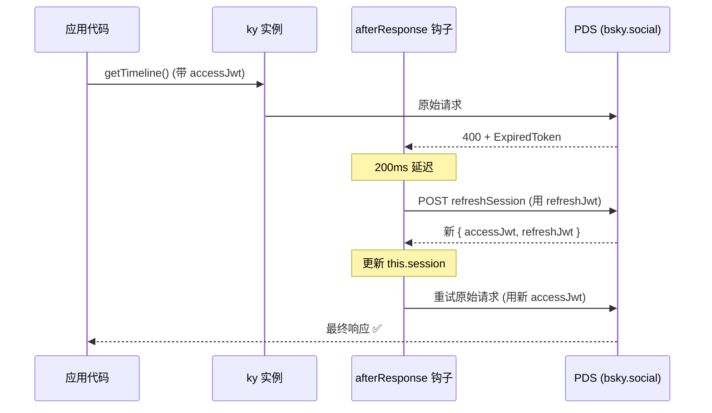
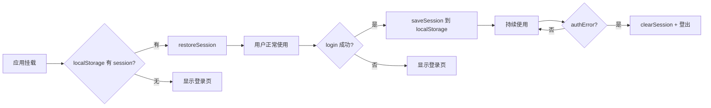

现在我已收集了所有关键代码，可以撰写完整的页面了。

---

# JWT 会话管理

Bluesky 的 AT Protocol 采用 **双令牌 JWT 机制** 管理会话：一个短寿命的 `accessJwt`（访问令牌）用于认证 API 请求，一个长寿命的 `refreshJwt`（刷新令牌）用于在令牌过期后无感续期。整个项目围绕这一机制构建了从登录、自动刷新到持久化、睡眠恢复的全链路会话管理方案。

[来源](packages/core/src/at/types.ts#L246-L252)

---

## 登录流程：凭据 → 会话

无论 TUI 还是 PWA，登录的起点都是调用 `BskyClient.login(handle, password)`。该方法向 AT Protocol 的 `com.atproto.server.createSession` 端点发起 POST 请求，携带用户的 **Handle** 和 **App Password**：

```typescript
async login(handle: string, password: string): Promise<CreateSessionResponse> {
  const res = await this.ky.post('com.atproto.server.createSession', {
    json: { identifier: handle, password },
  }).json<CreateSessionResponse>();
  this.session = res;
  return res;
}
```

[来源](packages/core/src/at/client.ts#L93-L98)

返回的 `CreateSessionResponse` 是整个会话管理的核心数据结构：

| 字段 | 类型 | 说明 |
|------|------|------|
| `accessJwt` | `string` | 短寿命 JWT，用于认证 API 请求 |
| `refreshJwt` | `string` | 长寿命 JWT，用于续期 accessJwt |
| `handle` | `string` | 用户的 Bluesky Handle（如 `alice.bsky.social`） |
| `did` | `string` | 去中心化标识符（如 `did:plc:...`） |
| `email?` | `string` | 邮箱地址（可选） |

[来源](packages/core/src/at/types.ts#L246-L252)

调用成功后，`this.session` 被赋值为完整的响应对象，后续所有 API 请求都从这个 session 中读取 `accessJwt` 构造 `Authorization: Bearer <token>` 头。

---

## ky afterResponse 钩子：无感令牌续期

`BskyClient` 的构造器中定义了一个名为 `withRefresh` 的 `afterResponse` 钩子，注册在认证专用的 ky 实例上。它是整个客户端的 **可靠性核心**。

### 触发条件

钩子只在以下条件 **全部满足** 时激活：

1. 响应状态码为 **400**
2. `this.session` 存在（即用户已登录）
3. 响应体 JSON 的 `error` 字段为 `"ExpiredToken"` 或 `"InvalidToken"`

```typescript
if (response.status === 400 && self.session) {
  const err = JSON.parse(body);
  if (err.error === 'ExpiredToken' || err.error === 'InvalidToken') {
    // 进入刷新流程
  }
}
```

[来源](packages/core/src/at/client.ts#L45-L51)

AT Protocol 的认证错误统一走 400 状态码而非 401，这是架构上容易踩坑的一点。

### 刷新三部曲



具体实现分三步：

**① 200ms 延迟** — 在发起刷新请求前 `await new Promise(r => setTimeout(r, 200))`。这一行看似随意，实际上解决了 **TLS 连接争用**：ky 内置 keep-alive 连接池，如果上一个请求的连接尚未完全释放就发起新请求，可能导致连接复用冲突。200ms 是一个经验值，足以让底层 TLS 连接回收到池中。

**② 使用 refreshJwt 刷新会话** — 通过原生 `fetch`（而非 `this.ky`）直接调用 `com.atproto.server.refreshSession`，携带 `Authorization: Bearer <refreshJwt>` 头。使用原生 `fetch` 是关键设计：避免递归触发自身的 `afterResponse` 钩子。

**③ 重试原始请求并返回** — 刷新成功后，用新的 `accessJwt` 重新发起与原始请求完全相同的 URL 和方法，如果成功则直接返回新响应给调用方。如果刷新或重试失败，`this.session` 被置为 `null`，后续 API 调用将抛出未认证错误。

```typescript
// 刷新：用 refreshJwt
const refreshRes = await fetch(`${BSKY_SERVICE}/xrpc/com.atproto.server.refreshSession`, {
  method: 'POST',
  headers: { Authorization: `Bearer ${session.refreshJwt}` },
});
if (refreshRes.ok) {
  self.session = await refreshRes.json() as CreateSessionResponse;
  // 重试：用新 accessJwt
  const retryRes = await fetch(request.url, {
    method: request.method,
    headers: { Authorization: `Bearer ${self.session.accessJwt}` },
  });
  if (retryRes.ok) return retryRes;
}
self.session = null;  // 刷新失败 → 清空会话
```

[来源](packages/core/src/at/client.ts#L52-L70)

网络异常场景（如断网）则保留现有 session，让调用方自行决定重试策略——这是 `try/catch` 包裹刷新逻辑的用意。

---

## TUI 睡眠检测：wasAuthenticated 状态机

终端 TUI 应用面临一个独特问题：**系统休眠后，网络连接断裂，refreshJwt 可能已过期**。`afterResponse` 钩子虽然能处理令牌过期，但如果休眠时间过长，refreshJwt 本身也失效了，自动刷新就会失败，`this.session` 被置为 `null`。

TUI 的 `App.tsx` 用一个简洁的状态机解决这个问题：

```typescript
const [wasAuthenticated, setWasAuthenticated] = useState(false);

// 启动时自动登录
useEffect(() => {
  if (!authLoading) login(config.blueskyHandle, config.blueskyPassword);
}, []);

// 监测 session 状态，检测到从「已认证→未认证」则重新登录
useEffect(() => {
  if (client?.isAuthenticated()) {
    setWasAuthenticated(true);
  } else if (wasAuthenticated) {
    setWasAuthenticated(false);
    login(config.blueskyHandle, config.blueskyPassword);
  }
}, [client]);
```

[来源](packages/tui/src/components/App.tsx#L125-L137)

逻辑如下：

1. `wasAuthenticated` 初始为 `false`
2. 首次 `login` 成功后，`client.isAuthenticated()` 返回 `true`，将 `wasAuthenticated` 置为 `true`
3. 系统休眠后醒来，网络不通或 refreshJwt 过期，`afterResponse` 钩子将 session 置为 `null`
4. React 重新渲染，`client.isAuthenticated()` 返回 `false`，而 `wasAuthenticated` 仍为 `true`
5. 条件 `wasAuthenticated && !client.isAuthenticated()` 触发，调用 `login(...)` 重新建立会话

这个模式的关键在于 **状态的单向跃迁**：从未认证到已认证时记录标记，从已认证到未认证时触发重新登录，同时将标记复位避免无限循环。

---

## PWA 持久化：localStorage 三件套

PWA（浏览器应用）需要处理页面刷新、关闭后重开等场景，因此需要将 session 持久化到本地存储。实现集中在 `useSessionPersistence.ts`，提供三个纯函数：

```typescript
const SESSION_KEY = 'bsky_session';

export interface StoredSession {
  accessJwt: string;
  refreshJwt: string;
  handle: string;
  did: string;
}

export function getSession(): StoredSession | null {
  try {
    const raw = localStorage.getItem(SESSION_KEY);
    if (!raw) return null;
    return JSON.parse(raw) as StoredSession;
  } catch { return null; }
}

export function saveSession(session: StoredSession): void {
  localStorage.setItem(SESSION_KEY, JSON.stringify(session));
}

export function clearSession(): void {
  localStorage.removeItem(SESSION_KEY);
}
```

[来源](packages/pwa/src/hooks/useSessionPersistence.ts#L1-L25)

PWA 的 `App.tsx` 中通过三个 `useEffect` 管理持久化生命周期：



**挂载时恢复** — 检查 localStorage 中是否有 `bsky_session`，如果存在且 `client` 尚未创建，调用 `restoreSession` 凭 session 数据直接恢复 `BskyClient` 实例，无需重新输入密码。

```typescript
useEffect(() => {
  const saved = getSession();
  if (saved && !client) {
    restoreSession({
      accessJwt: saved.accessJwt,
      refreshJwt: saved.refreshJwt,
      handle: saved.handle,
      did: saved.did,
    });
    setIsLoggedIn(true);
  }
}, []);
```

[来源](packages/pwa/src/App.tsx#L124-L133)

**登录成功时持久化** — session 就绪后写入 localStorage，确保下次页面加载时能无缝恢复。

[来源](packages/pwa/src/App.tsx#L138-L148)

**认证错误时清除** — 当 `authError` 出现（如 refreshJwt 过期导致 `session_expired`），立即清除 localStorage 中的 session，将用户引导回登录页。

[来源](packages/pwa/src/App.tsx#L151-L156)

---

## restoreSession：恢复路径的统一入口

`@bsky/app` 层的 `AuthStore` 提供了 `restoreSession` 方法，这是 TUI 和 PWA 共享的会话恢复入口：

```typescript
restoreSession(session: CreateSessionResponse) {
  const c = new BskyClient();
  c.restoreSession(session);
  store.session = session;
  store.client = c;
  c.getProfile(session.handle).then(p => {
    store.profile = p;
    store._notify();
  }).catch(() => {
    if (!c.isAuthenticated()) {
      store.client = null;
      store.session = null;
      store.error = 'session_expired';
      store._notify();
    }
  });
}
```

[来源](packages/app/src/stores/auth.ts#L44-L56)

两层恢复的含义：

- **`BskyClient.restoreSession(session)`** — 仅设置内存中的 `this.session`，使 `isAuthenticated()` 返回 `true`，后续 API 请求能正确携带 accessJwt
- **`AuthStore.restoreSession(session)`** — 创建新 `BskyClient`、恢复 session、加载用户 Profile。如果 Profile 加载失败且 `isAuthenticated()` 返回 `false`（说明 refreshJwt 已过期），则回退到 `session_expired` 错误状态

`useAuth` Hook 将 store 的方法暴露给 UI 层，TUI 和 PWA 通过同一接口获取认证能力：

```typescript
export function useAuth() {
  const [store] = useState(() => createAuthStore());
  const [, force] = useState(0);
  const tick = useCallback(() => force(n => n + 1), []);
  useEffect(() => store.subscribe(tick), [store, tick]);

  return {
    client, session, profile, loading, error,
    login: (h, p) => store.login(h, p),
    restoreSession: (s) => store.restoreSession(s),
  };
}
```

[来源](packages/app/src/hooks/useAuth.ts#L1-L20)

---

## 会话生命周期全景

将以上所有环节串联起来，一个请求的完整会话旅程如下：

```mermaid
flowchart TD
    A[login(handle, password)] --> B[createSession]
    B --> C[accessJwt + refreshJwt + handle + did]
    C --> D[存储到 this.session]
    D --> E[API 请求携带 accessJwt]
    E --> F{响应 400?}
    F -->|否| G[返回数据]
    F -->|是| H{error = ExpiredToken<br/>or InvalidToken?}
    H -->|否| G
    H -->|是| I[200ms 延迟]
    I --> J[fetch refreshSession<br/>使用 refreshJwt]
    J --> K{成功?}
    K -->|是| L[更新 this.session]
    L --> M[重试原始请求<br/>使用新 accessJwt]
    M --> G
    K -->|否| N[this.session = null]
    N --> O{TUI 检测到<br/>wasAuthenticated?}
    O -->|是| P[自动重新 login]
    O -->|否| Q{PWA 检测到<br/>authError?}
    Q -->|是| R[clearSession + 登录页]
```

---

## 总结

| 环节 | 机制 | 关键代码 |
|------|------|----------|
| 登录 | `POST com.atproto.server.createSession` | `client.ts#L93-L98` |
| 双令牌 | `accessJwt` 认证 + `refreshJwt` 续期 | `types.ts#L246-L252` |
| 自动刷新 | ky `afterResponse` 钩子 + 200ms 延迟 | `client.ts#L45-L70` |
| TUI 睡眠检测 | `wasAuthenticated` 状态机触发重登录 | `App.tsx#L125-L137` |
| PWA 持久化 | localStorage 三件套（get/save/clear） | `useSessionPersistence.ts#L1-L25` |
| 会话恢复 | `BskyClient.restoreSession` → `AuthStore.restoreSession` | `stores/auth.ts#L44-L56` |

---

## 下一步

- 了解 `BskyClient` 的完整 API 封装体系，参见 [AT Protocol 客户端封装](at-protocol-客户端封装.md)
- 查看认证测试如何验证会话生命周期，参见 [测试策略](测试策略.md)
- 探索 React Hooks 层如何将认证状态注入 UI，参见 [@bsky/app：React Hooks 层](bsky-app-react-hooks-层.md)
- 了解双端应用中认证页面的 UI 实现，参见 [TUI 终端界面实现](tui-终端界面实现.md) 和 [PWA 网页应用实现](pwa-网页应用实现.md)