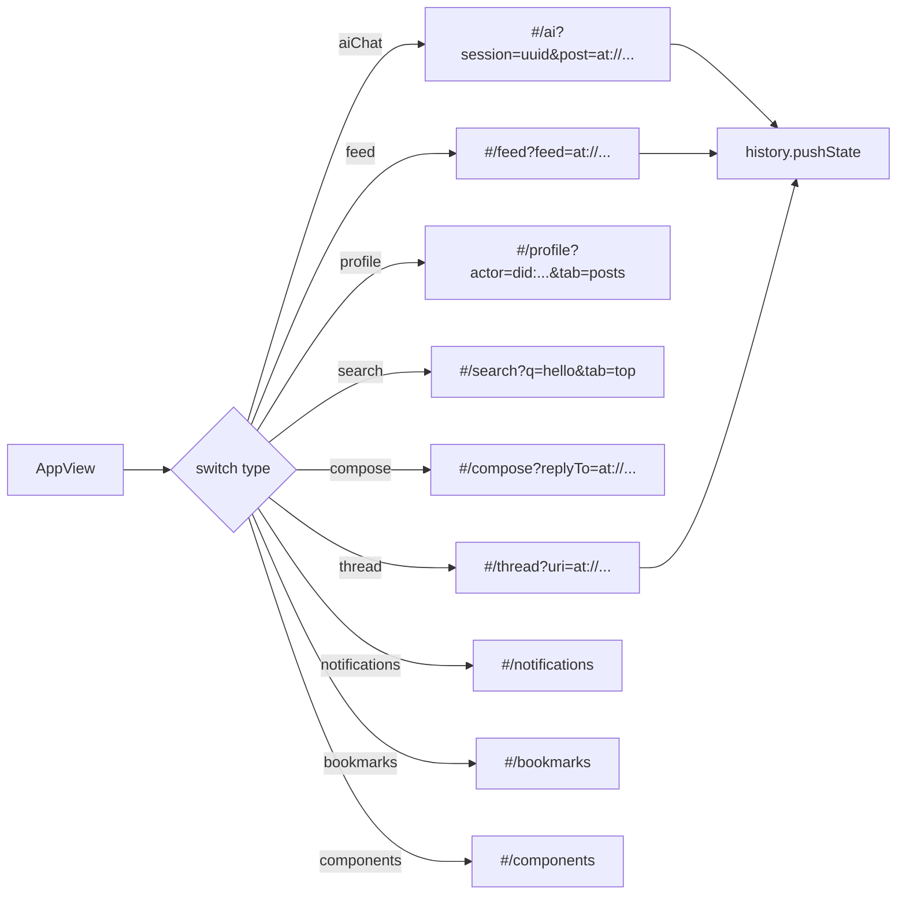
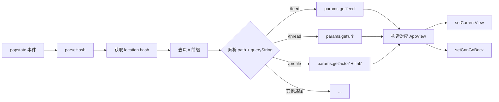
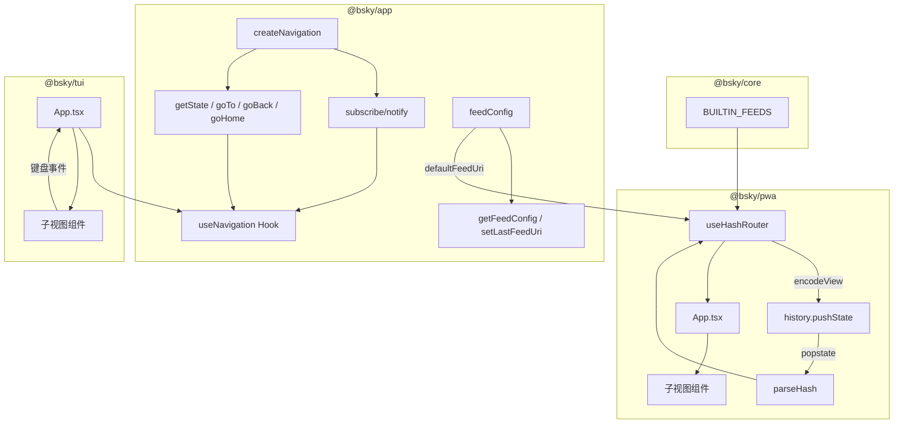

现在我已经获取了所有需要的源码。以下是完整页面内容。

---

# Navigator 与状态管理

导航系统是应用中唯一以"平面联合类型 + 栈式推送"取代传统路由表的模块。10 种视图共享同一个 `AppView` 类型，通过不可变栈的 push/pop 实现状态流转，**不依赖 URL 路径模式匹配**，从而在 TUI 终端和 PWA 浏览器两个渲染端共享同一套导航逻辑。

---

## AppView：10 种视图的联合类型

所有视图状态收敛为一个联合类型 `AppView`，每种视图由其 `type` 字面量区分，附加参数作为可选字段：

| 视图类型 | 必选参数 | 可选参数 | 语义 |
|---|---|---|---|
| `'feed'` | — | `feedUri?: string` | Feed 时间线。无 `feedUri` 时由运行时解析默认 Feed |
| `'detail'` | `uri: string` | — | 帖子详情（TUI 端未使用，PWA 端由 `'thread'` 替代） |
| `'thread'` | `uri: string` | — | 帖子线程视图 |
| `'compose'` | — | `replyTo?: string; quoteUri?: string` | 发帖编辑器 |
| `'profile'` | `actor: string` | `profileTab?: string` | 用户资料页（`profileTab` 控制初始标签页） |
| `'notifications'` | — | — | 通知列表 |
| `'search'` | — | `query?: string; searchTab?: string` | 搜索页 |
| `'aiChat'` | — | `contextUri?: string; sessionId?: string; contextPost?: string; contextProfile?: string` | AI 对话页 |
| `'bookmarks'` | — | — | 书签页 |
| `'components'` | — | — | 组件展示页（仅 PWA 调试用） |

这种设计的关键意图：**视图身份由 `type` 字段的字符串字面量唯一标识，参数作为可选的 payload 附加**。不需要类继承，不需要泛型约束，也不需要路由表配置——只依赖 TypeScript 的 discriminated union 类型收窄。

[来源](packages/app/src/state/navigation.ts#L1-L13)

---

## 栈式导航：不可变 `AppView[]` 与 Subscribe-Notify

### 核心数据结构

`createNavigation()` 是一个**纯工厂函数**，不依赖任何框架或浏览器 API。其内部状态仅为一个数组：

```ts
let stack: AppView[] = [{ type: 'feed' }];
```

栈底永远是 `{ type: 'feed' }`，栈顶即当前视图。

### 三个操作

**`goTo(view: AppView)`**——推入不可变副本：
```ts
function goTo(view: AppView) {
  stack = [...stack, view];
  notify();
}
```
不直接 `stack.push()`，而是创建新的数组引用，保证状态不可变。这符合 React 的引用相等性检测要求，也是 TUI 端 `useState` 能正确触发重渲染的前提。

**`goBack()`**——切片弹出栈顶：
```ts
function goBack() {
  if (stack.length > 1) {
    stack = stack.slice(0, -1);
    notify();
  }
}
```
保持栈底 `feed` 不可弹出。如果栈深度为 1，`goBack()` 是空操作。

**`goHome()`**——重置为单元素栈：
```ts
function goHome() {
  stack = [{ type: 'feed' }];
  notify();
}
```

### Subscribe-Notify 通知模式

工厂函数维护一个回调函数数组 `listeners: Array<() => void>`。每次 `notify()` 遍历执行所有监听器：

```ts
function subscribe(fn: () => void) {
  listeners.push(fn);
  return () => { listeners = listeners.filter(l => l !== fn); };
}
```

订阅返回取消函数，这是典型的"订阅-取消"模式，与 React 的 `useEffect` 清理周期天然配合。`getState()` 快照当前栈顶和 `canGoBack` 状态供订阅者读取。

[来源](packages/app/src/state/navigation.ts#L22-L64)

---

## useNavigation Hook：TUI 端的 React 集成

TUI 端使用 Ink（React-on-terminal），没有浏览器 URL 概念，因此直接使用 `NavigationController` 的纯内存状态：

```ts
export function useNavigation() {
  const [nav] = useState(() => createNavigation());
  const [state, setState] = useState(() => nav.getState());
  const tick = useCallback(() => setState(nav.getState()), [nav]);
  useEffect(() => nav.subscribe(tick), [nav, tick]);
  return { currentView: state.currentView, canGoBack: state.canGoBack, ... };
}
```

关键细节：

- **`useState(() => createNavigation())`** —— 工厂函数作为初始化器，只在首次渲染执行一次，组件重新挂载时不会重建。**这与 React 的 `useRef` 单例不同**——`useState` 的初始化函数在 StrictMode 下可能执行两次，但 TUI 端未启用 StrictMode，因此安全。
- **`subscribe(tick)`** —— 将 `setState`（调用 `nav.getState()` 的结果）注册到通知列表。每次 `goTo`/`goBack`/`goHome` 触发 `notify()` 时，`tick` 函数被调用，通过 `setState` 触发 React 重渲染。
- **这与 `useSyncExternalStore` 模式等价**，但使用更轻量的手动实现。

TUI 的 `App.tsx` 中，所有子视图组件（`UnifiedThreadView`、`ProfileView`、`NotifView` 等）通过 props 接收 `goTo` 和 `goBack`，通过键盘事件触发导航。完整快捷键映射见 [TUI 快捷键与导航](tui-快捷键与导航.md)。

[来源](packages/app/src/hooks/useNavigation.ts#L1-L18) | [来源](packages/tui/src/components/App.tsx#L53-L53)

---

## useHashRouter：PWA 的 Hash 路由编解码

PWA 端需要让 URL 地址栏反映当前视图，以支持浏览器前进/后退按钮、书签和分享链接。`useHashRouter` 实现了 **AppView ↔ URL Hash 的双向编解码**。

### 编码方向：AppView → Hash URL

`encodeView()` 将 `AppView` 映射为 `#/path?params` 格式：



Hash 格式一览：

| AppView | 编码结果 |
|---|---|
| `{ type: 'feed', feedUri: 'at://...' }` | `#/feed?feed=at%3A%2F%2F...` |
| `{ type: 'thread', uri: 'at://...' }` | `#/thread?uri=at%3A%2F%2F...` |
| `{ type: 'profile', actor: 'did:plc:...', profileTab: 'posts' }` | `#/profile?actor=did%3Aplc%3A...&tab=posts` |
| `{ type: 'compose', replyTo: 'at://...' }` | `#/compose?replyTo=at%3A%2F%2F...` |
| `{ type: 'aiChat', sessionId: 'uuid', contextPost: 'at://...' }` | `#/ai?session=uuid&post=at%3A%2F%2F...` |
| `{ type: 'search', query: 'hello', searchTab: 'top' }` | `#/search?q=hello&tab=top` |
| `{ type: 'notifications' }` | `#/notifications` |

`goTo` 调用 `encodeView` 后执行 `window.history.pushState(null, '', hash)`，将编码后的 hash 推入浏览器历史栈，同时更新 React 状态。

### 解码方向：popstate → AppView

当用户点击浏览器后退/前进按钮时，触发 `popstate` 事件：



核心逻辑在 `parseHash()` 中：提取 `location.hash`，去掉 `#` 前缀，用 `?` 分割出路径和查询字符串，`URLSearchParams` 解析参数，然后根据路径 `switch` 构造对应 `AppView`。

特别注意 `feed` 视图的 fallback 链：如果 URL 中没有 `feed` 参数，依次尝试 `getFeedConfig().defaultFeedUri` → `BUILTIN_FEEDS.following`。这确保了新用户首次访问时能自动跳转到合理的 Feed。

[来源](packages/pwa/src/hooks/useHashRouter.ts#L1-L152)

---

## 前后导航一致性：TUI 内存栈 vs PWA 历史栈

双端的回退导航机制存在本质差异：

| 维度 | TUI (`useNavigation`) | PWA (`useHashRouter`) |
|---|---|---|
| 栈实现 | `AppView[]` 数组（内存） | `window.history`（浏览器） |
| `goBack()` | `stack.slice(0, -1)` | `window.history.back()` |
| `canGoBack` | `stack.length > 1` | `hash !== '#/feed' && hash !== '' && hash !== '#/'` |
| 回退中间状态 | 直接弹出栈顶 | 依赖浏览器历史条目，可能跨页面 |
| 跨标签页问题 | 不存在 | `popstate` 事件监听可恢复状态 |

PWA 端的 `canGoBack` 判断受限于浏览器的限制：`window.history.length` 包含了其他页面的历史条目，因此不能直接使用 `history.length > 1`。实际实现中，`canGoBack` 在 `popstate` 处理器中通过检查当前 hash 是否指向 `feed` 来判断是否可回退。

**一个已知的边缘情况**：如果用户从应用外部页面（如 Google 搜索结果）导航进来，点击后退可能会回退到外部页面而非应用内上一视图。这是 Hash 路由的固有特性，不通过 URL 模式匹配的导航系统无法避免。

[来源](packages/pwa/src/hooks/useHashRouter.ts#L18-L22)

---

## 加载时自动重定向

`useHashRouter` 的 `useEffect` 在挂载时检测当前 hash。如果 hash 为空、为 `#/` 或裸 `#/feed`，会自动使用 `replaceState` 重写为带具体 Feed URI 的形式：

```ts
const raw = window.location.hash.replace(/^#/, '');
if (!raw || raw === '/' || raw === '/feed' || raw === '') {
  const defFeed = getFeedConfig().defaultFeedUri ?? BUILTIN_FEEDS.following;
  window.history.replaceState(null, '', `#/feed?feed=${encodeURIComponent(defFeed)}`);
}
```

使用 `replaceState` 而非 `pushState` 确保这次重定向不会污染浏览器历史栈。`BUILTIN_FEEDS` 定义了两个内置 Feed 的 AT URI：`following` 和 `discover`。

[来源](packages/pwa/src/hooks/useHashRouter.ts#L27-L35) | [来源](packages/core/src/at/feeds.ts#L2-L6)

---

## 设计权衡与经验

**1. 为什么不用 React Router？**

项目需要 TUI 和 PWA 共享导航逻辑。React Router 在终端环境（Ink）中不可用，且其路径匹配模式对 `AppView` 联合类型来说是多余的抽象层。直接使用 discriminated union + 栈结构，让两端各自适配底层平台——TUI 用内存数组，PWA 用 `history.pushState`。

**2. 不可变栈的成本**

每次 `goTo` 创建新数组（`[...stack, view]`），深度为 n 时复制 O(n)。但实际导航栈深度极少超过 10（用户不会连续深入 10 层嵌套视图），可以忽略不计。更重要的是，不可变引用保证了 React 能通过引用相等性跳过不必要的子树 diff。

**3. Subscribe-Notify vs React.Context**

`createNavigation()` 返回的 `subscribe/notify` 是传统的观察者模式，与具体的状态管理框架解耦。[@bsky/app：React Hooks 层](bsky-app-react-hooks-层.md) 中的所有纯 Store（如 `feedConfig`、`viewStateStore`）都采用同一模式：模块级可变状态 + `subscribe/notify` + `useState` 桥接。这样在非 React 环境（如 Node.js 脚本或测试）中可以直接调用 `getState()`/`goTo()` 而不需要渲染组件。

[来源](packages/app/src/state/navigation.ts#L1-L64) | [来源](packages/app/src/hooks/useActiveFeed.ts#L1-L21)

---

## 架构总览



---

## 推荐阅读

- [三层架构设计](三层架构设计.md) — 理解纯 Store 层在整个架构中的定位
- [用户界面：TUI 与 PWA](用户界面-tui-与-pwa.md) — 两种运行模式的导航差异对比
- [TUI 快捷键与导航](tui-快捷键与导航.md) — TUI 端的完整键盘导航快捷键映射
- [PWA 浏览器应用实现](pwa-浏览器应用实现.md) — PWA 侧的整体组件树和渲染流程
- [Widget 系统与扩展点](widget-系统与扩展点.md) — Widget 如何通过 `goTo` 接口触发导航