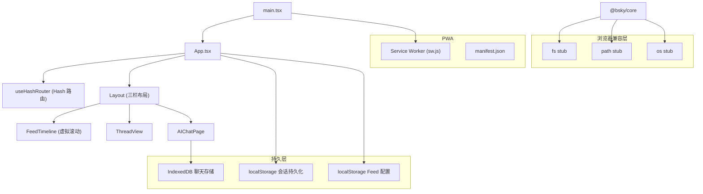
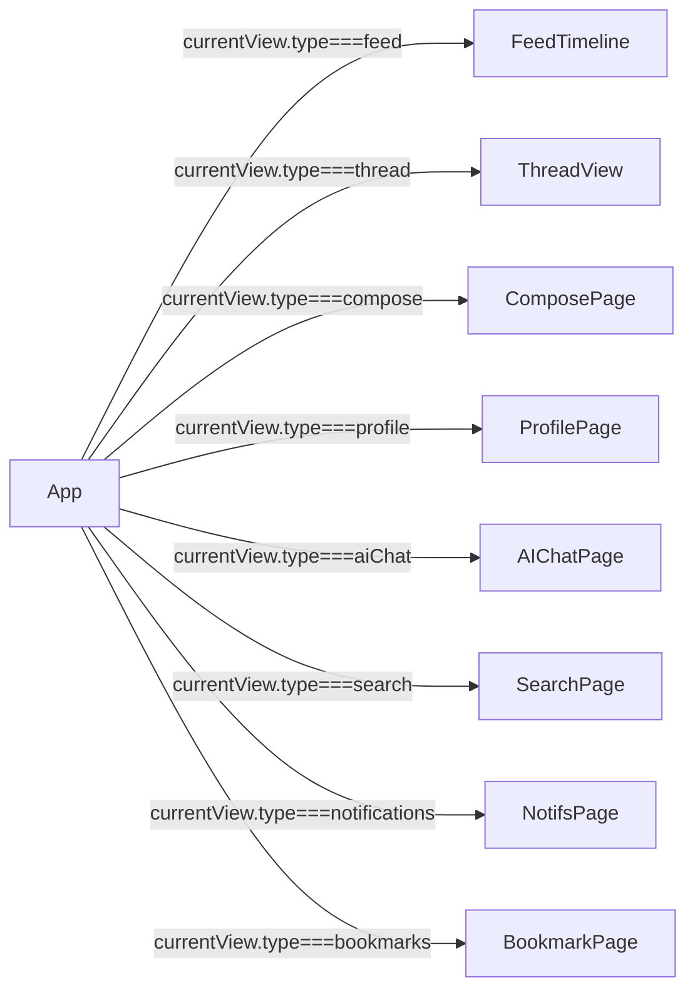

# PWA 浏览器应用实现

## 架构概览

PWA 浏览器应用是 Bluesky 客户端的第二种运行形态，与 [TUI 终端界面实现](tui-终端界面实现.md) 共享 `@bsky/core` 和 `@bsky/app` 两层，只在渲染层不同。它基于 **React DOM + Tailwind CSS + Vite** 构建，兼容静态托管部署。



[来源](packages/pwa/src/main.tsx#L1-L17) | [来源](packages/pwa/src/App.tsx#L1-L15) | [来源](packages/pwa/vite.config.ts#L1-L18)

---

## Hash 路由：基于 `history.pushState` + `popstate`

PWA 部署在静态托管平台（如 Cloudflare Pages、Netlify），不支持服务端路由重写，因此必须使用 **Hash 路由**——所有视图编码在 URL 的 `#` 之后。

`useHashRouter` Hook 的核心机制：

1. **编码/解码**：`encodeView()` 将 `AppView` 对象转为 `#/path?key=value` 格式，`parseHash()` 反向解析。所有 URI 参数经 `encodeURIComponent` 编码。
2. **pushState + popstate**：`goTo()` 使用 `window.history.pushState` 推入新历史条目，浏览器前进/后退触发 `popstate` 事件供 Hook 监听。
3. **默认 Feed 重定向**：当哈希为空或仅为 `#/feed`（无 feed 参数）时，自动使用 `getFeedConfig().defaultFeedUri` 补充 feed 参数。

**Hash 格式一览**：

```typescript
#/feed?feed=at://...           // 时间线
#/thread?uri=at://...          // 帖子线程
#/profile?actor=did:plc:...    // 用户资料
#/notifications                 // 通知
#/search?q=...                  // 搜索
#/bookmarks                     // 书签
#/compose?replyTo=at://...      // 发帖
#/ai?session=...                // AI 对话
```

```typescript
// encodeView 与 parseHash 互为逆操作
function parseHash(): AppView { /* 从 window.location.hash 解析 */ }
function encodeView(view: AppView): string { /* 将 AppView 编码为 hash */ }

// 导航操作
const goTo = useCallback((view: AppView) => {
  const hash = encodeView(view);
  window.history.pushState(null, '', hash);
  setCurrentView(view);
  setCanGoBack(true);
}, []);
```

[来源](packages/pwa/src/hooks/useHashRouter.ts#L1-L199)

---

## 虚拟滚动：@tanstack/react-virtual + FeedTimeline

Feed 时间线可能包含数百条帖子，直接渲染全部 DOM 节点会导致性能问题。`FeedTimeline` 组件使用 `@tanstack/react-virtual` 的 `useVirtualizer` 实现虚拟滚动。

```typescript
const virtualizer = useVirtualizer({
  count: posts.length,
  getScrollElement: () => scrollRef.current,
  estimateSize: () => 120, // 每帖估计高度 120px
  overscan: 5,             // 可见区域外预渲染 5 个
});
```

**关键实现细节**：

- **`estimateSize`**：每项固定 120px 估计值，实际高度由 `measureElement` 自动校准。
- ****绝对定位渲染**：虚拟项通过 `transform: translateY(${start}px)` 定位在滚动容器内，容器总高度由 `getTotalSize()` 设置。
- **滚动位置恢复**：通过 `initialScrollIndex` + `scrollToIndex` 实现。当用户从帖子详情返回时间线时，恢复之前的滚动位置。
- **`data-index` 属性**：每个虚拟项设置 `data-index`，配合 `measureElement` 自动测量实际 DOM 高度并校准虚拟滚动。
- **IntersectionObserver 哨兵**：底部设置哨兵元素，当用户滚动到底部时自动触发 `loadMore`。这比手动滚动事件监听更高效。

```typescript
// 哨兵元素触发自动加载更多
useEffect(() => {
  const el = sentinelRef.current;
  if (!el || !loadMore || !cursor) return;
  const obs = new IntersectionObserver(
    ([entry]) => { if (entry?.isIntersecting) loadMore(); },
    { root: scrollRef.current, rootMargin: '200px' },
  );
  obs.observe(el);
  return () => obs.disconnect();
}, [loadMore, cursor, posts.length]);
```

[来源](packages/pwa/src/components/FeedTimeline.tsx#L1-L192) | [来源](packages/pwa/package.json#L17)

---

## IndexedDB 存储：ChatStorage 接口实现

PWA 的聊天记录存储在浏览器 IndexedDB 中，而非文件系统。`IndexedDBChatStorage` 实现了 `ChatStorage` 抽象接口，与 [聊天存储：ChatStorage 接口](聊天存储-chatstorage-接口.md) 中定义的接口一致。

```typescript
const DB_NAME = 'bsky-chats';
const DB_VERSION = 1;
const STORE_NAME = 'chats';

function openDB(): Promise<IDBDatabase> {
  return new Promise((resolve, reject) => {
    const req = indexedDB.open(DB_NAME, DB_VERSION);
    req.onupgradeneeded = () => {
      const db = req.result;
      if (!db.objectStoreNames.contains(STORE_NAME)) {
        db.createObjectStore(STORE_NAME, { keyPath: 'id' });
      }
    };
    req.onsuccess = () => resolve(req.result);
    req.onerror = () => reject(req.error);
  });
}
```

**实现要点**：

- **单 Object Store**：以 `id` 为 keyPath，存储完整的 `ChatRecord` 对象。
- **`withStore` 辅助函数**：每次操作打开新连接 + 事务，简化 CRUD 代码（连接池由浏览器管理）。
- **`listChats` 按 `updatedAt` 降序**：返回摘要时过滤出用户/助手的消息计数，按更新时间排序。
- **对比 TUI 的文件存储**：TUI 使用 `gw`（FileChatStorage）将每个聊天存为 `{id}.json` 文件；PWA 的 IndexedDB 方案无需 `fs`、`path` 等 Node 模块。

[来源](packages/pwa/src/services/indexeddb-chat-storage.ts#L1-L65)

---

## Node 模块 Stub：浏览器兼容垫片

`@bsky/core` 模块中的 `FileChatStorage` 依赖于 `fs`、`path`、`os` 三个 Node.js 内置模块。在浏览器环境中这些模块不可用，因此在 `vite.config.ts` 中通过 resolve alias 将它们替换为轻量级 stub。

```typescript
// vite.config.ts
resolve: {
  alias: {
    os: resolve(__dirname, 'src/stubs/os.ts'),
    fs: resolve(__dirname, 'src/stubs/fs.ts'),
    path: resolve(__dirname, 'src/stubs/path.ts'),
  },
},
```

三个 stub 的实现极度精简，仅提供浏览器可能调用的函数签名：

| 模块 | 真实函数 | Stub 行为 |
|------|----------|-----------|
| `fs` | `existsSync` | 始终返回 `false` |
| `fs` | `readFileSync` | 始终返回空字符串 `''` |
| `fs` | `writeFileSync` | 无操作 |
| `fs` | `mkdirSync` | 无操作 |
| `fs` | `readdirSync` | 返回空数组 `[]` |
| `fs` | `unlinkSync` | 无操作 |
| `path` | `join` | 用 `/` 拼接参数 |
| `os` | `homedir` | 返回 `'/'` |

由于 PWA 使用 `IndexedDBChatStorage` 而非 `FileChatStorage`，这些 fs 方法实际上很少被调用。stub 存在的意义仅仅是让 `@bsky/core` 在浏览器构建时**不报模块未找到错误**。

[来源](packages/pwa/src/stubs/fs.ts#L1-L7) | [来源](packages/pwa/src/stubs/path.ts#L1-L2) | [来源](packages/pwa/src/stubs/os.ts#L1-L2) | [来源](packages/pwa/vite.config.ts#L9-L12)

---

## Service Worker 注册

Service Worker 在 `main.tsx` 入口处注册：

```typescript
if ('serviceWorker' in navigator) {
  window.addEventListener('load', () => {
    navigator.serviceWorker.register('./sw.js', { scope: './' }).then(
      (reg) => console.log('[PWA] SW registered:', reg.scope),
      (err) => console.warn('[PWA] SW registration failed:', err),
    );
  });
}
```

**注册策略**：

- `load` 事件后注册，避免与页面首次渲染争抢资源。
- `scope: './'` 限定在同级目录范围内拦截请求。
- 注册失败不影响应用功能（降级为无离线能力的普通网页）。

**Service Worker 缓存策略**（`public/sw.js`）：

| 请求目标 | 策略 | 缓存名 | 理由 |
|----------|------|--------|------|
| `cdn.bsky.app` 图片 | Cache First | `bsky-img-v1` | 内容寻址，不可变 |
| `fonts.gstatic.com` | Cache First | `bsky-font-v1` | 字体文件极少变更 |
| `fonts.googleapis.com` | Stale-While-Revalidate | `bsky-font-v1` | CSS 配置可能更新 |
| API 请求 (`bsky.social` 等) | Network First | `bsky-v3` | 需要最新数据 |
| `/assets/` 构建产物 | Cache First | `bsky-v3` | 带 hash 的文件名 |
| HTML 页面 | Stale-While-Revalidate | `bsky-v3` | 可能包含未 hash 的资源 |

**`staleWhileRevalidate`**：优先返回缓存内容（即时展示），同时在后台发起网络请求更新缓存。适合 HTML 页面——即使不是最新版本也比白屏好。

[来源](packages/pwa/src/main.tsx#L8-L15) | [来源](packages/pwa/public/sw.js#L1-L107)

---

## manifest.json：PWA 配置

`public/manifest.json` 定义了应用安装到设备主屏幕时的表现：

```json
{
  "name": "Bluesky Client",
  "short_name": "Bluesky",
  "description": "Bluesky social client with AI integration — timeline, thread, compose, AI chat",
  "start_url": "./",
  "display": "standalone",
  "background_color": "#FFFFFF",
  "theme_color": "#00A5E0",
  "orientation": "any",
  "icons": [
    { "src": "icons/icon-64.png",  "sizes": "64x64",   "type": "image/png" },
    { "src": "icons/icon-192.png", "sizes": "192x192", "type": "image/png", "purpose": "any maskable" },
    { "src": "icons/icon-512.png", "sizes": "512x512", "type": "image/png", "purpose": "any maskable" }
  ]
}
```

关键配置说明：

- **`display: standalone`**：应用以独立窗口运行，无浏览器地址栏/工具栏，模拟原生应用体验。
- **`theme_color: #00A5E0`**：对应 Bluesky 品牌蓝色，影响系统状态栏颜色。
- **`purpose: "maskable"`**：图标支持自适应形状，在不同设备上可被裁剪为圆形、圆角矩形等。
- **`orientation: any`**：不限制屏幕方向。

[来源](packages/pwa/public/manifest.json#L1-L29)

---

## App.tsx：视图调度中心

`App.tsx` 是整个 PWA 的根组件，承担**视图路由分发**和**全局状态初始化**职责。



**核心职责**：

1. **会话恢复**：useEffect 中从 `localStorage` 读取保存的 JWT，调用 `restoreSession()`。
2. **认证状态同步**：登录成功后保存 session 到 `localStorage`；认证错误时（如 session 过期）清除。
3. **AI 配置解析**：`resolveScenarioConfig` 处理场景模型覆盖（`"deepseek/deepseek-v4-flash"` → 解析 provider + model）。
4. **Widget 注册**：在 mount 时注册所有 Widget（PolishWidget、ProfilePreviewWidget 等）。
5. **最后活跃 Feed URI 追踪**：每次进入 feed 视图时更新，以便侧边栏导航回默认 feed。

[来源](packages/pwa/src/App.tsx#L1-L250)

---

## 相关章节

- [用户界面：TUI 与 PWA](用户界面-tui-与-pwa.md) — 两种运行模式的对比
- [@bsky/app：React Hooks 层](bsky-app-react-hooks-层.md) — 共享 Hooks
- [聊天存储：ChatStorage 接口](聊天存储-chatstorage-接口.md) — 存储抽象层
- [部署 PWA 到静态托管](部署-pwa-到静态托管.md) — 构建与部署
- [三层架构设计](三层架构设计.md) — 整体设计哲学