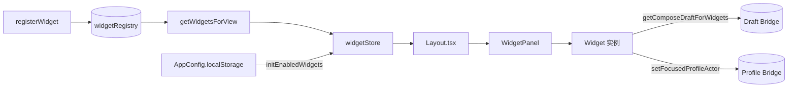

# Widget 系统与扩展点

Bluesky 的 PWA 客户端引入了一套 **Widget 系统**，允许开发者注册可插拔的 UI 组件，并按当前浏览的视图（View）动态启用/禁用。其设计目标是：**Widget 的注册、启停、数据共享三者解耦**，分别由 `widgetRegistry.ts`（注册中心）、`widgetStore.ts`（运行时状态）、`WidgetContext`（上下文注入）三个模块承担。

---

## 架构总览



三类模块各司其职：

| 模块 | 职责 | 文件 |
|---|---|---|
| **Registry** | 注册 Widget 定义与渲染函数，按视图过滤 | `packages/app/src/hooks/widgetRegistry.ts` |
| **Store** | 管理启用状态（Set<string>），跨 Widget 数据桥接 | `packages/app/src/hooks/widgetStore.ts` |
| **Consumer** | 初始化状态、渲染面板、持久化到 localStorage | `packages/pwa/src/components/Layout.tsx` |

[来源](packages/app/src/hooks/widgetRegistry.ts) · [来源](packages/app/src/hooks/widgetStore.ts) · [来源](packages/pwa/src/components/Layout.tsx)

---

## WidgetDefinition：注册契约

每一个 Widget 必须提供一个 **定义**（Definition）和一个 **渲染函数**（Render Function）。定义由 `WidgetDefinition` 接口描述：

```typescript
interface WidgetDefinition {
  id: string;                    // 唯一标识符，如 'polish'
  titleKey: string;              // i18n 键，用于显示名称
  icon: string;                  // 图标名称，对应 Icon 组件
  views: string[];               // 可见的视图列表，空数组 = 所有视图
  defaultOpen: boolean;          // 首次加载时是否默认启用
}
```

[来源](packages/app/src/hooks/widgetRegistry.ts#L1-L22)

### 实际注册的 Widget

PWA 在 `App.tsx` 的 `useEffect` 中一次性注册了 5 个内置 Widget：

| ID | 用途 | 所属视图 | 默认启用 |
|---|---|---|---|
| `polish` | AI 润色草稿 | `compose` | ✅ |
| `profilePreview` | 查看当前帖子作者信息 | `thread` | ✅ |
| `suggestedFollows` | 推荐关注 | 全部 | ❌ |
| `suggestedFeeds` | 推荐 Feed | 全部 | ❌ |
| `trends` | 趋势话题 | 全部 | ❌ |

注册时，`render` 函数接受 `WidgetProps`（含 `onClose` 和 `context`），返回 `ReactNode`：

```typescript
registerWidget({
  id: 'polish',
  titleKey: 'action.polish',
  icon: 'file-text',
  views: ['compose'],
  defaultOpen: true,
}, (props) => React.createElement(PolishWidget, props));
```

`views: ['compose']` 意味着此 Widget **只在编辑帖子视图可见**；`views: []`（空数组）则 **在所有视图中均可启用**。

[来源](packages/pwa/src/App.tsx#L92-L124)

---

## 注册机制

`widgetRegistry.ts` 维护一个模块级 `Map<string, WidgetEntry>`：

```typescript
const _registry: Map<string, WidgetEntry> = new Map();

function registerWidget(def, render) {
  _registry.set(def.id, { ...def, render });
}
```

三个查询函数：

- **`getWidget(id)`** — 按 ID 精确查找
- **`getWidgets()`** — 返回所有注册的 Widget
- **`getWidgetsForView(viewType)`** — 返回在当前视图下可见的 Widget（`views.length === 0` 或 `views.includes(viewType)`）

视图过滤的规则是：**views 为空数组的 Widget 在任何视图都可见，非空数组的 Widget 仅在 views 列表中出现的视图可见**。这意味着 `getWidgetsForView` 返回的列表是「可选」而非「已启用」的，启用状态由 Store 层管理。

[来源](packages/app/src/hooks/widgetRegistry.ts#L24-L44)

---

## widgetStore：状态管理

### 启用状态

Store 使用一个模块级 `Set<string>` 追踪哪些 Widget 被启用：

```typescript
const _enabled: Set<string> = new Set();
```

**`initEnabledWidgets(ids: string[])`** — 清空并重新初始化。在 `Layout.tsx` 的 `useEffect` 中调用，从 `AppConfig.enabledWidgets`（持久化在 localStorage）恢复状态。若 localStorage 中没有任何记录，则自动启用所有 `defaultOpen: true` 的 Widget 并写入配置：

```typescript
useEffect(() => {
  const existing = config.enabledWidgets || [];
  if (existing.length > 0) {
    initEnabledWidgets(existing);
  } else {
    const defaultIds = getWidgetsForView(currentView.type)
      .filter(w => w.defaultOpen).map(w => w.id);
    initEnabledWidgets(defaultIds);
    if (defaultIds.length > 0) {
      onConfigChange({ ...config, enabledWidgets: defaultIds });
    }
  }
}, []);
```

**启停三个核心函数：**

| 函数 | 行为 | 返回值 |
|---|---|---|
| `enableWidget(id)` | 若 Widget 已注册，加入 Set | `void` |
| `disableWidget(id)` | 从 Set 中删除 | `void` |
| `toggleWidget(id)` | 取反，enable/disable 二选一 | `boolean`（启用后为 `true`） |

每次 toggle 后，`Layout.tsx` 会将最新的 `getEnabledWidgetIds()` 写回 `AppConfig`，实现持久化。

**`getEnabledWidgetsForView(viewType)`** — 组合查询：先调用 Registry 的 `getWidgetsForView` 按视图过滤，再为每个 Widget 标注 `enabled: boolean` 字段，供 UI 面板渲染启用状态。

[来源](packages/app/src/hooks/widgetStore.ts#L1-L36) · [来源](packages/pwa/src/components/Layout.tsx#L62-L79)

### 跨 Widget 草稿共享

因为 Widget 面板（右栏）和主内容区（Compose 页面）渲染在不同的 React 子树中，直接传 prop 会破坏解耦。Widget Store 提供了一组模块级变量作为 **草稿桥（Draft Bridge）**：

```typescript
let _composeDraft = '';
let _composeDraftSetter: ((text: string) => void) | null = null;

setComposeDraftForWidgets(text)   // 写入当前草稿
getComposeDraftForWidgets()        // 读取当前草稿
registerComposeDraftSetter(fn)     // 注册外部 setter
replaceComposeDraft(text)          // 通过 setter 替换草稿
```

**工作流程：**

1. `Layout.tsx` 从 `ComposePage` 拿到 `composeDraft` 和 `onComposeDraftChange`，注入到 `WidgetContext`
2. Widget 优先读取上下文中的 `context.composeDraft`，回退到模块级 `getComposeDraftForWidgets()`
3. 当 `PolishWidget` 生成润色结果后，调用 `onComposeDraftChange?.(result)`（若从模态框打开）或 `replaceComposeDraft(result)`（若在右面板）

```typescript
// PolishWidget.tsx
const draft = wtContext?.composeDraft ?? getComposeDraftForWidgets();
const onReplace = wtContext?.onComposeDraftChange ?? replaceComposeDraft;
```

[来源](packages/app/src/hooks/widgetStore.ts#L38-L45) · [来源](packages/pwa/src/components/widgets/PolishWidget.tsx#L13-L16)

### 聚焦用户上下文

`setFocusedProfileActor` / `getFocusedProfileActor` 提供另一种上下文桥接——当用户在某个视图中点击或聚焦某个用户时，右面板的 Widget 可以据此展示对应的资料。目前该 API 已在 `widgetStore.ts` 中定义并导出，但尚未被任何消费方调用，是预留的扩展点。

[来源](packages/app/src/hooks/widgetStore.ts#L48-L50)

---

## WidgetContext：运行上下文

`WidgetContext` 是注入给每个 Widget 的上下文对象，由 `Layout.tsx` 构造并传递给 `WidgetPanel`：

```typescript
interface WidgetContext {
  composeDraft?: string;              // 当前草稿文本（compose 视角）
  onComposeDraftChange?: (text) => void; // 替换草稿的回调
  viewType?: string;                  // 当前视图类型，如 'compose', 'thread'
  client?: BskyClient;                // Bluesky API 客户端
  threadUri?: string;                 // 当前线程 URI（thread 视图）
  polishConfig?: AIConfig;            // 润色模型配置
  goTo?: (v: AppView) => void;        // 导航函数
  [key: string]: unknown;             // 扩展槽
}
```

Widget 通过 `WidgetProps.context` 获取该上下文。5 个内置 Widget 各取所需：

- **PolishWidget** — 读取 `composeDraft`、`polishConfig`
- **ProfilePreviewWidget** — 读取 `client`、`threadUri`，根据线程 URI 获取帖子作者
- **SuggestedFollowsWidget** — 读取 `client`、`goTo`
- **SuggestedFeedsWidget** — 读取 `client`
- **TrendsWidget** — 读取 `client`、`goTo`

[来源](packages/app/src/hooks/widgetRegistry.ts#L1-L12) · [来源](packages/pwa/src/components/Layout.tsx#L112-L121)

---

## WidgetPanel 与 WidgetPicker：UI 渲染

**WidgetPanel** 是右侧面板的实际渲染组件。它接收 `viewType`、`enabledIds`、`context`，执行两步过滤：

1. 通过 `getWidgetsForView(viewType)` 获取当前视图可用的 Widget
2. 进一步筛选出 `enabledIds` 中包含的 Widget
3. 按 `views.length > 0`（视图限定 Widget）置顶排序

**WidgetPicker** 是一个模态对话框，列出全部已注册的 Widget，显示当前启用状态。用户点击某项即可调用 `toggleWidget` 切换启用/禁用。

[来源](packages/pwa/src/components/WidgetPanel.tsx) · [来源](packages/pwa/src/components/WidgetPicker.tsx)

---

## 与 Config 系统的关系

Widget 的启用状态通过 `AppConfig.enabledWidgets` 持久化到 localStorage：

- **读取**：`Layout.tsx` 挂载时从 `config.enabledWidgets` 恢复
- **写入**：每次 toggle 后调用 `onConfigChange` 更新整个 config 对象
- **默认值**：首次加载且无持久化记录时，自动启用 `defaultOpen: true` 的 Widget

[来源](packages/pwa/src/hooks/useAppConfig.ts#L21-L22)

---

## 扩展指南

要添加一个新 Widget，只需三步：

1. **在 `packages/pwa/src/components/widgets/` 下创建组件**，接受 `WidgetProps` 参数
2. **在 `App.tsx` 中调用 `registerWidget`**，指定 `id`、`titleKey`、`icon`、`views`、`defaultOpen`
3. **若需要共享数据**，通过 `WidgetContext` 传递，或使用 Store 中的 `setComposeDraftForWidgets` / `setFocusedProfileActor` 等桥

```typescript
registerWidget({
  id: 'myCustomWidget',
  titleKey: 'widget.myCustomWidget',
  icon: 'star',
  views: ['feed', 'thread'],  // 仅在 feed 和 thread 视图可用
  defaultOpen: false,
}, (props) => React.createElement(MyCustomWidget, props));
```

Widget 系统与 [Navigator 与状态管理](navigator-与状态管理.md) 协同工作——`WidgetContext` 中的 `viewType` 和 `goTo` 直接来自 NavigationController，使 Widget 能感知当前视图并导航。

---

## 下一步

- 查看内置 Widget 的完整实现：[PWA 组件目录](packages/pwa/src/components/widgets/)
- 了解视图类型系统：[Navigator 与状态管理](navigator-与状态管理.md)
- 探索 AppConfig 持久化机制：[配置指南](配置指南.md)
- 了解 PWA 整体架构：[PWA 浏览器应用实现](pwa-浏览器应用实现.md)