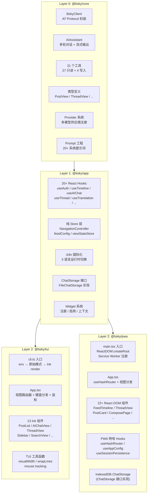

现在信息足够，开始撰写。

---

# 三层架构设计

> **金科玉律：每一行业务逻辑只在 core 或 app 中出现一次。渲染层代码只负责"画界面"——它不直接调用 BskyClient，不管理认证状态，不缓存聊天记录。**

整个项目采用严格的三层单向依赖架构，从底向上依次为：**Core**（零 UI 依赖的纯 TypeScript 层）→ **App**（React Hooks + 纯 Store 层）→ **TUI / PWA**（渲染层）。依赖关系不可逆：Core 不知道 App 的存在，App 不知道 TUI 或 PWA 的存在。

---

## 第一性原理：业务逻辑只出现一次

这是整个系统的设计基石。任何功能需求，开发者必须先判断它属于哪一层：

- **"如何与 Bluesky API 通信？"** → Core。`BskyClient` 封装了所有 AT Protocol 端点，`AIAssistant` 封装了 LLM 多轮对话与工具调用。TUI 和 PWA 从不直接构造 fetch 请求。
- **"用户按了回车键后发生什么？"** → App。`useCompose` 处理发帖流程，`useAuth` 处理登录/登出，`useAIChat` 管理对话状态。渲染层只调用 Hook 暴露的 `sendMessage()`，不关心内部是如何调用 AIAssistant 的。
- **"如何把帖子画到屏幕上？"** → TUI/PWA。`PostItem.tsx` 调用 `postToLines()` 把 PostView 转为文本行，`PostCard.tsx` 渲染带 Tailwind 样式的卡片组件。它们从不直接调用 `client.getTimeline()`。

这条规则由 monorepo 的包依赖关系强制执行：TUI 和 PWA 的 `package.json` 同时依赖 `@bsky/core` 和 `@bsky/app`，但 App 只依赖 Core 不依赖渲染层，Core 零依赖（仅 `ky` + `dotenv`）。[来源](packages/tui/package.json#L23-L24) [来源](packages/pwa/package.json#L14-L15) [来源](packages/core/package.json#L17-L21)

---

## Layer 0：@bsky/core — 纯 TypeScript 内核

**定位**：零 UI 依赖的库，可在任何 JavaScript 运行时（Node.js、浏览器、Deno）中使用。

**职责**：

| 模块 | 导出 | 职责 |
|------|------|------|
| `BskyClient` | `from './at/client.js'` | 基于 `ky` HTTP 客户端的 AT Protocol 封装，含 JWT 自动刷新、所有 API 端点 |
| `AIAssistant` | `from './ai/assistant.js'` | 多轮对话引擎，流式 SSE 输出，工具调用管道 |
| `createTools` | `from './ai/tools.js'` | 31 个工具定义 + 处理器（27 只读 + 4 写入），含 Write Confirmation Gate |
| 类型定义 | `from './at/types.js'` | `PostView`、`ProfileView`、`ThreadViewPost` 等 15+ 核心类型 |
| Provider 系统 | `from './ai/providers.js'` | 多供应商注册，模型信息，推理风格配置 |
| Prompt 工程 | `from './ai/prompts.js'` | 集中管理的 20+ 系统提示词，遵循 `P_`/`PF_` 命名约定 |
| Feed 工具 | `from './at/feeds.js'` | `BUILTIN_FEEDS`、`resolveFeedId`、`getFeedLabel` |

**零 UI 依赖的证明**：Core 的 `package.json` 中只有 `ky`（HTTP 客户端）和 `dotenv`（环境变量）两个运行时依赖。[来源](packages/core/src/index.ts#L1-L44) [来源](packages/core/package.json#L17-L21)

**31 个工具的构成**：27 个只读工具（`resolve_handle`、`search_posts`、`get_timeline`、`get_post_thread_flat`、`fetch_web_markdown` 等）覆盖了 Bluesky 的全部只读数据面；4 个写工具（`create_post`、`like`、`repost`、`follow`）经过 Write Confirmation Gate 门控，需用户确认后才执行。[来源](packages/core/src/ai/tools.ts#L56-L890)

---

## Layer 1：@bsky/app — React Hooks + 纯 Store 层

**定位**：可跨渲染框架复用的 React 逻辑层。PWA 和 TUI 共享同一套 Hooks——`useHashRouter` 和 `useSessionPersistence` 是 PWA 独有的扩展，前者替代了 TUI 的键盘导航，后者替代了 TUI 的内存会话。

**职责**：

| 类别 | 导出 | 职责 |
|------|------|------|
| **认证** | `useAuth` | 登录/登出、会话管理、JWT 刷新 |
| **时间线** | `useTimeline` | Feed 加载、分页、Feed 切换 |
| **帖子操作** | `usePostActions` | 点赞/转发/查看用户 |
| **帖子详情** | `usePostDetail` | 帖子详情 + 操作集 |
| **讨论串** | `useThread` | 扁平化线程视图 (`FlatLine`) |
| **撰帖** | `useCompose` | 发帖/回复/图片上传 |
| **草稿箱** | `useDrafts` | 多草稿管理 (`DraftStore`) |
| **AI 对话** | `useAIChat` | 流式 AI 对话状态管理 |
| **聊天历史** | `useChatHistory` | 会话记录列表/加载/删除 |
| **翻译** | `useTranslation` | 7 语言双模式翻译 |
| **用户资料** | `useProfile` | 资料 + 关注列表 |
| **搜索** | `useSearch` | 帖子/用户搜索 + 标签切换 |
| **通知** | `useNotifications` | 通知列表 |
| **书签** | `useBookmarks` | 收藏帖子管理 |
| **活跃 Feed** | `useActiveFeed` | 当前 Feed URI 跟踪 |
| **滚动恢复** | `useScrollRestore` | 视图切换滚动位置保留 |
| **导航** | `useNavigation` / `createNavigation` | `NavigationController` 栈式导航 |
| **国际化** | `useI18n` | 中/英/日三语言运行时切换 |
| **Widget** | `widgetRegistry` / `widgetStore` | 插件式 UI 组件注册 |
| **Feed 配置** | `getFeedConfig` / `saveFeedConfig` | 自定义 Feed 持久化 |

**Store 模式**：App 层的"状态管理"不使用 Redux/Zustand 等框架。导航使用 `NavigationController`（栈 + 订阅模式），Feed 配置使用 `feedConfig.ts`（localStorage 读写 + 内存缓存），视图状态使用 `viewStateStore.ts`（挂起/恢复）。所有 Store 都是纯函数 + 单例订阅者模式，不依赖 React Context。[来源](packages/app/src/index.ts#L1-L45)

**关键的接口抽象**：`ChatStorage` 是 App 层定义的抽象接口（`saveChat` / `loadChat` / `listChats` / `deleteChat`），TUI 用 `FileChatStorage`（JSON 文件）实现，PWA 用 IndexedDB 实现。渲染层只需注入实现。[来源](packages/app/src/services/chatStorage.ts)

---

## Layer 2：@bsky/tui — 终端渲染层

**定位**：基于 Ink（React-on-terminal）的终端客户端。

**入口**：`cli.ts` — 加载 `.env` 配置、初始化原始模式 stdin、调用 `ink.render()` 挂载 App 组件。[来源](packages/tui/src/cli.ts)

**视图路由器**：`App.tsx` 组件充当单一视图路由器，接收来自 `useNavigation` 的 `currentView` 状态，根据 `AppView` 类型分发到对应的 Ink 组件。键盘事件通过 Ink 的 `useInput` 统一监听，不依赖 DOM。[来源](packages/tui/src/components/App.tsx)

**TUI 专用工具**（PWA 不需要）：

| 工具 | 位置 | 用途 |
|------|------|------|
| `visualWidth(str)` | `tui/src/utils/text.ts` | CJK 终端列宽计算 |
| `wrapLines(text, cols, indent)` | `tui/src/utils/text.ts` | 智能换行 |
| `enableMouseTracking()` | `tui/src/utils/mouse.ts` | ANSI 鼠标追踪 |
| `parseMouseEvent(buf)` | `tui/src/utils/mouse.ts` | 解析 `\x1b[M...` 序列 |
| `postToLines(post, cols)` | `tui/src/components/PostItem.tsx` | 预计算帖子显示行 |

**不存在的职责**：TUI 不管理认证状态（委托给 `useAuth`），不直接调用 `BskyClient`（委托给 App 层的 Hooks），不管理对话状态（委托给 `useAIChat`）。

---

## Layer 2：@bsky/pwa — 浏览器渲染层

**定位**：基于 React DOM + Tailwind CSS + Vite 的渐进式 Web 应用。

**入口**：`main.tsx` — `ReactDOM.createRoot()` 挂载 App，注册 Service Worker。[来源](packages/pwa/src/main.tsx)

**路由方案**：PWA 使用 `useHashRouter` Hook（Hash-based 路由），通过 `history.pushState` + `popstate` 事件，以 `#/feed` / `#/thread/...` 格式编码 `AppView`。所有路由逻辑封装在一个 Hook 中，TUI 不需要它（TUI 用键盘导航替代）。[来源](packages/pwa/src/hooks/useHashRouter.ts)

**PWA 特有扩展**（App 层 Hooks 之外）：

| 模块 | 位置 | 用途 |
|------|------|------|
| `useHashRouter` | `pwa/src/hooks/useHashRouter.ts` | Hash-based 路由编码/解码 |
| `useAppConfig` | `pwa/src/hooks/useAppConfig.ts` | localStorage 配置持久化 |
| `useSessionPersistence` | `pwa/src/hooks/useSessionPersistence.ts` | 浏览器 session save/restore |
| `IndexedDB ChatStorage` | `pwa/src/services/indexeddb-chat-storage.ts` | `ChatStorage` 接口的 IndexedDB 实现 |
| Node 模块 stubs | `pwa/src/stubs/fs.ts` 等 | 浏览器端填补 `fs`/`path`/`os` |

**22+ 组件**：`FeedTimeline`（@tanstack/react-virtual 虚拟滚动）、`ThreadView`（带翻译）、`PostCard`（Tailwind 样式）、`ComposePage`（富文本编辑器）、`AIChatPage`（流式渲染）、`BookmarkPage`、`NotifsPage`、`ProfilePage`、`SearchPage` 等。另有 5 个 Widget 组件（`PolishWidget`、`TrendsWidget`、`ProfilePreviewWidget`、`SuggestedFollowsWidget`、`SuggestedFeedsWidget`）。[来源](packages/pwa/src/components/)

---

## 跨层职责对比

| 关注点 | Core | App | TUI | PWA |
|--------|------|-----|-----|-----|
| AT Protocol 通信 | ✅ `BskyClient` | ❌ | ❌ | ❌ |
| LLM 对话引擎 | ✅ `AIAssistant` | ❌ | ❌ | ❌ |
| 工具定义与执行 | ✅ 31 个 | ❌ | ❌ | ❌ |
| JWT 自动刷新 | ✅ `ky afterResponse` | ❌ | ❌ | ❌ |
| 认证状态管理 | ❌ | ✅ `useAuth` | ❌ | ❌ |
| 时间线数据管理 | ❌ | ✅ `useTimeline` | ❌ | ❌ |
| AI 对话状态 | ❌ | ✅ `useAIChat` | ❌ | ❌ |
| 导航路由 | ❌ | ✅ `NavigationController` | ❌ | ❌ |
| 国际化 | ❌ | ✅ `useI18n` | ❌ | ❌ |
| 聊天持久化接口 | ❌ | ✅ `ChatStorage` 接口 | ❌ | ❌ |
| 终端文本排版 | ❌ | ❌ | ✅ `visualWidth/wrapLines` | ❌ |
| 鼠标追踪 | ❌ | ❌ | ✅ ANSI 序列 | ❌ |
| 键盘快捷键 | ❌ | ❌ | ✅ `useInput` | ❌ |
| 虚拟滚动 | ❌ | ❌ | ✅ Viewport 渲染 | ✅ `@tanstack/react-virtual` |
| 路由 | ❌ | ❌ | ❌ | ✅ `useHashRouter` |
| Tailwind 样式 | ❌ | ❌ | ❌ | ✅ |
| Service Worker | ❌ | ❌ | ❌ | ✅ |
| 会话持久化 | ❌ | ❌ | ❌ | ✅ `localStorage` |

---

## 依赖注入模式

两层渲染层通过两种不同方式获取 App 层的 Hooks：

1. **参数注入**：`useTimeline(client, feedUri)` — TUI 和 PWA 都传入由 `useAuth` 返回的 `client` 实例。
2. **Context + 闭包**：`useAuth` 内部使用单例模式管理 `BskyClient` 实例，渲染层只需调用 `useAuth()` 即可访问。

`ChatStorage` 接口是经典策略模式：App 层定义接口，渲染层各自实现。TUI 的 `FileChatStorage` 使用 Node.js `fs` 模块写 JSON 文件，PWA 的 IndexedDB 实现使用浏览器原生 IndexedDB API。`useChatHistory` Hook 接受 `ChatStorage` 实例作为参数，渲染层在初始化时注入。[来源](packages/app/src/services/chatStorage.ts)

---

## 推荐阅读

- [@bsky/core：AT Protocol 客户端](bsky-core-at-protocol-客户端.md) — BskyClient 的完整设计，包括 JWT 自动刷新和所有 API 端点
- [@bsky/core：AI 助手系统](bsky-core-ai-助手系统.md) — AIAssistant 的多轮对话、31 个工具调用与流式输出
- [@bsky/app：React Hooks 层](bsky-app-react-hooks-层.md) — 20+ 共享 Hooks 的完整参考
- [31 个 AI 工具详解](31-个-ai-工具详解.md) — 27 只读 + 4 写入工具的详细定义
- [用户界面：TUI 与 PWA](用户界面-tui-与-pwa.md) — 两种运行模式的对比与选型建议
- [Navigator 与状态管理](navigator-与状态管理.md) — 10 种视图的栈式导航设计
- [聊天存储：ChatStorage 接口](聊天存储-chatstorage-接口.md) — 持久化抽象与双端实现