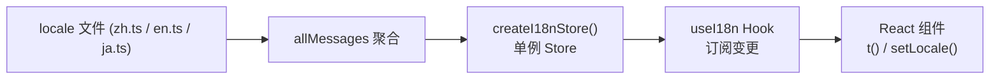

# 国际化 (i18n) 系统

一个三语言（中文/英文/日文）国际化系统，采用 **单例 Store + React Hook** 架构，支持运行时即时切换，无需刷新页面。

## 架构：单例 → 订阅 → 渲染

整个 i18n 系统分为三层，数据流是单向的：



### ① 模块级单例 Store

`store.ts` 中通过模块级变量 `_instance` 确保整个进程中只存在一个 `I18nStore` 实例：

```typescript
let _instance: I18nStore | null = null;

export function getI18nStore(initialLocale?: Locale): I18nStore {
  if (!_instance) {
    _instance = createI18nStore(initialLocale);
  }
  return _instance;
}
```

[来源](packages/app/src/i18n/store.ts#L56-L62)

`createI18nStore()` 返回的 Store 对象包含四个关键部分：

| 成员 | 作用 |
|---|---|
| `messages` | 当前语言的翻译映射表 |
| `setLocale(locale)` | 切换语言 → 更新 `messages` → 通知所有订阅者 |
| `t(key, params?)` | 翻译查询 + 插值（含三级回退链） |
| `subscribe(fn)` / `unsubscribe(fn)` | 发布-订阅机制 |

[来源](packages/app/src/i18n/store.ts#L5-L24)

### ② 三级回退机制

`t()` 方法的查找优先级确保了即使某个 key 在目标语言中缺失，用户也不会看到 `undefined`：

1. 当前语言的消息表（如 `allMessages.en`）
2. 英文消息表（`allMessages.en`）—— 始终作为保底
3. 中文消息表（`allMessages.zh`）—— 最后防线
4. 如果以上都不存在，返回 key 本身

```typescript
t(key: string, params?: Record<string, string | number>): string {
  const raw = store.messages[key];
  if (raw) return interpolate(raw, params);
  const en = allMessages.en[key];
  if (en) return interpolate(en, params);
  const zh = allMessages.zh[key];
  if (zh) return interpolate(zh, params);
  return key;
}
```

[来源](packages/app/src/i18n/store.ts#L42-L50)

同时 `interpolate()` 函数支持模板插值：`t('compose.charCount', { current: 42, max: 300 })` 会替换 `{current}/{max}` 为 `42/300`。

[来源](packages/app/src/i18n/store.ts#L27-L31)

### ③ `useI18n` Hook：连接 Store 与 React

`useI18n.ts` 将 Store 的发布-订阅模式适配为 React 的响应式机制。核心逻辑只有三个步骤：

1. 通过 `getI18nStore(initialLocale)` 获取单例
2. 用 `useState(0)` 加 `subscribe` 实现强制刷新（force update）
3. 用 `useCallback` 包装 `t`、`setLocale` 确保引用稳定性

```typescript
export function useI18n(initialLocale?: Locale) {
  const store = getI18nStore(initialLocale);
  const [, force] = useState(0);
  const tick = useCallback(() => force(n => n + 1), []);

  useEffect(() => store.subscribe(tick), [store, tick]);

  return {
    t: useCallback((key, params) => store.t(key, params), [store]),
    locale: store.locale,
    setLocale: useCallback((l) => store.setLocale(l), [store]),
    availableLocales,
    localeLabels,
  };
}
```

[来源](packages/app/src/i18n/useI18n.ts#L6-L19)

**不会导致级联重渲染**：只有调用了 `setLocale` 切换语言时，所有订阅了 `useI18n` 的组件才会重新渲染。

## 语言文件结构

每个语言独立为一个模块文件，导出 `Record<string, string>` 类型的键值对。键采用**命名空间 + 点号**的分层约定：

| 命名空间 | 含义 | 示例键 |
|---|---|---|
| `nav.*` | 导航 | `nav.feed`, `nav.search` |
| `action.*` | 操作按钮 | `action.like`, `action.translate` |
| `compose.*` | 发帖编辑器 | `compose.placeholder`, `compose.charCount` |
| `thread.*` | 帖子线程 | `thread.replies`, `thread.confirmDelete` |
| `ai.*` | AI 对话 | `ai.thinking`, `ai.newChat` |
| `settings.*` | 设置面板 | `settings.targetLang`, `settings.darkMode` |
| `keys.*` | 快捷键提示 (TUI) | `keys.feed`, `keys.thread` |
| `status.*` | 状态提示 | `status.loading`, `status.empty` |

[来源](packages/app/src/i18n/locales/zh.ts) | [来源](packages/app/src/i18n/locales/en.ts) | [来源](packages/app/src/i18n/locales/ja.ts)

所有语言文件通过 `locales/index.ts` 聚合成 `messages` 对象，同时在此定义**可用语言列表**和**语言标签**：

```typescript
export const messages: Record<Locale, LocaleMessages> = { zh, en, ja };
export const availableLocales: Locale[] = ['zh', 'en', 'ja'];
export const localeLabels: Record<Locale, string> = {
  zh: '中文',
  en: 'English',
  ja: '日本語',
};
```

[来源](packages/app/src/i18n/locales/index.ts#L1-L9)

类型定义在 `types.ts`：

```typescript
export type Locale = 'zh' | 'en' | 'ja';
export type LocaleMessages = Record<string, string>;
```

[来源](packages/app/src/i18n/types.ts#L1-L3)

## 实际使用场景

### 在入口组件中初始化

两个入口组件都使用 `useI18n` 来获取 `t()` 和 `locale`：

**TUI (`App.tsx`)** —— 从配置文件读取用户选择的语言：

```typescript
const { t, locale } = useI18n(config.targetLang as Locale);
const dateLocale = locale === 'zh' ? 'zh-CN' : locale === 'ja' ? 'ja-JP' : 'en-US';
```

[来源](packages/tui/src/components/App.tsx#L59-L60)

**PWA (`App.tsx`)** —— 使用默认语言（中文）：

```typescript
const { t } = useI18n();
```

[来源](packages/pwa/src/App.tsx#L36)

### 在子组件中调用翻译

所有子组件通过 `const { t } = useI18n()` 获取翻译函数，直接使用命名空间键：

```tsx
// 按钮文字
<button>{t('action.like')}</button>

// 带插值的翻译
<span>{t('compose.charCount', { current: chars, max: 300 })}</span>

// 状态提示
<Text>{t('status.loading')}</Text>
```

[来源](packages/pwa/src/components/PostCard.tsx#L201) | [来源](packages/pwa/src/components/SettingsModal.tsx#L32)

### 语言切换

在 `SettingsModal`（PWA）中，下拉菜单通过 `setLocale` 实现即时切换：

```tsx
const { t, locale, setLocale, localeLabels, availableLocales } = useI18n();

<select value={locale} onChange={e => setLocale(e.target.value as Locale)}>
  {availableLocales.map(l => (
    <option key={l} value={l}>{localeLabels[l]}</option>
  ))}
</select>
```

[来源](packages/pwa/src/components/SettingsModal.tsx#L267-L277)

切换后所有使用 `t()` 的组件自动重新渲染，无需刷新页面。

### dateLocale：时间格式化的语言感知

由于 `Date.toLocaleDateString()` 需要 BCP 47 语言标签（`zh-CN`/`en-US`/`ja-JP`），而 i18n 系统的 `Locale` 类型使用双字母代码（`zh`/`en`/`ja`），使用 `useI18n` 的组件会同时派生一个 `dateLocale` 变量：

```typescript
const { locale } = useI18n();
const dateLocale = locale === 'zh' ? 'zh-CN' : locale === 'ja' ? 'ja-JP' : 'en-US';

// 使用示例
new Date(post.indexedAt).toLocaleString(dateLocale, { month: '2-digit', day: '2-digit' });
```

[来源](packages/tui/src/components/PostItem.tsx#L18-L19) | [来源](packages/tui/src/components/App.tsx#L60)

这个模式在 TUI 的 5 个组件中重复出现（`App.tsx`、`PostItem.tsx`、`NotifView.tsx`、`AIChatView.tsx`、`UnifiedThreadView.tsx`），作为一个轻量级的约定而非抽象工具函数。

### 在 AI 对话中传递 locale

AI 对话系统也需要知道当前语言，以便用对应语言回复用户。`useAIChat` 通过 `options.locale` 将语言信息注入系统提示词：

```typescript
if (options?.locale) parts.push(PF_LOCALE_HINT(options.locale));
```

[来源](packages/app/src/hooks/useAIChat.ts#L81)

这使得 AI 助手可以用用户的界面语言回答问题，详见 [](prompt-工程与系统提示词.md)。

## 可用语言

系统当前支持三种语言，定义在 `availableLocales` 中：

| 语言代码 | 文件 | 语言标签 |
|---|---|---|
| `zh` | `locales/zh.ts` | 中文 |
| `en` | `locales/en.ts` | English |
| `ja` | `locales/ja.ts` | 日本語 |

[来源](packages/app/src/i18n/locales/index.ts#L3-L7)

增加新语言的步骤：
1. 在 `locales/` 下新建语言文件（如 `ko.ts`），实现与 `zh.ts` 相同的 key 集合
2. 在 `locales/index.ts` 的 `messages`、`availableLocales`、`localeLabels` 中注册
3. 在 `types.ts` 的 `Locale` 联合类型中追加新代码

---

## 设计决策总结

- **单例而非 Context**：避免 React Context 的嵌套问题，且 Store 可在 React 树外使用（如 TUI 的非 React 模块）。
- **纯对象而非框架**：不依赖 `react-intl` 或 `i18next`，保持零外部依赖。
- **三级回退**：即使是日文用户，遇到未翻译的 key 也能看到英文或中文，不会暴露技术性的 key 名称。
- **模块级 locale**：每个语言独立文件，Tree-shaking 友好，新增语言不影响已有代码。

## 相关页面

- [](三层架构设计.md) —— 了解 `@bsky/app` 层在整个架构中的定位
- [](bsky-app-react-hooks-层.md) —— `useI18n` 与其他 20+ 个 Hook 的整体参考
- [](配置指南.md) —— `config.targetLang` 如何在 TUI 配置文件中设置初始语言
- [](翻译系统-双模式与重试.md) —— 翻译功能与 i18n 的「语言」概念不同，翻译系统负责翻译帖子内容而非 UI
- [](prompt-工程与系统提示词.md) —— `PF_LOCALE_HINT` 如何将 locale 传递给 AI 助手