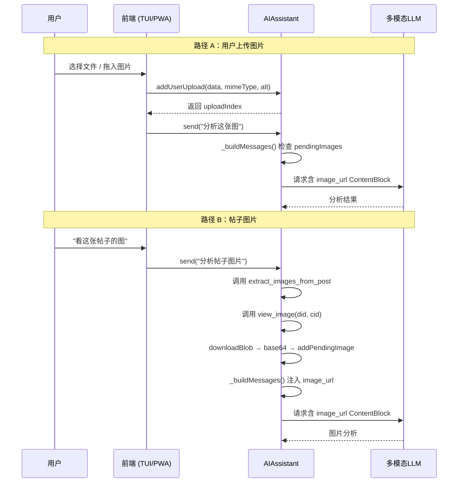

# 思考模式与视觉模式

AI 对话引擎提供两项高级特性：**思考模式**让 LLM 的"内心独白"对用户可见，**视觉模式**让多模态模型直接分析图片。两者共享同一套配置管道但作用于不同的 API 层级。

---

## 思考模式：三种推理风格

思考模式解决一个核心矛盾：用户想看到 LLM 的推理过程，但不同供应商用不同方式暴露这一内容。系统抽象出三种推理风格，每个供应商注册时选其一。

```mermaid
graph LR
    A[用户开启思考模式] --> B{供应商风格}
    B -->|reasoning_content| C[DeepSeek 原生字段]
    B -->|structured_content| D[Mistral thinking blocks]
    B -->|none| E[不发送推理参数]
    C --> F[流式逐 chunk 收集<br>yield type: 'thinking']
    D --> G[解析 content[] 数组<br>提取 type: 'thinking' 块]
    E --> H[仅返回最终文本]
```

### `reasoning_content` — DeepSeek 原生

DeepSeek 在 SSE 流式响应中通过独立的 `delta.reasoning_content` 字段传输推理文本。这是最干净的实现：推理与正文在两条互不干扰的通道中传输。

```typescript
// assistant.ts#L505-L507
if (delta.reasoning_content) {
  reasoningContent += delta.reasoning_content;
  yield { type: 'thinking', content: delta.reasoning_content as string };
}
```

发起请求时，系统向 DeepSeek API 发送专有的 `thinking` 参数：

```typescript
// assistant.ts#L362
(body as any).thinking = { type: this.config.thinkingEnabled !== false ? 'enabled' : 'disabled' };
```

[来源](packages/core/src/ai/assistant.ts#L505-L507)

### `structured_content` — Mistral thinking 块

Mistral 不提供独立的 `reasoning_content` 字段。它的推理文本嵌入在 `content` 数组的 `{ type: 'thinking' }` 块中。流式解析器需要识别这种结构并从中提取文本：

```typescript
// assistant.ts (dist 中的流式解析逻辑)
if (re.content) {
  if (Array.isArray(re.content)) {
    for (const block of re.content) {
      if (block.type === 'thinking' && block.thinking) {
        for (const t of block.thinking) {
          if (t.type === 'text' && t.text) {
            reasoningContent += t.text;
            yield { type: 'thinking', content: t.text };
          }
        }
      }
    }
  }
}
```

请求层面，Mistral 接受 `reasoning_effort` 参数：

```typescript
// assistant.ts#L364
if (this.config.reasoningStyle === 'structured_content' && this.config.thinkingEnabled !== false) {
  (body as any).reasoning_effort = 'high';
}
```

[来源](packages/core/src/ai/assistant.ts#L362-L365)

### `none` — 禁用推理

不做任何特殊处理，不发送 `thinking` 或 `reasoning_effort` 参数，响应中的任何推理内容也被忽略。

### 跨供应商兼容：`_buildMessages` 的预处理

当 `reasoningStyle !== 'reasoning_content'` 时（即非 DeepSeek），`_buildMessages` 会在历史消息中查找 `reasoning_content` 字段，将其合并到 `content` 文本的最前面作为"上一步思考过程"前缀，然后删除该字段。这样既保留了推理信息供后续轮次参考，又避免了向不支持该字段的 API（如 Mistral）发送非法参数引发 `extra_forbidden` 错误。

```typescript
// assistant.ts#L316-L323
if (this.config.reasoningStyle !== 'reasoning_content') {
  msgs = msgs.map(m => {
    const rc = (m as any).reasoning_content as string | undefined;
    if (!rc || m.role !== 'assistant') return m;
    const { reasoning_content: _, ...rest } = m as any;
    const prefix = `【上一步思考过程】\n${rc}\n\n`;
    if (typeof rest.content === 'string') rest.content = prefix + rest.content;
    return rest;
  });
}
```

[来源](packages/core/src/ai/assistant.ts#L316-L327)

### 供应商与风格对照表

| 供应商 | `reasoningStyle` | 请求参数 | 响应格式 |
|---|---|---|---|
| DeepSeek | `reasoning_content` | `thinking: { type }` | `delta.reasoning_content` 独立字段 |
| Mistral | `structured_content` | `reasoning_effort: "high"` | `content[]` 内嵌 `{ type: "thinking" }` 块 |
| 自定义 | `none` | 不发送 | 仅 `content` |

配置详情见 [多模型供应商与 Provider 系统](多模型供应商与-provider-系统.md) 和 [配置指南](配置指南.md)。

---

## 视觉模式：完整流程

视觉模式让多模态 LLM（如 Pixtral、GPT-4V）直接分析用户提供的图片。流程分为两条路径——**用户上传图片**和**帖子图片分析**——最终汇入统一的消息注入管道。



### 路径 A：用户上传（addUserUpload）

前端通过 `useAIChat` Hook 的 `addUserImage` 方法传入二进制数据：

```typescript
// useAIChat.ts#L421
return assistant.addUserUpload(data, mimeType, alt);
```

`addUserUpload` 将数据存入 `_userUploads` 数组并返回索引：

```typescript
// assistant.ts#L169-L172
addUserUpload(data: Uint8Array, mimeType: string, alt: string): number {
  this._userUploads.push({ data, mimeType, alt });
  return this._userUploads.length - 1;
}
```

[来源](packages/core/src/ai/assistant.ts#L169-L172)

### 路径 B：帖子图片（view_image 工具）

当 AI 决定分析帖子中的图片时，它首先调用 `extract_images_from_post` 获取 blob 引用（did + cid），然后调用 `view_image`。

`view_image` 工具处理器：

1. 判断来源：若 `uploadIndex` 存在则从 `_userUploads` 读取，否则通过 `client.downloadBlob` 下载
2. 将二进制数据转为 base64 data URL
3. 调用 `addPendingImage(dataUrl, alt)` 将图片加入待处理队列
4. 返回包含 `visionEnabled` 状态的元数据（动态提示 AI 是否能"看到"图片）

```typescript
// tools.ts#L651-L652
const ai = assistant as unknown as { addPendingImage?: (url: string, alt?: string) => void };
ai.addPendingImage?.(dataUrl, alt);
```

[来源](packages/core/src/ai/tools.ts#L651-L652)

返回的 `note` 字段根据 `visionEnabled` 动态变化：

```typescript
// tools.ts#L657
note: ((assistant as unknown as { config?: { visionEnabled?: boolean } })?.config?.visionEnabled)
  ? 'Image stored — you will see this image in your next response.'
  : 'Image stored as metadata only. Vision mode is OFF.',
```

[来源](packages/core/src/ai/tools.ts#L657)

### 统一注入：`_buildMessages` 的视觉处理

无论图片来自哪条路径，`_buildMessages` 在发送前做最后一件事：找到对话中最后一条用户消息，将其 `content` 替换为包含 `image_url` 的 ContentBlock 数组。

```typescript
// assistant.ts#L331-L345
if (!this.hasPendingImages || !this.config.visionEnabled) return msgs;
msgs = [...msgs];
for (let i = msgs.length - 1; i >= 0; i--) {
  if (msgs[i]!.role === 'user') {
    const blocks: ContentBlock[] = [
      { type: 'text', text },
      ...this._pendingImages.flatMap(img => [
        ...(img.alt ? [{ type: 'text' as const, text: `[图片 ALT: ${img.alt}]` }] : []),
        { type: 'image_url', image_url: { url: img.url, detail: 'auto' } },
      ]),
    ];
    msgs[i] = { ...msgs[i]!, content: blocks };
    this.messages[i] = { ...this.messages[i]!, content: blocks }; // 跨轮次持久化
    break;
  }
}
this.clearPendingImages();
```

关键设计决策：
- **只有 `visionEnabled === true` 时才注入图片** — 否则图片仅存为元数据，不发送给模型
- **注入到最近的用户消息** — 符合多模态 API 约定
- **持久化到 `this.messages`** — 保证跨多轮工具调用的上下文连续
- **处理完后清空 `_pendingImages`** — 避免重复发送

[来源](packages/core/src/ai/assistant.ts#L331-L348)

### 系统提示词配合

`PF_VISION_HINT` 根据 `visionEnabled` 生成不同的提示文本。开启时告诉 AI 可以使用 `view_image`；关闭时则告知 AI 视觉不可用，并附带提示用户开启的方法：

```typescript
// prompts.ts#L128-L133
export function PF_VISION_HINT(enabled: boolean): string {
  if (enabled) {
    return '视觉模式已开启。你可以使用 view_image 查看图片内容。';
  }
  return '用户暂未开启视觉模式。如果你支持视觉...可以提醒用户开启视觉模式。';
}
```

[来源](packages/core/src/ai/prompts.ts#L128-L133)

这个系统提示与用户消息中的视觉提示（`view_image` 工具返回的 `note` 字段）形成双重引导，确保 AI 不会在视觉模式关闭时尝试分析图片。

---

## 写操作确认门控

写操作确认机制是系统安全防线。**只有标记了 `requiresWrite: true` 的工具**才会触发确认弹窗，27 个只读工具（搜索帖子、获取资料、浏览线程等）直通无阻。

确认门控在工具执行循环中：

```typescript
// assistant.ts（sendMessageStreaming）
if (tool.requiresWrite) {
  yield { type: 'confirmation_needed', content: toolName + args, toolName };
  if (!await this._waitForConfirmation()) {
    result = 'User cancelled the operation.';
    // 跳过执行，记录取消状态
  }
}
```

`_waitForConfirmation` 返回一个 Promise，由前端确认/拒绝后 resolve。只读工具永远不会进入这个分支。

受保护的 4 个写工具（详见 [31 个 AI 工具详解](31-个-ai-工具详解.md)）：
- `create_post` — 发帖
- `like` — 点赞
- `repost` — 转发
- `follow` — 关注

[来源](packages/core/src/ai/assistant.ts#L103-L108)

---

## 配置与联动

思考模式和视觉模式在配置中通过两个独立布尔值控制：

| 配置项 | 类型 | 默认值 | 影响 |
|---|---|---|---|
| `thinkingEnabled` | `boolean` | `true` | 发送推理参数、处理推理输出 |
| `visionEnabled` | `boolean` | `false` | 注入 `image_url` ContentBlock |
| `reasoningStyle` | 枚举 | 取决于供应商 | 决定推理参数的发送方式 |

当用户在 TUI 设置页面或 PWA 设置面板中切换模型时，系统自动从 `providers.json` 读取模型的 `thinking` 和 `vision` 能力，覆盖用户手动设置的值。

视觉模式的激活条件：

```typescript
// PWA SettingsModal.tsx#L67-L68
setThinkingEnabled(firstModel.thinking);
setVisionEnabled(firstModel.vision);
```

[来源](packages/pwa/src/components/SettingsModal.tsx#L67-L68)

---

## 推荐阅读

- [AI 对话与流式输出](ai-对话与流式输出.md) — 流式 SSE 解析中思考内容的逐 token 处理
- [多模型供应商与 Provider 系统](多模型供应商与-provider-系统.md) — 供应商注册机制与 `reasoningStyle` 配置
- [31 个 AI 工具详解](31-个-ai-工具详解.md) — `view_image` 工具定义及 `requiresWrite` 标记
- [Prompt 工程与系统提示词](prompt-工程与系统提示词.md) — `PF_VISION_HINT` 和视觉相关提示词
- [配置指南](配置指南.md) — `.env` 和 JSON 配置中的 `thinkingEnabled` / `visionEnabled`