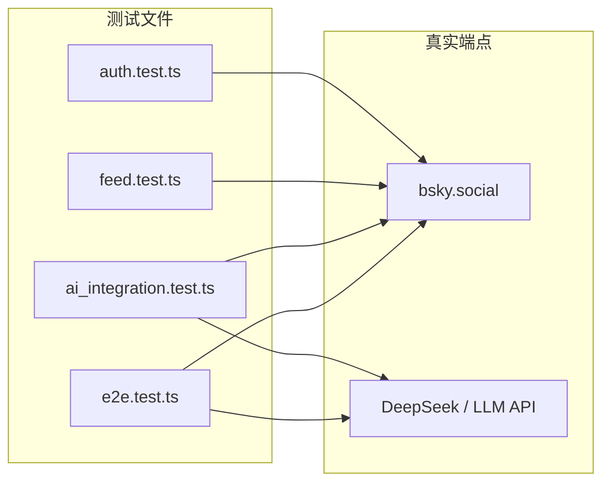

本项目的测试套件位于 `packages/core/tests/`，包含 4 个测试文件、19 个活跃测试用例。与主流实践不同，这里**不使用任何 Mock**——每个测试都向真实的 Bluesky 服务和 LLM API 发起请求。



---

## 测试哲学：真实 API 优先

这套测试的出发点不是验证代码逻辑（那是 TypeScript 编译器的职责），而是回答一个本质问题：**当代码真正连上 Bluesky 时，它能工作吗？**

这一决策带来了明确的利弊权衡：

| 维度 | 优势 | 代价 |
|------|------|------|
| **保真度** | 测试结果反映真实环境行为，Mock 无法模拟的网络抖动、API 变更、速率限制都能被捕获 | 测试依赖外部服务可用性，Bluesky 或 LLM 宕机时测试失败 |
| **维护成本** | 无需维护 Mock 数据、录制/回放夹具，API 变更时会自然暴露 | 需要真实凭据（`.env`），新开发者配置门槛更高 |
| **测试速度** | — | 每条测试 15-120 秒，全套运行约 3-5 分钟 |
| **幂等性** | 所有活跃测试为只读操作，不会在 Bluesky 留下痕迹 | 写操作测试被注释，无法自动化验证发帖/点赞/关注 |

[来源](packages/core/tests/auth.test.ts#L1-L10) | [来源](packages/core/tests/feed.test.ts#L1-L151) | [来源](packages/core/tests/ai_integration.test.ts#L1-L165) | [来源](packages/core/tests/e2e.test.ts#L1-L190)

---

## 配置与运行

### Vitest 配置

`vitest.config.ts` 定义了全局行为：

```typescript
export default defineConfig({
  test: {
    globals: true,        // 全局注册 describe/it/expect
    testTimeout: 60000,   // 单测最长 60 秒
    hookTimeout: 30000,   // beforeAll/afterAll 最长 30 秒
  },
});
```

60 秒超时反映了真实 API 的不确定性——Bluesky 搜索索引延迟、LLM 推理耗时都可能持续数秒到数十秒。

[来源](packages/core/vitest.config.ts#L1-L8)

### 运行命令

| 命令 | 作用 |
|------|------|
| `npm test` | 运行全部测试 |
| `npm run test:watch` | Watch 模式，文件变更自动重跑 |
| `npm run test:e2e` | 仅运行 `e2e.test.ts`，verbose 输出 |

[来源](packages/core/package.json#L17-L19)

### 环境变量

每个测试文件通过 `dotenv` 从项目根目录加载 `.env`：

```typescript
dotenv.config({ path: path.resolve(__dirname, '..', '..', '..', '.env') });
```

必须配置的凭据：

- **Bluesky**：`BLUESKY_HANDLE` + `BLUESKY_APP_PASSWORD`
- **LLM**：`LLM_API_KEY`、`LLM_BASE_URL`、`LLM_MODEL`

AI 测试在 `LLM_API_KEY` 缺失时会通过 `it.skip` 跳过整个 `describe` 块，避免无意义失败。详见 [配置指南](配置指南.md)。

[来源](packages/core/tests/ai_integration.test.ts#L8-L18) | [来源](packages/core/tests/auth.test.ts#L6-L10)

---

## 测试类型详解

### 1. 认证测试（auth.test.ts）

覆盖 `BskyClient` 的三个核心方法，构成**健康检查门**：

| 测试 | 断言 | 超时 |
|------|------|------|
| 创建会话 | `accessJwt` 非空、`handle` 匹配、`did` 格式 `did:plc:` | 15s |
| 解析 Handle | `resolveHandle` 返回的 DID 与会话一致 | 15s |
| 获取个人资料 | `handle` 和 `did` 与会话一致 | 15s |

这三个测试如果失败，说明网络、凭据或 API 版本出了问题，后续所有测试都不必运行。JWT 刷新机制详见 [JWT 会话管理](jwt-会话管理.md)。

```typescript
it('should create a session and return accessJwt', async () => {
  const session = await client.login(HANDLE, APP_PASSWORD);
  expect(session.accessJwt).toBeTruthy();
  expect(session.handle).toBe(HANDLE);
  expect(session.did).toMatch(/^did:plc:/);
}, 15000);
```

[来源](packages/core/tests/auth.test.ts#L15-L38)

### 2. Feed 测试（feed.test.ts）

这个文件的设计揭示了一个重要信号：**所有写操作测试都被注释掉了**。

文件中声明了 `testPostUri`、`uploadedBlobCid` 等变量，定义了发帖 → 获取线程 → 展平线程 → 上传图片 → 提取图片的完整链路，但全部包裹在 `/* */` 中。唯一活跃的测试是搜索：

```typescript
it('should search posts and find some results', async () => {
  const searchRes = await client.searchPosts({ q: 'Bluesky', limit: 25, sort: 'latest' });
  expect(searchRes.posts.length).toBeGreaterThanOrEqual(0);
}, 30000);
```

注意断言只要求 `>= 0`——它不要求搜索结果存在，只要求 API 调用本身不抛异常。这反映了搜索 API 的不确定性。`BskyClient` 的完整 API 封装见 [@bsky/core：AT Protocol 客户端](bsky-core-at-protocol-客户端.md)。

[来源](packages/core/tests/feed.test.ts#L1-L151)

### 3. AI 集成测试（ai_integration.test.ts）

最复杂的测试文件，分三个 `describe` 块：

#### 工具调用全流程

初始化 `AIAssistant`，注入 `createTools(client)` 返回的 20+ 个工具，让 AI 执行真实调用：

```typescript
it('should search posts via AI tool call', async () => {
  const assistant = new AIAssistant(AI_CONFIG);
  assistant.setTools(tools);
  assistant.addSystemMessage('你是一个深度集成 Bluesky 的终端助手。使用工具获取信息。回答简练。');

  const result = await assistant.sendMessage(
    '在 Bluesky 上搜索包含 "Bluesky" 的帖子，告诉我找到了多少条。'
  );
  expect(result.toolCallsExecuted).toBeGreaterThanOrEqual(1);
}, 120000);
```

关键验证点是 `toolCallsExecuted >= 1`——测试的不是搜索结果内容，而是 **AI 正确选择了 `search_posts` 工具并解析了返回数据**。

#### 翻译与润色

测试三个函数：`translateToChinese`、`polishDraft`（两种风格），验证点简洁：

| 测试 | 输入 | 断言 |
|------|------|------|
| 英译中 | 英文句子 | 结果包含中文字符 |
| 润色→更正式 | 口语化草稿 | 结果非空且长度增加 |
| 润色→更幽默 | 正式句子 | 结果非空 |

实现细节见 [翻译系统：双模式与重试](翻译系统-双模式与重试.md) 和 [Prompt 工程与系统提示词](prompt-工程与系统提示词.md)。

#### 引导性问题

使用 `singleTurnAI` 函数，基于一个硬编码的公开帖子 URI 生成问题，验证 AI 的理解与生成能力。

[来源](packages/core/tests/ai_integration.test.ts#L1-L165)

### 4. 端到端测试（e2e.test.ts）

以编号 `[1]` 至 `[10]` 组织完整用户流程，但活跃测试只有 6 个：

| 编号 | 测试项 | 状态 | 说明 |
|------|--------|------|------|
| [1] | 认证 | ✅ 活跃 | login → resolveHandle → getProfile |
| [2] | Feed 读取 | ✅ 活跃 | getTimeline（仅验证非空） |
| [3] | 图片上传/提取 | ❌ 注释 | 依赖写操作 |
| [4] | AI 工具调用 | ❌ 注释 | 分析帖子（依赖已发帖） |
| [5] | AI 翻译 | ✅ 活跃 | translateToChinese |
| [6] | AI 润色 | ✅ 活跃 | polishDraft |
| [7] | 资料与关系图 | ✅ 活跃 | getProfile('bsky.app') + getFollows |
| [8] | 时间线 | ✅ 活跃 | 冗余验证 getTimeline |
| [9] | 通知 | ✅ 活跃 | listNotifications（仅验证存在） |
| [10] | AI 引导问题 | ✅ 活跃 | singleTurnAI |

策略清晰：**读操作全量覆盖，写操作全部搁置**。覆盖了认证、时间线、搜索、资料、通知、翻译、润色这些用户日常高频路径。

[来源](packages/core/tests/e2e.test.ts#L1-L190)

---

## 实践建议

### 速率限制

Bluesky API 有速率限制，连续运行全部测试（尤其 `searchPosts` 和 `getTimeline` 并行执行）可能触发 `HTTP 429`。代码中有 `setTimeout(r, 2000)` 插入延迟的方案。如遇限流，建议单线程执行。

### 测试账号隔离

**强烈建议使用专门的测试账号**，而非日常主账号。原因：

- 搜索和时间线读取会在服务器留下可追踪的调用记录
- 如果将来启用被注释的写操作测试，测试帖子会出现在账号时间线上

### AI 调用成本

`translateToChinese` 和 `polishDraft` 每次约 200-500 token；`sendMessage`（含工具调用循环）约 2000-5000 token。日常 CI 可通过 `--exclude` 跳过 AI 测试。

### 幂等性

由于不创建数据，所有活跃测试天然幂等——无论运行多少次，不会在 Bluesky 留下痕迹。

---

## 下一步

- [@bsky/core：AT Protocol 客户端](bsky-core-at-protocol-客户端.md) — `BskyClient` 的 API 封装详情
- [@bsky/core：AI 助手系统](bsky-core-ai-助手系统.md) — `AIAssistant` 与工具调用循环
- [31 个 AI 工具详解](31-个-ai-工具详解.md) — 所有可被 AI 调用的 Bluesky 工具定义
- [JWT 会话管理](jwt-会话管理.md) — 认证与会话刷新机制