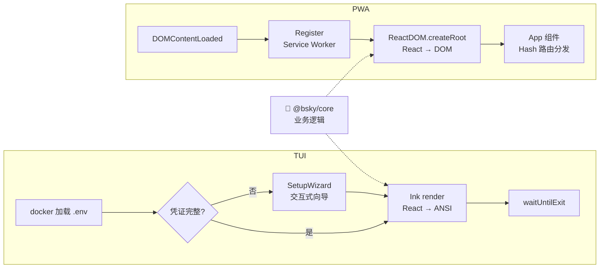

以下是您需要的 Wiki 页面：

# 用户界面：TUI 与 PWA

一个代码仓库，两套界面——终端用户和浏览器用户各取所需，但共享同一套业务逻辑和 AI 引擎。这个项目最直观的特色，也是理解整个架构设计的起点。

---

## 两条完全不同的渲染路径

项目同时提供两种运行形态，它们的入口文件从第一行就分道扬镳：



左边的 **TUI** 走 Ink 渲染管线，把 React 组件树编译成 ANSI 转义序列输出到终端；右边的 **PWA** 走标准 React DOM 渲染，输出到浏览器 DOM。两者之间的连线是重点——核心业务逻辑 `@bsky/core` 作为纯数据层，同时供给两个入口。

[来源](packages/tui/src/cli.ts#L1-L97) | [来源](packages/pwa/src/main.tsx#L1-L16)

---

## TUI 入口：`packages/tui/src/cli.ts` 的启动三阶段

TUI 的入口是一个 Node.js 脚本（`#!/usr/bin/env node`），经历三个阶段到达用户界面。

### 第一阶段：环境加载与凭据检查

从两个候选路径加载 `.env` 文件——`cli.ts` 所在目录的上级 monorepo 根目录，以及 `process.cwd()`。然后调用 `getConfigFromEnv()` 提取 `BLUESKY_HANDLE`、`BLUESKY_APP_PASSWORD` 以及 AI 相关的 `LLM_*` 系列变量。如果缺少关键凭据（handle 或 password），`getConfigFromEnv()` 返回 `null`，触发 SetupWizard。

[来源](packages/tui/src/cli.ts#L22-L34)

### 第二阶段：交互式配置向导

当 `.env` 文件缺失时，Root 组件渲染 `SetupWizard` 而不是主 `App`。SetupWizard 是一个 8 字段的顺序表单状态机——用户输入 Bluesky 凭据 → LLM 配置 → 语言偏好，每一步都可验证。提交后写入 `.env` 文件并重载配置，触发 `dotenv.config({ override: true })` 重新读取。

```typescript
// 关键设计：用 React 状态切换决定渲染哪套 UI
function Root({ isRawModeSupported }) {
  const [appConfig, setAppConfig] = React.useState(getConfigFromEnv);
  if (!appConfig) {
    return React.createElement(SetupWizard, {
      onComplete: () => { /* 重载配置 */ setAppConfig(newConfig); },
    });
  }
  return React.createElement(App, { config: appConfig, isRawModeSupported });
}
```

[来源](packages/tui/src/cli.ts#L54-L67)

### 第三阶段：Ink 渲染与 Raw Mode

这是最关键的部分。TUI 启动时尝试将 `process.stdin` 设为 **raw mode**，让键盘按键事件逐字符输入（而非等待回车）：

```typescript
let isRawMode = false;
try {
  const stdin = process.stdin as ReadStream;
  if (stdin.isTTY) {
    stdin.setRawMode(true);
    isRawMode = true;
  }
} catch {}
```

如果 raw mode 设置失败（例如在非 TTY 环境或某些 IDE 终端），代码会创建一个虚拟的 `Readable` 流，将 `process.stdin` 的 `data` 事件桥接过去，保证 Ink 在不支持 raw mode 的环境下仍然能接收输入。

```typescript
const { waitUntilExit } = render(React.createElement(Root, { isRawModeSupported: isRawMode }), {
  stdin: inputStream,
  stdout: process.stdout,
  stderr: process.stderr,
  exitOnCtrlC: true,
});
```

`exitOnCtrlC: true` 让 Ctrl+C 直接退出应用，而不需要额外处理。

[来源](packages/tui/src/cli.ts#L69-L97)

---

## PWA 入口：`packages/pwa/src/main.tsx` 的极简启动

PWA 的入口只有 16 行代码，极其简洁：

```typescript
import React from 'react';
import ReactDOM from 'react-dom/client';
import { App } from './App.js';
import './index.css';
import 'highlight.js/styles/github.css';

if ('serviceWorker' in navigator) {
  window.addEventListener('load', () => {
    navigator.serviceWorker.register('./sw.js', { scope: './' })
      .then((reg) => console.log('[PWA] SW registered:', reg.scope))
      .catch((err) => console.warn('[PWA] SW registration failed:', err));
  });
}

ReactDOM.createRoot(document.getElementById('root')!).render(
  <React.StrictMode><App /></React.StrictMode>,
);
```

两件事按顺序发生：

1. **注册 Service Worker**：仅在 `load` 事件后注册，避免阻塞首屏渲染。Service Worker 的 scope 设为 `'./'`，表示拦截所有同源请求。
2. **渲染 React 根组件**：通过 `ReactDOM.createRoot` 挂载到 `#root` DOM 节点，包裹 `React.StrictMode` 帮助检测潜在问题。

`App` 组件内部的 `useHashRouter` hook 接管了后续的页面路由——所有视图切换通过 `#/feed`、`#/thread?uri=...` 等 hash URL 驱动，与 `window.history.pushState` + `popstate` 事件协同工作。这让 PWA 可以部署在任何静态托管服务上，无需服务器端路由配置。

[来源](packages/pwa/src/main.tsx#L1-L16) | [来源](packages/pwa/src/hooks/useHashRouter.ts#L1-L133)

---

## 渲染机制对比

| 维度 | TUI | PWA |
|------|-----|-----|
| **渲染引擎** | Ink（React → ANSI 转义码） | React DOM + Tailwind CSS |
| **CSS 方案** | 无，颜色通过 `color` prop 直接控制 | Tailwind utility classes + CSS 变量 |
| **文本换行** | 手动算法：`visualWidth` + `wrapLines`（支持 CJK 双宽度） | CSS `word-wrap` + `overflow-wrap`，浏览器自动处理 |
| **滚动实现** | 视口裁剪：预计算行列表 + `viewStart` 偏移量 | `@tanstack/react-virtual` 虚拟滚动 |
| **Markdown 渲染** | 自定义 `renderMarkdown()` 输出 Ink `<Text>` 元素 | `react-markdown` + `remark-gfm`（表格、代码高亮、GFM） |
| **图片处理** | `sharp` 压缩 + `fs.readFileSync` 读本地文件 | `` 原生加载，CDN 图片 |
| **深色模式** | 无独立切换，依赖终端自身 | CSS 变量 `.dark` class 切换 |

[TUI 来源](packages/tui/src/utils/text.ts#L1-L82) | [PWA 来源](packages/pwa/src/index.css#L1-L110) | [详情](tui-终端界面实现.md) | [详情](pwa-浏览器应用实现.md)

---

## 输入处理机制

### TUI：全局键盘分发器

TUI 使用 Ink 的 `useInput` 钩子实现一个**集中式键盘分发器**，所有按键在 `App.tsx` 中统一处理：

```
useInput((input, key) => {
  // 优先级 1: Tab / Esc 全局快捷键
  // 优先级 2: 当前视图独占模式 (compose/search/aiChat)
  // 优先级 3: 箭头键 + Enter 列表导航
  // 优先级 4: 字母快捷键 (t/n/p/s/a/c/b)
  // 优先级 5: 视图专属操作 (j/k/m/r/f/v/q)
})
```

设计模式是**状态机 + 门控**：当视图处于 `draftSavePrompt`、`draftListOpen`、`imagePathInput` 等子状态时，所有输入被该子状态拦截，直到退出该子状态为止。`Ctrl+G` 是从任意视图创建 AI 聊天会话的全局快捷键。

**鼠标支持有限**：TUI 通过 ANSI 转义序列（DEC private mode `\x1b[?1000h`）追踪鼠标滚轮事件，但不处理点击。这是因为 Ink 的 `useInput` 在 raw mode 下会吞掉所有输入，与鼠标点击序列冲突。

[来源](packages/tui/src/components/App.tsx#L117-L280) | [来源](packages/tui/src/utils/mouse.ts#L24-L47)

### PWA：标准 DOM 事件

PWA 使用浏览器原生的 DOM 事件体系——点击、滚动、键盘都由浏览器分派给具体的 DOM 元素。路由由 `useHashRouter` 管理，通过 `window.history.pushState` 和 `popstate` 事件响应浏览器的前进/后退按钮。

```typescript
// Hash 路由格式示例
#/feed?feed=at://...        // 时间线
#/thread?uri=at://...       // 帖子详情
#/profile?actor=did:plc:... // 个人主页
#/ai?session=uuid...        // AI 对话
#/compose?replyTo=at://...  // 发帖
```

[来源](packages/pwa/src/hooks/useHashRouter.ts#L23-L38)

---

## 部署形态

| 维度 | TUI | PWA |
|------|-----|-----|
| **运行位置** | 本地终端 | 浏览器（本地 dev 或远程托管） |
| **启动命令** | `npx tsx src/cli.ts` | `pnpm dev`（开发）/ 构建后部署 |
| **凭据管理** | `.env` 文件 + `configStore` JSON | 浏览器登录表单 + `localStorage` |
| **离线能力** | 无（始终在线） | Service Worker 缓存 + IndexedDB 持久化 |
| **安装方式** | `git clone` + `pnpm install` | PWA 安装到桌面（manifest.json） |
| **包依赖特征** | `ink`、`ink-text-input`、`sharp`、`dotenv`、`clipboardy` | `react-dom`、`@tanstack/react-virtual`、`react-markdown`、`vite`、`tailwindcss` |

[TUI 来源](packages/tui/package.json#L1-L30) | [PWA 来源](packages/pwa/package.json#L1-L25) | [详情](部署-pwa-到静态托管.md)

---

## Service Worker 的四种缓存策略

PWA 的 `sw.js` 实现了四种不同的缓存策略，针对不同资源类型优化：

| 策略 | 适用资源 | 行为 |
|------|---------|------|
| **Cache First** | CDN 图片 (`cdn.bsky.app`)、Google Fonts 文件、Vite 构建产物 (`/assets/`) | 优先从缓存读取，失败时回退到网络 |
| **Stale While Revalidate** | 首页 HTML、Google Fonts CSS | 立即返回缓存内容，同时在后台更新缓存 |
| **Network First** | API 请求 (`bsky.social`, `api.deepseek.com`) | 优先请求网络，失败时使用缓存兜底 |
| **Cache + Network Fallback** | 图标文件 (`/icons/`) | 缓存优先，网络兜底 |

Service Worker 在 `install` 阶段预缓存 `./`、`./index.html`、`./manifest.json` 三个关键文件，实现 PWA 的"秒开"体验。

[来源](packages/pwa/public/sw.js#L1-L108) | [来源](packages/pwa/public/manifest.json#L1-L29)

---

## "一次编写，两处渲染"的架构原则

这是整个项目最核心的设计原则。从入口文件可以清晰看到：

**TUI 的 `cli.ts`** 导入 `@bsky/core` 的 `getProviderById`，但是从不直接创建 `BskyClient` 或 `AIAssistant`——这些由 `@bsky/app` 的 hooks（如 `useAuth`、`useAIChat`）管理。

**PWA 的 `main.tsx`** 只做两件事：注册 Service Worker 和渲染 `App` 组件。`App.tsx` 从 `@bsky/app` 导入 `useAuth`、`useTimeline`、`useI18n`、`useDrafts`、`usePostActions` 等 hooks，从 `@bsky/core` 导入类型定义和工具函数。

依赖流向是严格的单向依赖：

```
@bsky/core (纯 TS，零 UI 依赖)
    ↓
@bsky/app (React Hooks + 纯 Store，无渲染)
    ↓                          ↓
@bsky/tui (Ink 渲染层)    @bsky/pwa (React DOM 渲染层)
```

这意味着：**添加一个新功能时，核心逻辑改一次**（`@bsky/core` 的业务类或 `@bsky/app` 的 hook），然后分别更新两个界面的渲染组件即可。不会出现"TUI 有但 PWA 没有"或"两端行为不一致"的问题。

[来源](packages/tui/src/cli.ts#L1-L7) | [来源](packages/pwa/src/main.tsx#L1-L16) | [详情](三层架构设计.md)

---

## 适用场景与选型建议

| 场景 | 推荐 | 原因 |
|------|:----:|------|
| 开发者日常、SSH 远程操作 | **TUI** | 毫秒级启动，纯键盘操作，无 GUI 依赖 |
| 低配服务器、树莓派 | **TUI** | 不需要浏览器，节省内存 |
| 日常社交浏览、移动端 | **PWA** | 完整的视觉体验，鼠标/触控操作 |
| 需要离线使用 | **PWA** | Service Worker 缓存 + IndexedDB |
| 图片/视频密集场景 | **PWA** | 原生 `` 渲染，Lightbox 查看 |
| 需要复杂的 Markdown 表格、代码高亮 | **PWA** | `react-markdown` + GFM 完整支持 |

---

## 推荐阅读

- [三层架构设计](三层架构设计.md) — 理解 `@bsky/core` → `@bsky/app` → 渲染层的严格单向依赖
- [TUI 终端界面实现](tui-终端界面实现.md) — Ink 渲染、视口计算、CJK 文本引擎的完整实现
- [PWA 浏览器应用实现](pwa-浏览器应用实现.md) — Hash 路由、虚拟滚动、Service Worker 的完整实现
- [快速开始](快速开始.md) — 5 分钟分别启动 TUI 和 PWA，体验双端差异
- [部署 PWA 到静态托管](部署-pwa-到静态托管.md) — 将 PWA 部署到 Cloudflare Pages 等平台