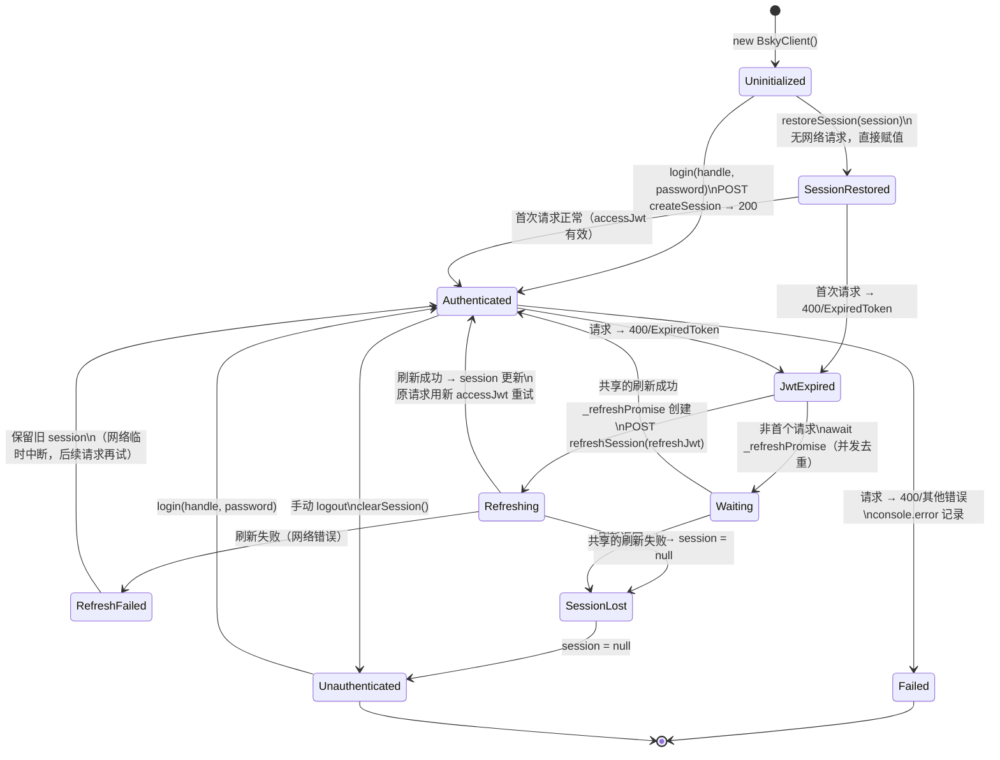

# BskyClient 深度解析

`BskyClient` 是 `@bsky/core` 包的核心类，封装了 AT Protocol 的全部 HTTP 通信。它不仅是 Bluesky API 的客户端，更是一个**有状态认证代理**——管理 session 生命周期、自动处理 JWT 刷新、对外暴露统一的类型安全方法签名。理解这个类是理解整个项目网络层的关键。

---

## 三个 ky 实例的架构设计

构造函数内创建了三个独立的 **ky 实例**（轻量级 `fetch` 封装库），各自绑定不同的 `prefixUrl`：

| 实例 | 基础 URL | prefixUrl | 用途 |
|------|----------|-----------|------|
| `this.ky` | `https://bsky.social` | `/xrpc` | 认证操作 + 需鉴权的 PDS 端点 |
| `this.publicKy` | `https://public.api.bsky.app` | `/xrpc` | 公共只读端点，无需 session |
| `this.chatKy` | `https://api.bsky.chat` | `/xrpc` | 私信 (DM) 专用端点 |

三个实例共享相同的超时（30s）和重试配置，但只有 `this.ky` 和 `this.chatKy` 挂载了 `withRefresh` 钩子。`publicKy` 不挂载——公共 API 不会返回 400/ExpiredToken，强行挂载只会徒增开销。

整个 XRPC 协议的路由路径通过 `prefixUrl` 拼接完成：例如 `this.ky.post('com.atproto.server.createSession')` 实际请求 `https://bsky.social/xrpc/com.atproto.server.createSession`。

[来源](packages/core/src/at/client.ts#L47-L124)

---

## `withRefresh`：基于共享 Promise 的防重入刷新

`withRefresh` 是注册在 `afterResponse` 钩子中的函数，核心逻辑是对 HTTP 400 响应中 `ExpiredToken` / `InvalidToken` 错误的透明恢复。

### 执行流程

```
响应 400 → 解析 body → 检测 err.error
    ├─ 不是 token 错误 → 输出 console.error 并放行
    └─ 是 ExpiredToken / InvalidToken →
        ├─ _refreshPromise 已存在 → 等待已有刷新过程
        └─ _refreshPromise 为 null → 创建新刷新 Promise
            ├─ 等待 200ms（防抖，避免批量请求同时触发）
            ├─ 用 refreshJwt 调用 POST /xrpc/com.atproto.server.refreshSession
            │   ├─ 成功 → 更新 self.session（accessJwt + refreshJwt）
            │   └─ 失败 → self.session = null
            └─ finally → _refreshPromise = null
```

### 并发锁的精妙之处

`_refreshPromise` 是一个闭包变量，声明在构造函数作用域内，被 `this.ky` 和 `this.chatKy` 的 `withRefresh` 引用：

```typescript
let _refreshPromise: Promise<CreateSessionResponse | null> | null = null;
```

当多个并发请求同时命中 400/ExpiredToken 时，只有**第一个**进入 `if (!_refreshPromise)` 分支，后续请求进入 `else` 分支直接 `await _refreshPromise`。刷新完成后，`finally` 将 `_refreshPromise` 重置为 `null`，为下一轮刷新做好准备。

这种模式通常称为 **deduplication**（去重），而非传统的 mutual exclusion。它的优点是零锁开销——不涉及任何原子操作或互斥量，纯靠 Promise 引用的一致性保证。

刷新成功后，原请求用新的 `accessJwt` 通过原生 `fetch`（而非 ky）重试，避免再次触发钩子导致死循环：

```typescript
const retryRes = await fetch(request.url, {
  method: request.method,
  headers: { Authorization: `Bearer ${self.session.accessJwt}` },
});
```

[来源](packages/core/src/at/client.ts#L60-L106)

---

## 自动重试配置

三个实例共用相同的重试策略：

```typescript
retry: { limit: 1, statusCodes: [408, 413, 429, 500, 502, 503, 504] }
```

- **limit: 1**：最多重试一次（即总共最多发送 2 次请求）。
- **状态码范围**：408（请求超时）、413（负载过大）、429（限流）、500/502/503/504（服务端错误）。
- **4xx 中的例外**：400 不走自动重试，由 `withRefresh` 钩子接管；401/403 不重试，直接降级。

[来源](packages/core/src/at/client.ts#L111-L112)

---

## 会话管理的双路径

`BskyClient` 的设计让**认证与非认证请求可以共存于同一个客户端实例**。核心模式是 `this.session ? this.ky : this.publicKy` 的三元选择：

```typescript
async getProfile(actor: string): Promise<ProfileView> {
  const kyInstance = this.session ? this.ky : this.publicKy;
  const headers = this.session ? { headers: this.getAuthHeaders() } : {};
  return kyInstance.get('app.bsky.actor.getProfile', {
    searchParams: { actor },
    ...headers,
  }).json<ProfileView>();
}
```

某些端点**强制要求认证**，如 `getTimeline`、`searchPosts`、`getSuggestedFollows`、`getSuggestedFeeds`、`getBookmarks`、`listDrafts`，它们直接调用 `this.ky.getAuthHeaders()`，未登录时会抛 `Not authenticated` 错误。公共 API 返回 403 的端点（如 `searchPosts`）也被归类到强制认证组。

[来源](packages/core/src/at/client.ts#L127-L130)

---

## AT 端点方法速查

BskyClient 实现了约 60 个方法。以下按 AT Protocol 命名空间分类：

### 认证与会话

| 方法 | AT 端点 | 说明 |
|------|---------|------|
| `login(handle, password)` | `com.atproto.server.createSession` | 登录，写入 `this.session` |
| `restoreSession(session)` | — | 恢复持久化 session，不发起网络请求 |
| `isAuthenticated()` | — | 检查 `this.session !== null` |
| `getDID()` / `getHandle()` / `getAccessJwt()` | — | 获取当前 session 信息 |

### 时间线 (Feed)

| 方法 | AT 端点 | 认证要求 |
|------|---------|---------|
| `getTimeline(limit, cursor?)` | `app.bsky.feed.getTimeline` | **必须** |
| `getAuthorFeed(actor, limit, cursor?, filter?)` | `app.bsky.feed.getAuthorFeed` | 可选 |
| `getPostThread(uri, depth?, parentHeight?)` | `app.bsky.feed.getPostThread` | 可选 |
| `getFeed(feedUri, limit, cursor?)` | `app.bsky.feed.getFeed` | 可选 |
| `getSuggestedFeeds(limit, cursor?)` | `app.bsky.feed.getSuggestedFeeds` | **必须** |
| `getFeedGenerator(feed)` | `app.bsky.feed.getFeedGenerator` | 可选 |
| `getPopularFeedGenerators(limit, cursor?)` | `app.bsky.unspecced.getPopularFeedGenerators` | 可选 |

### 社交图谱 (Graph)

| 方法 | AT 端点 | 说明 |
|------|---------|------|
| `getFollows(actor, limit, cursor?)` | `app.bsky.graph.getFollows` | 可选认证 |
| `getFollowers(actor, limit, cursor?)` | `app.bsky.graph.getFollowers` | 可选认证 |
| `getSuggestedFollows(actor)` | `app.bsky.graph.getSuggestedFollowsByActor` | **必须** |
| `follow(did)` | `com.atproto.repo.createRecord` (follow) | **必须** |
| `unfollow(followUri)` | `com.atproto.repo.deleteRecord` (follow) | **必须** |
| `getList(listUri, limit, cursor?)` | `app.bsky.graph.getList` | 可选 |
| `getLists(actor, limit, cursor?, purposes?)` | `app.bsky.graph.getLists` | 可选 |
| `getListFeed(listUri, limit, cursor?)` | `app.bsky.feed.getListFeed` | 可选 |
| `getListBlocks(limit, cursor?)` | `app.bsky.graph.getListBlocks` | **必须** |
| `getListMutes(limit, cursor?)` | `app.bsky.graph.getListMutes` | **必须** |
| `getListsWithMembership(actor, limit, cursor?, purposes?)` | `app.bsky.graph.getListsWithMembership` | **必须** |
| `createList(name, purpose, description?, avatar?)` | `com.atproto.repo.createRecord` (list) | **必须** |
| `deleteList(listUri)` | `com.atproto.repo.deleteRecord` (list) | **必须** |
| `updateList(listUri, params)` | `com.atproto.repo.putRecord` (list) | **必须** |
| `addListItem(listUri, subjectDid)` | `com.atproto.repo.createRecord` (listitem) | **必须** |
| `removeListItem(listItemUri)` | `com.atproto.repo.deleteRecord` (listitem) | **必须** |
| `blockList(listUri)` / `unblockList(listBlockUri)` | 同上 (listblock) | **必须** |
| `muteActorList(listUri)` / `unmuteActorList(listUri)` | `app.bsky.graph.muteActorList` | **必须** |

### 帖子操作

| 方法 | AT 端点 | 认证要求 |
|------|---------|---------|
| `searchPosts(params)` | `app.bsky.feed.searchPosts` | **必须** |
| `getLikes(uri, limit, cursor?)` | `app.bsky.feed.getLikes` | 可选 |
| `getRepostedBy(uri, limit, cursor?)` | `app.bsky.feed.getRepostedBy` | 可选 |
| `deletePost(uri)` | `com.atproto.repo.deleteRecord` | **必须** |
| `createRecord(repo, collection, record, rkey?, swapCommit?)` | `com.atproto.repo.createRecord` | **必须** |
| `putRecord(repo, collection, rkey, record, swapRecord?)` | `com.atproto.repo.putRecord` | **必须** |
| `deleteRecord(repo, collection, rkey)` | `com.atproto.repo.deleteRecord` | **必须** |
| `uploadBlob(data, mimeType)` | `com.atproto.repo.uploadBlob` | **必须** |
| `downloadBlob(did, cid)` | `com.atproto.sync.getBlob` | 可选（传入 session 则附带认证） |

### 搜索

| 方法 | AT 端点 | 认证要求 |
|------|---------|---------|
| `searchActors(params)` | `app.bsky.actor.searchActors` | 可选 |
| `resolveHandle(handle)` | `com.atproto.identity.resolveHandle` | 公共 |

### 通知

| 方法 | AT 端点 | 认证要求 |
|------|---------|---------|
| `listNotifications(limit, cursor?, priority?)` | `app.bsky.notification.listNotifications` | **必须** |

### 书签 (自定义扩展)

| 方法 | AT 端点 | 认证要求 |
|------|---------|---------|
| `createBookmark(uri, cid)` | `app.bsky.bookmark.createBookmark` | **必须** |
| `deleteBookmark(uri)` | `app.bsky.bookmark.deleteBookmark` | **必须** |
| `getBookmarks(limit, cursor?)` | `app.bsky.bookmark.getBookmarks` | **必须** |

### 草稿 (自定义扩展)

| 方法 | AT 端点 | 认证要求 |
|------|---------|---------|
| `createDraft(draft)` | `app.bsky.draft.createDraft` | **必须** |
| `updateDraft(id, draft)` | `app.bsky.draft.updateDraft` | **必须** |
| `getDrafts(limit, cursor?)` | `app.bsky.draft.getDrafts` | **必须** |
| `deleteDraft(id)` | `app.bsky.draft.deleteDraft` | **必须** |

### 私信 (Chat/DM)

所有 DM 方法使用 `chatKy` 实例，通过私有辅助方法 `chatGet<T>` 和 `chatPost<T>` 统一封装，详见 [DM 私信实现](dm-私信实现.md)。

| 方法 | 说明 |
|------|------|
| `listConvos(limit, cursor?)` | 列出会话列表 |
| `getConvoForMembers(members)` | 获取或创建与指定成员的会话 |
| `getMessages(convoId, limit, cursor?)` | 获取消息历史 |
| `sendMessage(convoId, message)` | 发送消息 |
| `addReaction(convoId, messageId, value)` | 添加反应（如 ❤️） |
| `removeReaction(convoId, messageId, value)` | 移除反应 |
| `updateRead(convoId, messageId?)` | 标记已读 |
| `deleteMessageForSelf(convoId, messageId)` | 不留痕迹删除 |
| `muteConvo(convoId)` / `unmuteConvo(convoId)` | 会话静音控制 |
| `leaveConvo(convoId)` | 离开会话 |

### 个人资料

| 方法 | AT 端点 | 说明 |
|------|---------|------|
| `getProfile(actor)` | `app.bsky.actor.getProfile` | 可选认证 |
| `putProfile(params)` | `com.atproto.repo.putRecord` (profile) | 更新昵称、描述、头像、背景 |
| `getTrends(limit, personalizedFor?)` | `app.bsky.unspecced.getTrends` | 可选 |
| `listRecords(repo, collection, limit, cursor?)` | `com.atproto.repo.listRecords` | 可选 |
| `getRecord(repo, collection, rkey)` | `com.atproto.repo.getRecord` | 可选 |
| `getVideoThumbnailUrl(did, cid)` / `getVideoPlaylistUrl(did, cid)` | — | URL 构建辅助方法（非 XRPC） |

[来源](packages/core/src/at/client.ts#L132-L748)

---

## 关键设计模式

### 1. `createSession` vs `restoreSession`：两条初始化路径

登录成功后，`BskyClient` 拿到完整的 `CreateSessionResponse`（含 `accessJwt` + `refreshJwt` + `did` + `handle`）。应用退出后，session 可持久化（PWA 使用 `localStorage`，TUI 使用 JSON 文件，详见 [存储与持久化](存储与持久化.md)），重启时通过 `restoreSession` 恢复。

`restoreSession` 不鉴权、不请求网络，只是把持久化的 session JSON 对象赋值给 `this.session`。真正的鉴权发生在**第一个请求命中 400/ExpiredToken** 时——此时 `withRefresh` 钩子用 `refreshJwt` 静默刷新。

### 2. 辅助方法 `chatGet<T>` / `chatPost<T>`

DM 方法不走三元选择模式，而是统一通过这两个私有辅助方法调用 `chatKy`，因为 chat API 的所有端点都强制要求认证：

```typescript
private async chatGet<T>(path: string, params?: Record<string, string | number>): Promise<T> {
  return this.chatKy.get(path, {
    headers: this.getAuthHeaders(),
    searchParams: params ?? {},
  }).json<T>();
}
```

### 3. URLSearchParams 的特殊处理

`getLists` 和 `getListsWithMembership` 接受 `purposes` 数组参数，使用 `URLSearchParams.append` 生成 `purposes=modlist&purposes=curatelist` 格式的查询字符串，而不是标准的 JSON 序列化——这是 AT Protocol 的约定。

[来源](packages/core/src/at/client.ts#L271-L280)

---

## 状态机：从登录到退出的完整生命周期



### 关键状态说明

- **Uninitialized**：`session = null`，任何调用 `this.ky` 的认证方法都会抛 `Not authenticated` 错误。
- **SessionRestored**：PWA 页面加载后的典型入口——从 `localStorage` 恢复 session JSON，BskyClient 认为有 session，但不知道 accessJwt 是否已过期。
- **JwtExpired**：accessJwt 过期是常态（Bluesky 的 accessJwt 只有 2 小时有效期），`withRefresh` 钩子检测到后自动进入刷新流程。
- **Refreshing**：_refreshPromise 持有期间，所有其他 400 请求共享同一个 Promise，不会触发并发刷新。
- **RefreshFailed**（网络错误被 `catch` 吞掉）：保留原有 session 不置 null，后续请求可以再次尝试刷新。
- **SessionLost**（刷新 HTTP 响应非 200）：`self.session = null`，客户端降级为未认证状态，所有后续认证请求都会抛错误。

上述状态转换的驱动代码完全封装在 `BskyClient` 内部，上层应用（PWA 的 `AuthStore`、TUI 的 `App.tsx`）只需要监听 `session` 是否为 null 即可。

[来源](packages/core/src/at/client.ts#L51-L125)

---

## 与上层消费的衔接

`BskyClient` 实例在 PWA 中通过 `AuthStore` 管理（见 [认证与会话管理](认证与会话管理.md)），`AuthStore.restoreSession` 在页面加载时调用 `getSession()` 从 `localStorage` 读取 session，传入 `BskyClient.restoreSession`。如果 `getProfile` 抛出错误且客户端已未认证，则清空 session 触发重新登录流程。

在 TUI 端，`BskyClient` 的实例同样通过类似模式创建，启动时由 `SetupWizard` 引导用户登录。

`BskyClient` 也被 `createTools` 工厂函数注入到 31 个 AI 工具中（见 [31 个 AI 工具系统](31-个-ai-工具系统.md)），使 AI 助手能通过自然语言驱动客户端执行各种 AT Protocol 操作。