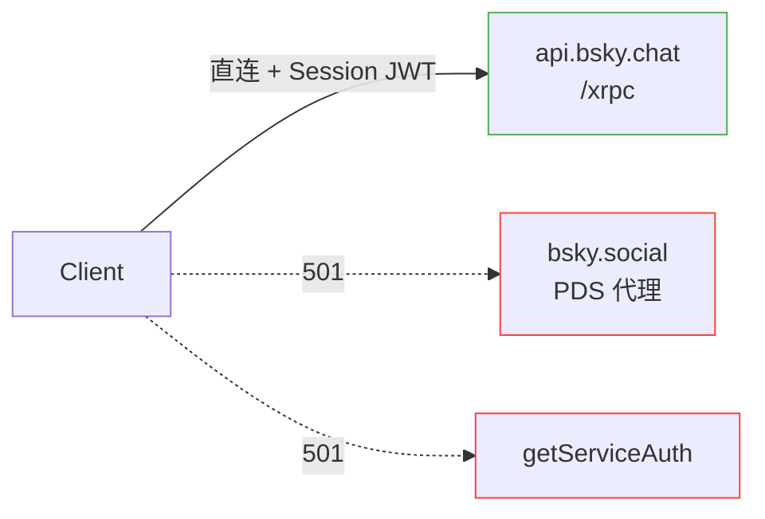
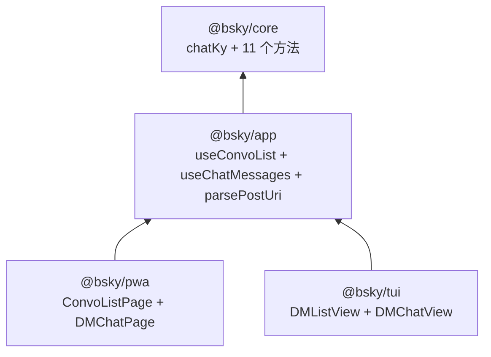

# DM 私信实现

Bluesky 的私信体系独立于主流 AT Protocol，由专用聊天服务 `api.bsky.chat` 托管。本文深入拆解其 API 架构、鉴权演化、数据模型以及从 core 到 UI 的四层实现栈。

---

## API 架构

### 独立聊天端点

DM 所有操作都通过 `chat.bsky.convo.*` Lexicon 端点执行，托管在独立域名上：

| 端点 | 方法 | 用途 |
|------|------|------|
| `chat.bsky.convo.listConvos` | GET | 分页列出会话 |
| `chat.bsky.convo.getConvoForMembers` | GET | 按 DID 获取或创建 1:1 会话 |
| `chat.bsky.convo.getMessages` | GET | 游标分页获取消息 |
| `chat.bsky.convo.sendMessage` | POST | 发送文字消息 |
| `chat.bsky.convo.addReaction` | POST | 添加 emoji 反应（幂等） |
| `chat.bsky.convo.removeReaction` | POST | 移除 emoji 反应 |
| `chat.bsky.convo.updateRead` | POST | 标记已读 |
| `chat.bsky.convo.deleteMessageForSelf` | POST | 为自身删除消息 |
| `chat.bsky.convo.muteConvo` | POST | 静音会话 |
| `chat.bsky.convo.unmuteConvo` | POST | 取消静音 |
| `chat.bsky.convo.leaveConvo` | POST | 离开会话 |

来源：[docs/DM.md#L11-L22](docs/DM.md#L11-L22)

### chatKy 实例

`BskyClient` 维护三个独立的 ky 实例，聊天专用实例指向 `https://api.bsky.chat/xrpc`：

```typescript
const CHAT_API = 'https://api.bsky.chat';

this.chatKy = ky.create({
  prefixUrl: CHAT_API + '/xrpc',
  timeout: 30000,
  retry: { limit: 1, statusCodes: [408, 413, 429, 500, 502, 503, 504] },
  hooks: { afterResponse: [withRefresh] },
});
```

三个实例的区别在于：
- **`this.ky`** → `bsky.social/xrpc`（主实例，带 `withRefresh` hook）
- **`this.publicKy`** → `public.api.bsky.app/xrpc`（无 hook，无需认证）
- **`this.chatKy`** → `api.bsky.chat/xrpc`（带 `withRefresh` hook，共用 session JWT）

来源：[packages/core/src/at/client.ts#L47-L49](packages/core/src/at/client.ts#L47-L49), [packages/core/src/at/client.ts#L119-L124](packages/core/src/at/client.ts#L119-L124)

### 两个内部辅助方法

所有聊天 API 调用收敛于两个私有泛型方法 `chatGet` 和 `chatPost`，它们自动注入认证头：

```typescript
private async chatGet<T>(path: string, params?: Record<string, string | number>): Promise<T> {
  return this.chatKy.get(path, {
    headers: this.getAuthHeaders(),
    searchParams: params ?? {},
  }).json<T>();
}

private async chatPost<T>(path: string, body: unknown): Promise<T> {
  return this.chatKy.post(path, {
    headers: this.getAuthHeaders(),
    json: body,
  }).json<T>();
}
```

`getAuthHeaders()` 返回 `{ Authorization: Bearer ${this.session.accessJwt} }`——与主 API 完全相同的 session JWT。

来源：[packages/core/src/at/client.ts#L653-L666](packages/core/src/at/client.ts#L653-L666), [packages/core/src/at/client.ts#L127-L130](packages/core/src/at/client.ts#L127-L130)

---

## 鉴权弯路

聊天 API 的鉴权走过三条路才找到正确方案。

### 错误路径一：`getServiceAuth`

`com.atproto.server.getServiceAuth` 是 AT Protocol 中用于为特定服务生成独立 JWT 的端点。尝试通过它获取 `api.bsky.chat` 的 service JWT：

```
POST bsky.social/xrpc/com.atproto.server.getServiceAuth
→ 501 Not Implemented
```

**501 的根因**：该端点较新，部署的 PDS 版本（bsky.social）尚未实现。即使实现，返回的 service JWT 仅用于安全上下文分离，实际 `api.bsky.chat` 同时接受 session JWT，没有必要走这条路。

来源：[docs/DM.md#L30-L31](docs/DM.md#L30-L31), [docs/DM.md#L124-L127](docs/DM.md#L124-L127)

### 错误路径二：PDS 代理

另一种直觉是将聊天端点通过 PDS 代理，利用 `xrpc-service-proxy` header 转发：

```
POST bsky.social/xrpc/chat.bsky.convo.sendMessage
xrpc-service-proxy: https://api.bsky.chat
→ 501 Not Implemented
```

尝试用户 PDS (`*.host.bsky.network`) 同样返回 501。**PDS 不托管聊天服务的反向代理**。

来源：[docs/DM.md#L31-L32](docs/DM.md#L31-L32)

### 正确路径：直连 + Session JWT

最终方案简洁直接：

```
POST https://api.bsky.chat/xrpc/chat.bsky.convo.sendMessage
Authorization: Bearer {accessJwt}
```

- **主机**：`https://api.bsky.chat/xrpc`
- **鉴权**：Session JWT（`accessJwt`），与 `app.bsky.*` 共用同一个 token
- **不需要**：`getServiceAuth`、`xrpc-service-proxy` header、PDS 代理

聊天服务直接信任 session JWT。虽然 JWT 的 `aud` 声明指向 PDS，但跨服务信任在 Bluesky 的基础设施内成立。

来源：[docs/DM.md#L36-L46](docs/DM.md#L36-L46)



---

## 数据模型

### ConvoView（会话视图）

```typescript
interface ConvoView {
  id: string;
  rev: string;
  members: ProfileViewBasic[];
  lastMessage?: MessageView | DeletedMessageView | SystemMessageView;
  lastReaction?: { message: MessageView; reaction: ReactionView };
  muted: boolean;
  status: 'request' | 'accepted';
  unreadCount: number;
  kind: 'direct' | 'group';
}
```

- `status`：`'request'` 表示待接受，`'accepted'` 表示已建立对话
- `kind`：当前仅 `'direct'`（1:1）得到完整实现，`'group'` API 标注为 unstable

来源：[packages/core/src/at/types.ts#L384-L394](packages/core/src/at/types.ts#L384-L394)

### MessageView（消息视图）

```typescript
interface MessageView {
  id: string;
  rev: string;
  text: string;
  facets?: Array<{
    index: { byteStart: number; byteEnd: number };
    features: Array<{ $type: string; [k: string]: unknown }>;
  }>;
  embed?: {
    $type: string;
    record: { uri: string; cid: string; author?: ProfileViewBasic; value?: { text: string } };
  };
  reactions: ReactionView[];
  sender: { did: string };
  sentAt: string;
}
```

- `embed` 用于引用帖子，`$type` 通常为 `'app.bsky.embed.record#view'`
- `facets` 用于富文本（提及、链接、标签），结构与主时间线一致

来源：[packages/core/src/at/types.ts#L405-L417](packages/core/src/at/types.ts#L405-L417)

### ReactionView（反应视图）

```typescript
interface ReactionView {
  value: string;       // 单个 emoji grapheme
  sender: { did: string };
  createdAt: string;
}
```

**限制**：`value` 必须是单个 grapheme（即一个 emoji），不能是组合序列或文字。

来源：[packages/core/src/at/types.ts#L433-L437](packages/core/src/at/types.ts#L433-L437)

### DeletedMessageView / SystemMessageView

```typescript
interface DeletedMessageView {
  id: string;
  rev: string;
  sender: { did: string };
  sentAt: string;
}

interface SystemMessageView {
  id: string;
  rev: string;
  sentAt: string;
  data: { $type: string; [k: string]: unknown };
}
```

这两个变体没有 `text` 属性，UI 层通过 `'text' in msg` 区分类型：

- **DeletedMessageView**：`deleteMessageForSelf` 后服务端返回的占位对象，仅带 `sender`
- **SystemMessageView**：系统事件（如成员加入/离开），数据在 `data` 字段

来源：[packages/core/src/at/types.ts#L419-L431](packages/core/src/at/types.ts#L419-L431)

### MessageInput（消息输入）

```typescript
interface MessageInput {
  text: string;
  facets?: Array<{ ... }>;
  embed?: {
    $type: 'app.bsky.embed.record';
    record: { uri: string; cid: string };
  };
}
```

**约束**：消息文本最大 10000 字节 / 1000 graphemes，引用 embed 仅支持 `app.bsky.embed.record`。

来源：[packages/core/src/at/types.ts#L396-L403](packages/core/src/at/types.ts#L396-L403), [docs/DM.md#L83-L85](docs/DM.md#L83-L85)

---

## 代码分层

项目采用四层架构 [包架构深度解析](包架构深度解析.md)，DM 功能在各层的分布如下：



### core 层：11 个原始方法

`BskyClient` 提供 11 个聊天相关的方法，全部通过 `chatGet`/`chatPost` 封装调用：

| 方法 | 路由 | 参数 | 返回类型 |
|------|------|------|----------|
| `listConvos` | `chat.bsky.convo.listConvos` | `limit`, `cursor` | `ConvoListResponse` |
| `getConvoForMembers` | `chat.bsky.convo.getConvoForMembers` | `members: string[]` | `GetConvoResponse` |
| `getMessages` | `chat.bsky.convo.getMessages` | `convoId`, `limit`, `cursor` | `GetMessagesResponse` |
| `sendMessage` | `chat.bsky.convo.sendMessage` | `convoId`, `message: MessageInput` | `MessageView` |
| `addReaction` | `chat.bsky.convo.addReaction` | `convoId`, `messageId`, `value` | `MessageView` |
| `removeReaction` | `chat.bsky.convo.removeReaction` | `convoId`, `messageId`, `value` | `MessageView` |
| `updateRead` | `chat.bsky.convo.updateRead` | `convoId`, `messageId?` | `{ convo: ConvoView }` |
| `deleteMessageForSelf` | `chat.bsky.convo.deleteMessageForSelf` | `convoId`, `messageId` | `void` |
| `muteConvo` | `chat.bsky.convo.muteConvo` | `convoId` | `{ convo: ConvoView }` |
| `unmuteConvo` | `chat.bsky.convo.unmuteConvo` | `convoId` | `{ convo: ConvoView }` |
| `leaveConvo` | `chat.bsky.convo.leaveConvo` | `convoId` | `{ convo: ConvoView }` |

注意 `getConvoForMembers` 的参数以逗号分隔的 DID 列表传递——这在核心 API 中将数组序列化后作为 GET 参数。

来源：[packages/core/src/at/client.ts#L668-L732](packages/core/src/at/client.ts#L668-L732)

### app 层：3 个功能单元

#### useConvoList

会话列表的纯数据加载 Hook：

```typescript
function useConvoList(client: BskyClient | null): {
  convos: ConvoView[];      // 累积列表
  cursor: string | undefined;
  loading: boolean;
  error: string | null;
  load: (reset?: boolean) => Promise<void>;    // 增量/重置加载
  refresh: () => Promise<void>;                 // 全量刷新
}
```

`load(false)` 追加下一页（利用 `cursor`），`load(true)` 或 `refresh()` 重置游标重新加载。底层调用 `client.listConvos(30, cursor)`。

来源：[packages/app/src/hooks/useConvoList.ts#L4-L41](packages/app/src/hooks/useConvoList.ts#L4-L41)

#### useChatMessages

单个会话的消息管理 Hook，聚合 6 个操作：

```typescript
function useChatMessages(client: BskyClient | null): {
  messages: AnyChatMessage[];      // MessageView | DeletedMessageView | SystemMessageView
  convo: ConvoView | null;
  loading: boolean;
  sending: boolean;
  error: string | null;
  loadConvo: (conversationId: string, reset?: boolean) => Promise<void>;
  loadOlder: () => Promise<void>;
  sendMessage: (text: string, embed?: MessageInput['embed']) => Promise<MessageView | undefined>;
  toggleReaction: (messageId: string, value: string, isPresent: boolean) => Promise<void>;
  refresh: () => Promise<void>;
  deleteMessage: (messageId: string) => Promise<void>;
  markRead: () => Promise<void>;
  muteConvo: () => Promise<void>;
  unmuteConvo: () => Promise<void>;
}
```

关键设计点：

- **`loadConvo`** 调用 `getConvoForMembers`（参数是对方的 DID 作为 `conversationId`）获取或创建会话，再通过返回的 `convo.id` 调用 `getMessages`
- **`toggleReaction`** 根据 `isPresent` 参数决定调用 `addReaction` 还是 `removeReaction`，错误静默处理
- **`sendMessage`** 将新消息追加到本地 `messages` 数组尾部
- **`loadOlder`** 在数组头部插入旧消息（`mr.messages.reverse()`）
- **`markRead`** 静默吞掉错误（非关键操作）

来源：[packages/app/src/hooks/useChatMessages.ts#L9-L131](packages/app/src/hooks/useChatMessages.ts#L9-L131)

#### parsePostUri

用于检测并解析引用帖子 URI 的工具函数：

```typescript
function parsePostUri(text: string): {
  uri: string;
  did?: string;
  rkey?: string;
  handle?: string;
} | null
```

支持三种格式：
1. `at://did:plc:*/app.bsky.feed.post/*` → 直接提取 `did` + `rkey`
2. `at://handle/app.bsky.feed.post/*` → 提取 `handle` + `rkey`
3. `https://bsky.app/profile/*/post/*` → 转换为 `at://` URI，保留 `handle`

来源：[packages/app/src/hooks/useChatMessages.ts#L134-L153](packages/app/src/hooks/useChatMessages.ts#L134-L153)

### PWA 层：ConvoListPage + DMChatPage

**ConvoListPage** 使用 `useConvoList` 渲染会话列表，每个条目显示头像、名称、最后消息、未读计数和静音指示器。点击会话时通过 `goTo({ type: 'dmChat', conversationId: other.did })` 导航到聊天视图。

**DMChatPage** 实现完整的聊天 UI：

- **消息气泡**：自己发的右对齐（`bg-primary text-white`），对方发的左对齐（`bg-surface`）
- **引用帖子**：在气泡上方显示 `border-l-2` 的引用卡片，通过 `embed.record.value.text` 渲染
- **反应栏**：每个消息下方显示反应 badge + 始终可见的添加按钮
- **emoji 选择器**：8 个常用 emoji 的弹出栏
- **引用粘贴**：输入框检测 paste 的 URI，调用 `resolveQuoteRecord` → `client.getRecord(did, 'app.bsky.feed.post', rkey)` 获取 `cid`
- **滚动加载**：`scrollTop < 60` 时触发 `loadOlder`，提供无限向上翻页
- **删除消息**：自己的消息 hover 时显示删除按钮，调用 `deleteMessageForSelf`

来源：[packages/pwa/src/components/DMChatPage.tsx#L18-L320](packages/pwa/src/components/DMChatPage.tsx#L18-L320), [packages/pwa/src/components/ConvoListPage.tsx#L13-L150](packages/pwa/src/components/ConvoListPage.tsx#L13-L150)

### TUI 层：DMListView + DMChatView

**DMListView** 是基于 Ink 的纯文本会话列表，使用 `selectedIndex` 实现键盘上下选择。显示对方名称、最后消息片段和未读计数。

**DMChatView** 实现终端聊天界面：

- 消息列表按 `availableRows` 截断，超过时显示 `↑ N lines` 提示
- 消息前缀：自己的消息以 `you:` 显示（`color: 'cyan'`），对方以名称显示
- 反应以 `     {emoji}[count]` 格式展平在消息下方
- 底部黄色提示符 `▸` 配合 `ink-text-input` 实现输入

来源：[packages/tui/src/components/DMListView.tsx#L17-L49](packages/tui/src/components/DMListView.tsx#L17-L49), [packages/tui/src/components/DMChatView.tsx#L15-L98](packages/tui/src/components/DMChatView.tsx#L15-L98)

---

## 关键教训

### 1. Chat API 直连，不经过 PDS 代理

**现象**：`bsky.social/xrpc/chat.bsky.convo.*` 返回 501。

**根因**：聊天服务由 `api.bsky.chat` 独立托管，PDS 不实现聊天代理。Session JWT 被聊天服务直接信任——JWT 的 `aud` 虽指向 PDS，但跨服务信任在 Bluesky 基础设施内成立。

**修复**：`BskyClient.chatKy` 指向 `https://api.bsky.chat/xrpc`，使用 `this.getAuthHeaders()` 直接携带 session JWT 调用。

来源：[docs/DM.md#L119-L122](docs/DM.md#L119-L122)

### 2. `getServiceAuth` 不可用

**现象**：`com.atproto.server.getServiceAuth` 返回 501。

**根因**：该端点较新，部分 PDS 版本尚未实现。即使实现，返回的 service JWT 也仅用于安全上下文分离，实际 `api.bsky.chat` 同时接受 session JWT。

**措施**：直接使用 session JWT，完全绕开 service auth 流程。

来源：[docs/DM.md#L124-L127](docs/DM.md#L124-L127)

### 3. 反应按钮必须始终可见

**现象**：零反应的消息无法添加反应。

**根因**：`msgReactions.length > 0` 条件包裹了整个反应栏（包括 emoji 选择器入口）。当消息初次发布时 `reactions` 为空数组，用户完全没有入口添加第一个反应。

**修复**：反应 badge 仍按数量条件渲染（仅当 `length > 0`），但添加按钮（`<Icon name="smile" />`）独立于条件之外，始终可见且可点击。PWA 的实现中：

```tsx
{/* Reactions bar — always shows add button */}
<div className="flex flex-wrap items-center gap-1 mt-1">
  {msgReactions.length > 0 && Object.entries(grouped).map(...)}  {/* 条件 badge */}
  <button onClick={() => handleReactionClick(msgView.id)} ...>    {/* 始终可见 */}
    <Icon name="smile" size={14} />
  </button>
</div>
```

来源：[docs/DM.md#L129-L132](docs/DM.md#L129-L132), [packages/pwa/src/components/DMChatPage.tsx#L225-L248](packages/pwa/src/components/DMChatPage.tsx#L225-L248)

### 4. 引用帖通过 URI 粘贴解析

**实现**：用户在输入框粘贴 `at://` 或 `bsky.app` URL → `parsePostUri` 检测并提取 `did/handle` + `rkey` → 若为 handle 格式，调用 `client.resolveHandle()` 解析为 DID → `client.getRecord(did, 'app.bsky.feed.post', rkey)` 获取 `cid` → 构建 `app.bsky.embed.record` embed。

```typescript
embed = { $type: 'app.bsky.embed.record', record: { uri: quotePreview.uri, cid: quotePreview.resolved.cid } };
```

**注意**：`did:plc:*` 格式可以直接提取 DID，而 handle 格式需要额外一步 `resolveHandle` 解析。

来源：[docs/DM.md#L134-L136](docs/DM.md#L134-L136), [packages/pwa/src/components/DMChatPage.tsx#L59-L92](packages/pwa/src/components/DMChatPage.tsx#L59-L92)

### 5. 测试规范

由于 DM 测试涉及真实消息交互，必须遵循以下规范：

- 使用备用测试账号发送测试消息，**不要影响真实联系人**
- 测试完成后清理残留反应和消息（调用 `removeReaction` 和 `deleteMessageForSelf`）
- 具体测试命令见 `AGENTS.local.md`

来源：[docs/DM.md#L138-L141](docs/DM.md#L138-L141)

---

## 已知限制

| 限制 | 状态 | 影响 |
|------|------|------|
| `getServiceAuth` 不可用 | 已绕开 | 直接用 session JWT |
| 无事件轮询（`getLog`） | 未实现 | 需手动刷新 |
| Group conversation | API 标注 unstable | 未实现，仅 1:1 |
| 消息删除 | 仅支持 `deleteMessageForSelf` | 无全局删除 |
| WebSocket 实时推送 | 不适用 | HTTP 轮询方案 |

来源：[docs/DM.md#L143-L151](docs/DM.md#L143-L151)

---

## 下一步

- 查看 [认证与会话管理](认证与会话管理.md) 理解 session JWT 的完整生命周期
- 了解 [BskyClient 深度解析](bskyclient-深度解析.md) 中 `withRefresh` hook 如何与聊天 API 共用
- 参考 [核心 Hooks 参考](核心-hooks-参考.md) 获取 `useConvoList` / `useChatMessages` 的完整签名