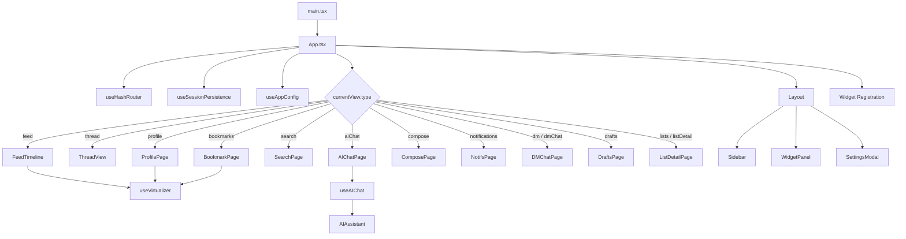

# PWA 网页应用实现

React DOM PWA 的完整架构——从 CSS 变量设计系统到哈希路由、虚拟滚动与浏览器端图片压缩，全部实现在 `packages/pwa/src` 下。本文面向高级读者，聚焦六项关键基础设施的设计决策与代码级细节。

---

## 设计系统：CSS 变量驱动的语义色板

整个 PWA 的视觉语言定义在三个层面：**DESIGN.md 设计规范**、**CSS 变量声明层**（`index.css`）和 **Tailwind 配置映射层**（`tailwind.config.ts`）。

### 语义色板（Light / Dark）

所有颜色通过 CSS 自定义属性注入，运行时通过 `.dark` 类切换，无需 Tailwind 的 `dark:` 变体逐个覆盖：

| CSS 变量 | Light | Dark | 语义 |
|---|---|---|---|
| `--color-primary` | `#00A5E0` | `#00A5E0` | 主色（按钮/链接/AI 图标） |
| `--color-primary-hover` | `#0095C9` | `#00B5F0` | 主色悬停 |
| `--color-surface` | `#F8F9FA` | `#121212` | 卡片/输入框背景 |
| `--color-border` | `#E5E7EB` | `#27272A` | 分割线/边框 |
| `--color-text-primary` | `#0F172A` | `#F1F5F9` | 标题/正文 |
| `--color-text-secondary` | `#64748B` | `#A3B4C0` | 次要文字 |

Tailwind 配置将这些变量映射为语义化的 utility class：`bg-surface`、`border-border`、`text-text-primary`，开发中从不直接使用硬编码色值。[来源](packages/pwa/src/index.css#L5-L21)

### 字体比例

字体栈为 `Inter` + 系统字体回退。比例采用 Mobile-first 层级：

- **H1**：`28px / 700 / 1.2` — Feed 标题、Profile 名
- **H2**：`22px / 600 / 1.3` — 帖子标题、Modal 标题
- **Body**：`16px / 400 / 1.5` — 正文、回复
- **Caption**：`13px / 400 / 1.4` — 时间、用户名
- **Label**：`12px / 500 / 1.3` — Tab 文字、按钮小字

### 间距系统

采用 8px 基础网格：`8px / 16px / 24px / 32px / 48px`。Tailwind 配置扩展了 `spacing.sidebar: '280px'` 和 `spacing['right-panel']: '390px'`，对应桌面三栏布局的侧边栏和右面板宽度。[来源](packages/pwa/tailwind.config.ts#L23-L26)

### 圆角规范

DESIGN.md 定义五级圆角：`none (0) / sm (4px) / md (8px) / lg (12px) / pill (9999px)`。Avatar、按钮和 Tab 使用 `pill`（完全圆润），卡片使用 `md`。Modal 采用 `lg` 并配合 backgrop-filter 毛玻璃效果。[来源](docs/DESIGN.md#L122-L124)

### 暗模式同步

`App.tsx` 在挂载时读取 `getAppConfig().darkMode` 并同步到 `document.documentElement.classList`。`Layout.tsx` 中的 toggle 按钮双向绑定：点击时切换 `.dark` 类，同时持久化到 localStorage。[来源](packages/pwa/src/App.tsx#L133-L135)

---

## 虚拟滚动：@tanstack/react-virtual 的三页适配

PWA 使用 `useVirtualizer` 管理长列表渲染，目前适配 **FeedTimeline**、**ProfilePage** 和 **BookmarkPage** 三页。核心模式高度一致：

```tsx
const virtualizer = useVirtualizer({
  count: items.length,
  getScrollElement: () => scrollRef.current,
  estimateSize: () => ESTIMATED_ITEM_HEIGHT,  // 120-150px
  overscan: 5,
});
```

滚动容器固定高度 `h-[calc(100vh-3rem)]`，虚拟项通过 `position: absolute` + `translateY` 定位。[来源](packages/pwa/src/components/FeedTimeline.tsx#L52-L57)

### 像素值恢复规范

这是经过教训沉淀的关键设计。**不能使用 `scrollToIndex`**，因为虚拟器在 ResizeObserver 触发前使用估算高度（120px），而实际 PostCard 高度约 170px，导致偏移 5-6 帖。[来源](docs/SCROLL.md#L68-L73)

**正确做法**：在 `App.tsx` 用 `feedScrollTopRef` 以像素值保存 scrollTop，FeedTimeline 通过 `requestAnimationFrame` 在 mount 时直接赋值 `el.scrollTop = initialScrollTop`。ProfilePage 和 BookmarkPage 使用 `useScrollRestore` hook，后者基于模块级 Map 实现跨页面切换的像素持久化。[来源](packages/pwa/src/components/FeedTimeline.tsx#L60-L69)

### 自动加载 Sentinel

三页均使用 IntersectionObserver 监测底部 sentinel div（`h-px`），进入视口时触发 `loadMore()`。rootMargin 设为 `200px` 提前加载，sentinel 随 cursor 变化重新绑定。[来源](packages/pwa/src/components/FeedTimeline.tsx#L89-L98)

| 页面 | 估算高度 | 滚动恢复方式 |
|---|---|---|
| FeedTimeline | 120px | `feedScrollTopRef` 像素值 |
| ProfilePage | 150px | `useScrollRestore('profile-${actor}')` |
| BookmarkPage | 120px | `useScrollRestore('bookmarks')` |

---

## VideoCard：hls.js HLS 播放实现

Bluesky 的视频使用 HLS（HTTP Live Streaming）协议，`VideoCard.tsx` 的实现有两大设计约束：

1. **`<video>` 始终在 DOM 中** — 不 playing 时通过 `className="hidden"` 隐藏，确保 `videoRef.current` 永不 null，避免 useEffect 运行时的条件竞争。
2. **hls.js 懒加载** — `play()` 只在用户点击播放按钮后动态 `import('hls.js')`，不阻塞首屏渲染。[来源](packages/pwa/src/components/VideoCard.tsx#L26-L27)

播放流程：

```
user clicks play → setPlaying(true) → useEffect fires
  → dynamic import hls.js → Hls.isSupported()?
    → YES: new Hls() → loadSource(playlistUrl) → attachMedia(video)
      → MANIFEST_PARSED event → video.play()
    → NO: 回退 native HLS (canPlayType 'application/vnd.apple.mpegurl')
            → video.src = playlistUrl → video.play()
    → 都不支持 → setError(true)
```

关键细节：**只有 fatal error 才会 disable 播放器**。`Hls.Events.ERROR` 中判定 `data.fatal` 标记，非致命错误（如带宽不足时的 level switch 失败）不中断播放。Retry 按钮重置 `playing` 和 `error` 状态并清空 `video.src`。[来源](packages/pwa/src/components/VideoCard.tsx#L44-L48)

Cleanup 函数通过 `cancelled` 标志防止异步完成后的 state set，并 `hls.destroy()`。[来源](packages/pwa/src/components/VideoCard.tsx#L64-L70)

---

## compressImage.ts：浏览器端图片压缩管道

Bluesky 的图片上传限制为 2MB。`compressImage` 函数实现了一个**渐进式压缩管道**，完全在浏览器端执行，无服务端依赖：

```ts
const pipeline = [
  ['image/jpeg', 0.82],   // 首次尝试 JPEG 82% 质量
  ['image/jpeg', 0.65],   // 降低质量
  ['image/webp', 0.75],   // 换 WebP 格式
  ['image/jpeg', 0.4],    // 最后手段：低质量 JPEG
];
```

流程：

1. **快速路径** — 文件小于等于 2MB → 原样返回（`wasCompressed: false`）。
2. **GIF 跳过** — `file.type.includes('gif')` 不压缩，保留动画。
3. **尺寸缩放** — 使用 `createImageBitmap` 解码，若宽或高超过 2048px 按比例缩小。
4. **Canvas 重编码** — `canvas.toBlob` 以不同格式/质量组合遍历压缩，任一组合满足大小即返回。
5. **文件名处理** — 扩展名随格式切换（`.jpg` 或 `.webp`），`originalName` 保留原文件名供 UI 显示。[来源](packages/pwa/src/utils/compressImage.ts#L18-L97)

`formatSize` 辅助函数提供人类可读的字节表示。[来源](packages/pwa/src/utils/compressImage.ts#L99-L103)

---

## Icon.tsx：import.meta.glob SVG 图标系统

PWA 的图标系统基于 Vite 的 `import.meta.glob` + `?raw` 变换，无需手动注册每个 SVG：

```ts
const iconFiles = import.meta.glob('../icons/*.svg', {
  query: '?raw',
  import: 'default',
  eager: true,
}) as Record<string, string>;
```

构建时 Vite 将所有 `src/icons/*.svg` 作为原始字符串打包进 bundle。`Icon.tsx` 在模块作用域建立文件名 → SVG 字符串的 `SVG_RAW` 查找表。[来源](packages/pwa/src/components/Icon.tsx#L10-L17)

渲染时 `injectSize` 函数做三件事：

- 替换 `width="24"` → `width="${size}"`
- 替换 `height="24"` → `height="${size}"`
- 替换 `fill="none"` → `fill="currentColor"`（当 `filled` prop 为 true）

使用 `dangerouslySetInnerHTML` 注入 SVG，通过 `aria-hidden="true"` 标记为装饰性元素。图标默认 `18px`，通过 `className` 接受 Tailwind 颜色类（如 `text-red-500`），因为 SVG 使用 `stroke="currentColor"` / `fill="currentColor"` 继承文本色。[来源](packages/pwa/src/components/Icon.tsx#L42-L54)

`ICON_NAMES` 常量为开发提供可用图标列表。[来源](packages/pwa/src/components/Icon.tsx#L57)

---

## useHashRouter：pushState + popstate 哈希路由

PWA 部署为静态文件（无服务端路由），哈希路由是唯一可靠的方案。`useHashRouter` 的实现直接基于原生 History API，无第三方路由库。

### 路由格式

```
#/feed?feed=at://...        → feed view
#/thread?uri=at://...       → thread view
#/profile?actor=did:...&tab=posts
#/search?q=关键词&tab=top
#/ai?session=uuid&post=...  → AI chat with context
#/compose?replyTo=...       → compose with reply
#/dm?conv=...               → DM conversation
```

所有路由参数 **手动编码解码**（`encodeURIComponent` / `decodeURIComponent`），未使用 `URLSearchParams` 的自动编码（因为后者对空格编码为 `+` 而非 `%20` 存在歧义）。[来源](packages/pwa/src/hooks/useHashRouter.ts#L76-L163)

### 核心机制

- **`parseHash()`**：从 `window.location.hash` 解析路径和查询参数，返回类型安全的 `AppView` 联合类型。默认空 hash 重定向到 default feed。[来源](packages/pwa/src/hooks/useHashRouter.ts#L28-L33)

- **`goTo(view)`**：`history.pushState(null, '', hash)` 更新 URL + setState。**Bare feed 导航**（`view.type === 'feed'` 但无 feedUri）自动解析为 last active feed 或 default，保证 `#/feed` 不丢失上下文。[来源](packages/pwa/src/hooks/useHashRouter.ts#L46-L58)

- **`goBack()`**：`window.history.back()`，依赖浏览器原生的 popstate 栈管理。**底层不维护自己的状态栈**，`canGoBack` 通过判断当前 hash 是否为 `'#/feed'` 推导。[来源](packages/pwa/src/hooks/useHashRouter.ts#L60-L64)

- **`goHome()`**：pushState 到 default feed，重置 `canGoBack`。[来源](packages/pwa/src/hooks/useHashRouter.ts#L66-L71)

- **popstate 监听**：浏览器前进/后退按钮触发 `popstate` 事件 → handler 调用 `parseHash()` 更新 state。[来源](packages/pwa/src/hooks/useHashRouter.ts#L35-L44)

### 与 App.tsx 的集成

`App.tsx` 将 `useHashRouter` 返回的 `currentView` 作为单一路由源，通过 `switch` 映射到 15 个页面组件。每个页面组件接收 `goTo` / `goBack` 作为导航一等公民 props，而非全局路由上下文。[来源](packages/pwa/src/App.tsx#L222-L330)

### Session 恢复与 Logout 流程

Session 持久化使用 `useSessionPersistence.ts`（`localStorage` 的 `bsky_session` key）：

1. **恢复**：`App.tsx` mount 时调用 `getSession()`，若存在且 `client` 为 null，调用 `restoreSession()` 以 accessJwt / refreshJwt 恢复认证。
2. **保存**：`login` 成功后 `session` 和 `client.isAuthenticated()` 双确认后写入 localStorage。
3. **清除**：authError 捕获（如 session 过期）自动 `clearSession()` + `setIsLoggedIn(false)`，防止 stuck 状态。
4. **Logout**：清除 session + `goHome()` 跳转到登录页。[来源](packages/pwa/src/App.tsx#L154-L196)

---

## 架构全景



Vite 配置中通过 `resolve.alias` 将 `os`/`fs`/`path` 指向 `src/stubs/*.ts`，使 core 层的 Node.js 依赖在浏览器中安全短路。[来源](packages/pwa/vite.config.ts#L13-L18)

---

## 推荐阅读

- [核心 Hooks 参考](核心-hooks-参考.md) — `useScrollRestore`、`useAuth` 等 PWA 依赖的 hook 签名
- [导航状态机](导航状态机.md) — `AppView` 联合类型定义和 push/pop 语义
- [包架构深度解析](包架构深度解析.md) — core / app / pwa 三层依赖关系
- [认证与会话管理](认证与会话管理.md) — JWT 双令牌与 `restoreSession` 底层逻辑
- [组件系统](组件系统.md) — WidgetPanel 注册表与右侧面板实现