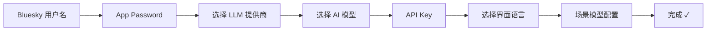

# TUI 终端界面入门

打开终端，敲下 `pnpm run dev:tui`，你看到的并不是一个命令行工具——而是一个**全屏交互式的 Bluesky 客户端**。本文带你走完从首次配置到浏览帖子的完整过程。

---

## 首次启动：SetupWizard 配置向导

第一次运行 TUI 时，如果没有在 `.env` 文件中预设凭据，程序会自动进入 **SetupWizard**——一个分步交互配置界面。

判断入口在 `cli.ts`：`getConfigFromEnv()` 检查环境变量 `BLUESKY_HANDLE` 和 `BLUESKY_APP_PASSWORD`，任一缺失就渲染 `SetupWizard` 组件。[来源](packages/tui/src/cli.ts#L63-L66) 每个步骤通过 `Step` 联合类型驱动，当前步骤决定界面上显示哪个输入框或选择列表。[来源](packages/tui/src/components/SetupWizard.tsx#L29-L29)

### 各步骤详解

**① Bluesky 用户名** — 输入你的 handle，例如 `user.bsky.social`。按 `Enter` 进入下一步。

**② App Password** — 输入在 Bluesky 设置中生成的 **应用密码**。注意：这不是你的登录密码，需要在 Bluesky 网页端的 Settings → App Passwords 中生成一个。按 `Enter` 确认。

**③ 选择 LLM 提供商** — 用 `↑↓` 方向键在可选提供商列表中移动，`Enter` 确认。每个提供商会显示名称和 base URL。提供商列表来自 `@bsky/core` 的 `PROVIDERS` 常量。[来源](packages/tui/src/components/SetupWizard.tsx#L58-L58)

**④ 选择 AI 模型** — 上一步选定提供商后，该提供商下的模型列表会展示出来，带有 💭（思考能力）和 👁（视觉能力）标记。可以选择预置模型，或者选择最底部的 `Custom model...` 手动输入模型 ID。`Enter` 确认。[来源](packages/tui/src/components/SetupWizard.tsx#L208-L226)

**⑤ API Key** — 输入对应提供商的 API 密钥。密钥不会显示明文，只显示 `****` 占位。按 `Enter` 提交。[来源](packages/tui/src/components/SetupWizard.tsx#L240-L248)

**⑥ 选择界面语言** — 用 `←→` 方向键在 **中文 (zh)**、**English (en)**、**日本語 (ja)** 之间选择，`Enter` 确认。也可以按 `Tab` 跳过场景配置直接完成。[来源](packages/tui/src/components/SetupWizard.tsx#L252-L266)

**⑦ 场景模型配置（可选）** — 你可以为 **AI 聊天**、**翻译**、**润色** 三个场景分别指定不同的模型，留空则使用默认模型。`↑↓` 切换场景，`Enter` 切换开/关，`Esc` 或 `Tab` 完成。[来源](packages/tui/src/components/SetupWizard.tsx#L269-L286)

**⑧ 完成** — 全部配置就绪后，程序会写两个文件：
- `.env` — 存储 `BLUESKY_HANDLE` 和 `BLUESKY_APP_PASSWORD`（凭证信息）
- `bsky-tui.config.json` — 存储 AI 配置、语言偏好等非凭证信息

按 `Enter` 启动主界面。[来源](packages/tui/src/components/SetupWizard.tsx#L62-L101)

> **提示**：如果你想跳过向导直接启动，可以在项目根目录创建 `.env` 文件并填入环境变量。详见 [快速开始](快速开始.md) 和 [环境变量与配置](环境变量与配置.md)。

---

## 全局快捷键：一只手掌控整个应用

TUI 的键盘设计遵循一个原则：**核心操作一键直达，从不离开键盘**。所有全局快捷键在主 `useInput` 处理器中按固定顺序注册。[来源](docs/KEYBOARD.md#L23-L75)

| 按键 | 功能 | 说明 |
|------|------|------|
| `t` | **回家** — 返回 Timeline 信息流 | 无论在哪，一键回到主页 |
| `n` | **通知** — 浏览通知列表 | — |
| `p` | **个人主页** — 查看自己的资料 | — |
| `s` | **搜索** — 进入搜索视图 | — |
| `a` | **AI 聊天** — 启动 AI 对话 | — |
| `c` | **发帖** — 进入编辑视图 | 在帖子线程视图中被拦截，由本地 `c` 处理（回复） |
| `b` | **书签** — 浏览收藏的帖子 | — |
| `m` | **私信** — 打开 DM 列表 | 信息流视图中 `m` 加载更多帖子 |
| `L` | **列表** — 查看和管理自定义列表 | 大写 L |

八个字母 + 一个 `Esc`，覆盖了所有核心页面跳转。你不需要背，**底部的快捷键提示行一直显示当前可用的操作**。

### 特殊键

- **`Esc`** — 万能返回键。根据当前视图行为不同：在 AI 聊天中如果焦点在 AI 面板，先取消焦点再返回；在发帖视图如有内容，先提示保存草稿再返回；在信息流视图中无操作（已是首页）。[来源](docs/KEYBOARD.md#L33-L42)
- **`Tab`** — 切换 AI 焦点。在 AI 聊天视图中，`Tab` 在 `'main'`（主区域）和 `'ai'`（AI 输入框）之间切换。在编辑多帖时，`Tab` 循环切换帖子索引。[来源](packages/tui/src/components/App.tsx#L219-L224)
- **`Ctrl+G`** — 在任何视图中启动 AI 对话（带当前帖子的上下文 URI）。[来源](packages/tui/src/components/App.tsx#L288-L289) 详情见 [AI 助手引擎](ai-助手引擎.md) 和 [AI 对话 Hook 深度解析](ai-对话-hook-深度解析.md)。
- **`,`（逗号）** — 打开设置视图（.env 编辑器）。[来源](packages/tui/src/components/App.tsx#L291-L292)

---

## Feed 信息流：浏览与阅读

信息流是 TUI 的默认首页。按 `t` 从任何视图回到这里。

### 基础导航

| 按键 | 功能 |
|------|------|
| `j` 或 `↓` | 光标向下移动一行 |
| `k` 或 `↑` | 光标向上移动一行 |
| `PgUp` | 向上翻页（5 条帖子） |
| `PgDn` | 向下翻页（5 条帖子） |
| `Enter` | **查看选中帖子** — 进入帖子线程视图 |

光标行高亮显示，对应帖子内容。按 `Enter` 后进入 [导航状态机](导航状态机.md) 管理的线程视图，可以阅读完整对话树、点赞、回复、转发等。[来源](packages/tui/src/components/App.tsx#L260-L264)

### 更多 Feed 操作

| 按键 | 功能 |
|------|------|
| `m` | 加载更多老帖子 |
| `r` | 从顶部刷新信息流 |
| `f` | 切换/配置 Feed（`j/k` 选择，`Enter` 确认，`d` 删除，`a` 添加） |
| `v` | 收藏/取消收藏当前帖子 |
| `q` | 打开引用的帖子（如果有引用嵌入） |

鼠标滚轮在支持的终端中也有效，上下滚动等同于 `j/k`。[来源](docs/KEYBOARD.md#L79-L96)

> **信息流切换**：TUI 支持多个信息流（Feeds）。按 `f` 进入配置模式，你可以添加自定义 Feed URI（如 `at://did:plc:.../app.bsky.feed.generator/...`），或删除已有 Feed。默认信息流列表来自 `RECOMMENDED_FEEDS`。[来源](packages/tui/src/components/App.tsx#L82-L86)

---

## 下一步

现在你已经掌握了 TUI 的导航骨架。换个角度深入：

- **[键盘快捷键完整参考](键盘快捷键完整参考.md)** — 所有视图的完整键盘映射表（线程、AI 聊天、通知、发帖等）
- **[TUI 终端界面实现](tui-终端界面实现.md)** — 了解 Ink/React 渲染和 CJK 文本处理
- **[导航状态机](导航状态机.md)** — 深入理解基于栈的视图路由
- **[快速开始](快速开始.md)** — 从零搭建并运行两个界面