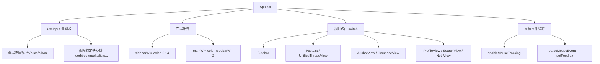

# TUI 终端界面实现

bsky TUI 基于 Ink（React for Terminal）构建，将 React 组件模型映射到终端画布。整个界面由三个核心层构成：**单一键盘路由器**、**动态布局引擎**、**视图分发器**，外加三个支撑终端体验的工具模块。

---

## 架构全景

App.tsx 是整个 TUI 的根组件，约 1020 行，承载了所有全局状态、键盘路由、鼠标支持和布局计算。其架构可分解为四个正交系统：



[来源](packages/tui/src/components/App.tsx#L46-L893)

---

## 单一键盘处理器架构

与常见做法（按视图挂载多个 `useInput`）不同，App.tsx 在根组件注册 **一个** `useInput` 回调，处理所有按键事件。该回调的优先级顺序如下：

1. **Tab / Escape** — 全局硬优先级，任何视图下第一时间处理（L219-244）
2. **AI 面板焦点锁定** — AI Chat 中若焦点在 AI 面板，跳过全局键（L245）
3. **覆盖层锁定** — FeedConfig / 列表命名 / 草稿保存提示等模态态阻断（L248-251）
4. **方向键** — feed/bookmarks 视图的箭头导航（L254-258）
5. **Enter** — feed/bookmarks/compose 等视图的确认操作（L260-286）
6. **Ctrl+G / ,** — 特殊全局键：启动 AI 对话、打开设置（L289-292）
7. **视图特定路由** — 按 `currentView.type` 走分支（L298-593）

这种设计带来了一个关键的 **冲突管理策略**：子视图（如 SearchView、ComposeView 内的 TextInput）内部注册自己的 `useInput`，Ink 的事件冒泡机制保证子组件优先捕获输入，未处理的按键才冒泡到根处理器。这解释了为什么 `currentView.type === 'search'` 或 `currentView.type === 'compose'` 时，根处理器直接 `return`——把控制权交给子组件。

[来源](packages/tui/src/components/App.tsx#L216-L594)

---

## 动态布局计算

布局在每次渲染时重新计算，响应终端窗口变化：

```typescript
// 侧边栏宽度 = 列数 × 14%，最小 16 列
const sidebarW = Math.max(16, Math.floor(cols * 0.14));
// 主区域宽度 = 总列数 - 侧边栏 - 2 列边框间距
const mainW = cols - sidebarW - 2;
```

终端尺寸通过 `useStdout().columns/rows` 获取，并通过 `resize` 事件动态更新：

```typescript
useEffect(() => {
  const onResize = () => {
    setCols(stdout?.columns ?? 80);
    setRows(stdout?.rows ?? 24);
  };
  stdout?.on('resize', onResize);
  return () => { stdout?.off('resize', onResize); };
}, [stdout]);
```

最终布局为三行结构：标题栏（1行）→ 内容区（Sidebar + 主视图，flexGrow=1）→ 状态栏（1行），外加可选的 raw mode 警告行。

[来源](packages/tui/src/components/App.tsx#L46-L54)

---

## 视图路由系统

`renderView()` 函数基于[导航状态机](导航状态机.md)的 `currentView.type` 执行 switch-case 分发。每个视图接收 `mainW` 作为宽度约束，确保组件不会溢出：

| 视图类型 | 渲染组件 | 关键 Props |
|---------|---------|-----------|
| `'feed'` | PostList | `posts`, `selectedIndex`, `width=mainW-4`, `height=rows-5` |
| `'thread'` | UnifiedThreadView | `uri`, `refreshThread`, `isBookmarked`, `goTo` |
| `'compose'` | ComposeView | `posts`, `mode`（7种子模式）, `composeMedia` |
| `'profile'` | ProfileView | `actor`, `cols=mainW`, `rows` |
| `'notifications'` | NotifView | `cols=mainW` |
| `'search'` | SearchView | `query`, `cols=mainW` |
| `'aiChat'` | AIChatView | `sessionId`, `contextPost`, `focused` |
| `'bookmarks'` | 内联渲染 | 带边框的列表视图，`slice(0, rows-5)` |
| `'lists'` / `'listDetail'` | 内联渲染 | 含创建/编辑 Input 模态 |
| `'dm'` / `'dmChat'` | DMListView / DMChatView | `conversationId` |
| `'about'` | 内联渲染 | 静态版本信息 |

注意 bookmarks、lists、listDetail 和 about 视图直接内联在 App.tsx 中，未提取为独立组件——这是有意为之，因为这些视图的状态高度耦合于根组件的本地 state。

[来源](packages/tui/src/components/App.tsx#L622-L864)

---

## CJK 感知文本处理

`text.ts` 提供了 TUI 的核心文本工具函数，解决终端对 CJK 字符宽度不感知的根本问题。

### visualWidth

遍历字符串，对每个字符判断是否是宽字符（CJK、Emoji、Hangul），宽字符算 2 列，ASCII 算 1 列，零宽字符（U+0000, U+200B）跳过：

```typescript
const wideRanges = [
  [0x1100, 0x115f],   // Hangul Jamo
  [0x2e80, 0xa4cf],   // CJK + Yi
  [0xac00, 0xd7a3],   // Hangul Syllables
  [0x1f300, 0x1f9ff], // Emoji
  [0x20000, 0x2ffff], // CJK Ext B+
  // ... 更多范围
];
```

`isWide()` 使用 `>= && <=` 区间判断，而非正则表达式，保证性能。

### wrapLines

按视觉宽度换行，支持首行与续行的不同缩进：

1. 按 `\n` 拆为段落
2. 对每段：若 `visualWidth(remaining) <= maxCols`，直接结束
3. 否则调用 `findBreakPoint()`——从左到右累计视觉宽度，在超限处优先选空格断开（保留空格位置），若无空格则硬断
4. 续行添加 `indent` 个空格前缀

这个函数被 PostList、AIChatView 等组件用于文本换行，是 TUI 支持中文/日文/韩文内容的基础。

[来源](packages/tui/src/utils/text.ts#L1-L82)

---

## 终端鼠标滚动支持

`mouse.ts` 实现了 ANSI Xterm 鼠标协议的最小子集——仅处理滚动事件。

### 协议细节

- 启用：向 stdout 写入 `\x1b[?1000h`
- 禁用：写入 `\x1b[?1000l`
- 事件格式：`\x1b[M<button><col+32><row+32>`
- 滚轮向上：button = 64 (0x40)
- 滚轮向下：button = 65 (0x41)

### 解析器设计

`parseMouseEvent` 维护一个 `mouseBuf` 模块级变量，累积 stdin 流入的字节。当缓冲区以 `\x1b[M` 开头且长度 >= 6 时，提取第 4 字节作为 button、第 5 字节减 32 作为 col、第 6 字节减 32 作为 row。为防止缓冲区失控，超过 20 字节且不是转义序列则清空。

### 集成到 App

App.tsx 在 `useEffect` 中挂载鼠标管道：

```typescript
useEffect(() => {
  enableMouseTracking(stdout);
  const onData = (data: Buffer) => {
    const evt = parseMouseEvent(data);
    if (!evt) return;
    if (evt.type === 'scrollUp') setFeedIdx(i => Math.max(0, i - 1));
    if (evt.type === 'scrollDown') setFeedIdx(i => Math.min(posts.length - 1, i + 1));
  };
  process.stdin.on('data', onData);
  return () => {
    process.stdin.off('data', onData);
    disableMouseTracking(stdout);
  };
}, [stdout, currentView.type, posts.length]);
```

注意：滚动仅作用于 feed 视图。线程视图、AI 对话等视图暂不支持鼠标滚动。

[来源](packages/tui/src/utils/mouse.ts#L1-L53)

---

## 零依赖 Markdown 渲染器

`markdown.tsx` 将 Markdown 字符串直接转换为 Ink `Text` 元素树，无需解析 AST 或引入 marked/hast 等依赖。

### 行级语法支持

| 语法 | 渲染方式 | 代码行 |
|-----|---------|-------|
| ` ``` ` 代码块 | `dimColor` 灰色，行首 2 空格缩进 | L37-57 |
| `# ` `## ` `### ` 标题 | `bold` + 层级颜色（cyanBright / cyan） | L69-78 |
| `> ` 引用 | `dimColor` 灰色，`│` 前缀 | L80-85 |
| `- ` / `* ` 无序列表 | `•` 符号 + 缩进感知 | L87-93 |
| `1. ` 有序列表 | 数字 + `.` + 缩进感知 | L95-101 |
| `---` 分隔线 | 36 个 `─` 字符，dimColor | L64-67 |
| 空行 | 一个空格 Text 元素 | L59-62 |
| URL / @handle | `color="blue"` 高亮 | L4-21 |

### 链接与提及识别

`TOKEN_REGEX` = `/(https?:\/\/[^\s<>"']+|@[a-zA-Z0-9._-]+(?:\.[a-zA-Z]{2,})+)/g`

`tokenizeLine()` 将每行按正则分割，URL 和 @handle 包裹在蓝色 `<Text>` 中，其余部分为普通文本。这个正则同时匹配 Bluesky 的 AT 标识符格式。

### 代码块处理

代码块起始 ` ``` ` 触发 `inCodeBlock=true`，后续行累积到 `codeLines`，直到结束 ` ``` ` 批量输出。若文件以未闭合的代码块结尾，末尾的未完成块也会被输出（L106-110）。

[来源](packages/tui/src/utils/markdown.tsx#L1-L113)

---

## 会话恢复与自动重连

App.tsx 实现了两层会话管理：

1. **自动登录**：组件挂载后立即调用 `login(config.blueskyHandle, config.blueskyPassword)`（L150-152）
2. **断线重连**：监听 `client.isAuthenticated()`，若从已认证变为未认证（如系统休眠后令牌过期），自动重新登录（L155-162）

这保证了 TUI 在长时间运行或系统唤醒后不会因会话过期而崩溃。

[来源](packages/tui/src/components/App.tsx#L148-L162)

---

## 进一步阅读

- [键盘快捷键完整参考](键盘快捷键完整参考.md) — 所有 `useInput` 处理器注册顺序与冲突解决策略
- [导航状态机](导航状态机.md) — `AppView` 联合类型与 push/pop 状态管理
- [包架构深度解析](包架构深度解析.md) — 理解 `@bsky/app` 与 `@bsky/tui` 的职责边界
- [PWA 网页应用实现](pwa-网页应用实现.md) — 同一套导航状态机的 PWA 端实现
- [AI 对话 Hook 深度解析](ai-对话-hook-深度解析.md) — AIChatView 背后的数据流