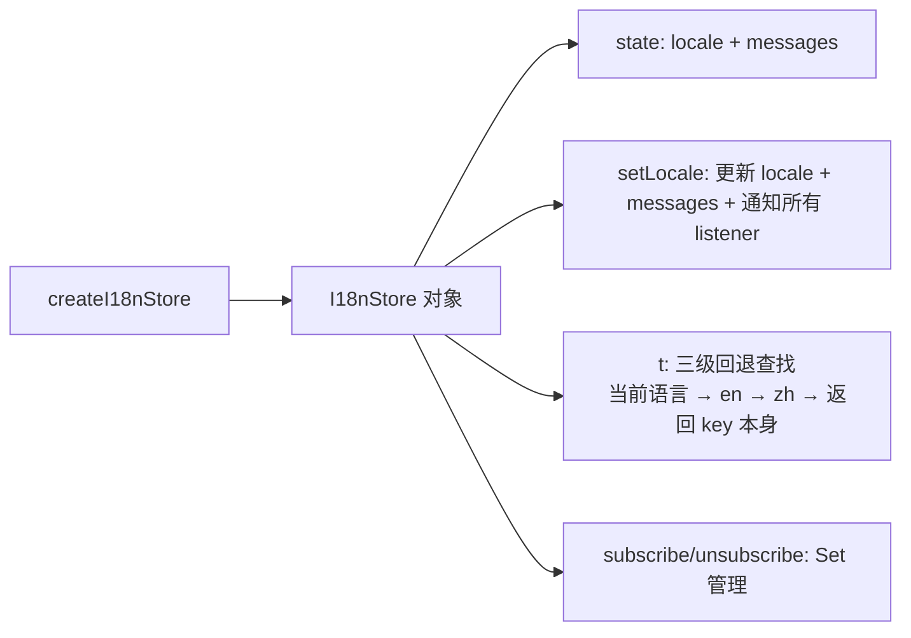

# 国际化系统

## 三语支持的 Singleton Store

国际化系统以最小依赖实现了完整的三语（中文、英文、日文）界面切换功能。其核心是一个模块级单例的 `I18nStore`，配合 React 的 `useI18n` Hook 驱动 UI 重渲染，让语言切换在毫秒级完成。

## 架构：单例 Store + 订阅模式

整个系统的代码只有四个文件：

```
packages/app/src/i18n/
├── types.ts          # Locale 联合类型、LocaleMessages 类型
├── store.ts          # I18nStore 接口 + 单例实现
├── useI18n.ts        # React Hook 封装
└── locales/
    ├── index.ts      # 汇总所有语言包 + availableLocales/localeLabels
    ├── zh.ts         # 中文翻译键值对
    ├── en.ts         # 英文翻译键值对
    └── ja.ts         # 日文翻译键值对
```

[来源](packages/app/src/i18n)

**类型层**定义了两种核心类型：

- `Locale = 'zh' | 'en' | 'ja'` — 三语联合类型，编译期保证只存在合法语言代码
- `LocaleMessages = Record<string, string>` — 扁平键值对字典，翻译文件的结构约束

[来源](packages/app/src/i18n/types.ts#L1-L3)

**Store 层**是架构的核心。`createI18nStore` 工厂函数生成一个 `I18nStore` 对象，该对象同时承载状态（`locale`、`messages`）和行为（`t`、`setLocale`、`subscribe`）。关键设计决策是将 `locale` 和 `messages` 公开为直接属性，而非通过 getter 封装，这样 React Hook 可以直接读取快照值，无需额外解包。



`t` 函数的查找逻辑实现了**三级回退**机制：优先返回当前语言的翻译，若 key 不存在则回退到 en，再回退到 zh，最后返回 key 本身。这意味着即使某个翻译键在新语言中缺失，用户也不会看到空白或崩溃，而只会看到未翻译的 key。`interpolate` 函数支持 `{param}` 模板插值，用于动态参数如 `'compose.charCount': '{current}/{max}'`。

[来源](packages/app/src/i18n/store.ts#L42-L49)

**单例模式**通过 `getI18nStore` 实现：首次调用时创建实例并缓存到模块级的 `_instance` 变量中，后续调用始终返回同一实例。`resetI18nStore` 用于测试环境中重置状态。

[来源](packages/app/src/i18n/store.ts#L70-L82)

## React 集成：useI18n Hook

`useI18n` Hook 是 Store 与 React 组件树之间的桥梁：

```typescript
export function useI18n(initialLocale?: Locale) {
  const store = getI18nStore(initialLocale);
  const [, force] = useState(0);
  const tick = useCallback(() => force(n => n + 1), []);
  useEffect(() => store.subscribe(tick), [store, tick]);
  // ...
}
```

它使用 `useState(0)` 作为强制重渲染的计数器，通过 `subscribe(tick)` 注册到 store 的 listener 集合中。当 `setLocale` 被调用时，store 遍历所有 listener 执行 `fn()`，触发 React 组件的 `useState` 更新导致重渲染。这是一个轻量级的发布-订阅模式，完全避免了 Context 的重渲染扩散问题——只有订阅了的组件才会重渲染。

返回值解构出五个成员：

| 成员 | 类型 | 说明 |
|------|------|------|
| `t` | `(key, params?) => string` | 翻译函数，参数为键名和可选插值 |
| `locale` | `Locale` | 当前语言代码 |
| `setLocale` | `(l: Locale) => void` | 即时切换语言，触发所有订阅者重渲染 |
| `availableLocales` | `Locale[]` | 可用语言列表 `['zh', 'en', 'ja']` |
| `localeLabels` | `Record<Locale, string>` | 语言标签映射（中文/English/日本語） |

[来源](packages/app/src/i18n/useI18n.ts#L6-L23)

`t` 和 `setLocale` 均使用 `useCallback` 包裹，确保引用稳定性，避免不必要的子组件重渲染。

## 翻译键命名约定

所有翻译键按**功能模块**前缀组织，形成清晰的命名空间：

| 前缀 | 模块 | 示例 |
|------|------|------|
| `nav.*` | 侧边栏导航 | `nav.feed`、`nav.profile`、`nav.aiChat` |
| `action.*` | 操作按钮 | `action.like`、`action.repost`、`action.translate` |
| `status.*` | 状态提示 | `status.loading`、`status.error`、`status.empty` |
| `compose.*` | 发帖/编辑 | `compose.placeholder`、`compose.charCount` |
| `thread.*` | 帖子详情 | `thread.replies`、`thread.translateEnabled` |
| `search.*` | 搜索 | `search.placeholder`、`search.tabTop` |
| `profile.*` | 用户资料 | `profile.followers`、`profile.loading` |
| `notifications.*` | 通知 | `notifications.reason.like` |
| `ai.*` | AI 对话 | `ai.thinking`、`ai.placeholder` |
| `login.*` | 登录页 | `login.title`、`login.passwordHint` |
| `settings.*` | 设置页 | `settings.tabAI`、`settings.targetLang` |
| `common.*` | 通用文本 | `common.loading`、`common.error` |
| `keys.*` | TUI 快捷键提示 | `keys.feed`、`keys.thread` |
| `breadcrumb.*` | TUI 面包屑导航 | `breadcrumb.feed`、`breadcrumb.profile` |
| `drafts.*` | 草稿管理 | `drafts.saved`、`drafts.deleteConfirm` |
| `dm.*` | 私信 | `dm.empty`、`dm.placeholder` |
| `setup.*` | TUI 初始设置向导 | `setup.welcome`、`setup.locale` |
| `feed.*` | 动态源管理 | `feed.switchFeed`、`feed.defaultFeed` |
| `widget.*` | PWA 右侧面板 Widget | `widget.trends`、`widget.suggestedFollows` |
| `theme.*` | 主题切换 | `theme.dark`、`theme.switchLight` |
| `layout.*` | PWA 布局 | `layout.aiSuggestions` |
| `lists.*` | 列表 | `lists.create`、`lists.memberCount` |
| `post.*` | 帖子卡片 | `post.imageCount`、`post.postsCount` |
| `about.*` | 关于页面 | `about.repository`、`about.buildTime` |

在中文文件中，同一数据类型声明的所有键采用此约定组织，并用注释标记分区边界：

```typescript
// ── Nav / sidebar ──
'nav.feed': '时间线',
// ── Actions ──
'action.refresh': '刷新',
```

[来源](packages/app/src/i18n/locales/zh.ts#L4-L398)

## 语言切换的 UI 实现

### PWA：SettingsModal 中的下拉选择器

在 PWA 的设置弹窗（SettingsModal）的"通用"标签页中，渲染了一个 `<select>` 下拉框：

```tsx
const { t, locale, setLocale, localeLabels, availableLocales } = useI18n();
// ...
<select
  value={locale}
  onChange={e => setLocale(e.target.value as typeof locale)}
>
  {availableLocales.map((l: Locale) => (
    <option key={l} value={l}>{localeLabels[l]}</option>
  ))}
</select>
```

用户选择新语言后，`setLocale` 立即触发 store 的 `_notify`，所有通过 `useI18n` 订阅的组件同步重渲染，整个界面语言即时切换，无需刷新页面。

[来源](packages/pwa/src/components/SettingsModal.tsx#L32-L386)

### TUI：SetupWizard 中的语言选择

终端界面的初始设置向导提供了同样的语言选择，使用方向键在 `['zh', 'en', 'ja']` 三个选项间切换：

```typescript
const LANG_OPTIONS = [
  { value: 'zh', label: '中文 (zh)' },
  { value: 'en', label: 'English (en)' },
  { value: 'ja', label: '日本語 (ja)' },
];
```

用户在向导最后一步选择语言后，`setLocale` 被调用，整个 TUI 的语言即时切换。

[来源](packages/tui/src/components/SetupWizard.tsx#L31-L89)

## 语言包维护要点

- **三个文件保持键集一致**：`zh.ts`、`en.ts`、`ja.ts` 必须导出相同的 key 集合。新增翻译时，三个文件都需要添加对应条目，否则 `t` 函数会走回退链。
- **日语引用冲突**：日语中使用单引号 `'` 作为字符串定界符时，需要转义内部单引号（如 `thread.confirmRepost` 中的 `\'`）。[来源](packages/app/src/i18n/locales/ja.ts#L131)
- **非翻译字符**：部分键的非翻译部分（如 `notifications.count` 在 en.ts 中为空字符串 `''`）在不同语言中可能不同。中文和日语有后缀"条"和"件"，英语则留空。

## 与其他系统的关联

国际化系统的多语言能力与 [AI 助手引擎](ai-助手引擎.md) 的 `p_UiLanguage` 提示词片段联动，AI 在回复时也会参考当前界面语言。[系统提示词体系](系统提示词体系.md) 中定义的 `p_UiLanguage` 函数读取当前 locale 并传递给 LLM，确保 AI 用用户使用的语言回复。`localeLabels` 也被导出到 `@bsky/app` 包外部，供 [翻译与润色系统](翻译与润色系统.md) 中的目标语言选择使用。

---

**下一步**：阅读 [核心 Hooks 参考](核心-hooks-参考.md) 了解 `useI18n` 与其他 20+ 个 Hook 的协同工作方式，或查看 [PWA 网页应用实现](pwa-网页应用实现.md) 了解语言选择器在 SettingsModal 中的完整 UI 集成。