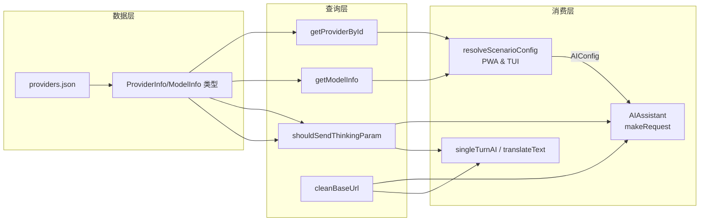

# 多提供商支持与模型注册表

项目同时支持多个 LLM 提供商，而非硬编码单一 API。核心是一个 TypeScript 类型安全的**注册表**，由 `providers.json` 数据文件驱动，运行时通过 `providers.ts` 中的函数查询。这套抽象层使得用户可以在 DeepSeek、Mistral 等提供商之间切换，而无需修改 AI 引擎的核心逻辑。对应的场景配置解析器（`resolveScenarioConfig`）则将用户在 UI 中填写的 `"provider/model"` 简短字符串解包为完整的 `AIConfig` 对象，自动推导 `thinkingEnabled`/`visionEnabled` 能力。

---

## 类型体系：ProviderInfo 与 ModelInfo

注册表中的每个提供商由两个接口描述，定义在 `packages/core/src/ai/providers.ts`：

- **`ProviderInfo`** — 提供商标识（`id`、`label`）、API 基础地址（`baseUrl`）、模型列表（`models`）、以及该提供商全体的**推理风格**（`reasoningStyle`）。
- **`ModelInfo`** — 单个模型的 `id`、`label`、以及两项能力标记：`thinking`（是否支持思考链）和 `vision`（是否支持图片输入）。

`reasoningStyle` 字段取三个字面量之一，含义如下：

| 取值 | 含义 | 适用提供商 |
|---|---|---|
| `'reasoning_content'` | API 原生返回 `reasoning_content` 字段 | DeepSeek |
| `'structured_content'` | 思考过程通过额外的 `reasoning_effort` 参数控制 | Mistral |
| `'none'` | 无推理/思考能力 | 自定义或其他 |

[来源](packages/core/src/ai/providers.ts#L7-L20)

`PROVIDERS` 常量是一个 `ProviderInfo[]` 数组，直接从 `providers.json` 按 `as ProviderInfo[]` 断言得到。JSON 作为数据源，TS 接口保证类型安全——两者分离，让非开发者也能编辑提供商列表 [来源](packages/core/src/ai/providers.ts#L22-L22)。

## 已注册提供商一览

当前注册表共两个内置提供商，各自模型清单如下：

| 提供商 | ID | baseUrl | reasoningStyle |
|---|---|---|---|
| **DeepSeek** | `deepseek` | `https://api.deepseek.com` | `reasoning_content` |
| **Mistral** | `mistral` | `https://api.mistral.ai` | `structured_content` |

### DeepSeek 模型

| 模型 ID | label | thinking | vision |
|---|---|---|---|
| `deepseek-v4-flash` | DeepSeek V4 Flash | ✅ | ❌ |
| `deepseek-v4-pro` | DeepSeek V4 Pro | ✅ | ❌ |

### Mistral 模型

| 模型 ID | label | thinking | vision |
|---|---|---|---|
| `mistral-small-latest` | Mistral Small (24B) | ✅ | ✅ |
| `pixtral-large-latest` | Pixtral Large (Vision) | ❌ | ✅ |
| `mistral-medium-latest` | Mistral Medium (128B) | ❌ | ✅ |
| `ministral-3b-latest` | Ministral 3B (Fast) | ❌ | ❌ |

[来源](packages/core/src/ai/providers.json#L1-L24)

注意 `thinking: true` 不代表该模型一定发送 `thinking` 参数，后者由 `shouldSendThinkingParam` 独立控制。vision 能力则直接决定是否允许发送图片内容块。

## 三个关键函数

### `cleanBaseUrl(baseUrl: string): string`

**容错性 URL 归一化**。用户可能在配置中粘贴各种形式的 API 地址，例如：

- `https://api.deepseek.com/v1/chat/completions`
- `https://api.deepseek.com/v1/`
- `https://api.deepseek.com/`

`cleanBaseUrl` 从左到右依次去除三个后缀：`/v1/chat/completions`、`/v1`、尾部斜杠。最终返回裸的根 URL，之后组装请求时统一追加 `/v1/chat/completions`。

```typescript
// 实际使用（assistant.ts L387）：
const url = `${cleanBaseUrl(this.config.baseUrl)}/v1/chat/completions`;
```

这确保了用户无论从什么渠道复制地址都不会导致双斜杠或路径重复问题 [来源](packages/core/src/ai/providers.ts#L41-L46)。

### `shouldSendThinkingParam(providerId: string): boolean`

**提供商级开关**，仅对 DeepSeek 返回 `true`。原因是 DeepSeek 的 API 接受非标准参数 `thinking: { type: 'enabled' | 'disabled' }` 来控制是否让模型输出 `reasoning_content` 字段；而 Mistral、OpenAI 兼容 API 等如果收到这个字段会报错。因此这个函数保护了请求体的兼容性 [来源](packages/core/src/ai/providers.ts#L53-L56)。

在 `makeRequest`（非流式）和 `sendMessageStreaming`（流式）两个路径中都插入了如下检查：

```typescript
if (this.config.provider && shouldSendThinkingParam(this.config.provider)) {
  (body as any).thinking = { type: this.config.thinkingEnabled !== false ? 'enabled' : 'disabled' };
}
```

对于 `reasoningStyle === 'structured_content'` 的提供商（如 Mistral），则会发送 `reasoning_effort: 'high'` 参数 [来源](packages/core/src/ai/assistant.ts#L367-L372)。

### `getModelInfo(providerId: string, modelId: string): ModelInfo | undefined`

**按提供商和模型 ID 查询注册表**。返回 `ModelInfo` 包含 `thinking` 和 `vision` 能力标记，这两个标记被 `resolveScenarioConfig` 用于自动推导 `thinkingEnabled`/`visionEnabled` 配置值。核心逻辑极简——两层查找，找不到返回 `undefined`：

```typescript
const provider = getProviderById(providerId);
if (!provider) return undefined;
return provider.models.find(m => m.id === modelId);
```

[来源](packages/core/src/ai/providers.ts#L35-L39)

配套函数 `isCustomModel` 的语义是"不在注册表中即视为自定义模型" [来源](packages/core/src/ai/providers.ts#L48-L51]。

## `resolveScenarioConfig`：从 `"provider/model"` 到完整 `AIConfig`

这是 UI 层将用户短格式配置转换成引擎可用配置的桥梁。PWA 版位于 `packages/pwa/src/App.tsx`，TUI 版位于 `packages/tui/src/components/App.tsx`，两者逻辑完全一致。

### 输入与输出

输入是一个字符串 `scenarioModel`，取值有三种形态：

| 值 | 含义 | 行为 |
|---|---|---|
| `""` | 未设置 | 返回 `appConfig.aiConfig` 原值 |
| `"deepseek-v4-flash"` | 仅有模型名，不含 `/` | 返回 `appConfig.aiConfig` 原值 |
| `"deepseek/deepseek-v4-flash"` | 完整格式 `provider/model` | 触发解析 |

返回类型是 `AIConfig`：

```typescript
type AIConfig = {
  apiKey: string;
  baseUrl: string;
  model: string;
  thinkingEnabled?: boolean;
  visionEnabled?: boolean;
  provider?: string;
  reasoningStyle?: 'reasoning_content' | 'structured_content' | 'none';
};
```

[来源](packages/core/src/ai/assistant.ts#L77-L85)

### 解析逻辑

```typescript
const [providerId, model] = scenarioModel.split('/');
const provider = getProviderById(providerId);
const modelInfo = provider ? getModelInfo(providerId, model) : undefined;
```

拆分出 `providerId` 和 `model` 后，通过注册表查找 `ProviderInfo` 和 `ModelInfo`。然后构建返回对象，每条属性的优先级规则如下：

| 返回字段 | 最终值来源（优先级自上而下） |
|---|---|
| `baseUrl` | `provider.baseUrl` → `appConfig.aiConfig.baseUrl`（兜底） |
| `model` | `model`（短格式中的模型名，**直接覆盖**） |
| `apiKey` | `appConfig.apiKeys[providerId]` → `appConfig.aiConfig.apiKey`（兜底） |
| `provider` | `provider.id` |
| `reasoningStyle` | `provider.reasoningStyle` |
| `thinkingEnabled` | `modelInfo.thinking` → `appConfig.aiConfig.thinkingEnabled` → `true` |
| `visionEnabled` | `modelInfo.vision` → `appConfig.aiConfig.visionEnabled` → `false` |

[来源](packages/pwa/src/App.tsx#L55-L73)

### 关键设计决策

1. **`apiKeys` 是独立的映射表**——`AppConfig.apiKeys` 以 `providerId` 为键存储，而非平铺在 `aiConfig` 中。这使得切换提供商时自动选择对应 API key，无需用户手动更换 [来源](packages/pwa/src/hooks/useAppConfig.ts#L12-L13)。

2. **`thinkingEnabled`/`visionEnabled` 从注册表自动推导**——如果 `modelInfo.thinking === true`，则自动启用思考模式，用户无需手动配置。如果 `modelInfo.thinking === false`，则显式关闭。只有找不到模型信息时，才会回退到全局配置的默认值。

3. **兜底值硬编码**——`AIConfig` 的默认构造在 `DEFAULT_CONFIG` 中指定为 DeepSeek：[`baseUrl: 'https://api.deepseek.com'`，`model: 'deepseek-v4-flash'`，`thinkingEnabled: true`]。这意味着即使注册表为空或配置缺失，AI 引擎也能以一个合理默认值启动 [来源](packages/core/src/ai/assistant.ts#L87-L91)。

### 场景绑定

`resolveScenarioConfig` 被调用三次，分别绑定三个场景：

```typescript
const scenarioModels = useMemo(() => ({
  aiChat: resolveScenarioConfig(appConfig.scenarioModels?.aiChat || ''),
  translate: resolveScenarioConfig(appConfig.scenarioModels?.translate || ''),
  polish: resolveScenarioConfig(appConfig.scenarioModels?.polish || ''),
}), [resolveScenarioConfig, appConfig.scenarioModels]);
```

[来源](packages/pwa/src/App.tsx#L75-L79)

每个场景（AI 对话、翻译、润色）可以独立指定 `"provider/model"`，这意味着用户可以让翻译走更经济的小模型、润色走快速模型、而对话用旗舰推理模型。

---

## 架构图



---

## 扩展指南：添加新提供商

注册表的设计使添加新提供商仅需编辑 `providers.json`，无需修改任何 TypeScript 代码。步骤：

1. 在 `providers.json` 中新增一个对象，包含 `id`/`label`/`baseUrl`/`reasoningStyle`/`models`。
2. 在 PWA 或 TUI 的配置中，为这个 `id` 对应的 `apiKeys` 键填入 API Key。
3. 在场景配置中使用 `"新id/模型名"` 格式引用即可。

若新提供商使用了不同的推理风格（如 `structured_content` 之外的形式），需在 `assistant.ts` 的 `_buildMessages` 和 `makeRequest` 中添加对应的预处理逻辑。`reasoningStyle` 的三种枚举值已经覆盖了目前已知的全部推理模式 [来源](packages/core/src/ai/assistant.ts#L323-L334)。

---

## 相关页面

- [AI 助手引擎](ai-助手引擎.md) — `AIAssistant` 如何消费 `AIConfig`、发起 API 调用、处理工具循环。
- [流式输出与思考模式](流式输出与思考模式.md) — SSR 流式解析中 `reasoning_content` 的提取与 `thinking` 令牌分派。
- [系统提示词体系](系统提示词体系.md) — 提示词中根据 `visionEnabled` 条件注入视觉能力提示。
- [环境变量与配置](环境变量与配置.md) — TUI 和 PWA 的完整配置结构，含 `apiKeys` 和 `scenarioModels` 字段的实际使用。