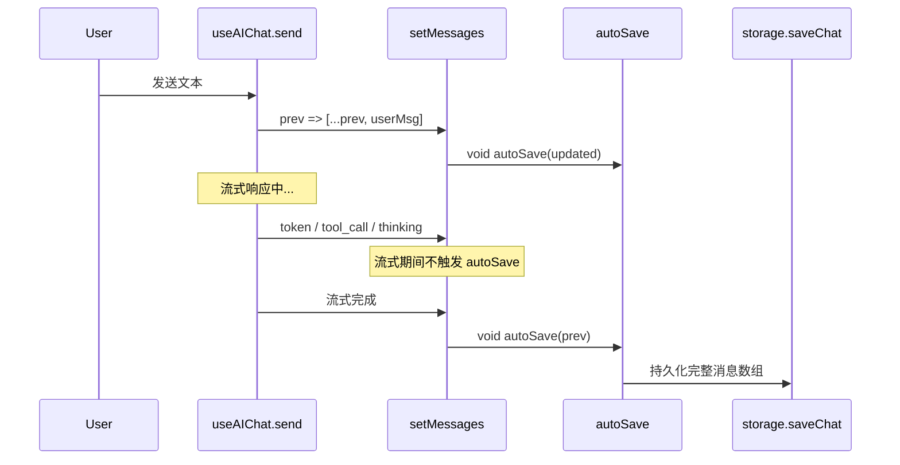
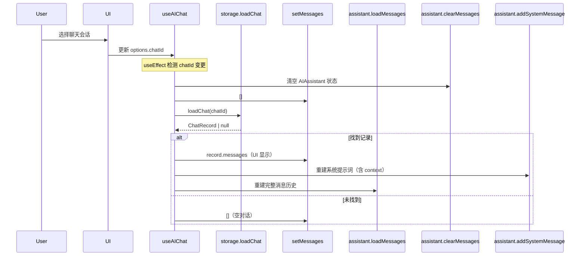

# 存储与持久化

## 架构总览：两个独立存储体系

项目采用**双层抽象**设计，将会话聊天（AI Chat）与帖子草稿（Post Draft）的持久化拆分为两套独立的接口体系。每套体系都定义了纯抽象接口，再由 **File\* (Node.js)** 和 **IndexedDB\* (PWA)** 两个分支分别实现，运行期通过依赖注入完成绑定。

```mermaid
graph TD
    subgraph "ChatStorage 接口"
        ChatStorage[<<interface>> ChatStorage]
        ChatStorage --> saveChat
        ChatStorage --> loadChat
        ChatStorage --> listChats
        ChatStorage --> deleteChat
    end
    
    subgraph "DraftStorage 接口"
        DraftStorage[<<interface>> DraftStorage]
        DraftStorage --> getAll
        DraftStorage --> get
        DraftStorage --> set
        DraftStorage --> delete
    end

    ChatStorage --> FileChatStorage
    ChatStorage --> IndexedDBChatStorage
    DraftStorage --> FileDraftStorage
    DraftStorage --> IndexedDBDraftStorage

    FileChatStorage -.->|TUI 默认| ~/bsky-tui/chats/{id}.json
    IndexedDBChatStorage -.->|PWA 默认| indexedDB: bsky-chats
    FileDraftStorage -.->|TUI 默认| ~/bsky-tui/drafts/{id}.json
    IndexedDBDraftStorage -.->|PWA 默认| indexedDB: bsky_drafts
```

[来源](packages/app/src/services/chatStorage.ts#L33-L38) | [来源](packages/app/src/services/draftStorage.ts#L16-L21)

---

## ChatStorage — AI 聊天持久化

### 类型定义

**`AIChatMessage`** 是序列化后的消息单元，覆盖 `user` / `assistant` / `tool_call` / `tool_result` / `thinking` 五种角色。`tool_calls` 字段保留 OpenAI 兼容格式用于回放，`reasoning_content` 保留思考链内容。[来源](packages/app/src/services/chatStorage.ts#L5-L14)

**`ChatRecord`** 是单次聊天的完整持久化记录，包含 `id`（UUID）、`title`（自动截取首条用户消息前 80 字符）、`contextUri`（来源 URI）、`context`（结构化上下文标签，用于恢复时重建系统提示词）、`messages` 消息数组及时间戳。[来源](packages/app/src/services/chatStorage.ts#L16-L24)

**`ChatSummary`** 是会话列表的轻量视图，仅含 `id`、`title`、`messageCount`（只计 `user` + `assistant` 角色）、`updatedAt`。[来源](packages/app/src/services/chatStorage.ts#L26-L31)

### 接口契约

```typescript
interface ChatStorage {
  saveChat(chat: ChatRecord): Promise<void>;
  loadChat(id: string): Promise<ChatRecord | null>;
  listChats(): Promise<ChatSummary[]>;
  deleteChat(id: string): Promise<void>;
}
```
[来源](packages/app/src/services/chatStorage.ts#L33-L38)

### FileChatStorage — Node.js 文件存储

TUI 环境的默认实现。存储路径为 `~/.bsky-tui/chats/{chatId}.json`，每个聊天独立文件。`listChats()` 遍历目录下所有 `.json` 文件，解析后提取 `ChatSummary`，按 `updatedAt` 降序排列；遇到损坏文件直接跳过。[来源](packages/app/src/services/chatStorage.ts#L40-L93)

关键实现细节：

- 构造函数 `dir` 可选，默认为 `path.join(homedir(), '.bsky-tui', 'chats')`，目录不存在则自动创建。
- 所有方法均返回 Promise，但内部使用 `fs.readFileSync` / `fs.writeFileSync` 等同步 API——这是 Node.js 模块级约定，不阻塞事件循环以外的 Promise 链。
- `listChats()` 只统计 `user` 和 `assistant` 角色的消息数，排除 `tool_call` / `tool_result` / `thinking`。

### IndexedDBChatStorage — PWA 浏览器存储

PWA 环境的实现。数据库名 `bsky-chats`，版本 1，对象存储名 `chats`，主键为 `id`。[来源](packages/pwa/src/services/indexeddb-chat-storage.ts#L3-L5)

与 FileChatStorage 的差异：

| 维度 | FileChatStorage | IndexedDBChatStorage |
|---|---|---|
| 存储介质 | 文件系统（JSON 文件） | IndexedDB（对象存储） |
| 数据隔离 | 每个聊天一个文件 | 同一 database store |
| 异常处理 | try/catch 静默跳过 | Promise reject 传播 |
| 平台依赖 | `fs` / `os` / `path` | `indexedDB` |
| 事务模式 | N/A（单文件原子写） | 显式 transaction（readonly/readwrite） |

IndexedDBChatStorage 的实现注意点：`openDB()` 每次调用都发起 `indexedDB.open` 请求，`withStore()` 每次创建新的 transaction，没有连接池缓存。`saveChat` 在 `updatedAt` 为空时自动填充。[来源](packages/pwa/src/services/indexeddb-chat-storage.ts#L7-L76)

### 默认存储获取

`getDefaultStorage()` 使用模块级懒加载单例，默认创建 `FileChatStorage` 实例。PWA 不调用此函数，而是直接实例化 `IndexedDBChatStorage` 传递给 hook。[来源](packages/app/src/hooks/useChatHistory.ts#L5-L12)

PWA 的 `AIChatPage` 和 `AIChatWidget` 分别在 `useMemo` 中创建 `new IndexedDBChatStorage()` 实例，传递给 `useAIChat` 的 `storage` 选项。[来源](packages/pwa/src/components/AIChatPage.tsx#L23) | [来源](packages/pwa/src/components/widgets/AIChatWidget.tsx#L36)

---

## 自动保存流程

`useAIChat` 是自动保存的核心驱动。保存时机发生在**每次消息状态变更后**：



实际代码中有三个触发点：

1. **用户发送消息时**：`setMessages(prev => { const updated = [...prev, newUserMsg]; void autoSave(updated); return updated; })`。[来源](packages/app/src/hooks/useAIChat.ts#L240-L244)
2. **流式完成时**：`setMessages(prev => { void autoSave(prev); return prev; })`。[来源](packages/app/src/hooks/useAIChat.ts#L310-L314)
3. **错误发生时**：错误消息追加后同样触发 autoSave。[来源](packages/app/src/hooks/useAIChat.ts#L320-L324)

非流式路径同理：中间步骤（tool_call / tool_result）和最终 assistant 回复全部追加后一次性 autoSave。[来源](packages/app/src/hooks/useAIChat.ts#L335-L351)

**`autoSave` 回调**的逻辑：从消息数组中提取首条 `user` 消息内容的前 80 字符作为标题，使用 `chatIdRef.current`（UUID 或指定 ID）写入 `storage.saveChat`。首次保存后调用 `onChatSaved()` 通知外部刷新会话列表，`chatNotifiedRef.current` 防止重复通知。[来源](packages/app/src/hooks/useAIChat.ts#L218-L236)

---

## 会话恢复流程

当用户在会话列表中选择一个历史聊天时，恢复过程分两步：



恢复逻辑实现在两个 `useEffect` 中：

1. **chatId 变更检测**（L94-L113）：比较 `options?.chatId` 与 `lastChatId.current`，变化时清空 assistant 和 messages，根据 `contextPost`/`contextProfile` 重建系统提示词，重置 `autoStartedRef` 和 `chatNotifiedRef`。

2. **从 Storage 加载**（L116-L172）：调用 `storage.loadChat(options.chatId)`，获取到 `ChatRecord` 后：
   - `setMessages(record.messages)` — 恢复 UI 级消息列表。
   - 若 `record.context` 存在，根据 `type`（`'post'` 或 `'profile'`）重建系统提示词；若不存在则回退到当前 `contextUri`。
   - 遍历 `record.messages`，将 `AIChatMessage` 格式转换回 `ChatMessage`（OpenAI API 格式），跳过 `thinking` 角色，将 `tool_call` 重构为 `assistant` 角色内嵌 `tool_calls` 数组，调用 `assistant.loadMessages([...system, ...chatMsgs])` 同步 AIAssistant 内部状态——这确保了 `editByIndex` 等编辑操作能正确工作。

[来源](packages/app/src/hooks/useAIChat.ts#L94-L172)

---

## DraftStorage — 帖子草稿持久化

### 接口定义

```typescript
interface DraftStorage {
  getAll(): Promise<AppDraft[]>;
  get(id: string): Promise<AppDraft | undefined>;
  set(draft: AppDraft): Promise<void>;
  delete(id: string): Promise<void>;
}
```
[来源](packages/app/src/services/draftStorage.ts#L16-L21)

**`AppDraft`** 的类型结构：[来源](packages/app/src/services/draftStorage.ts#L5-L14）

| 字段 | 类型 | 说明 |
|---|---|---|
| `id` | `string` | 本地 UUID |
| `serverId?` | `string` | PDS 服务端 ID（同步后填充） |
| `posts` | `{ text: string }[]` | 多帖草稿内容 |
| `replyTo?` | `string` | 回复目标 URI |
| `quoteUri?` | `string` | 引用帖子 URI |
| `createdAt` | `string` | ISO 时间戳 |
| `updatedAt` | `string` | ISO 时间戳 |
| `syncStatus` | `'local' \| 'synced' \| 'modified'` | 同步状态 |

### 工厂模式：setDraftStorageFactory

与 ChatStorage 不同，DraftStorage 采用**显式工厂注册**模式，而非直接构造函数入参：

```typescript
let _draftStorageFactory: (() => DraftStorage) | null = null;

export function setDraftStorageFactory(factory: () => DraftStorage) {
  _draftStorageFactory = factory;
  _defaultDraftStorage = null; // 清除缓存
}

export function getDefaultDraftStorage(): DraftStorage {
  if (!_defaultDraftStorage) {
    if (_draftStorageFactory) {
      _defaultDraftStorage = _draftStorageFactory();
    } else {
      // 自动检测 Node.js 环境
      // ...fallback to FileDraftStorage or throw
    }
  }
  return _defaultDraftStorage;
}
```
[来源](packages/app/src/services/draftStorage.ts#L72-L100)

这一设计的意图：`DraftStorage` 在 `@bsky/app` 层内部被 `useDrafts` 自动消费，不暴露给上层组件入参。工厂模式让 TUI 和 PWA 在**应用启动时**注册各自平台的实现，之后所有草稿操作透明使用对应实现。

### 平台实现

**FileDraftStorage**（Node.js）：路径为 `~/.bsky-tui/drafts/{id}.json`，实现风格与 FileChatStorage 一致——同步文件 I/O 封装成 Promise。[来源](packages/app/src/services/draftStorage.ts#L23-L70)

**IndexedDBDraftStorage**（PWA）：数据库名 `bsky_drafts`，版本 1，对象存储名 `drafts`。与 IndexedDBChatStorage 的关键差异是**缓存了数据库连接**（`dbPromise` 单例），避免每次操作都发起 `indexedDB.open`。[来源](packages/pwa/src/services/indexeddb-draft-storage.ts#L22-L26)

### 初始化注册点

| 平台 | 文件 | 注册代码 |
|---|---|---|
| **TUI** | `packages/tui/src/cli.ts:17` | `setDraftStorageFactory(() => new FileDraftStorage())` |
| **PWA** | `packages/pwa/src/App.tsx:37` | `setDraftStorageFactory(() => new IndexedDBDraftStorage())` |

### 写操作流程：PDS + 本地双写

`useDrafts` 的 `saveDraft` 方法实现了一个**先 PDS 后本地**的双写策略：[来源](packages/app/src/hooks/useDrafts.ts#L36-L89)

1. 构建 `AppDraft` 对象，继承已有的 `serverId`。
2. 如果客户端已认证（`_clientRef?.isAuthenticated()`），尝试 PDS 同步：有 `serverId` 则 `updateDraft`，否则 `createDraft`。成功后将 `syncStatus` 设为 `'synced'`，失败则降级为 `'local'`。
3. 无论 PDS 是否成功，均写入本地 `storage.set(draft)`。
4. 更新内存列表，按 `updatedAt` 降序排列。

`refreshDrafts` 同理：先加载本地草稿，再尝试从 PDS 拉取，用 `serverId` 作为关联键做合并，PDS 数据视为权威来源覆盖本地。[来源](packages/app/src/hooks/useDrafts.ts#L123-L189)

---

## 数据一致性要点

1. **乐观保存**：autoSave 使用 `void` 调用，不阻塞 UI 渲染。保存失败被 `try/catch` 静默吞掉，用户无感知。
2. **竞态保护**：`chatIdRef.current` 和 `lastChatId.current` 两个 ref 保障在异步加载过程中 chatId 变更不会导致状态错乱。
3. **编辑撤销的一致性**：`editByIndex` 和 `undoLastMessage` 操作同时修改 `assistant` 内部状态和 `messages` state，但**不触发 autoSave**——用户需手动发送编辑后的消息才会保存。
4. **context 持久化**：`contextRef.current` 从导航参数（`contextPost`/`contextProfile`）捕获并随 `autoSave` 写入 `ChatRecord.context`，确保页面刷新后能重建正确的系统提示词——这与仅依赖 URL 参数的方案不同，URL 参数在刷新后会丢失，而 IndexedDB 持久化的 context 可以恢复。[来源](packages/app/src/hooks/useAIChat.ts#L66)
5. **同步型文件写入**：FileChatStorage 和 FileDraftStorage 使用 `writeFileSync` —— 这在单用户 CLI 应用场景下不会产生实际风险，但多进程并发写同一文件会导致数据丢失。

---

## 推荐阅读

- [](ai-对话-hook-深度解析.md) — 自动保存触发点与消息编辑撤销的完整上下文
- [](31-个-ai-工具系统.md) — tool_call / tool_result 消息的来源与格式
- [](核心-hooks-参考.md) — useDrafts、useChatHistory 等 hook 签名一览
- [](pwa-网页应用实现.md) — PWA 的 IndexedDB 初始化与启动流程
- [](tui-终端界面实现.md) — TUI 通过 cli.ts 注册 FileDraftStorage 的启动入口