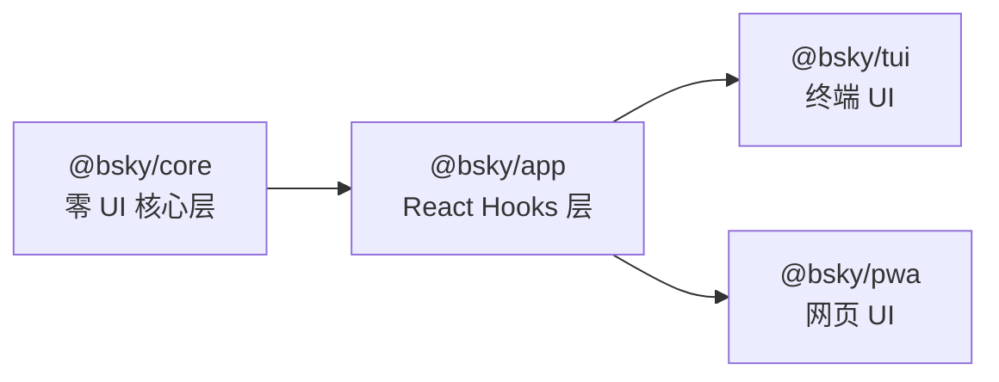

# 🦋 Bluesky Client — 概览

> 一个 **双界面**（TUI + PWA）、**AI 优先** 的 Bluesky 客户端，深度集成 31 个 AT Protocol 工具，拥有零 UI 依赖的核心层。

---

## 项目定位

Bluesky Client 不是一个模仿官方客户端的"替代品"——它重新定义了 Bluesky 的使用方式。官方客户端是一个封闭的社交网络应用，而这是一个 **AI 驱动的开发者工具**，让你在终端和浏览器中同时操纵 Blueksy 生态。

三个决定性特征奠定了它的基因：

- **双 UI 架构**：同一套业务逻辑同时驱动终端界面（TUI）和渐进式网页应用（PWA），两套渲染层共享同一个 React Hooks 层和数据流。
- **AI 优先**：AI 不是附加功能，而是操作系统的"代理层"。AIAssistant 拥有 31 个 Bluesky 工具，可以自主完成阅读、搜索、发帖、互动等几乎所有操作，用户只需用自然语言下达指令。
- **零 UI 依赖的核心层**：`@bsky/core` 包不依赖任何 UI 框架——纯 TypeScript，可在任何环境中复用。这是 TUI 和 PWA 能够共享同一套业务逻辑的根本原因。

[来源](README.md#L3-L9) · [来源](docs/ARCHITECTURE.md#L100-L101)

---

## 两条路径，一个内核

项目遵循 monorepo 架构，核心逻辑只写一次，两个界面各取所需：

| 层 | 角色 | 依赖 |
|---|---|---|
| `@bsky/core` | AT Protocol 客户端、AI 助手、31 个工具、提示词、类型 | `ky`, 无 UI 依赖 |
| `@bsky/app` | 共享 React Hooks（useAuth, useTimeline, useAIChat...）、Store、国际化 | `react`, `@bsky/core` |
| `@bsky/tui` | 终端 UI，Ink（React-on-terminal）渲染 | `ink`, `@bsky/app` |
| `@bsky/pwa` | 网页 UI，React DOM + Tailwind，可安装 PWA | `react-dom`, `@bsky/app` |

这条依赖链有一条铁律：**业务逻辑只存在于 `@bsky/core` 和 `@bsky/app` 中，TUI 和 PWA 只是纯渲染层**。这意味着任何新功能，只要在核心层实现，两个界面自动获得支持。

[来源](README.md#L160-L171) · [来源](docs/ARCHITECTURE.md#L63-L86)

---

## 功能矩阵：TUI vs PWA

两个界面的功能覆盖率几乎一致，但在交互范式上有本质差异——TUI 以键盘为中心，PWA 以点击/触控为中心。

### 核心社交功能

| 功能 | TUI | PWA |
|------|:---:|:---:|
| 时间线（虚拟滚动） | ✅ | ✅ |
| 自定义 Feed 切换 | `f` 键 | `▾` 下拉菜单 |
| 帖子串查看（回复树） | ✅ | ✅ |
| 引用帖展示 | `│` 管道格式 | 可点击卡片 |
| 发帖/回复/引用 | ✅ | ✅ 草稿保存 |
| 删除自己的帖子 | `d` 键 + 确认 | `🗑` 图标 + 确认 |
| 点赞 / 转帖 / 回复 | ✅ | ✅ 计数实时更新 |
| 转帖+引用合一按钮 | ✅ 弹出菜单 | ✅ 弹出菜单 |
| 通知 | ✅ | ✅ |
| 搜索（4 个标签页） | 热门/最新/用户/Feed | 同左 |
| 个人资料 | ✅ 关注/取消关注 | ✅ 含标签页 |
| 书签（内置 API） | ✅ | ✅ |
| DM 私信 | ✅ | ✅ 会话列表+对话视图 |

[来源](README.md#L72-L103)

### AI 功能（差异化核心）

| 功能 | TUI | PWA | 说明 |
|------|:---:|:---:|------|
| AI 对话（31 工具 + 流式） | ✅ | ✅ | 思考过程可视化 |
| AI 会话持久化 URL | 不支持 | ✅ | `#/ai?session=uuid` |
| 思考模式 | ✅ 可配置 | ✅ 可配置 | DeepSeek reasoning_content |
| 视觉模式 | ✅ 可配置 | ✅ 可配置 | GPT-4V / Claude Vision |
| AI 翻译（7 语言） | `f` 键 | 图标按钮 | 双模式：simple/JSON |
| AI 润色草稿 | ✅ | ✅ | 按风格要求优化 |
| 写操作确认 | ✅ | ✅ | 防误操作门禁 |

[来源](README.md#L53-L67) · [来源](docs/ARCHITECTURE.md#L112-L113)

### 界面特性

| 特性 | TUI | PWA |
|------|:---:|:---:|
| Markdown 渲染 | 自定义终端解析器 | react-markdown GFM |
| 图片显示（CDN） | ✅ 灯箱+本地保存 | ✅ 灯箱 |
| 视频/GIF 播放 | Ctrl+Click OSC 8 | HLS 播放器 |
| 链接/手柄自动着色 | ✅ 蓝色文本 | ✅ 蓝色样式 |
| 国际化（zh/en/ja） | ✅ 即时切换 | ✅ 即时切换 |
| 深色模式 | 终端原生 | CSS 变量 |
| PWA 可安装 | 不适用 | manifest.json + SW |
| Hash 路由 | 不适用 | `#/feed`, `#/search?q=...` |
| JWT 自动刷新 | ✅ ky afterResponse | ✅ 同左 |
| 滚动位置恢复 | 不适用 | ✅ 返回时保留 |

[来源](README.md#L94-L103)

---

## 与官方客户端的关键差异

不是"做得不一样"，而是"做得不一样的事"。

| 维度 | 官方客户端 | Bluesky Client |
|------|-----------|----------------|
| **交互方式** | 纯 GUI，触摸/鼠标 | 双界⾯：TUI 全键盘 + PWA 传统 GUI |
| **AI 集成** | 无 | 深度集成：LLM 驱动操作、自然语言指令 |
| **工具系统** | 无 | 31 个 AT Protocol 工具供 AI 调用 |
| **流式输出** | 无 | SSE 流式，逐字推送 + 思考链可视化 |
| **翻译** | 无 | AI 驱动 7 语言双模式翻译 |
| **草稿** | 无 | 持久化草稿（TUI JSON / PWA IndexedDB） |
| **DM** | 有 | 完整支持：消息发送/反应/删除/静音 |
| **多 Feed** | 有限 | ✅ getSuggestedFeeds 推荐 + 自定义 |
| **书签** | 无 | ✅ 内置 API |
| **滚动位置恢复** | 有 | ✅ PWA 独有 |
| **定制化程度** | 封闭 | 开源，全代码可修改 |

简而言之：官方客户端让你"刷"，这个客户端让你**操控**。

[来源](README.md#L53-L67) · [来源](docs/ARCHITECTURE.md#L10-L12)

---

## 架构哲学：核心层的零 UI 承诺

项目最根本的设计决策是 **"核心层不知道 UI 的存在"**。

`@bsky/core` 的 `src/index.ts` 只导出纯 TypeScript 类：`BskyClient`（AT Protocol HTTP 客户端）、`AIAssistant`（AI 对话引擎）、`createTools`（31 个工具工厂）。没有 React、没有 Ink、没有 DOM 导入——这意味着：

- 你可以用这些类写一个 CLI 脚本做批量操作
- 你可以把它们嵌入到 Electron 或 React Native 应用
- 测试不需要模拟 DOM，直接调用真实 API（29 个集成测试全通过）

这就是[包架构深度解析](包架构深度解析.md)中反复强调的"四层隔离"原则。

[来源](docs/PACKAGES.md#L5-L24) · [来源](README.md#L160-L164)

---

## AI 是操作系统，不是功能

大多数应用把 AI 当作一个"聊天按钮"嵌在角落。在这个项目中，AI 是"用户代理"：

你在 AI 对话框输入 *"看看 @alice 最近发了什么，把热门那条转帖到我的时间线"*——AIAssistant 会调用 `getProfile` → `getAuthorFeed` → `searchPosts` → `repost`，经过写操作确认后完成。整个过程你只需要打字。

这背后的引擎由[AI 助手引擎](ai-助手引擎.md)、[31 个 AI 工具系统](31-个-ai-工具系统.md)和[流式输出与思考模式](流式输出与思考模式.md)共同支撑。

[来源](README.md#L53-L67) · [来源](docs/AI_SYSTEM.md#L5-L26)

---

## 谁应该使用这个项目

| 人群 | 理由 |
|------|------|
| **Bluesky 重度用户** | 书签、DM、AI 翻译、多 Feed 一站式管理 |
| **终端爱好者** | 全键盘操作、CJK 精准换行、无鼠标干扰 |
| **AI 探索者** | 用自然语言操控社交网络，观察 LLM 工具调用的完整链路 |
| **AT Protocol 开发者** | `@bsky/core` 是干净、无依赖的参考实现 |
| **React 架构学习者** | 观察同一套 Hooks 如何驱动终端和浏览器两个渲染器 |

如果你是前两类用户，直接从[快速开始](快速开始.md)动手；如果你是后三类，推荐先阅读[包架构深度解析](包架构深度解析.md)和[BskyClient 深度解析](bskyclient-深度解析.md)。

---

## 下一步

- [快速开始](快速开始.md) — 5 分钟跑起来
- [TUI 终端界面入门](tui-终端界面入门.md) — 键盘流的第一课
- [PWA 网页应用入门](pwa-网页应用入门.md) — 浏览器用户从这里开始
- [包架构深度解析](包架构深度解析.md) — 深入理解四层架构
- [AI 助手引擎](ai-助手引擎.md) — 揭开 AI 代理的面纱