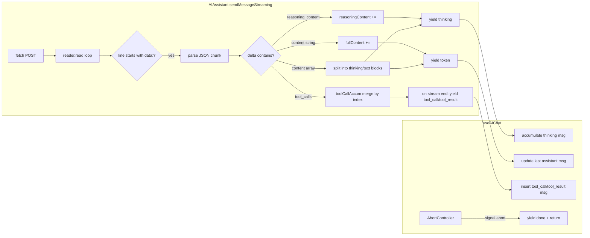

# 流式输出与思考模式

`AIAssistant.sendMessageStreaming` 是 `sendMessage` 的非阻塞版本。它不等待完整响应再返回，而是将 LLM 的 SSE 流逐 token 解析，通过 `AsyncGenerator` 向外推送事件。这使得 PWA 能实时渲染 token，并在 thinking 模式下逐步展示模型的思考链。

---

## 一、SSE 数据流：手动解析器

流的每一行以 `data: ` 开头，后续是 JSON chunk。流的结尾由 `data: [DONE]` 标记。解析器逐行处理，只关心前缀匹配的行：

```typescript
for (const line of lines) {
  if (!line.startsWith('data: ')) continue;
  const data = line.slice(6);
  if (data === '[DONE]') continue;
  // parse JSON chunk
}
```

每次读取使用 `TextDecoder` 的 `stream: true` 模式，确保多字节字符不会在 Chunk 边界被截断。解析失败的 JSON 行（如非标准的 SSE 注释）被静默跳过。

[来源](packages/core/src/ai/assistant.ts#L501-L550)

## 二、三个并行累加器

流式解析过程中，`sendMessageStreaming` 维护三个独立的累加器，分别对应三种不同类型的输出：

```typescript
let fullContent = '';           // ← 最终文本
let reasoningContent = '';      // ← 思考链（reasoning）
let toolCallAccum: Map<number, { id: string; name: string; arguments: string }> = new Map(); // ← 工具调用
```

- **`fullContent`**：仅收集 `delta.content` 中的普通文本 token。对应 `yield { type: 'token', content }`。
- **`reasoningContent`**：收集 `delta.reasoning_content` 以及 Mistral 结构化内容中的思考块文本。对应 `yield { type: 'thinking', content }`。
- **`toolCallAccum`**：按 `delta.tool_calls` 中每个元素的 `index` 分组，增量合并 `id`、`name`、`arguments`（arguments 用字符串追加而非覆盖）。

流结束后，三个累加器的内容分别用于构建最终的 assistant message 或触发下一轮工具循环。

[来源](packages/core/src/ai/assistant.ts#L486-L488)

### 2.1 tool_calls 增量合并

OpenAI 兼容 API 在流式模式下，`tool_calls` 是分多次推送的。每个 chunk 中 `delta.tool_calls` 数组的每个元素携带 `index` 字段，标明它属于第几个工具调用。累积逻辑为：

```typescript
for (const tc of delta.tool_calls) {
  const idx = tc.index;
  if (!toolCallAccum.has(idx)) {
    toolCallAccum.set(idx, { id: tc.id || '', name: tc.function?.name || '', arguments: '' });
  }
  const acc = toolCallAccum.get(idx)!;
  if (tc.id) acc.id = tc.id;
  if (tc.function?.name) acc.name = tc.function.name;
  if (tc.function?.arguments) acc.arguments += tc.function.arguments;  // 增量追加
}
```

流结束后，`Map` 按 `index` 排序转换为标准 `ToolCall[]`，推入消息历史，然后进入下一轮循环。

[来源](packages/core/src/ai/assistant.ts#L538-L570)

---

## 三、Thinking 模式的两条路径

`AIConfig.reasoningStyle` 定义思考模式的实现方式，两个取值对应不同的提供商：

| 风格 | 提供商 | 数据来源 | 属性名 |
|---|---|---|---|
| `reasoning_content` | DeepSeek | 原生字段 | `delta.reasoning_content` |
| `structured_content` | Mistral | 结构化数组 | `delta.content` 为 `Array<{type, thinking?, text?}>` |

[来源](packages/core/src/ai/providers.json#L3-L16)

### 3.1 DeepSeek 路径：原生 reasoning_content

DeepSeek 模型在 SSE 流中直接推送 `delta.reasoning_content` 字段。解析器检测到后，将其追加到 `reasoningContent` 累加器，并立即 yield `thinking` 事件：

```typescript
if (delta.reasoning_content) {
  reasoningContent += delta.reasoning_content;
  yield { type: 'thinking', content: delta.reasoning_content as string };
}
```

此字段最终会被保存到 `ChatMessage.reasoning_content` 中，供后续轮次重构建消息时使用。

[来源](packages/core/src/ai/assistant.ts#L511-L514)

另外，DeepSeek 需要通过非标准参数 `thinking` 来启用思考模式：

```typescript
if (this.config.provider && shouldSendThinkingParam(this.config.provider)) {
  (body as any).thinking = { type: this.config.thinkingEnabled !== false ? 'enabled' : 'disabled' };
}
```

`shouldSendThinkingParam` 检查 provider 是否为 `'deepseek'`——只有 DeepSeek 使用该参数。

[来源](packages/core/src/ai/assistant.ts#L435-L437)
[来源](packages/core/src/ai/providers.ts#L53-L55)

### 3.2 Mistral 路径：结构化内容数组

Mistral 不使用 `delta.reasoning_content`，而是将思考内容嵌入 `delta.content` 的数组中。数组元素有两种类型：

- `{ type: 'thinking', thinking: [{ type: 'text', text: '...' }] }` → 思考链
- `{ type: 'text', text: '...' }` → 最终输出

解析器遍历数组：

```typescript
if (Array.isArray(delta.content)) {
  for (const block of delta.content) {
    if (block.type === 'thinking' && block.thinking) {
      for (const t of block.thinking) {
        if (t.type === 'text' && t.text) {
          reasoningContent += t.text;
          yield { type: 'thinking', content: t.text };
        }
      }
    } else if (block.type === 'text' && block.text) {
      fullContent += block.text;
      yield { type: 'token', content: block.text };
    }
  }
}
```

思考块和文本块共享同一个 `delta.content` 字段，解析器据此分流到不同的累加器和事件类型。

[来源](packages/core/src/ai/assistant.ts#L516-L531)

### 3.3 消息构建时的适配

当 `reasoningStyle !== 'reasoning_content'` 时（即 Mistral 等），`_buildMessages` 会在构建 API 请求前将 `reasoning_content` 合并到 `content` 字段中作为思考前缀，然后移除原字段，避免非 DeepSeek 提供商因未知字段报错：

```typescript
if (this.config.reasoningStyle !== 'reasoning_content') {
  const rc = (m as any).reasoning_content as string | undefined;
  if (!rc || m.role !== 'assistant') return m;
  const { reasoning_content: _, ...rest } = m as any;
  rest.content = `【上一步思考过程】\n${rc}\n\n` + rest.content;
  return rest;
}
```

[来源](packages/core/src/ai/assistant.ts#L320-L332)

---

## 四、AbortSignal 的优雅暂停

`sendMessageStreaming` 接受可选的 `AbortSignal` 参数，在两处检查中断信号：

**HTTP 请求阶段**：`fetch` 调用直接传入 `signal`，若触发中断，catch 块检查 `signal.aborted` 并 yield `{ type: 'done', content: '\n\n[已暂停]' }`，不抛出异常。

**SSE 读取阶段**：每次 `reader.read()` 之前检查 `signal?.aborted`，若已中断则 yield `{ type: 'done', content: '\n\n[已暂停]' }` 并跳出循环。外层 catch 块也做相同判断，处理读取过程中突然中断的情况。

关键设计决策：中断时 yield `done` 事件而非抛出错误，消费者无需异常处理即可正常结束流式更新。PWA 的 `useAIChat` 通过 `AbortController` 控制：

```typescript
const ctrl = new AbortController();
abortRef.current = ctrl;
// ... stream consumption ...
// 用户点击停止按钮：
const stop = useCallback(() => abortRef.current?.abort(), []);
```

[来源](packages/core/src/ai/assistant.ts#L467-L470)
[来源](packages/core/src/ai/assistant.ts#L491-L495)
[来源](packages/core/src/ai/assistant.ts#L553-L557)
[来源](packages/app/src/hooks/useAIChat.ts#L248-L249)
[来源](packages/app/src/hooks/useAIChat.ts#L475-L477)

---

## 五、流式事件消费端

`useAIChat` 中的 `send` 方法在 `options.stream` 为 true 时，使用 `for await...of` 消费 `sendMessageStreaming` 生成的 AsyncGenerator。四种事件类型的处理方式：

### 5.1 `token` → 实时更新 assistant 消息

维护一个 `streamingContent` 变量跟踪当前累积文本。每次收到 `token` 事件时追加，然后检查消息列表的最后一条是否为 `assistant` 角色——若是则更新其 `content`，否则创建新消息：

```typescript
if (event.type === 'token') {
  streamingContent += event.content;
  setMessages(prev => {
    const last = prev[prev.length - 1];
    if (last?.role === 'assistant') {
      const updated = [...prev];
      updated[updated.length - 1] = { ...last, content: streamingContent };
      return updated;
    }
    return [...prev, { role: 'assistant', content: streamingContent }];
  });
}
```

流结束后，`done` 事件不会修改消息（文本已经通过 token 事件渲染完毕），但会触发 `autoSave`。

[来源](packages/app/src/hooks/useAIChat.ts#L292-L304)

### 5.2 `thinking` → 累积显示

收到 `thinking` 事件时，检查最后一条消息是否为 `thinking` 角色——若是则追加内容，否则创建新消息。这使得思考链在 UI 中逐步展开，而非一次性显示：

```typescript
if (event.type === 'thinking') {
  setMessages(prev => {
    const last = prev[prev.length - 1];
    if (last?.role === 'thinking') {
      const updated = [...prev];
      updated[updated.length - 1] = { role: 'thinking', content: last.content + event.content };
      return updated;
    }
    return [...prev, { role: 'thinking', content: event.content }];
  });
}
```

[来源](packages/app/src/hooks/useAIChat.ts#L281-L291)

### 5.3 `tool_call` / `tool_result` → 插入独立消息

工具调用和工具结果各自作为独立的消息条目插入，带有 `toolName` 和 `toolCallId` 元数据，以便 UI 渲染时可识别和折叠。`tool_call` 事件到来时，会重置 `streamingContent`，因为下一轮 LLM 响应是全新开始。

[来源](packages/app/src/hooks/useAIChat.ts#L264-L280)

### 5.4 `confirmation_needed` → 写操作门

当工具标记为 `requiresWrite` 时，引擎会 yield `confirmation_needed` 事件。`useAIChat` 将事件内容存入 `pendingConfirmation` 状态，UI 据此显示确认对话框。用户批准或拒绝后通过 `confirmAction` / `rejectAction` 调用 `assistant.confirmAction(boolean)` 继续流程。

[来源](packages/app/src/hooks/useAIChat.ts#L257-L263)
[来源](packages/app/src/hooks/useAIChat.ts#L381-L389)

---

## 六、架构示意图



---

## 推荐阅读

- [AI 助手引擎](ai-助手引擎.md) — `AIAssistant` 完整架构，包含非流式 `sendMessage` 的同步路径
- [AI 对话 Hook 深度解析](ai-对话-hook-深度解析.md) — `useAIChat` 的完整生命周期，包括流式/非流式双模式
- [多提供商支持与模型注册表](多提供商支持与模型注册表.md) — `reasoningStyle` 的配置来源与 provider 映射