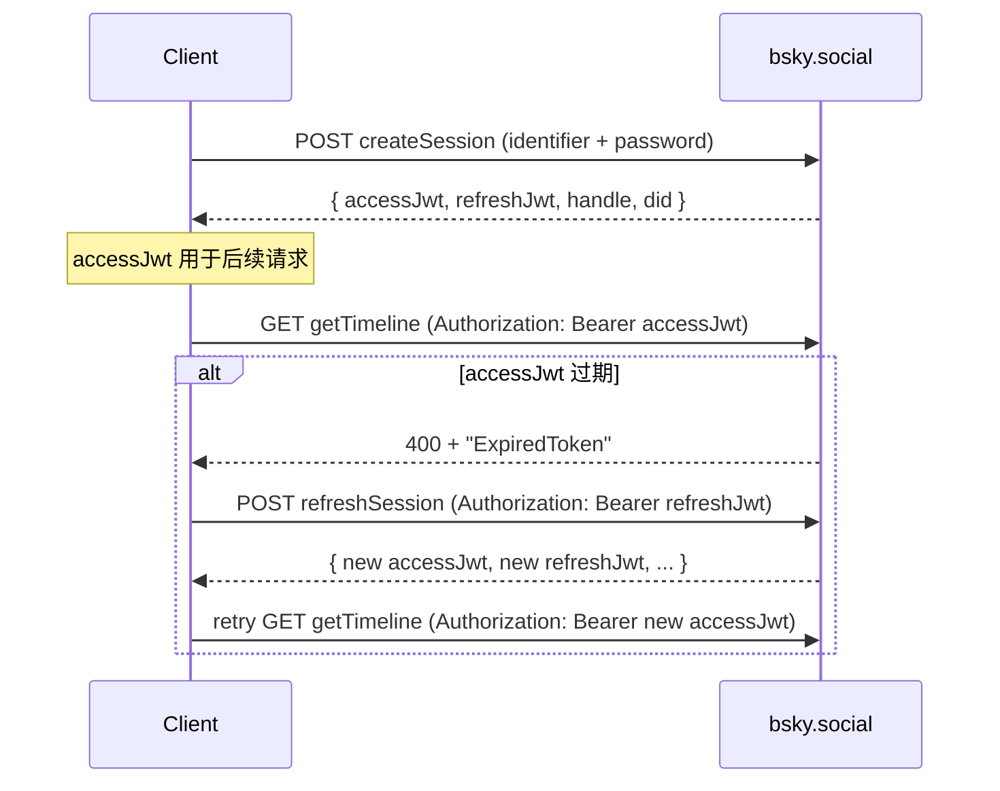
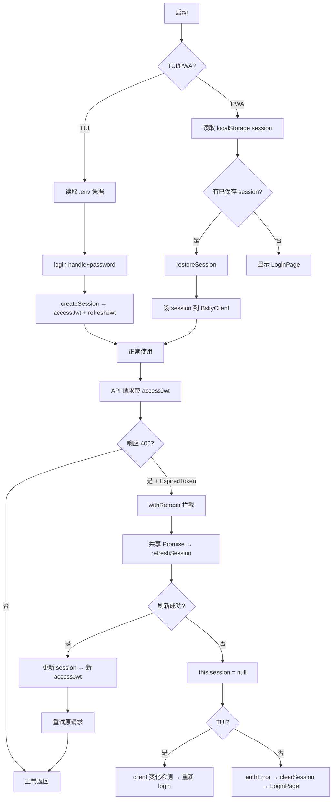

认证与会话管理
====================

**双令牌（Dual-Token）** 是 Bluesky AT Protocol 认证体系的核心设计。`createSession` 返回的 `accessJwt` 和 `refreshJwt` 拥有不同的生命周期和职责，客户端在此基础上构建了两套差异化的会话管理策略——TUI 的明文密码登录 vs PWA 的持久化会话恢复。本文从 BskyClient 的 `withRefresh` 自动刷新钩子出发，逐层剖析令牌机制、存储策略和跨界面差异。

## 令牌生命周期

`com.atproto.server.createSession` 返回的 `CreateSessionResponse` 包含两个 JWT：

| 字段 | 职责 | 典型有效期 | 刷新方式 |
|------|------|-----------|---------|
| `accessJwt` | 所有 API 请求的 Bearer Token | ~2 小时 | 通过 `refreshSession` 端点获取新令牌对 |
| `refreshJwt` | 仅用于调用 `com.atproto.server.refreshSession` | ~90 天 | 不可刷新，过期需重新 `createSession` |

两个令牌绑定同一 session——`refreshSession` 返回的是全新的令牌对，但 `did` 和 `handle` 不变。[来源](packages/core/src/at/types.ts#L246-L254)



## withRefresh：自动令牌刷新

`BskyClient` 构造时向 `ky` 实例注册了一个 `afterResponse` 钩子 `withRefresh`。这个函数在**每个响应返回后**执行，逻辑是：

1. 检查 `response.ok`——仅对非 2xx 响应介入
2. 读取响应体，解析 JSON，判断 `error` 字段是否为 `'ExpiredToken'` 或 `'InvalidToken'`
3. 如果是，触发刷新流程

刷新流程使用**共享 Promise 模式**（`_refreshPromise` 闭包变量）：

```
if (!_refreshPromise) {
  _refreshPromise = (async () => {
    await sleep(200)  // 短暂延迟，让并发请求聚集
    const r = await fetch(`${BSKY_SERVICE}/xrpc/com.atproto.server.refreshSession`, {
      method: 'POST',
      headers: { Authorization: `Bearer ${session.refreshJwt}` },
    })
    if (r.ok) {
      self.session = await r.json()  // 更新 session
      return self.session
    }
    self.session = null  // 刷新失败 → 清除身份
    return null
  })()
  _refreshPromise.finally(() => { _refreshPromise = null })
}
const refreshed = await _refreshPromise
```

这确保了**并发 N 个请求同时遇到 400 时，只发起一次 refreshSession 调用**，所有等待者共享同一个 Promise。刷新成功后，使用新 `accessJwt` 重试原请求：

```
if (refreshed && self.session) {
  const retryRes = await fetch(request.url, {
    method: request.method,
    headers: { Authorization: `Bearer ${self.session.accessJwt}` },
  })
  if (retryRes.ok) return retryRes  // 用 retryRes 替换原响应
}
```

注意 `ky.hooks.afterResponse` 的返回值语义：返回 `Response` 会**替换**原始响应，返回 `void` 则走原有错误路径。[来源](packages/core/src/at/client.ts#L60-L106)

`withRefresh` 同时注册在 `this.ky`（主 API）和 `this.chatKy`（聊天 API）上，覆盖所有需要认证的请求。[来源](packages/core/src/at/client.ts#L108-L124)

## AuthStore：全局认证状态

`createAuthStore()` 定义了认证层的核心数据结构和操作：

```typescript
interface AuthStore {
  client: BskyClient | null    // 已认证的客户端实例
  session: CreateSessionResponse | null
  profile: ProfileView | null
  loading: boolean
  error: string | null
  login: (handle, password) => Promise<void>
  restoreSession: (session) => void
  subscribe(fn): () => void    // 观察者模式，用于 React 重渲染
}
```

**`login` 流程**：创建新 `BskyClient` → 调用 `c.login(handle, password)`（即 `createSession`）→ 设置 `store.client` → 调用 `c.getProfile(handle)` 加载用户档案。任何异常写入 `store.error`。[来源](packages/app/src/stores/auth.ts#L27-L42)

**`restoreSession` 流程**：创建新 `BskyClient` → 调用 `c.restoreSession(session)`（仅设 `this.session`，不发 HTTP 请求）→ 设置 `store.session` 和 `store.client` → 异步获取 `getProfile`。关键设计：如果 profile 请求失败且 `c.isAuthenticated()` 返回 `false`（即 refresh 也失败了），则清空身份并设置错误为 `'session_expired'`。[来源](packages/app/src/stores/auth.ts#L44-L60)

`useAuth()` hook 是对 `AuthStore` 的 React 绑定，使用 `useState` + 订阅模式触发组件重渲染。[来源](packages/app/src/hooks/useAuth.ts#L6-L22)

## TUI vs PWA：会话管理对比

两种界面采用了根本不同的认证策略，差异源于各自的使用场景假设：

| 维度 | TUI | PWA |
|------|-----|-----|
| **凭据源** | `.env` 文件中的 `BLUESKY_HANDLE` + `BLUESKY_APP_PASSWORD` | 用户通过 `LoginPage` 表单输入 |
| **启动方式** | 每次启动都调用 `login(handle, password)` 重新登录 | 从 `localStorage` 读取持久化的 session，调用 `restoreSession()` |
| **持久化** | 无 session 持久化。密码存于 `.env`，每次重新 `createSession` | `accessJwt`、`refreshJwt`、`handle`、`did` 存入 `localStorage` key `bsky_session` |
| **会话恢复** | 不支持。终端重启即丢失认证状态 | 页面加载 → `getSession()` → `restoreSession()` → 若 `isAuthenticated()` 则直接进入主界面 |
| **睡眠恢复** | 通过 `client.isAuthenticated()` 变化检测失活，自动重新 `login()` | 通过 `authError` 检测 → `clearSession()` → 显示 `LoginPage` 让用户手动重新输入密码 |
| **登出** | 关闭终端 | `clearSession()` + 重置状态 |

**TUI 的自动重登录机制**（`packages/tui/src/components/App.tsx`）：

```typescript
// Auto-login
useEffect(() => {
  if (!authLoading) login(config.blueskyHandle, config.blueskyPassword)
}, [])

// Re-login on expired session (e.g., after system sleep)
useEffect(() => {
  if (client?.isAuthenticated()) {
    setWasAuthenticated(true)
  } else if (wasAuthenticated) {
    setWasAuthenticated(false)
    login(config.blueskyHandle, config.blueskyPassword)
  }
}, [client])
```

第二个 useEffect 监听 `client` 对象引用变化。当 `withRefresh` 刷新失败导致 `this.session = null` 时，`isAuthenticated()` 返回 `false`，触发重新登录。这处理了**系统休眠后 accessJwt 和 refreshJwt 同时过期**的场景。[来源](packages/tui/src/components/App.tsx#L148-L162)

**PWA 的持久化恢复机制**（`packages/pwa/src/App.tsx`）：

```typescript
// ── Restore session from localStorage on mount ──
useEffect(() => {
  const saved = getSession()
  if (saved && !client) {
    restoreSession({
      accessJwt: saved.accessJwt,
      refreshJwt: saved.refreshJwt,
      handle: saved.handle,
      did: saved.did,
    })
    setIsLoggedIn(true)
  }
}, [])

// ── Save session when login succeeds ──
useEffect(() => {
  if (session && client?.isAuthenticated()) {
    saveSession({ accessJwt, refreshJwt, handle, did })
    setIsLoggedIn(true)
  }
}, [session, client])

// ── Force logout when auth error (session expired after sleep) ──
useEffect(() => {
  if (authError && isLoggedIn) {
    clearSession()
    setIsLoggedIn(false)
  }
}, [authError, isLoggedIn])
```

login 成功后自动落盘到 `localStorage`；refresh 失败导致 session 过期时，`restoreSession` 中的 profile 请求失败触发 `session_expired` error → `clearSession()` → 显示 `LoginPage`。[来源](packages/pwa/src/App.tsx#L153-L186)

`useSessionPersistence.ts` 仅封装了 `localStorage.getItem/setItem/removeItem`，不做任何校验——校验完全交给 `AuthStore.restoreSession`。[来源](packages/pwa/src/hooks/useSessionPersistence.ts#L1-L26)

## 完整会话生命周期



## 安全注意事项

- TUI 将 Bluesky **App Password**（非主密码）以明文存储在 `.env` 文件中。App Password 具有权限范围限制，不能访问账户设置、不能更改密码，降低泄露风险。[来源](packages/tui/src/cli.ts#L64-L66)
- PWA 将 `accessJwt` 和 `refreshJwt` 以明文 JSON 存入 `localStorage`。这意味着任何能够执行 XSS 的脚本都可以窃取令牌并冒充用户。
- `refreshJwt` 的有效期约为 90 天，一旦泄露攻击者可在长达三个月内持续刷新 session。PWA 不加密存储令牌是一个已知风险点。
- `withRefresh` 刷新失败时设置 `self.session = null`，但不会主动通知上层——`AuthStore.restoreSession` 通过后续 `getProfile` 请求的失败来间接检测会话过期。

## 相关资源

- [BskyClient 深度解析](bskyclient-深度解析.md) — AT Protocol 客户端的完整架构
- [环境变量与配置](环境变量与配置.md) — TUI 的 `.env` 与 PWA 的配置模型
- [TUI 终端界面入门](tui-终端界面入门.md) — SetupWizard 配置向导中的认证输入
- [PWA 网页应用入门](pwa-网页应用入门.md) — 浏览器中的登录与会话管理
- [包架构深度解析](包架构深度解析.md) — `@bsky/core` 与 `@bsky/app` 的层次关系